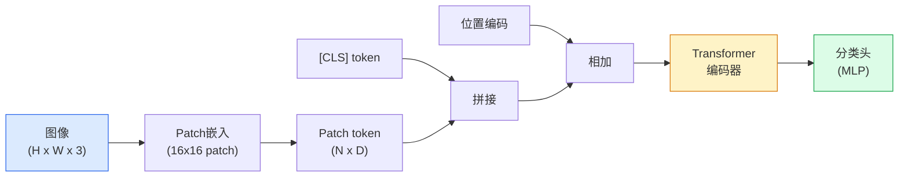

# 视觉Transformer

> ViT将图像分割为patch序列，用标准Transformer处理。当数据量足够大时，它超越了所有CNN。

**类型:** 学习+构建
**语言:** Python
**前置知识:** Phase 4 Lesson 03 (CNN), Phase 7 Lesson 02 (自注意力)
**时间:** 约75分钟

## 学习目标

- 解释ViT架构：patch嵌入、位置编码、Transformer编码器、分类头
- 从零实现ViT，包括patch嵌入和分类token
- 理解ViT和CNN的归纳偏置差异以及各自的优势
- 使用预训练ViT进行迁移学习

## 问题所在

CNN有两个归纳偏置：平移等变性（卷积核在所有位置共享）和局部性（每个神经元只看局部邻域）。这些偏置在小数据集上是优势——模型不需要从零学习"边缘检测器应该平移不变"这个事实。但在大数据集上，它们变成了限制——CNN的局部感受野难以建模全局关系。

ViT（Dosovitskiy et al., 2020）放弃了这些偏置。它将图像分割为16x16 patch，将每个patch视为一个"词"，用标准Transformer处理这个patch序列。没有卷积，没有局部性假设，没有平移等变性。模型必须从数据中学习一切。

结果：在小数据集上ViT不如CNN（归纳偏置太少），但在JFT-300M等大规模数据集上预训练后，ViT超越了所有CNN。2026年，ViT是大多数视觉任务的首选骨干。

## 核心概念

### ViT架构



四个步骤：

1. **Patch嵌入** — 将H x W图像分割为N个PxP patch，每个patch线性投影到D维
2. **[CLS] token** — 在序列开头添加一个可学习的分类token
3. **位置编码** — 为每个patch添加可学习的位置嵌入
4. **Transformer编码器** — L层标准Transformer块处理patch序列

### Patch嵌入

```
输入: (B, 3, 224, 224)
Patch大小: 16 x 16
Patch数量: (224/16) x (224/16) = 14 x 14 = 196

实现: Conv2d(3, D, kernel_size=16, stride=16)
输出: (B, D, 14, 14) -> (B, 196, D)
```

一个步幅等于核大小的卷积就是patch嵌入——每个16x16区域被线性投影到D维向量。

### [CLS] token

ViT在patch序列前添加一个可学习的`[CLS]` token。经过Transformer编码器后，这个token聚合了所有patch的信息，用于分类。这是从BERT借用的设计——一个特殊token学习全局表示。

### 位置编码

Transformer没有固有的位置感知——patch序列的顺序信息必须显式注入。ViT使用可学习的位置嵌入：每个patch位置一个D维向量，在训练中学习。

```
位置编码: (196 + 1, D)  # 196个patch + 1个[CLS]
添加到: patch嵌入 + 位置编码
```

可学习位置编码比固定正弦编码在ViT中表现更好，因为图像的空间结构比序列更复杂。

### ViT vs CNN归纳偏置

| 属性       | CNN            | ViT              |
| ---------- | -------------- | ---------------- |
| 平移等变性 | 内置（卷积）   | 无（必须学习）   |
| 局部性     | 内置（小核）   | 无（全局注意力） |
| 全局建模   | 需要深层堆叠   | 第一层就有       |
| 数据效率   | 高（偏置帮助） | 低（偏置少）     |
| 大数据性能 | 受限           | 更好             |
| 计算效率   | 高（稀疏连接） | 低（全注意力）   |

ViT的弱点（数据效率低、计算贵）正是后续工作（DeiT、Swin Transformer、ConvNeXt）要解决的。

### ViT变体

| 模型      | Patch | 层数 | 隐藏维度 | 头数 | 参数量 |
| --------- | ----- | ---- | -------- | ---- | ------ |
| ViT-Tiny  | 16    | 12   | 192      | 3    | 5.7M   |
| ViT-Small | 16    | 12   | 384      | 6    | 22M    |
| ViT-Base  | 16    | 12   | 768      | 12   | 86M    |
| ViT-Large | 16    | 24   | 1024     | 16   | 307M   |
| ViT-Huge  | 14    | 32   | 1280     | 16   | 632M   |
| Swin-Base | 7     | 12   | 768      | 12   | 88M    |
| DeiT-Base | 16    | 12   | 768      | 12   | 86M    |

Swin Transformer引入了层级结构和窗口注意力，解决了ViT的计算效率问题。DeiT通过知识蒸馏使ViT在小数据集上可行。

## 构建它

### 步骤1：Patch嵌入

```python
import torch
import torch.nn as nn

class PatchEmbedding(nn.Module):
    def __init__(self, img_size=224, patch_size=16, in_channels=3, embed_dim=768):
        super().__init__()
        self.num_patches = (img_size // patch_size) ** 2
        self.proj = nn.Conv2d(in_channels, embed_dim, kernel_size=patch_size, stride=patch_size)

    def forward(self, x):
        x = self.proj(x)  # (B, D, H/P, W/P)
        return x.flatten(2).transpose(1, 2)  # (B, N, D)
```

### 步骤2：完整ViT

```python
class VisionTransformer(nn.Module):
    def __init__(self, img_size=224, patch_size=16, in_channels=3, num_classes=1000,
                 embed_dim=768, depth=12, heads=12, mlp_ratio=4):
        super().__init__()
        self.patch_embed = PatchEmbedding(img_size, patch_size, in_channels, embed_dim)
        num_patches = self.patch_embed.num_patches

        self.cls_token = nn.Parameter(torch.zeros(1, 1, embed_dim))
        self.pos_embed = nn.Parameter(torch.zeros(1, num_patches + 1, embed_dim))
        nn.init.trunc_normal_(self.pos_embed, std=0.02)

        self.blocks = nn.ModuleList([
            nn.TransformerEncoderLayer(
                d_model=embed_dim, nhead=heads,
                dim_feedforward=embed_dim * mlp_ratio,
                activation="gelu", batch_first=True, norm_first=True
            ) for _ in range(depth)
        ])
        self.norm = nn.LayerNorm(embed_dim)
        self.head = nn.Linear(embed_dim, num_classes)

    def forward(self, x):
        B = x.shape[0]
        x = self.patch_embed(x)

        cls_tokens = self.cls_token.expand(B, -1, -1)
        x = torch.cat([cls_tokens, x], dim=1)
        x = x + self.pos_embed

        for blk in self.blocks:
            x = blk(x)

        x = self.norm(x)
        return self.head(x[:, 0])  # [CLS] token
```

### 步骤3：预训练ViT推理

```python
from torchvision.models import vit_b_16, ViT_B_16_Weights

model = vit_b_16(weights=ViT_B_16_Weights.IMAGENET1K_V1)
model.eval()

x = torch.randn(1, 3, 224, 224)
with torch.no_grad():
    out = model(x)
print(f"output shape: {out.shape}  # (1, 1000)")
print(f"top prediction: {out.argmax(dim=-1).item()}")
```

## 使用它

预训练ViT + 迁移学习：

```python
model = vit_b_16(weights=ViT_B_16_Weights.IMAGENET1K_V1)

# 冻结骨干
for param in model.parameters():
    param.requires_grad = False

# 替换头
model.heads = nn.Linear(768, 10)  # 10类
```

## 发布它

本课产出：

- `outputs/prompt-vit-variant-picker.md` — 一个提示，根据任务、数据量和计算预算选择ViT变体。
- `outputs/skill-vit-patch-analyzer.md` — 一个技能，可视化ViT的注意力图，展示模型关注图像的哪些区域。

## 练习

1. **(简单)** 在CIFAR-10上训练ViT-Tiny（patch_size=4）10个epoch。与ResNet-18比较。
2. **(中等)** 实现Swin Transformer的窗口注意力：将patch分组为7x7窗口，在窗口内做注意力。与全局注意力比较计算量。
3. **(困难)** 实现DeiT的知识蒸馏：用CNN教师模型指导ViT学生模型训练。比较有/无蒸馏的收敛速度。

## 关键术语

| 术语             | 人们怎么说    | 实际含义                                                 |
| ---------------- | ------------- | -------------------------------------------------------- |
| Patch嵌入        | "图像切块"    | 将图像分割为固定大小的patch并线性投影到嵌入空间          |
| [CLS] token      | "分类token"   | 可学习的特殊token，聚合全局信息用于分类                  |
| 位置编码         | "位置信息"    | 为每个patch添加位置信息，使Transformer感知空间顺序       |
| 归纳偏置         | "先验假设"    | 模型架构内置的假设；CNN有局部性和平移等变性，ViT几乎没有 |
| Swin Transformer | "窗口ViT"     | 层级结构+窗口注意力，解决ViT计算效率问题                 |
| DeiT             | "数据高效ViT" | 通过知识蒸馏使ViT在标准数据集上可行                      |

## 延伸阅读

- [An Image is Worth 16x16 Words (Dosovitskiy et al., 2020)](https://arxiv.org/abs/2010.11929) — ViT原始论文
- [Swin Transformer (Liu et al., 2021)](https://arxiv.org/abs/2103.14030) — 层级ViT
- [DeiT (Touvron et al., 2021)](https://arxiv.org/abs/2012.12877) — 数据高效ViT训练
- [ConvNeXt (Liu et al., 2022)](https://arxiv.org/abs/2201.03545) — 现代化CNN与ViT竞争
