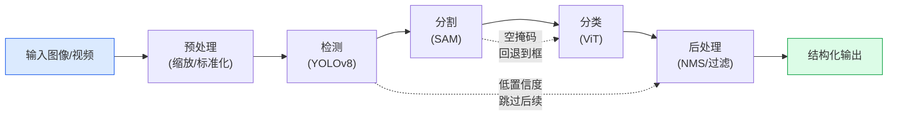

# 视觉管线项目

> 将检测、分割和分类组合为端到端视觉管线，处理真实世界的不完美输入和边缘情况。

**类型:** 项目
**语言:** Python
**前置知识:** Phase 4 Lessons 01-15
**时间:** 约120分钟

## 学习目标

- 设计多阶段视觉管线：预处理、检测、分割、分类、后处理
- 处理真实世界输入的边缘情况：可变分辨率、损坏图像、空帧
- 实现管线监控：延迟追踪、置信度过滤、失败日志
- 将管线部署为可调用的推理服务

## 问题所在

单个视觉模型在受控条件下工作良好。真实世界部署需要将多个模型串联为管线，处理不完美输入，并在延迟预算内产生一致输出。

一个零售分析管线可能需要：人物检测 -> 实例分割 -> 属性分类 -> 轨迹跟踪。每一步都可能失败——检测漏掉物体、分割不精确、分类错误。管线设计必须优雅地处理这些失败，而不是崩溃或产生垃圾输出。

## 核心概念

### 管线架构



### 错误处理策略

- **跳过** — 低置信度检测跳过后续步骤
- **回退** — 分割失败时使用边界框
- **缓存** — 相似帧复用上次结果
- **超时** — 单步超时则返回部分结果

### 延迟预算

```
总预算: 100ms
  预处理: 5ms
  检测: 30ms
  分割: 40ms
  分类: 20ms
  后处理: 5ms
```

每步必须在预算内完成。超时则跳过非关键步骤。

## 构建它

### 步骤1：管线框架

```python
from dataclasses import dataclass
from typing import List, Optional
import numpy as np
import time

@dataclass
class Detection:
    box: tuple  # (x1, y1, x2, y2)
    score: float
    class_id: int
    mask: Optional[np.ndarray] = None
    attributes: Optional[dict] = None

class PipelineStep:
    def __init__(self, name, timeout_ms=50):
        self.name = name
        self.timeout_ms = timeout_ms

    def process(self, data, timing):
        start = time.time()
        result = self._run(data)
        elapsed = (time.time() - start) * 1000
        timing[self.name] = elapsed
        if elapsed > self.timeout_ms:
            print(f"WARNING: {self.name} exceeded timeout ({elapsed:.0f}ms > {self.timeout_ms}ms)")
        return result

    def _run(self, data):
        raise NotImplementedError
```

### 步骤2：完整管线

```python
class VisionPipeline:
    def __init__(self, steps):
        self.steps = steps

    def run(self, image):
        timing = {}
        data = {"image": image, "detections": []}
        for step in self.steps:
            data = step.process(data, timing)
        return data, timing
```

## 发布它

本课产出：

- `outputs/prompt-vision-pipeline-architect.md` — 一个提示，根据需求设计视觉管线架构。
- `outputs/skill-pipeline-monitor.md` — 一个技能，实现管线监控和告警。

## 练习

1. **(简单)** 构建一个简单的检测+分类管线，处理合成图像。
2. **(中等)** 添加错误处理：低置信度跳过、分割回退、超时保护。
3. **(困难)** 将管线部署为FastAPI服务，支持批量推理和健康检查。

## 关键术语

| 术语       | 人们怎么说   | 实际含义                           |
| ---------- | ------------ | ---------------------------------- |
| 视觉管线   | "多模型串联" | 将多个视觉模型组合为端到端处理流程 |
| 延迟预算   | "时间限制"   | 每个步骤的最大允许时间             |
| 回退策略   | "Plan B"     | 主步骤失败时的替代方案             |
| 置信度过滤 | "低分丢弃"   | 丢弃低于阈值的检测结果             |

## 延伸阅读

- [Building ML Pipelines (Hapke et al., O'Reilly)](https://www.oreilly.com/library/view/building-machine-learning/9781492053185/)
- [FastAPI 部署指南](https://fastapi.tiangolo.com/deployment/)
