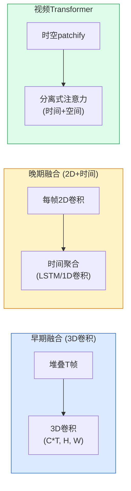

# 视频理解

> 视频是图像的时间序列。理解视频意味着建模时间依赖——从帧间运动到长程因果。

**类型:** 学习+构建
**语言:** Python
**前置知识:** Phase 4 Lesson 14 (视觉Transformer)
**时间:** 约60分钟

## 学习目标

- 解释视频数据的时间维度如何改变架构设计：3D卷积、时间注意力、分离式时空注意力
- 实现一个简单的视频分类模型，处理视频帧的时间序列
- 理解动作识别、时间定位和视频检索的区别
- 使用预训练视频模型（VideoMAE、TimeSformer）进行推理

## 问题所在

图像模型看单帧。视频模型必须看帧序列并理解时间关系：运动方向、动作顺序、因果关系。一个挥手在单帧中无法与静止的手区分；只有跨帧才能看到运动。

视频理解的核心挑战是规模：一个10秒的30fps视频有300帧，每帧224x224x3。直接将所有帧输入图像模型计算量巨大。视频架构必须在时间建模能力和计算效率之间平衡。

## 核心概念

### 视频表示

```
视频张量: (N, C, T, H, W)
  N = 批次大小
  C = 通道数 (3 for RGB)
  T = 时间帧数
  H, W = 空间尺寸
```

时间维度T是视频区别于图像的关键。所有视频架构都是处理这个额外维度的不同策略。

### 三种时间建模方法



- **3D卷积** (C3D, I3D) — 将时间维度视为额外卷积维度。最直接但计算量大。
- **2D+时间** (R(2+1)D, TSN) — 先用2D卷积处理每帧，再用时间模型聚合。更灵活。
- **视频Transformer** (TimeSformer, VideoMAE) — 将视频分割为时空patch，用注意力建模。2026年主流。

### 分离式时空注意力

TimeSformer的关键创新：不在所有(T*H*W)token上做全注意力（O(T^2*H^2*W^2)复杂度），而是分离为时间注意力和空间注意力：

```
时间注意力: 每个空间位置，跨所有时间帧注意
  复杂度: O(H*W * T^2)

空间注意力: 每个时间帧，跨所有空间位置注意
  复杂度: O(T * H^2*W^2)

总计: O(T^2*H*W + T*H^2*W^2) << O(T^2*H^2*W^2)
```

### 视频任务

- **动作识别** — 整个视频分类为动作类别（"跑步"、"做饭"）
- **时间定位** — 找到视频中动作发生的时间段（"第3-7秒在跑步"）
- **动作检测** — 时空定位：谁在何时何地做什么
- **视频检索** — 给定文本查询，找到匹配的视频片段
- **视频字幕** — 生成视频内容的自然语言描述

### 帧采样策略

视频通常太长无法逐帧处理。采样策略很重要：

- **均匀采样** — 从整个视频中均匀取T帧。覆盖全局但可能错过关键瞬间。
- **密集采样** — 从短片段中密集采样。捕获局部运动但可能错过上下文。
- **随机采样** — 训练时随机，推理时均匀。数据增强效果。
- **自适应采样** — 根据运动量选择帧。计算高效但需要预处理。

## 构建它

### 步骤1：视频数据加载

```python
import torch
import numpy as np

def load_video_frames(num_frames=16, size=224, seed=0):
    """合成视频帧用于演示"""
    rng = np.random.default_rng(seed)
    frames = []
    for t in range(num_frames):
        # 创建随时间移动的物体
        yy, xx = np.meshgrid(np.linspace(0, 1, size), np.linspace(0, 1, size), indexing="ij")
        cx = 0.3 + 0.4 * (t / num_frames)
        cy = 0.5
        circle = ((xx - cx)**2 + (yy - cy)**2 < 0.05).astype(np.float32)
        frame = np.stack([circle, circle * 0.5, np.zeros_like(circle)], axis=-1)
        frames.append(frame)
    video = np.stack(frames)
    return torch.from_numpy(video).permute(3, 0, 1, 2).float()  # (C, T, H, W)

video = load_video_frames()
print(f"video shape: {video.shape}  # (C, T, H, W)")
```

### 步骤2：简单视频分类器

```python
import torch.nn as nn
import torch.nn.functional as F

class SimpleVideoClassifier(nn.Module):
    def __init__(self, num_classes=10, backbone_dim=256):
        super().__init__()
        # 空间特征提取（每帧共享）
        self.spatial = nn.Sequential(
            nn.Conv2d(3, 64, 3, 2, 1), nn.ReLU(),
            nn.Conv2d(64, 128, 3, 2, 1), nn.ReLU(),
            nn.Conv2d(128, backbone_dim, 3, 2, 1), nn.ReLU(),
            nn.AdaptiveAvgPool2d(1),
        )
        # 时间建模
        self.temporal = nn.LSTM(backbone_dim, 256, num_layers=2, batch_first=True)
        # 分类头
        self.head = nn.Linear(256, num_classes)

    def forward(self, x):
        B, C, T, H, W = x.shape
        # 处理每帧
        x = x.permute(0, 2, 1, 3, 4).reshape(B * T, C, H, W)
        spatial_feat = self.spatial(x).squeeze(-1).squeeze(-1)
        spatial_feat = spatial_feat.reshape(B, T, -1)
        # 时间建模
        temporal_feat, _ = self.temporal(spatial_feat)
        # 用最后时间步分类
        return self.head(temporal_feat[:, -1])
```

### 步骤3：分离式时空注意力块

```python
class DividedSTAttentionBlock(nn.Module):
    def __init__(self, dim=256, heads=4):
        super().__init__()
        self.time_attn = nn.MultiheadAttention(dim, heads, batch_first=True)
        self.space_attn = nn.MultiheadAttention(dim, heads, batch_first=True)
        self.norm1 = nn.LayerNorm(dim)
        self.norm2 = nn.LayerNorm(dim)
        self.norm3 = nn.LayerNorm(dim)
        self.mlp = nn.Sequential(
            nn.Linear(dim, dim * 4), nn.GELU(), nn.Linear(dim * 4, dim)
        )

    def forward(self, x, T, HW):
        B, seq, D = x.shape
        # 时间注意力: 每个空间位置跨时间
        xt = x.view(B, T, HW, D).permute(0, 2, 1, 3).reshape(B * HW, T, D)
        a, _ = self.time_attn(self.norm1(xt), self.norm1(xt), self.norm1(xt), need_weights=False)
        xt = (xt + a).reshape(B, HW, T, D).permute(0, 2, 1, 3).reshape(B, seq, D)
        # 空间注意力: 每帧内跨空间
        xs = xt.view(B * T, HW, D)
        a, _ = self.space_attn(self.norm2(xs), self.norm2(xs), self.norm2(xs), need_weights=False)
        xs = (xs + a).reshape(B, T, HW, D).reshape(B, seq, D)
        return xs + self.mlp(self.norm3(xs))
```

## 使用它

使用预训练视频模型：

```python
from transformers import AutoModel, AutoProcessor

# VideoMAE 或 TimeSformer
model = AutoModel.from_pretrained("MCG-NJU/VideoMAE-finetuned-kinetics400")
processor = AutoProcessor.from_pretrained("MCG-NJU/VideoMAE-finetuned-kinetics400")
```

## 发布它

本课产出：

- `outputs/prompt-video-model-picker.md` — 一个提示，根据视频长度、任务类型和计算预算选择视频架构。
- `outputs/skill-video-sampler.md` — 一个技能，为不同视频模型实现最优帧采样策略。

## 练习

1. **(简单)** 在合成视频上训练简单视频分类器，区分"向左移动"和"向右移动"两种模式。
2. **(中等)** 实现完整视频Transformer，使用分离式时空注意力。与2D+LSTM方法比较。
3. **(困难)** 实现时间动作定位：给定未裁剪视频，输出每个动作的开始和结束时间。

## 关键术语

| 术语         | 人们怎么说      | 实际含义                                       |
| ------------ | --------------- | ---------------------------------------------- |
| 时空建模     | "3D处理"        | 同时建模空间和时间维度的信息                   |
| 分离式注意力 | "时间+空间分开" | 交替执行时间注意力和空间注意力，大幅降低计算量 |
| 动作识别     | "视频分类"      | 将整个视频分类为动作类别                       |
| 帧采样       | "选哪些帧"      | 从长视频中选择代表性帧的策略                   |
| 3D卷积       | "时间卷积"      | 在时间、高度、宽度三个维度上同时卷积           |
| 时间定位     | "何时发生"      | 找到视频中特定动作发生的时间段                 |

## 延伸阅读

- [TimeSformer (Bertasius et al., 2021)](https://arxiv.org/abs/2102.05095) — 分离式时空注意力
- [VideoMAE (Tong et al., 2022)](https://arxiv.org/abs/2203.12602) — 视频掩码自编码器
- [SlowFast (Feichtenhofer et al., 2019)](https://arxiv.org/abs/1812.03982) — 双通道视频架构
