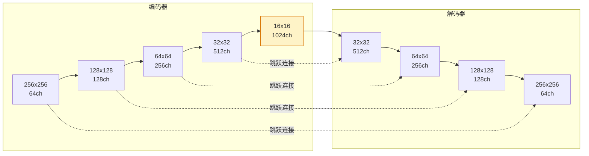

# 语义分割UNet

> 分割是像素级分类。U-Net的编码器-解码器结构与跳跃连接是医学影像和密集预测的骨干架构。

**类型:** 构建
**语言:** Python
**前置知识:** Phase 4 Lesson 02 (卷积从零实现), Phase 4 Lesson 03 (CNN)
**时间:** 约75分钟

## 学习目标

- 解释语义分割、实例分割和全景分割之间的区别
- 实现一个完整的U-Net，包括编码器、解码器和跳跃连接
- 理解为什么跳跃连接对精细细节恢复至关重要
- 使用交叉熵和Dice损失训练分割模型并评估mIoU

## 问题所在

分类给每张图像一个标签。检测给每个物体一个框。分割给每个像素一个标签。当你需要精确的物体边界时——医学影像中的肿瘤轮廓、自动驾驶中的道路区域、卫星图像中的建筑足迹——你需要像素级预测。

语义分割为每个像素分配一个类别标签，不区分同一类的不同实例。实例分割（下一课）区分实例。全景分割两者都做。

U-Net（Ronneberger et al., 2015）最初为医学影像设计，成为密集预测的默认架构，因为它的编码器-解码器结构与跳跃连接自然地结合了上下文和细节。编码器路径逐步下采样以捕获上下文；解码器路径逐步上采样以恢复空间分辨率；跳跃连接将编码器细节直接传递给解码器。

## 核心概念

### 三种分割

```
语义分割:    [猫, 猫, 猫, 背景, 背景, 狗, 狗]
实例分割:    [猫1, 猫1, 猫2, 背景, 背景, 狗1, 狗1]
全景分割:    [猫1, 猫1, 猫2, 背景, 背景, 狗1, 狗1] + 语义标签
```

语义分割最简单：每个像素一个类别。实例分割需要额外的实例ID。全景分割结合两者。

### U-Net架构



U形：编码器下采样（左臂），瓶颈（底部），解码器上采样（右臂）。每个解码器层从编码器对应层接收跳跃连接。

### 为什么跳跃连接至关重要

没有跳跃连接，解码器必须从瓶颈（16x16）恢复全分辨率（256x256）。那是256/16 = 16倍上采样，信息已经丢失。跳跃连接将编码器的中间特征图直接传递给解码器，绕过瓶颈。

```
没有跳跃连接:
  编码器 256 -> 128 -> 64 -> 32 -> 16 (瓶颈)
  解码器 16 -> 32 -> 64 -> 128 -> 256 (必须猜测细节)

有跳跃连接:
  编码器 256 -> 128 -> 64 -> 32 -> 16
  解码器 16 + [32的特征] -> 32 + [64的特征] -> 64 + [128的特征] -> ...
  (细节从编码器直接传递)
```

跳跃连接不是可选的。没有它们，U-Net在边界精度上严重退化。

### 上采样方法

解码器需要增加空间分辨率。三种方法：

1. **转置卷积** (`nn.ConvTranspose2d`) — 可学习的上采样。可以产生棋盘伪影如果核大小不是步幅的倍数。
2. **双线性上采样 + 卷积** — 先插值再精炼。更平滑，无棋盘伪影。
3. **像素重排** (`nn.PixelShuffle`) — 将通道重排为空间维度。用于超分辨率。

U-Net通常使用转置卷积或双线性+卷积。现代实现更偏好后者。

### 损失函数

分割使用两种损失的组合：

- **交叉熵损失** — 逐像素分类损失。处理类别平衡（通过权重）。
- **Dice损失** — 直接优化分割重叠度。对类别不平衡更鲁棒。

```
Dice = 2 * |P ∩ G| / (|P| + |G|)
Dice Loss = 1 - Dice
```

其中P是预测分割，G是真实分割。Dice对类别不平衡更鲁棒，因为它是归一化的重叠度量，不是原始像素计数。

### mIoU（平均交并比）

分割的标准评估指标：

```
IoU_per_class = TP / (TP + FP + FN)
mIoU = 所有类别IoU的平均
```

mIoU对每个类别独立评估分割质量，然后平均。报告mIoU和每类IoU，因为整体指标可能隐藏在少数类别上的糟糕表现。

## 构建它

### 步骤1：编码器块

```python
import torch
import torch.nn as nn
import torch.nn.functional as F

class EncoderBlock(nn.Module):
    def __init__(self, in_ch, out_ch):
        super().__init__()
        self.conv = nn.Sequential(
            nn.Conv2d(in_ch, out_ch, 3, padding=1, bias=False),
            nn.BatchNorm2d(out_ch),
            nn.ReLU(inplace=True),
            nn.Conv2d(out_ch, out_ch, 3, padding=1, bias=False),
            nn.BatchNorm2d(out_ch),
            nn.ReLU(inplace=True),
        )
        self.pool = nn.MaxPool2d(2)

    def forward(self, x):
        feat = self.conv(x)
        return self.pool(feat), feat
```

返回池化后的输出（传给下一层）和池化前的特征（传给跳跃连接）。

### 步骤2：解码器块

```python
class DecoderBlock(nn.Module):
    def __init__(self, in_ch, skip_ch, out_ch):
        super().__init__()
        self.up = nn.ConvTranspose2d(in_ch, in_ch, 2, stride=2)
        self.conv = nn.Sequential(
            nn.Conv2d(in_ch + skip_ch, out_ch, 3, padding=1, bias=False),
            nn.BatchNorm2d(out_ch),
            nn.ReLU(inplace=True),
            nn.Conv2d(out_ch, out_ch, 3, padding=1, bias=False),
            nn.BatchNorm2d(out_ch),
            nn.ReLU(inplace=True),
        )

    def forward(self, x, skip):
        x = self.up(x)
        # 处理尺寸不匹配
        dh = skip.size(2) - x.size(2)
        dw = skip.size(3) - x.size(3)
        x = F.pad(x, [dw // 2, dw - dw // 2, dh // 2, dh - dh // 2])
        x = torch.cat([x, skip], dim=1)
        return self.conv(x)
```

上采样，拼接跳跃连接，卷积。尺寸填充处理当输入尺寸不是2的幂时的边界情况。

### 步骤3：完整U-Net

```python
class UNet(nn.Module):
    def __init__(self, in_channels=3, num_classes=10):
        super().__init__()
        # 编码器
        self.enc1 = EncoderBlock(in_channels, 64)
        self.enc2 = EncoderBlock(64, 128)
        self.enc3 = EncoderBlock(128, 256)
        self.enc4 = EncoderBlock(256, 512)

        # 瓶颈
        self.bottleneck = nn.Sequential(
            nn.Conv2d(512, 1024, 3, padding=1, bias=False),
            nn.BatchNorm2d(1024),
            nn.ReLU(inplace=True),
            nn.Conv2d(1024, 1024, 3, padding=1, bias=False),
            nn.BatchNorm2d(1024),
            nn.ReLU(inplace=True),
        )

        # 解码器
        self.dec4 = DecoderBlock(1024, 512, 512)
        self.dec3 = DecoderBlock(512, 256, 256)
        self.dec2 = DecoderBlock(256, 128, 128)
        self.dec1 = DecoderBlock(128, 64, 64)

        # 分类头
        self.head = nn.Conv2d(64, num_classes, 1)

    def forward(self, x):
        # 编码器路径
        x, s1 = self.enc1(x)
        x, s2 = self.enc2(x)
        x, s3 = self.enc3(x)
        x, s4 = self.enc4(x)

        # 瓶颈
        x = self.bottleneck(x)

        # 解码器路径（带跳跃连接）
        x = self.dec4(x, s4)
        x = self.dec3(x, s3)
        x = self.dec2(x, s2)
        x = self.dec1(x, s1)

        return self.head(x)
```

### 步骤4：Dice损失

```python
def dice_loss(pred, target, smooth=1.0):
    """pred: (N, C, H, W) logits, target: (N, H, W) 类别索引"""
    pred = F.softmax(pred, dim=1)
    num_classes = pred.size(1)
    target_onehot = F.one_hot(target, num_classes).permute(0, 3, 1, 2).float()

    intersection = (pred * target_onehot).sum(dim=(2, 3))
    union = pred.sum(dim=(2, 3)) + target_onehot.sum(dim=(2, 3))

    dice = (2 * intersection + smooth) / (union + smooth)
    return 1 - dice.mean()

def segmentation_loss(pred, target):
    ce = F.cross_entropy(pred, target)
    dl = dice_loss(pred, target)
    return ce + dl
```

交叉熵处理逐像素分类，Dice处理整体分割质量。组合使用通常优于单独使用任何一种。

### 步骤5：mIoU评估

```python
def compute_miou(pred, target, num_classes):
    """pred: (N, H, W) 预测类别, target: (N, H, W) 真实类别"""
    ious = []
    for cls in range(num_classes):
        pred_cls = (pred == cls)
        target_cls = (target == cls)
        intersection = (pred_cls & target_cls).sum().float()
        union = (pred_cls | target_cls).sum().float()
        if union > 0:
            ious.append((intersection / union).item())
    return sum(ious) / len(ious) if ious else 0.0
```

## 使用它

对于生产分割，使用`segmentation_models_pytorch`（SMP）：

```python
import segmentation_models_pytorch as smp

model = smp.Unet(
    encoder_name="resnet34",
    encoder_weights="imagenet",
    in_channels=3,
    classes=10,
)

# 或使用更现代的架构
model = smp.UnetPlusPlus(
    encoder_name="efficientnet-b4",
    encoder_weights="imagenet",
    in_channels=3,
    classes=10,
)
```

SMP提供20+编码器骨干和5+解码器架构，全部预训练，带有统一的API。U-Net++添加了嵌套的跳跃连接以获得更好的特征融合。

## 发布它

本课产出：

- `outputs/prompt-segmentation-architect.md` — 一个提示，根据输入分辨率、类别数和延迟预算选择分割架构。
- `outputs/skill-segmentation-evaluator.md` — 一个技能，计算mIoU、每类IoU、边界F1和实例级分割指标。

## 练习

1. **(简单)** 在合成数据（随机形状在背景上）上训练U-Net 10个epoch。报告mIoU。可视化输入、真实和预测分割。
2. **(中等)** 实现U-Net++的嵌套跳跃连接。与标准U-Net在相同数据上比较mIoU。
3. **(困难)** 实现Deep Supervision——在训练期间从每个解码器层添加辅助损失。与仅从最终层监督比较收敛速度。

## 关键术语

| 术语     | 人们怎么说      | 实际含义                                            |
| -------- | --------------- | --------------------------------------------------- |
| 语义分割 | "像素分类"      | 为每个像素分配类别标签，不区分实例                  |
| U-Net    | "编码器-解码器" | 带有跳跃连接的对称编码器-解码器架构；密集预测的骨干 |
| 跳跃连接 | "拼接"          | 将编码器特征直接传递给解码器以恢复空间细节          |
| 编码器   | "下采样路径"    | 逐步减少空间分辨率、增加通道数的卷积层              |
| 解码器   | "上采样路径"    | 逐步恢复空间分辨率的转置卷积或上采样层              |
| Dice损失 | "重叠损失"      | 直接优化预测和真实分割之间重叠的损失函数            |
| mIoU     | "分割准确率"    | 平均交并比；所有类别上IoU的平均值                   |
| 转置卷积 | "反卷积"        | 可学习的上采样操作；增加空间分辨率                  |

## 延伸阅读

- [U-Net: Convolutional Networks for Biomedical Image Segmentation (Ronneberger et al., 2015)](https://arxiv.org/abs/1505.04597) — 原始U-Net论文
- [U-Net++ (Zhou et al., 2018)](https://arxiv.org/abs/1807.10165) — 嵌套跳跃连接
- [DeepLab v3+ (Chen et al., 2018)](https://arxiv.org/abs/1802.02611) — 空洞空间卷积池化的替代架构
- [Segmentation Models PyTorch](https://github.com/qubvel/segmentation_models.pytorch) — 生产分割模型库
