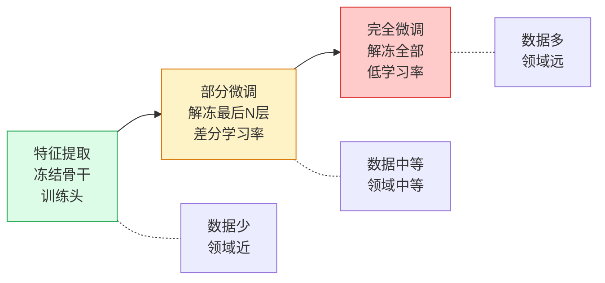

# 迁移学习

> 迁移学习是在别人的权重上构建，只训练你的任务所改变的部分。

**类型:** 构建
**语言:** Python
**前置知识:** Phase 4 Lesson 03 (CNN从LeNet到ResNet), Phase 4 Lesson 04 (图像分类)
**时间:** 约60分钟

## 学习目标

- 加载预训练ImageNet骨干，冻结它，替换分类头，并在新数据集上训练到收敛
- 解释"特征提取"（冻结骨干）和"微调"（解冻部分或全部骨干）之间的区别，以及何时使用每种方式
- 实现差分学习率——骨干使用较低学习率，头部使用较高学习率——并解释为什么这防止灾难性遗忘
- 诊断常见的迁移学习失败模式：过拟合小数据集、忘记预训练特征、领域偏移

## 问题所在

从零在ImageNet上训练ResNet-50需要8个V100 GPU运行约90个epoch，大约一周。从零在1000张医学图像上训练相同模型需要10分钟，但准确率是垃圾，因为1000张图像不足以学习通用视觉特征。

迁移学习解决了这两个问题。你在ImageNet上预训练（或下载预训练权重），冻结大部分网络，只训练一个小头或微调最后几层。结果：10分钟训练，90%+准确率，单GPU。

这个模式如此普遍，以至于"从零训练"在2026年是例外，不是默认。每个生产视觉系统——医学影像、卫星分析、零售、农业——都从预训练骨干开始。问题不是是否迁移学习，而是迁移多少以及如何迁移。

## 核心概念

### 迁移谱



经验法则：

- **数据少，领域近**（例如，1000张自然图像，10类）→ 冻结骨干，训练线性头。
- **数据中等，领域中等**（例如，10k卫星图像）→ 解冻最后2-3个阶段，差分学习率。
- **数据多，领域远**（例如，100k医学X光）→ 完全微调，低学习率，可能从ImageNet权重热启动。

"领域距离"是直觉的：自然图像到自然图像是近的。自然图像到X光是远的。自然图像到卫星是中等的。

### 冻结和解冻

```python
# 特征提取：冻结骨干
for param in model.parameters():
    param.requires_grad = False
model.fc = nn.Linear(model.fc.in_features, num_classes)

# 部分微调：冻结stem和layer1，解冻其余
for name, param in model.named_parameters():
    if "layer1" in name or "layer2" in name:
        param.requires_grad = False

# 完全微调：解冻全部
for param in model.parameters():
    param.requires_grad = True
```

冻结设置`requires_grad = False`，这意味着该参数在反向传播期间不接收梯度更新。节省内存（没有梯度存储）和计算（没有优化器步进）。代价：冻结层不能适应新任务。

### 差分学习率

当你解冻骨干层时，使用比新头低得多的学习率。骨干已经学习了有用的特征；大学习率会破坏它们（灾难性遗忘）。

```python
optimizer = torch.optim.SGD([
    {"params": model.fc.parameters(), "lr": 1e-2},           # 头：快速学习
    {"params": model.layer4.parameters(), "lr": 1e-3},       # 深层骨干：慢学习
    {"params": model.layer3.parameters(), "lr": 1e-4},       # 中层骨干：更慢
    {"params": model.layer1.parameters(), "lr": 1e-5},       # 浅层骨干：几乎不动
], momentum=0.9, weight_decay=5e-4)
```

10倍衰减是常见默认值。头获得完整学习率，每个更深的骨干组获得十分之一。

### 灾难性遗忘

当你在新任务上用过高学习率微调整个网络时，网络快速适应新数据，但忘记了预训练特征。症状：训练损失在前几个epoch下降，然后验证准确率崩溃，因为早期层停止产生通用边缘/纹理检测器。

修复：差分学习率，或从特征提取开始训练几个epoch，然后解冻并微调低学习率。这种"热身然后微调"模式是大多数生产管线使用的。

### 领域偏移

预训练权重来自ImageNet（自然图像）。当你的目标域不同时：

- **医学影像** — 灰度、高对比度、与ImageNet完全不同的纹理。早期层（边缘检测器）仍然有用。后期层（物体部分检测器）没用。
- **卫星图像** — 俯视、多光谱、没有自然物体。早期层有用。中期层需要微调。
- **文档/OCR** — 高对比度二值图像。早期层可能需要重新训练。

经验法则：领域越远，你需要解冻和微调的层越多。

## 构建它

### 步骤1：加载预训练ResNet-18

```python
import torch
import torch.nn as nn
from torchvision.models import resnet18, ResNet18_Weights

model = resnet18(weights=ResNet18_Weights.IMAGENET1K_V1)
print(f"Original fc: {model.fc}")
print(f"Total params: {sum(p.numel() for p in model.parameters()):,}")
```

ResNet-18有11.7M参数。最后的全连接层是`Linear(512, 1000)`——1000个ImageNet类。你的任务有不同的类别数。

### 步骤2：替换头并冻结骨干

```python
num_classes = 5  # 例如，花朵分类

# 冻结骨干
for param in model.parameters():
    param.requires_grad = False

# 替换头
model.fc = nn.Linear(model.fc.in_features, num_classes)

# 只有fc有梯度
trainable = sum(p.numel() for p in model.parameters() if p.requires_grad)
total = sum(p.numel() for p in model.parameters())
print(f"Trainable: {trainable:,} / {total:,} ({100*trainable/total:.1f}%)")
```

2,565个可训练参数，共11.7M。你只训练0.02%的模型。

### 步骤3：特征提取训练

```python
from torch.optim import SGD
from torch.optim.lr_scheduler import CosineAnnealingLR

optimizer = SGD(model.fc.parameters(), lr=0.01, momentum=0.9)
scheduler = CosineAnnealingLR(optimizer, T_max=10)

# 标准训练循环（简化）
def train_epoch(model, loader, optimizer, device):
    model.train()
    for x, y in loader:
        x, y = x.to(device), y.to(device)
        loss = nn.functional.cross_entropy(model(x), y)
        optimizer.zero_grad()
        loss.backward()
        optimizer.step()
```

只有`model.fc`接收梯度。骨干权重与ImageNet离开时完全相同。

### 步骤4：差分学习率微调

```python
# 解冻layer3和layer4
for name, param in model.named_parameters():
    if "layer3" in name or "layer4" in name or "fc" in name:
        param.requires_grad = True

optimizer = SGD([
    {"params": model.fc.parameters(), "lr": 1e-2},
    {"params": model.layer4.parameters(), "lr": 1e-3},
    {"params": model.layer3.parameters(), "lr": 1e-4},
], momentum=0.9, weight_decay=5e-4)
```

头学习快，深层骨干慢适应，浅层骨干保持冻结。

### 步骤5：渐进解冻

一种实用的策略：从冻结开始，训练几个epoch，然后逐层解冻。

```python
def progressive_unfreeze(model, epoch_schedule):
    """epoch_schedule: {epoch: [layer_names_to_unfreeze]}"""
    for epoch, layers in sorted(epoch_schedule.items()):
        if epoch == current_epoch:
            for name, param in model.named_parameters():
                if any(layer in name for layer in layers):
                    param.requires_grad = True

# 示例：epoch 0冻结，epoch 3解冻layer4，epoch 6解冻layer3
schedule = {3: ["layer4"], 6: ["layer3"]}
```

渐进解冻是fast.ai的默认方法，也是生产中最安全的方法。它防止早期训练不稳定性，同时仍允许深层适应。

## 使用它

对于真实世界迁移学习，`torchvision`预训练模型是起点。以下是2026年的完整配方：

```python
from torchvision.models import resnet50, ResNet50_Weights
from torchvision import transforms

# 加载预训练模型
model = resnet50(weights=ResNet50_Weights.IMAGENET1K_V2)

# 替换头
num_classes = 10
model.fc = nn.Sequential(
    nn.Dropout(0.25),
    nn.Linear(model.fc.in_features, 256),
    nn.ReLU(),
    nn.Linear(256, num_classes),
)

# 差分学习率
optimizer = torch.optim.AdamW([
    {"params": model.fc.parameters(), "lr": 1e-3},
    {"params": model.layer4.parameters(), "lr": 1e-4},
    {"params": model.layer3.parameters(), "lr": 5e-5},
], weight_decay=0.01)

# 标准ImageNet预处理
transform = transforms.Compose([
    transforms.Resize(256),
    transforms.CenterCrop(224),
    transforms.ToTensor(),
    transforms.Normalize(mean=[0.485, 0.456, 0.406], std=[0.229, 0.224, 0.225]),
])
```

V2权重（IMAGENET1K_V2）使用比V1更好的训练配方，在大多数迁移场景中值得1-2%的提升。

## 发布它

本课产出：

- `outputs/prompt-transfer-strategy.md` — 一个提示，根据数据集大小、领域距离和计算预算推荐迁移策略（冻结/部分微调/完全微调）。
- `outputs/skill-differential-lr-setup.md` — 一个技能，给定骨干架构和解冻计划，生成差分学习率优化器配置。

## 练习

1. **(简单)** 在CIFAR-10上用冻结ResNet-18骨干训练5个epoch。然后解冻layer4并微调5个epoch。比较验证准确率。
2. **(中等)** 实现渐进解冻：从冻结开始，每5个epoch解冻一个额外层组（layer4 -> layer3 -> layer2）。与一步解冻所有层比较。
3. **(困难)** 在灰度图像数据集（例如，将CIFAR-10转换为灰度）上微调ResNet-18。修改第一层以接受1通道输入。比较三种初始化策略：随机、从RGB权重平均、从RGB权重复制一个通道。

## 关键术语

| 术语       | 人们怎么说            | 实际含义                                                 |
| ---------- | --------------------- | -------------------------------------------------------- |
| 迁移学习   | "预训练"              | 使用在不同任务上训练的模型的权重作为新任务的起点         |
| 特征提取   | "冻结骨干"            | 保持预训练权重固定，只训练新的分类头                     |
| 微调       | "解冻"                | 允许部分或全部预训练权重在新数据上更新                   |
| 冻结       | "requires_grad=False" | 阻止参数在反向传播期间接收梯度更新                       |
| 差分学习率 | "不同层不同学习率"    | 骨干使用较低学习率，头使用较高学习率，以保留预训练特征   |
| 灾难性遗忘 | "忘记旧任务"          | 在新任务上用过高学习率微调时，网络丢失预训练中学到的特征 |
| 领域偏移   | "数据不同"            | 预训练数据分布和目标数据分布之间的差异                   |
| 渐进解冻   | "逐层解冻"            | 从冻结骨干开始，训练几个epoch，然后逐层解冻              |

## 延伸阅读

- [How transferable are features in deep neural networks? (Yosinski et al., 2014)](https://arxiv.org/abs/1411.1792) — 关于哪些层迁移和哪些不迁移的奠基性实验
- [A Survey on Transfer Learning (Pan & Yang, 2010)](https://www.cse.ust.hk/~qyang/Docs/2009/tkde_transfer_learning.pdf) — 迁移学习方法的全面分类
- [fast.ai Transfer Learning Guide](https://docs.fast.ai/transfer.html) — 渐进解冻和差分学习率的实用指南
- [Rethinking ImageNet Pre-training (He et al., 2019)](https://arxiv.org/abs/1811.08883) — 表明从随机初始化训练可以匹配预训练，但需要更长时间
