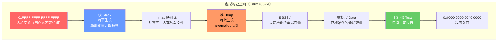
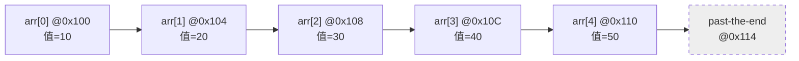
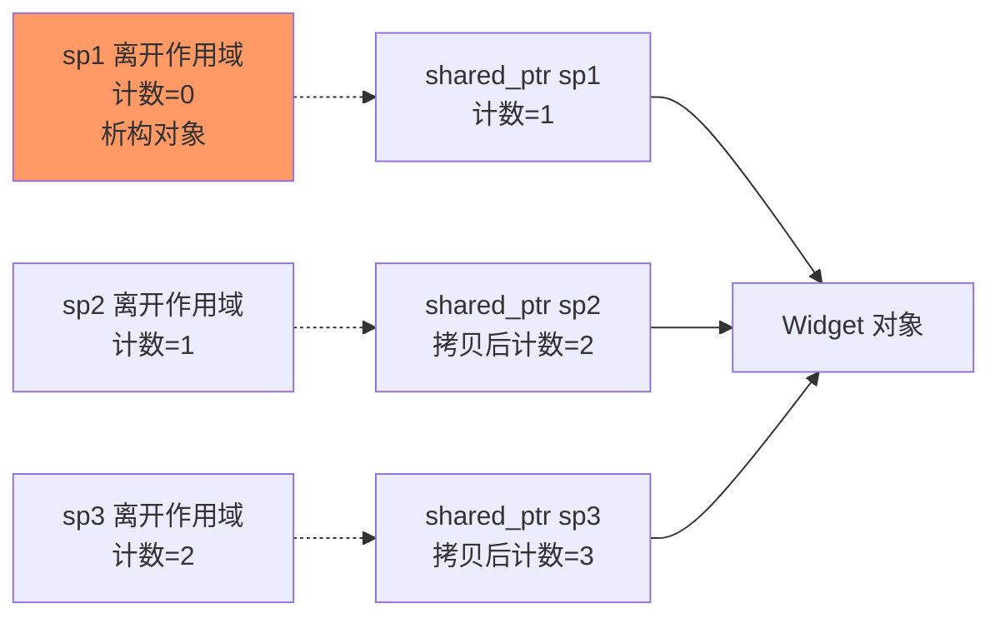

## 第 1 章 学习目标与导论

### 1.1 本章在 C++ 知识体系中的位置

指针（pointer，源自拉丁语 "punctus"，意为"点"）是 C++ 语言中最具特色、最容易引发错误、也是最能体现系统级编程能力的核心机制之一。它位于 C++ 知识体系的"内存层"，向上承接数据类型与基础语法，向下衔接智能指针、引用、移动语义与 RAII 等现代 C++ 关键特性。

学习本章前，读者应当已经掌握：

- `cpp/概述与现代标准`：C++ 的发展脉络与现代标准演进
- `cpp/基础语法`：变量声明、作用域、控制流
- `cpp/数据类型详解`：基本类型、数组、struct 与类型转换

掌握本章后，读者将为后续学习 `cpp/引用`、`cpp/右值引用与移动语义`、`cpp/智能指针详解`、`cpp/RAII资源管理`、`cpp/模板元编程` 等高级主题奠定坚实基础。

### 1.2 学习目标

本章遵循 Bloom 分类法，按认知层级递进组织学习目标：

1. **记忆（Remember）**：复述指针的内存模型与地址算术的代数性质，识别 `T*`、`const T*`、`T* const`、`const T* const` 四种形式的语义差异。
2. **理解（Understand）**：解释指针类型系统对内存访问的约束机制，说明严格别名规则与 `void*` 限制的根源。
3. **应用（Apply）**：使用指针算术实现高效数组遍历与字符串操作，编写函数指针回调与跳转表。
4. **分析（Analyze）**：对比指针与引用、智能指针的所有权（ownership，借用日常语义，指"负责管理某资源生命周期"的责任归属）语义差异，识别代码中的悬空指针、内存泄漏与未定义行为。
5. **评估（Evaluate）**：评估原始指针在不同语境下的安全风险，选择智能指针、引用或视图等替代方案，论证选择的合理性。
6. **创造（Create）**：设计基于指针的抽象数据结构（如链表、跳表、对象池）与内存管理策略（如自定义分配器、内存池），并保证异常安全与线程安全。

### 1.3 阅读建议

- **零基础读者**：先通读第 3、4、6 章，建立直观认识后回看第 2 章历史动机；
- **有 C 语言基础读者**：重点关注第 5、8、9、10 章，理解 C++ 对指针的强化与现代替代方案；
- **进阶读者**：直接研读第 11、12 章的工程实践与开源项目案例。

## 第 2 章 历史动机与演进

### 2.1 1960s：BCPL 与 B 语言的字指针

指针的概念最早可追溯至 1967 年 Martin Richards 在剑桥大学设计的 BCPL 语言。BCPL 引入了"字指针（word pointer）"的概念，每个指针指向一个机器字（word），而非字节。这一设计简化了语言模型，但无法适应字节寻址架构。

1969 年，Ken Thompson 在贝尔实验室为 DEC PDP-7 设计 B 语言时继承了 BCPL 的字指针模型。B 语言是无类型的，所有数据皆为机器字，指针算术按字而非字节进行。这种设计在 PDP-7 的字寻址架构上工作良好，但在新一代字节寻址机器（如 PDP-11）上则暴露出根本性缺陷。

### 2.2 1972：Dennis Ritchie 与 C 语言的带类型指针

1972 年，Dennis Ritchie 在设计 C 语言时引入了**带类型的指针**这一关键创新。C 语言的指针携带类型信息，使得指针算术能够根据所指类型的大小自动调整：

```c
/* C 语言指针算术：步长与类型大小自动耦合 */
int  arr[4] = {10, 20, 30, 40};
int* p      = arr;          /* p 指向 arr[0] */
int* q      = p + 1;        /* q 指向 arr[1]，地址增加 sizeof(int) 而非 1 */
```

这一设计的核心动机是**直接内存访问**：Unix 内核需要操纵硬件寄存器、内存映射 I/O、进程地址空间等底层资源，没有指针这类机制就无法实现操作系统内核。Ritchie 在 1978 年与 Brian Kernighan 合著的《The C Programming Language》（K&R C）中正式确立了这一模型。

### 2.3 1985：Bjarne Stroustrup 与 C++ 的兼容性权衡

1985 年，Bjarne Stroustrup 发布 C++ 语言首个商用版本 Cfront。C++ 的设计目标是在保留 C 语言系统级编程能力的同时引入类型安全与面向对象机制。Stroustrup 在《The Design and Evolution of C++》中明确指出：**"C++ 必须与 C 兼容，否则无法吸引 C 程序员迁移"**。因此 C++ 保留了完整的指针机制，包括指针算术、`void*`、显式类型转换。

但 Stroustrup 同时引入了若干约束以提升安全性：

- **更严格的类型检查**：`void*` 不能隐式转换为其他指针类型（C 语言允许）；
- **引用（reference）**：作为指针的"语法糖"替代方案，不可为空、不可重绑定；
- **new/delete**：替代 `malloc/free`，调用构造与析构函数；
- **const 正确性**：`const T*`、`T* const` 等组合强制约束读写权限。

### 2.4 2011：C++11 的革命性引入

C++11 是指针演进史上的里程碑，引入了多项关键特性：

| 特性                                    | 动机                                        | 替代/补充的旧机制         |
| :-------------------------------------- | :------------------------------------------ | :------------------------ |
| `nullptr`                               | 消除 `NULL` 的二义性（0 还是 `(void*)0`？） | `NULL`、`0`               |
| `std::unique_ptr`                       | 表达独占所有权，零开销抽象                  | `std::auto_ptr`（已废弃） |
| `std::shared_ptr`                       | 表达共享所有权，引用计数管理                | 手动引用计数              |
| `std::weak_ptr`                         | 打破 `shared_ptr` 循环引用                  | 无标准方案                |
| `std::make_unique` / `std::make_shared` | 异常安全的对象构造                          | 裸 `new`                  |
| 右值引用与移动语义                      | 显式表达所有权转移                          | 复制构造的隐式转移        |

其中 `std::auto_ptr` 的废弃最具代表性：其复制构造**隐式转移所有权**，违反值语义直觉，且不满足 STL 容器对元素 `CopyConstructible` 的要求。C++17 正式将其从标准中移除。

### 2.5 2017 与 2020：现代 C++ 的精细化

C++17 引入 `std::byte` 与 `std::launder`：

- `std::byte`：替代 `char*`/`unsigned char*` 表示"原始字节"，语义更清晰，避免与字符混淆；
- `std::launder`：解决"通过 placement new 在同一存储上创建新对象后，旧指针是否有效"的问题（标准 [basic.life]）。

C++20 引入 **concepts** 后，对指针的约束可表达为模板参数要求，例如：

```cpp
// C++20：使用 concepts 约束模板参数必须是指针类型
template <typename T>
    requires std::is_pointer_v<T>
auto dereference(T p) {
    return *p;
}
```

这一机制使得泛型代码能够更早地在编译期诊断类型错误，而非依赖于晦涩的模板实例化失败信息。

## 第 3 章 形式化定义与内存模型

### 3.1 形式化定义

为了消除自然语言的歧义，本节以数学形式化方式定义指针的语义。该形式化对应 C++ 标准 [basic.compound] 与 [expr.unary.op] 的规定。

设 $M = \{0, 1, \dots, 2^{W}-1\}$ 为虚拟地址空间（$W$ 为地址总线宽度，常见为 64 或 32），其中每个元素表示一个字节存储单元。设 $\mathcal{T}$ 为 C++ 类型集合，$\text{sizeof}: \mathcal{T} \to \mathbb{N}^+$ 为类型大小函数。

**定义 3.1（指针）**：类型为 $T^*$ 的指针 $p$ 是一个有序对 $(a, T)$，其中 $a \in M$ 为地址，$T \in \mathcal{T}$ 为所指类型。形式上：

$$p : T^* \triangleq (a, T), \quad a \in M, T \in \mathcal{T}$$

**定义 3.2（解引用，dereference）**：解引用（"de-" 去除 + "reference" 引用，意为"通过引用访问原始对象"）算子将指针映射为其所指对象的值。设 $\text{load}: M \times \mathcal{T} \to V$ 为"按类型 $T$ 解释地址 $a$ 处的 $\text{sizeof}(T)$ 字节"的函数：

$$\text{deref}(p) \triangleq \text{load}(a, T)$$

**定义 3.3（指针算术）**：对于指针 $p = (a, T)$ 与整数 $n \in \mathbb{Z}$：

$$p + n \triangleq (a + n \cdot \text{sizeof}(T) \pmod{2^{W}}, T)$$

该定义保证 $p + 1$ 在地址上前进 $\text{sizeof}(T)$ 字节，而非 1 字节。

**定义 3.4（指针减法）**：对于同一数组内的两个指针 $p_1 = (a_1, T)$、$p_2 = (a_2, T)$：

$$p_2 - p_1 \triangleq \frac{a_2 - a_1}{\text{sizeof}(T)} \in \mathbb{Z}$$

结果类型为 `std::ptrdiff_t`，仅当 $p_1$、$p_2$ 指向同一数组元素或其 past-the-end 元素时有定义。

**代数性质**：指针算术在合法范围内构成 $\mathbb{Z}$-模（$\mathbb{Z}$-module），满足：

- 加法结合律：$(p + m) + n = p + (m + n)$
- 加法单位元：$p + 0 = p$
- 加法逆元：$p + (-n) = p - n$
- 减法兼容性：$(p + n) - p = n$

### 3.2 C++ 对象模型

C++ 标准 [intro.object] 定义了对象（object）为"存储区域"（a region of storage）。理解对象模型对于正确使用指针至关重要：

- **对象身份（identity）**：每个对象有唯一的地址、生命周期与类型；
- **存储期（storage duration）**：定义对象的生存期，包括静态（static）、线程（thread）、自动（automatic）、动态（dynamic）四种，对应标准 [basic.stc]；
- **生命周期（lifetime）**：对象从构造完成到析构开始的时间段，对应标准 [basic.life]。

在对象生命周期之外访问其存储是未定义行为（UB，Undefined Behavior）。例如：

```cpp
#include <iostream>

int* create_dangling() {
    int x = 42;          // 自动存储期，函数返回时销毁
    return &x;           // 返回指向已销毁对象的指针
}                         // UB：x 已析构

int main() {
    int* p = create_dangling();
    std::cout << *p;     // UB：解引用指向无效对象的指针
    return 0;
}
```

### 3.3 虚拟地址空间布局

现代操作系统采用虚拟内存机制，每个进程拥有独立的虚拟地址空间。下图展示了典型 Linux x86-64 进程的地址空间布局：



不同存储期的对象分布在不同的段：

- **自动存储期**（局部变量）：位于栈（Stack），由编译器自动管理；
- **静态存储期**（全局变量、`static` 变量）：位于数据段或 BSS；
- **动态存储期**（`new`/`malloc`）：位于堆（Heap），由程序员管理；
- **线程存储期**（`thread_local`）：每线程独立存储。

### 3.4 对象模型与 lifetime

C++17 引入 `std::launder` 用于解决以下场景：通过 placement new 在原存储上创建新对象后，原指针是否有效？

```cpp
#include <new>
#include <iostream>

struct X { const int n; };

int main() {
    X x{1};
    X* p = &x;
    new (p) X{2};              // 在原存储上构造新对象
    // std::cout << p->n;      // UB：p 指向旧对象，编译器可能缓存旧值
    std::cout << std::launder(p)->n;  // 正确：通过 launder 获取指向新对象的指针
    return 0;
}
```

`std::launder` 是优化屏障，阻止编译器跨构造点传播指针别名信息。

## 第 4 章 指针的声明、初始化与基本操作

### 4.1 声明语法

C++ 指针声明有三种等价写法，区别仅在风格：

```cpp
int* p1;   // 风格 A：强调类型（int* 是"指向 int 的指针"类型）
int *p2;   // 风格 B：强调变量（*p2 是 int）
int * p3;  // 风格 C：少见，可读性差
```

**风格选择建议**：Bjarne Stroustrup 与 C++ Core Guidelines 推荐风格 A（`int* p`），因为它符合"类型即契约"的 C++ 哲学。但需注意单语句声明多个变量时的歧义：

```cpp
int* p1, p2;   // p1 是 int*，p2 是 int（不是 int*）！
int *p1, *p2;  // 两者都是 int*
```

### 4.2 初始化方式

```cpp
#include <iostream>

int g_value = 100;  // 静态存储期

int main() {
    int x = 42;

    // 方式 1：取地址
    int* p1 = &x;

    // 方式 2：动态分配
    int* p2 = new int(10);

    // 方式 3：空指针（C++11 推荐 nullptr）
    int* p3 = nullptr;

    // 方式 4：指向静态对象
    int* p4 = &g_value;

    // 方式 5：数组名退化
    int arr[3] = {1, 2, 3};
    int* p5 = arr;       // arr 退化为 int*

    std::cout << *p1 << ' ' << *p2 << ' ' << *p4 << ' ' << *p5;
    // 输出: 42 10 100 1

    delete p2;           // 释放动态分配的内存
    return 0;
}
```

### 4.3 基本操作

#### 4.3.1 解引用（`*p`）

```cpp
#include <iostream>

int main() {
    int x = 42;
    int* p = &x;

    std::cout << "x 的值: " << x << "\n";        // 42
    std::cout << "*p 的值: " << *p << "\n";      // 42
    std::cout << "p 的地址: " << p << "\n";      // 0x7ffd...（实现定义）
    std::cout << "&x 的地址: " << &x << "\n";    // 与 p 相同

    *p = 100;                                     // 通过指针修改 x
    std::cout << "修改后 x 的值: " << x << "\n"; // 100
    return 0;
}
```

#### 4.3.2 成员访问（`p->member`）

`p->member` 是 `(*p).member` 的语法糖，用于通过指针访问结构体成员：

```cpp
#include <iostream>
#include <string>

struct Point {
    int x;
    int y;
    std::string label;
};

int main() {
    Point pt{3, 4, "origin"};
    Point* p = &pt;

    std::cout << p->x << ", " << p->y << "\n";   // 3, 4
    std::cout << p->label << "\n";               // origin

    p->x = 10;                                    // 通过指针修改成员
    std::cout << pt.x << "\n";                    // 10
    return 0;
}
```

#### 4.3.3 下标（`p[i]`）

`p[i]` 等价于 `*(p + i)`，因此指针也支持下标运算：

```cpp
#include <iostream>

int main() {
    int arr[5] = {10, 20, 30, 40, 50};
    int* p = arr;

    for (int i = 0; i < 5; ++i) {
        std::cout << p[i] << ' ';                // 10 20 30 40 50
    }
    std::cout << "\n";
    return 0;
}
```

注意 `i[p]` 与 `p[i]` 等价（因 `p[i] = *(p + i) = *(i + p) = i[p]`），但这属于炫技写法，不应在生产代码中使用。

## 第 5 章 指针类型系统

### 5.1 类型约束

C++ 是强类型语言，不同类型的指针不能互相赋值（除非显式转换）。这一约束防止了无意义的内存解释：

```cpp
int x = 42;
// float* fp = &x;   // 编译错误：int* 不能隐式转为 float*
float* fp = (float*)&x;   // C 风格强制转换，允许但可能违反别名规则
float* fp2 = reinterpret_cast<float*>(&x);  // C++ 风格，等价但更显式
```

### 5.2 const 修饰的四种组合

`const` 修饰符在指针声明中的位置决定了"所指对象是否可变"与"指针本身是否可变"：

| 声明形式             | 所指对象可变 | 指针本身可变 | 典型用途                       |
| :------------------- | :----------- | :----------- | :----------------------------- |
| `int* p`             | 是           | 是           | 通用指针                       |
| `const int* p`       | 否           | 是           | 只读视图（如函数参数保护入参） |
| `int* const p`       | 是           | 否           | 固定地址（如硬件寄存器映射）   |
| `const int* const p` | 否           | 否           | 只读固定地址                   |

**记忆口诀**：`const` 在 `*` 左侧修饰所指对象，在 `*` 右侧修饰指针本身。

```cpp
#include <iostream>

int main() {
    int a = 10, b = 20;

    // 组合 1：int* p —— 都可变
    int* p1 = &a;
    *p1 = 11;    p1 = &b;        // 均合法

    // 组合 2：const int* p —— 所指对象不可变，指针可变
    const int* p2 = &a;
    // *p2 = 12;                 // 编译错误：不能通过 const int* 修改
    p2 = &b;                     // 合法

    // 组合 3：int* const p —— 指针本身不可变，所指对象可变
    int* const p3 = &a;
    *p3 = 13;                    // 合法
    // p3 = &b;                  // 编译错误：const 指针不可重新赋值

    // 组合 4：const int* const p —— 都不可变
    const int* const p4 = &a;
    // *p4 = 14; p4 = &b;        // 均编译错误

    std::cout << a << ' ' << b;  // 输出: 13 20
    return 0;
}
```

### 5.3 void\* 通用指针

`void*` 是"无类型指针"，可指向任意对象，但**禁止直接解引用**（编译器不知道该按多少字节解释）。使用前必须 `static_cast` 到具体类型：

```cpp
#include <iostream>

void print_as_int(void* p) {
    // std::cout << *p;              // 编译错误：void* 不能解引用
    int* ip = static_cast<int*>(p);
    std::cout << *ip << "\n";
}

int main() {
    int x = 42;
    void* vp = &x;                   // 任意对象指针均可隐式转为 void*
    print_as_int(vp);                // 输出: 42
    return 0;
}
```

`void*` 主要用于 C 风格泛型接口（如 `qsort`、`memcpy`），现代 C++ 优先使用模板或 `std::any`、`std::variant` 替代。

### 5.4 函数指针

函数指针声明语法为 `Ret (*name)(Args...)`：

```cpp
#include <iostream>
#include <functional>

int add(int a, int b) { return a + b; }
int sub(int a, int b) { return a - b; }

int main() {
    // 函数指针
    int (*fp)(int, int) = add;
    std::cout << fp(3, 4) << "\n";          // 7
    fp = sub;
    std::cout << fp(3, 4) << "\n";          // -1

    // std::function：更灵活，但有一定开销
    std::function<int(int, int)> f = add;
    std::cout << f(3, 4) << "\n";           // 7

    // 跳转表：用函数指针数组实现分发
    int (*ops[])(int, int) = {add, sub};
    std::cout << ops[0](10, 3) << "\n";     // 13
    std::cout << ops[1](10, 3) << "\n";     // 7
    return 0;
}
```

| 特性       | 函数指针         | `std::function`          |
| :--------- | :--------------- | :----------------------- |
| 大小       | 固定（1 个指针） | 较大（含小对象优化）     |
| 调用开销   | 直接跳转，零开销 | 类型擦除，可能有间接调用 |
| 可捕获状态 | 不可             | 可（通过 Lambda 捕获）   |
| 表达能力   | 仅普通函数       | 任意可调用对象           |

### 5.5 成员指针

成员指针（pointer to member）是 C++ 独有的特性，指向类的非静态成员：

```cpp
#include <iostream>

struct Widget {
    int value;
    void show() const { std::cout << "value=" << value << "\n"; }
};

int main() {
    Widget w{42};

    // 数据成员指针
    int Widget::* pmd = &Widget::value;
    std::cout << w.*pmd << "\n";            // 42

    // 成员函数指针
    void (Widget::*pmf)() const = &Widget::show;
    (w.*pmf)();                             // value=42
    return 0;
}
```

成员指针不指向具体对象的内存，而是"相对于对象起始的偏移"（数据成员）或"待绑定 this 的函数"（成员函数）。它们常用于序列化框架、ORM 映射等场景。

## 第 6 章 指针算术与数组

### 6.1 代数性质回顾

第 3 章已给出指针算术的形式化定义，本节补充其实践约束：

- **加法**：`p + n` 仅当 `p` 指向数组元素或 past-the-end 时有定义；
- **减法**：`p1 - p2` 仅当两者指向同一数组时有定义，返回 `std::ptrdiff_t`；
- **比较**：`p1 < p2`、`p1 == p2` 等仅在两者指向同一数组（含 past-the-end）时有定义；
- **单调性**：对于不指向 past-the-end 的指针 $p$，$p < p + 1 \Leftrightarrow \text{true}$。

### 6.2 数组与指针的等价性

C++ 标准 [expr.sub] 规定 `E1[E2]` 等价于 `*((E1)+(E2))`，因此：

$$\texttt{arr[i]} \equiv \texttt{*(arr + i)} \equiv \texttt{*(i + arr)} \equiv \texttt{i[arr]}$$

数组名在大多数上下文中会**退化为指向首元素的指针**（数组到指针退化，array-to-pointer decay）：

```cpp
#include <iostream>
#include <cstddef>

int main() {
    int arr[5] = {10, 20, 30, 40, 50};
    int* p = arr;                 // arr 退化为 int*

    std::cout << arr[2] << "\n";  // 30
    std::cout << *(p + 2) << "\n";// 30
    std::cout << p[2] << "\n";    // 30
    std::cout << 2[arr] << "\n";  // 30（合法但不推荐）

    // 指针减法
    int* q = p + 3;
    std::cout << q - p << "\n";   // 3（ptrdiff_t）

    // sizeof 注意：sizeof(arr) 是数组大小，不会退化
    std::cout << sizeof(arr) << "\n";  // 20（5 * sizeof(int)）
    std::cout << sizeof(p) << "\n";    // 8（64 位指针大小）
    return 0;
}
```

### 6.3 指针遍历数组

```cpp
#include <iostream>

int main() {
    int arr[5] = {1, 2, 3, 4, 5};

    // 方式 1：下标遍历
    for (size_t i = 0; i < 5; ++i) {
        std::cout << arr[i] << ' ';
    }
    std::cout << "\n";                  // 1 2 3 4 5

    // 方式 2：指针遍历（更接近底层）
    for (int* p = arr; p != arr + 5; ++p) {
        std::cout << *p << ' ';
    }
    std::cout << "\n";                  // 1 2 3 4 5

    // 方式 3：C++11 range-for（最推荐）
    for (int x : arr) {
        std::cout << x << ' ';
    }
    std::cout << "\n";                  // 1 2 3 4 5
    return 0;
}
```

### 6.4 字符串与指针

C 风格字符串是以 `\0` 结尾的字符数组，`const char*` 指针常用于引用字符串字面量：

```cpp
#include <iostream>
#include <cstring>

// 自实现 strlen，演示指针遍历
size_t my_strlen(const char* s) {
    const char* p = s;
    while (*p) ++p;              // 遇到 '\0' 停止
    return static_cast<size_t>(p - s);
}

int main() {
    const char* s = "hello";
    std::cout << my_strlen(s) << "\n";    // 5
    std::cout << std::strlen(s) << "\n";  // 5

    // 字符串字面量存储在只读段，修改是 UB
    // s[0] = 'H';  // UB：段错误
    return 0;
}
```

### 6.5 多维数组与指针

`int (*p)[N]`（数组指针）与 `int* p[N]`（指针数组）是经典易混淆点：

```cpp
#include <iostream>

int main() {
    int arr[3][4] = {
        {1, 2, 3, 4},
        {5, 6, 7, 8},
        {9, 10, 11, 12}
    };

    // 数组指针：指向"含 4 个 int 的数组"
    int (*p)[4] = arr;                    // p 指向 arr[0]
    std::cout << p[1][2] << "\n";         // 7（即 arr[1][2]）
    std::cout << (*p)[0] << "\n";         // 1

    // 指针数组：3 个 int* 指针
    int* ptrs[3] = {arr[0], arr[1], arr[2]};
    std::cout << ptrs[1][2] << "\n";      // 7
    return 0;
}
```

**记忆方法**：`[]` 优先级高于 `*`，因此 `int* p[N]` 中 `p[N]` 先结合，p 是含 N 个 `int*` 的数组；`int (*p)[N]` 用括号强制 `*p` 先结合，p 是指向"含 N 个 int 的数组"的指针。

### 6.6 指针算术示意

下图展示 `int arr[5]`（假设 `sizeof(int)=4`）与指针的关系：



`p + 1` 在地址上前进 4 字节（`sizeof(int)`），而非 1 字节。

## 第 7 章 指针与函数

### 7.1 三种参数传递方式对比

```cpp
#include <iostream>

// 1. 传值：函数内修改不影响外部
void by_value(int x) { x = 100; }

// 2. 传指针：通过指针间接修改外部变量
void by_pointer(int* p) { if (p) *p = 100; }

// 3. 传引用：语法更自然，不可为空
void by_reference(int& r) { r = 100; }

int main() {
    int a = 1, b = 1, c = 1;
    by_value(a);
    by_pointer(&b);
    by_reference(c);
    std::cout << a << ' ' << b << ' ' << c;   // 输出: 1 100 100
    return 0;
}
```

| 方式          | 语法            | 可为空 | 可重绑定       | 性能     | 推荐场景           |
| :------------ | :-------------- | :----- | :------------- | :------- | :----------------- |
| 传值          | `f(T x)`        | 不适用 | 不适用         | 拷贝开销 | 小对象、基本类型   |
| 传指针        | `f(T* p)`       | 是     | 是（局部副本） | 指针拷贝 | 可选参数、C 接口   |
| 传引用        | `f(T& r)`       | 否     | 否             | 等价指针 | 强制参数、C++ 首选 |
| 传 const 引用 | `f(const T& r)` | 否     | 否             | 等价指针 | 大对象只读参数     |

### 7.2 指针作为返回值

返回指针需谨慎，**绝不能返回指向栈对象的指针**：

```cpp
#include <iostream>

// 错误：返回指向栈对象的指针（悬空指针）
int* bad_dangling() {
    int x = 42;
    return &x;                  // UB：x 在函数返回后销毁
}

// 正确：返回指向静态对象的指针
int* ok_static() {
    static int x = 42;
    return &x;                  // 静态对象生命周期贯穿整个程序
}

// 正确：返回指向堆对象的指针（调用者负责释放）
int* ok_heap() {
    return new int(42);         // 调用者必须 delete
}

// 最佳实践：返回智能指针
#include <memory>
std::unique_ptr<int> best_practice() {
    return std::make_unique<int>(42);
}

int main() {
    // int* p1 = bad_dangling();  // UB
    int* p2 = ok_static();
    std::cout << *p2 << "\n";    // 42

    int* p3 = ok_heap();
    std::cout << *p3 << "\n";    // 42
    delete p3;

    auto p4 = best_practice();
    std::cout << *p4 << "\n";    // 42
    return 0;
}
```

### 7.3 函数指针与回调

函数指针最经典的用途是**回调机制**（callback）。C 标准库的 `qsort` 即以函数指针作为比较器：

```cpp
#include <iostream>
#include <cstdlib>
#include <ctime>

// C 风格 qsort 比较器：返回负/零/正
int compare_int(const void* a, const void* b) {
    int x = *static_cast<const int*>(a);
    int y = *static_cast<const int*>(b);
    return (x > y) - (x < y);    // 避免溢出
}

int main() {
    int arr[10];
    std::srand(static_cast<unsigned>(std::time(nullptr)));
    for (int& x : arr) x = std::rand() % 100;

    std::qsort(arr, 10, sizeof(int), compare_int);

    for (int x : arr) std::cout << x << ' ';
    std::cout << "\n";           // 升序排列的 10 个数
    return 0;
}
```

C++ 推荐使用 `std::sort` 配合 Lambda，性能更优（编译器可内联）：

```cpp
#include <algorithm>
#include <iostream>

int main() {
    int arr[5] = {3, 1, 4, 1, 5};
    std::sort(arr, arr + 5, [](int a, int b) { return a > b; });
    for (int x : arr) std::cout << x << ' ';   // 5 4 3 1 1
    return 0;
}
```

### 7.4 事件分发器示例

```cpp
#include <functional>
#include <iostream>
#include <string>
#include <unordered_map>

// 简单事件分发器：以函数指针为回调
class Dispatcher {
    using Handler = void(*)(const std::string&);
    std::unordered_map<std::string, Handler> handlers_;
public:
    void on(const std::string& event, Handler h) {
        handlers_[event] = h;
    }
    void emit(const std::string& event, const std::string& payload) {
        auto it = handlers_.find(event);
        if (it != handlers_.end()) it->second(payload);
    }
};

void on_login(const std::string& user) {
    std::cout << "login: " << user << "\n";
}

void on_logout(const std::string& user) {
    std::cout << "logout: " << user << "\n";
}

int main() {
    Dispatcher d;
    d.on("login", on_login);
    d.on("logout", on_logout);
    d.emit("login",  "alice");   // 输出: login: alice
    d.emit("logout", "alice");   // 输出: logout: alice
    return 0;
}
```

## 第 8 章 动态内存与所有权

### 8.1 new/delete

```cpp
#include <iostream>

int main() {
    // 单对象
    int* p = new int(42);
    std::cout << *p << "\n";     // 42
    delete p;                    // 释放

    // 数组
    int* arr = new int[5]{1, 2, 3, 4, 5};
    for (int i = 0; i < 5; ++i) std::cout << arr[i] << ' ';
    std::cout << "\n";           // 1 2 3 4 5
    delete[] arr;                // 必须用 delete[]

    // placement new：在已分配的存储上构造对象
    alignas(int) unsigned char buf[sizeof(int)];
    int* pp = new (buf) int(99);
    std::cout << *pp << "\n";    // 99
    pp->~int();                  // 显式析构（int 无析构函数，可省略）
    return 0;
}
```

**匹配规则**：`new` 与 `delete` 配对，`new[]` 与 `delete[]` 配对。不匹配是未定义行为：

```cpp
int* p1 = new int[10];
delete p1;       // UB：应为 delete[] p1

int* p2 = new int(10);
delete[] p2;     // UB：应为 delete p2
```

### 8.2 智能指针演进史

| 版本  | 智能指针          | 所有权语义            | 状态                   |
| :---- | :---------------- | :-------------------- | :--------------------- |
| C++98 | `std::auto_ptr`   | 破坏性复制所有权转移  | C++11 废弃，C++17 移除 |
| C++11 | `std::unique_ptr` | 独占所有权，move-only | 推荐                   |
| C++11 | `std::shared_ptr` | 共享所有权，引用计数  | 推荐                   |
| C++11 | `std::weak_ptr`   | 弱引用，打破循环      | 配合 shared_ptr        |
| C++20 | `std::span<T>`    | 非拥有视图            | 替代 `T*` + 长度       |

### 8.3 std::unique_ptr：独占所有权

RAII（Resource Acquisition Is Initialization，资源获取即初始化，Bjarne Stroustrup 于 1980s 提出，将资源生命周期绑定到对象生命周期）是 C++ 资源管理的核心范式。`unique_ptr` 是其典型应用：

```cpp
#include <iostream>
#include <memory>
#include <vector>

class Widget {
public:
    Widget()  { std::cout << "构造\n"; }
    ~Widget() { std::cout << "析构\n"; }
    void use() { std::cout << "使用\n"; }
};

int main() {
    // make_unique 异常安全：避免裸 new 与潜在内存泄漏
    auto p = std::make_unique<Widget>();
    p->use();

    // 移动语义：所有权转移
    auto q = std::move(p);
    std::cout << "p 是否为空: " << (p == nullptr) << "\n";  // 1
    q->use();

    // 容器持有 unique_ptr
    std::vector<std::unique_ptr<Widget>> v;
    v.push_back(std::move(q));     // 移动入容器
    v.emplace_back(std::make_unique<Widget>());

    // 离开作用域时所有 Widget 自动析构
    return 0;
}
```

输出示例：

```
构造
使用
p 是否为空: 1
使用
构造
析构
析构
析构
```

### 8.4 std::shared_ptr：共享所有权

`shared_ptr` 通过**引用计数**实现共享所有权。每次拷贝增加计数，每次析构减少计数，归零时释放对象：



```cpp
#include <iostream>
#include <memory>

int main() {
    auto sp1 = std::make_shared<int>(42);
    std::cout << "count=" << sp1.use_count() << "\n";   // 1

    auto sp2 = sp1;
    std::cout << "count=" << sp1.use_count() << "\n";   // 2

    {
        auto sp3 = sp2;
        std::cout << "count=" << sp1.use_count() << "\n";   // 3
    }   // sp3 析构，count 减为 2
    std::cout << "count=" << sp1.use_count() << "\n";   // 2
    return 0;
}
```

**注意**：引用计数操作是原子的，因此 `shared_ptr` 的拷贝与析构存在性能开销，且控制块需要额外堆分配。`std::make_shared` 可将对象与控制块合并为单次堆分配。

### 8.5 std::weak_ptr：打破循环引用

循环引用是 `shared_ptr` 的经典陷阱：

```cpp
#include <iostream>
#include <memory>

struct Node;
struct Node {
    std::shared_ptr<Node> next;
    ~Node() { std::cout << "析构\n"; }
};

int main() {
    auto a = std::make_shared<Node>();
    auto b = std::make_shared<Node>();
    a->next = b;     // a 引用 b
    b->next = a;     // b 引用 a —— 循环！
    // 离开作用域时 a、b 的计数都不归零，内存泄漏
    return 0;
}
```

使用 `weak_ptr` 打破循环：

```cpp
#include <iostream>
#include <memory>

struct Node {
    std::shared_ptr<Node> next;
    std::weak_ptr<Node>   prev;   // 弱引用，不增加引用计数
    ~Node() { std::cout << "析构\n"; }
};

int main() {
    auto a = std::make_shared<Node>();
    auto b = std::make_shared<Node>();
    a->next = b;
    b->prev = a;                  // weak_ptr 不增加计数

    // 使用前需 lock() 升级为 shared_ptr
    if (auto sp = b->prev.lock()) {
        std::cout << "prev 存活\n";
    }
    return 0;
}
// 输出：prev 存活\n 析构\n 析构\n
```

### 8.6 自定义删除器

```cpp
#include <iostream>
#include <memory>
#include <cstdio>

int main() {
    // 用 unique_ptr 管理 fopen/fclose
    auto file_deleter = [](std::FILE* f) {
        if (f) {
            std::fclose(f);
            std::cout << "文件已关闭\n";
        }
    };
    std::unique_ptr<std::FILE, decltype(file_deleter)> fp(
        std::fopen("test.txt", "w"), file_deleter);

    if (fp) std::fprintf(fp.get(), "hello");
    // 离开作用域时自动 fclose
    return 0;
}
```

### 8.7 RAII 与异常安全

```cpp
#include <iostream>
#include <memory>
#include <stdexcept>

void risky(bool fail) {
    if (fail) throw std::runtime_error("oops");
}

// 裸 new：异常导致泄漏
void bad(bool fail) {
    int* p = new int(42);
    risky(fail);                 // 若抛异常，p 永不释放
    delete p;
}

// RAII：异常安全
void good(bool fail) {
    auto p = std::make_unique<int>(42);
    risky(fail);                 // 抛异常时栈展开，p 析构释放内存
}

int main() {
    try { bad(true); }   catch (const std::exception& e) {
        std::cout << "bad: " << e.what() << "\n";
    }
    try { good(true); }  catch (const std::exception& e) {
        std::cout << "good: " << e.what() << "\n";
    }
    return 0;
}
```

## 第 9 章 对比分析

### 9.1 指针 vs 引用

| 特性     | 指针 `T*`                    | 引用 `T&`                       |
| :------- | :--------------------------- | :------------------------------ |
| 可为空   | 是（`nullptr`）              | 否（必须初始化）                |
| 可重绑定 | 是（`p = &y;`）              | 否（绑定后不可改）              |
| 算术运算 | 支持                         | 不支持                          |
| 声明语法 | `T* p = &x;`                 | `T& r = x;`                     |
| 多级嵌套 | `T**`、`T***`...             | `T&` 不可嵌套（无"引用的引用"） |
| 底层实现 | 通常为地址                   | 通常为地址（编译器实现细节）    |
| 使用语法 | `*p`、`p->m`                 | `r`、`r.m`（与变量相同）        |
| 适用场景 | 可选参数、数组遍历、动态分配 | 强制参数、返回值、范围 for      |

```cpp
#include <iostream>

int main() {
    int x = 10, y = 20;

    int* p = &x;       // 指针
    int& r = x;        // 引用

    p = &y;            // 重绑定指针
    // r = &y;         // 编译错误：引用不可重绑定（实际是 *r = *(&y)）
    r = y;             // 这是赋值，r 仍绑定 x，x 的值变为 20

    std::cout << x << ' ' << y;   // 20 20
    return 0;
}
```

### 9.2 指针 vs 智能指针

| 特性     | 裸指针 `T*`                | `unique_ptr<T>`            | `shared_ptr<T>`         |
| :------- | :------------------------- | :------------------------- | :---------------------- |
| 所有权   | 无语义                     | 独占                       | 共享                    |
| 大小     | 1 个指针                   | 1 个指针（无自定义删除器） | 2 个指针（对象+控制块） |
| 拷贝     | 可拷贝                     | 不可拷贝，可移动           | 可拷贝（原子计数）      |
| 异常安全 | 不保证                     | 保证                       | 保证                    |
| 性能开销 | 零                         | 零（移动）                 | 原子操作开销            |
| 适用场景 | 不涉及所有权（视图、参数） | 默认动态对象               | 共享所有权              |

### 9.3 C++ 指针 vs C 指针

| 特性         | C 指针             | C++ 指针                          |
| :----------- | :----------------- | :-------------------------------- |
| 类型检查     | 较松               | 严格                              |
| `void*` 转换 | 隐式转任意指针类型 | 必须 `static_cast`                |
| const 正确性 | 支持               | 更强（`const` 重载、`constexpr`） |
| 函数指针     | 与数据指针不兼容   | 同 C，但推荐 `std::function`      |
| 智能指针     | 无                 | 标准库提供                        |
| 引用         | 无                 | 提供                              |

### 9.4 C++ 指针 vs Rust 引用/Box

| 特性     | C++ 指针/引用  | Rust `&T` / `Box<T>`        |
| :------- | :------------- | :-------------------------- |
| 空值     | 支持           | `Option<&T>` 显式表达       |
| 借用检查 | 无             | 编译期借用检查器            |
| 生命周期 | 程序员保证     | 编译期标注与检查            |
| 指针算术 | 支持（不安全） | 仅 `unsafe` 块中支持        |
| 数据竞争 | 运行期 UB      | 编译期拒绝（`Send`/`Sync`） |
| 所有权   | 手动 / RAII    | `Box` 独占，`Rc`/`Arc` 共享 |

### 9.5 C++ 指针 vs Java 引用

| 特性     | C++ 指针    | Java 引用           |
| :------- | :---------- | :------------------ |
| 内存管理 | 手动 / RAII | 垃圾回收（GC）      |
| 指针算术 | 支持        | 不支持              |
| 空值     | `nullptr`   | `null` / `Optional` |
| 内存安全 | 不保证      | 运行期保证          |
| 性能     | 直接访问    | JIT 优化后接近      |
| 适用场景 | 系统编程    | 业务应用            |

### 9.6 C++ 指针 vs Go 指针

| 特性      | C++ 指针           | Go 指针                    |
| :-------- | :----------------- | :------------------------- |
| 指针算术  | 支持               | 禁止（编译错误）           |
| 内存管理  | 手动 / RAII        | 垃圾回收（GC）             |
| 空值      | `nullptr`          | `nil`                      |
| 指针转换  | `reinterpret_cast` | 仅 `unsafe.Pointer` 中允许 |
| GC 兼容性 | N/A                | 移动 GC 受限               |

## 第 10 章 常见陷阱与未定义行为

### 10.1 野指针（Dangling Pointer）

野指针（dangling pointer，"dangling" 悬挂、悬空，指指针指向的内存已释放但指针仍存活）指向已释放或已超出生命周期的内存。

:::danger 错误示例

```cpp
#include <iostream>
int main() {
    int* p = new int(42);
    delete p;
    // p 现在是野指针
    std::cout << *p;   // UB：访问已释放内存
    return 0;
}
```

**原因**：`delete p` 后 `p` 仍保存原地址，但该存储已归还给分配器，访问结果未定义。
:::

**修正方案**：

```cpp
#include <iostream>
#include <memory>
int main() {
    auto p = std::make_unique<int>(42);
    std::cout << *p;   // 自动管理，无野指针风险
    return 0;
}
```

### 10.2 悬空引用（返回栈对象引用）

:::danger 错误示例

```cpp
int& bad_ref() {
    int x = 42;
    return x;   // UB：返回栈对象的引用
}
```

**原因**：栈对象在函数返回后销毁，引用悬空。
:::

**修正方案**：返回值而非引用，或将对象声明为 `static`：

```cpp
int good_value() { return 42; }
int& good_static() { static int x = 42; return x; }
```

### 10.3 内存泄漏

:::danger 错误示例

```cpp
void leak() {
    int* p = new int(42);
    // 函数结束，p 离开作用域，但 *p 未释放
}
```

**原因**：裸 `new` 后未 `delete`，且指针丢失，无法再释放。
:::

**修正方案**：使用 RAII 容器：

```cpp
void no_leak() {
    auto p = std::make_unique<int>(42);
    // 自动释放
}
```

### 10.4 双重释放

:::danger 错误示例

```cpp
int* p = new int(42);
delete p;
delete p;   // UB：双重释放
```

**原因**：同一地址被释放两次，分配器状态被破坏。
:::

**修正方案**：`delete` 后置空（或使用智能指针）：

```cpp
int* p = new int(42);
delete p;
p = nullptr;     // 防止误用
delete p;         // delete nullptr 是合法的空操作
```

### 10.5 数组与单对象 delete 不匹配

:::danger 错误示例

```cpp
int* arr = new int[10];
delete arr;       // UB：应为 delete[] arr
```

**原因**：`new[]` 在内存头部记录元素数量，`delete`（无 `[]`）不会读取该记录，导致只调用一次析构（数组类型如 `int` 无析构函数，可能"看起来正常"，但对有析构的类型是灾难）。
:::

### 10.6 越界访问

:::danger 错误示例

```cpp
int arr[5] = {1, 2, 3, 4, 5};
int* p = arr;
std::cout << *(p + 10);   // UB：越界读取
```

**原因**：指针算术超出数组边界（含 past-the-end 之后），行为未定义。
:::

**修正方案**：使用 `std::array` 或 `std::span` 进行边界检查：

```cpp
#include <array>
#include <iostream>
int main() {
    std::array<int, 5> arr = {1, 2, 3, 4, 5};
    // arr.at(10) 会抛 std::out_of_range，而非 UB
    return 0;
}
```

### 10.7 严格别名违规（Strict Aliasing）

C++ 标准 [basic.lval] 规定，访问对象必须通过兼容类型的指针/引用，否则是 UB：

:::danger 错误示例

```cpp
int x = 0x40490FDB;        // float 3.14159265 的位模式
float* fp = (float*)&x;
std::cout << *fp;          // UB：通过 float* 访问 int 对象
```

**原因**：编译器假设不同类型的指针不指向同一存储，可能进行错误优化。
:::

**修正方案**：使用 `memcpy` 或 `std::bit_cast`（C++20）：

```cpp
#include <bit>
#include <iostream>
int main() {
    int x = 0x40490FDB;
    float f = std::bit_cast<float>(x);   // C++20，类型安全
    std::cout << f;                       // 3.14159...
    return 0;
}
```

### 10.8 空指针解引用

:::danger 错误示例

```cpp
int* p = nullptr;
std::cout << *p;   // UB：解引用空指针
```

**原因**：空指针不指向任何有效对象，解引用未定义。
:::

**修正方案**：使用前检查：

```cpp
int* p = nullptr;
if (p) std::cout << *p;
```

### 10.9 未初始化指针

:::danger 错误示例

```cpp
int* p;             // 未初始化，指向随机地址
*p = 42;            // UB：写入随机内存
```

**原因**：局部变量未初始化时值为内存中的"垃圾"，可能是任意地址。
:::

**修正方案**：声明即初始化：

```cpp
int* p = nullptr;
```

### 10.10 跨数组指针比较

:::danger 错误示例

```cpp
int a[5], b[5];
int* pa = a;
int* pb = b;
if (pa < pb) { ... }   // UB：不同数组的指针比较无定义
```

**原因**：C++ 标准规定指针比较仅在同一数组（含 past-the-end）内有定义。
:::

## 第 11 章 工程实践与最佳实践

### 11.1 现代 C++ 准则

C++ Core Guidelines（由 Stroustrup 与 Sutter 主持）的 R 系列（Resource Management）明确指出：

- **R.10**：避免 `malloc`/`free`
- **R.11**：避免显式调用 `new`/`delete`
- **R.20**：使用 `unique_ptr` 或 `shared_ptr` 表达所有权
- **R.30**：仅当需要指针且不涉及所有权时使用裸指针（如参数、视图）

```cpp
// 反例：裸 new/delete，违反 R.11
void bad() {
    int* p = new int(42);
    // ...
    delete p;
}

// 正例：智能指针，符合 R.11 与 R.20
void good() {
    auto p = std::make_unique<int>(42);
    // ...
}
```

### 11.2 Pimpl 惯用法

Pimpl（Pointer to Implementation）通过将实现细节移至 .cpp 文件，实现**编译防火墙**（compilation firewall）与 ABI 稳定性：

```cpp
// widget.h
#pragma once
#include <memory>
#include <string>

class Widget {
public:
    Widget();
    ~Widget();                    // 必须在 .cpp 中定义（unique_ptr 需完整类型）
    Widget(Widget&&) noexcept;
    Widget& operator=(Widget&&) noexcept;
    void do_work();
private:
    struct Impl;                  // 前向声明
    std::unique_ptr<Impl> pimpl_; // 指向实现
};

// widget.cpp
#include "widget.h"
#include <iostream>

struct Widget::Impl {
    std::string name;
    int cache;
    void compute() { /* 复杂逻辑 */ }
};

Widget::Widget() : pimpl_(std::make_unique<Impl>()) {}
Widget::~Widget() = default;
Widget::Widget(Widget&&) noexcept = default;
Widget& Widget::operator=(Widget&&) noexcept = default;

void Widget::do_work() {
    pimpl_->compute();
    std::cout << pimpl_->name;
}
```

修改 `Impl` 内部结构不影响 `widget.h`，重新编译范围仅限于直接包含该 cpp 的文件。

### 11.3 自定义分配器与内存池

STL 容器支持自定义分配器以适配特殊场景（如实时系统、嵌入式无堆环境）：

```cpp
#include <iostream>
#include <vector>
#include <memory>

// 简单的栈上内存池分配器
template <typename T, size_t N>
class StackAllocator {
    alignas(T) unsigned char buf_[sizeof(T) * N];
    size_t idx_ = 0;
public:
    using value_type = T;
    T* allocate(size_t n) {
        if (idx_ + n > N) throw std::bad_alloc();
        T* p = reinterpret_cast<T*>(buf_ + idx_ * sizeof(T));
        idx_ += n;
        return p;
    }
    void deallocate(T*, size_t) noexcept {}   // 不释放，整体回收
};

int main() {
    std::vector<int, StackAllocator<int, 100>> v;
    for (int i = 0; i < 50; ++i) v.push_back(i);
    std::cout << v.size() << "\n";   // 50
    return 0;
}
```

### 11.4 缓存友好的访问模式

CPU 缓存以缓存行（cache line，通常 64 字节）为单位加载内存。连续访问模式命中率更高：

```cpp
#include <iostream>
#include <vector>
#include <chrono>

int main() {
    constexpr int N = 4096;
    std::vector<std::vector<int>> mat(N, std::vector<int>(N, 1));

    // 行优先访问（缓存友好）
    auto t1 = std::chrono::high_resolution_clock::now();
    long long sum1 = 0;
    for (int i = 0; i < N; ++i)
        for (int j = 0; j < N; ++j)
            sum1 += mat[i][j];
    auto t2 = std::chrono::high_resolution_clock::now();

    // 列优先访问（缓存不友好）
    long long sum2 = 0;
    for (int j = 0; j < N; ++j)
        for (int i = 0; i < N; ++i)
            sum2 += mat[i][j];
    auto t3 = std::chrono::high_resolution_clock::now();

    std::cout << "行优先: "
              << std::chrono::duration<double, std::milli>(t2 - t1).count()
              << " ms\n";
    std::cout << "列优先: "
              << std::chrono::duration<double, std::milli>(t3 - t2).count()
              << " ms\n";
    return 0;
}
```

行优先访问通常比列优先快 5-10 倍。

### 11.5 嵌入式与内核开发

在嵌入式与内核中，指针直接操作硬件寄存器：

```cpp
#include <cstdint>

// 内存映射 I/O：直接读写硬件寄存器
class UART {
public:
    static void write(char c) {
        volatile std::uint32_t* tx = reinterpret_cast<volatile std::uint32_t*>(0x4000'4000);
        *tx = static_cast<std::uint32_t>(c);
    }
};

int main() {
    UART::write('A');
    return 0;
}
```

`volatile` 告诉编译器不要优化对该指针的访问，每次访问必须真正读写内存（防止缓存到寄存器）。

### 11.6 静态与动态检测工具

| 工具                    | 类型 | 检测能力                          | 开销             |
| :---------------------- | :--- | :-------------------------------- | :--------------- |
| Clang Static Analyzer   | 静态 | 空指针解引用、内存泄漏、UB        | 编译期           |
| PVS-Studio              | 静态 | 64-bit 移植、UB、性能反模式       | 编译期           |
| Cppcheck                | 静态 | 常见错误模式                      | 编译期           |
| AddressSanitizer (ASan) | 动态 | 越界、use-after-free、double-free | 2x 速度、3x 内存 |
| MemorySanitizer (MSan)  | 动态 | 未初始化内存读取                  | 3x 速度          |
| Valgrind/Memcheck       | 动态 | 内存泄漏、越界、UB                | 20-50x 速度      |

启用 ASan 的编译命令：

```bash
g++ -std=c++20 -Wall -Wextra -fsanitize=address -g program.cpp -o program
```

## 第 12 章 案例研究

### 12.1 Linux 内核：container_of 宏

Linux 内核的 `container_of` 宏是指针技巧的经典应用，通过成员指针反推容器对象指针：

```cpp
#include <cstddef>
#include <iostream>

// 简化版 container_of 实现
#define container_of(ptr, type, member) \
    reinterpret_cast<type*>( \
        reinterpret_cast<char*>(ptr) - offsetof(type, member))

struct list_node {
    list_node* next;
    list_node* prev;
};

struct task {
    int pid;
    list_node node;       // 嵌入链表节点
    char name[16];
};

int main() {
    task t{1234, {nullptr, nullptr}, "init"};
    list_node* node = &t.node;
    // 从成员指针反推容器对象指针
    task* recovered = container_of(node, task, node);
    std::cout << recovered->pid << ' ' << recovered->name << "\n";   // 1234 init
    return 0;
}
```

该技巧广泛用于 Linux 内核链表、定时器、文件系统等子系统，使得通用数据结构可以嵌入任意类型对象。

### 12.2 SQLite：B-tree 的指针链表

SQLite 使用 B-tree 存储表数据，每个 B-tree 页面内部通过指针连接单元格（cell）。其源码 `btree.c` 中大量使用指针算术在页面内遍历单元格：

```cpp
// 概念性伪代码（简化自 SQLite btree.c）
struct Page {
    unsigned char* data;          // 页面原始字节
    int cell_count;
    int* cell_offsets;            // 单元格偏移数组
};

unsigned char* get_cell(Page* p, int idx) {
    return p->data + p->cell_offsets[idx];   // 指针算术定位单元格
}
```

这种"指针 + 偏移"的模式在数据库、文件系统、网络协议解析中极为常见。

### 12.3 Chromium：scoped_ptr 到 unique_ptr 的迁移

Chromium 项目在 C++11 标准化前自研了 `scoped_ptr` 表达独占所有权。C++11 标准化后，Chromium 在 2014-2015 年完成向 `std::unique_ptr` 的迁移（参见 Chromium issue 326236）。迁移动机：

1. 减少自研代码维护成本；
2. 与标准库容器、算法无缝集成；
3. 利用 `std::move` 显式表达所有权转移。

迁移过程揭示了 `unique_ptr` 与 `scoped_ptr` 的语义差异：`scoped_ptr` 不可移动（强制独占），而 `unique_ptr` 可移动（允许所有权转移）。这一变更使 Chromium 在工厂模式等场景下表达更自然。

### 12.4 LLVM：SmallVector 的指针优化

LLVM 的 `SmallVector<T, N>` 在栈上预分配 N 个元素，超过阈值后退化到堆。其实现使用 `T*` 指针在栈缓冲与堆缓冲之间切换：

```cpp
// 概念性伪代码（简化自 LLVM SmallVector）
template <typename T, unsigned N>
class SmallVector {
    T stack_buf[N];        // 栈缓冲
    T* begin_;             // 当前数据起始指针
    size_t size_, capacity_;
public:
    SmallVector() : begin_(stack_buf), size_(0), capacity_(N) {}

    void push_back(const T& v) {
        if (size_ == capacity_) grow();   // 切换到堆
        begin_[size_++] = v;
    }

    void grow() {
        T* new_buf = new T[capacity_ * 2];
        std::copy(begin_, begin_ + size_, new_buf);
        if (begin_ != stack_buf) delete[] begin_;
        begin_ = new_buf;
        capacity_ *= 2;
    }
};
```

通过指针的灵活性，`SmallVector` 在小数据量时避免堆分配开销，大数据量时自动扩展，兼顾性能与通用性。

### 12.5 Redis：SDS 的指针算术

Redis 的 SDS（Simple Dynamic String）在字符串头部存储长度与容量，但对外暴露 `char*` 接口。其核心技巧是通过指针算术从 `char*` 反推 SDS 头部：

```cpp
#include <cstring>
#include <iostream>
#include <cstdlib>

struct SDSHeader {
    unsigned int len;
    unsigned int free;
    char buf[];     // 柔性数组成员
};

// 通过 buf 指针反推 header
SDSHeader* sds_header(char* s) {
    return reinterpret_cast<SDSHeader*>(s - sizeof(SDSHeader) + sizeof(char));
}

char* sds_new(const char* init) {
    unsigned int len = static_cast<unsigned>(std::strlen(init));
    SDSHeader* h = static_cast<SDSHeader*>(
        std::malloc(sizeof(SDSHeader) + len + 1));
    h->len = len;
    h->free = 0;
    std::memcpy(h->buf, init, len + 1);
    return h->buf;   // 对外只暴露 buf 指针
}

int main() {
    char* s = sds_new("hello");
    SDSHeader* h = sds_header(s);
    std::cout << "len=" << h->len << ", str=" << h->buf << "\n";  // len=5, str=hello
    std::free(h);
    return 0;
}
```

该设计使 SDS 在保持二进制兼容（`char*` 接口）的同时，提供 O(1) 长度查询与容量管理。

## 第 13 章 习题与解答

### 13.1 填空题

**习题 1**（remember，难度 1）：在 64 位系统上，`sizeof(int*)` 的值为 ____ 字节。

<details>
<summary>参考答案</summary>

**答案**：8

**解析**：64 位系统的地址总线宽度为 64 位（8 字节），任何对象指针占 8 字节；指针大小与所指对象类型无关（`sizeof(int*) == sizeof(double*) == sizeof(char*) == 8`）。
</details>

**习题 2**（understand，难度 2）：表达式 `arr[i]` 在 C++ 中等价于指针算术表达式 ____。

<details>
<summary>参考答案</summary>

**答案**：`*(arr + i)`

**解析**：根据 C++ 标准 [expr.sub]，下标运算符 `E1[E2]` 等价于 `*((E1)+(E2))`。因此 `arr[i] = *(arr + i) = *(i + arr) = i[arr]`（最后一项合法但不推荐）。
</details>

**习题 3**（understand，难度 2）：两个指向同一数组内元素的指针 `p1` 与 `p2` 相减，结果类型为 ____（标准类型名）。

<details>
<summary>参考答案</summary>

**答案**：`std::ptrdiff_t`

**解析**：指针减法返回有符号整数类型 `std::ptrdiff_t`（定义于 `<cstddef>`），其宽度由实现定义但足以表示任意数组下标差。在 64 位系统上通常为 `long long`（8 字节）。
</details>

### 13.2 选择题

**习题 4**（understand，难度 2）：以下哪段代码存在严格别名违规（Strict Aliasing Violation）？

- A. `int x = 42; int* p = &x;`
- B. `int x = 42; float* p = (float*)&x; *p = 1.0f;`
- C. `int x = 42; int* p = &x; *p = 100;`
- D. `int x = 42; void* p = &x;`

<details>
<summary>参考答案</summary>

**答案**：B

**解析**：选项 B 通过 `float*` 访问 `int` 对象的存储，违反 C++ 标准 [basic.lval] 中的严格别名规则。`void*`（选项 D）只是存储地址未解引用，不违规。正确做法是使用 `std::memcpy` 或 `std::bit_cast`（C++20）。
</details>

**习题 5**（analyze，难度 3）：关于 `const int* const p = &x;`，下列说法正确的是？

- A. 可以通过 `p` 修改 `x` 的值
- B. 可以让 `p` 指向其他对象
- C. 既不能通过 `p` 修改所指对象，也不能让 `p` 指向其他对象
- D. 可以让 `p` 指向其他对象，但不能通过 `p` 修改所指对象

<details>
<summary>参考答案</summary>

**答案**：C

**解析**：第一个 `const` 修饰所指对象（不能通过 `p` 写入），第二个 `const` 修饰指针本身（不能重新赋值 `p`）。两者结合后 `p` 与 `*p` 均为只读。
</details>

**习题 6**（analyze，难度 3）：关于 `std::unique_ptr` 与 `std::shared_ptr`，下列哪项描述正确？

- A. `unique_ptr` 与 `shared_ptr` 都允许复制
- B. `unique_ptr` 独占所有权且不可复制，`shared_ptr` 通过引用计数共享所有权
- C. `shared_ptr` 的引用计数操作是零开销的
- D. `unique_ptr` 的大小始终等于裸指针

<details>
<summary>参考答案</summary>

**答案**：B

**解析**：`unique_ptr` 是 move-only 类型，独占对象；`shared_ptr` 通过原子引用计数共享所有权。选项 C 错误：`shared_ptr` 的计数器需原子操作，存在性能开销。选项 D 错误：当 `unique_ptr` 持有自定义删除器时，大小可能大于裸指针。
</details>

### 13.3 代码修正题

**习题 7**（apply，难度 3）：以下代码在错误路径上发生内存泄漏，请修正：

```cpp
void process(bool error) {
    int* arr = new int[100];
    // ... 处理逻辑 ...
    if (error) return;  // 泄漏！
    delete[] arr;
}
```

<details>
<summary>参考答案</summary>

**修正方案**：

```cpp
#include <memory>
void process(bool error) {
    auto arr = std::make_unique<int[]>(100);
    // ... 处理逻辑 ...
    if (error) return;   // 自动释放，无泄漏
    // 离开作用域时自动 delete[]，异常安全
}
```

**解析**：使用 `std::unique_ptr<int[]>` 替代裸 `new[]`，利用 RAII 在任意退出路径（含异常）自动释放内存。这也符合 C++ Core Guidelines R.10（避免裸 new/delete）与 R.11（避免显式管理生命周期）。
</details>

**习题 8**（evaluate，难度 4）：以下代码存在未定义行为，请指出并修正：

```cpp
int* p = (int*)malloc(sizeof(int));
*p = 42;
free(p);
int x = *p;  // UB!
```

<details>
<summary>参考答案</summary>

**修正方案**：

```cpp
#include <cstdlib>
int main() {
    int* p = (int*)std::malloc(sizeof(int));
    if (!p) return 1;
    *p = 42;
    int x = *p;        // 在释放前读取
    std::free(p);
    p = nullptr;       // 防止后续误用
    return 0;
}
```

**解析**：`free(p)` 后 `p` 成为悬空指针，再解引用 `*p` 访问已释放内存，属于未定义行为（C++ 标准 [basic.life]）。最佳实践是在 `free` 前完成所有访问，并将指针置空，或直接使用 `std::unique_ptr<int>`。
</details>

### 13.4 开放性问题

**习题 9**（create，难度 5）：设计一个线程安全的对象池（Object Pool），使用智能指针管理对象生命周期，避免循环引用。要求：

1. 对象池持有所有对象的弱引用；
2. 客户端通过 `acquire()` 获取 `shared_ptr`，归还后对象可被复用；
3. 解释为何使用 `weak_ptr` 而非 `shared_ptr` 持有池内对象。

给出核心代码并说明设计思路。

<details>
<summary>参考答案</summary>

```cpp
#include <memory>
#include <vector>
#include <mutex>
#include <iostream>

class Widget {
public:
    Widget()  { std::cout << "构造\n"; }
    ~Widget() { std::cout << "析构\n"; }
    void use() { std::cout << "使用\n"; }
};

class ObjectPool {
    std::vector<std::weak_ptr<Widget>> pool_;
    std::mutex mtx_;
public:
    std::shared_ptr<Widget> acquire() {
        std::lock_guard<std::mutex> lk(mtx_);
        for (auto& w : pool_) {
            if (auto sp = w.lock()) {
                return sp;            // 复用现存对象
            }
        }
        auto sp = std::make_shared<Widget>();
        pool_.push_back(sp);
        return sp;
    }
};

int main() {
    ObjectPool pool;
    {
        auto sp1 = pool.acquire();    // 构造
        auto sp2 = pool.acquire();    // 构造
        sp1->use();
        sp2->use();
    }   // sp1、sp2 离开作用域，引用计数归零，Widget 析构
    auto sp3 = pool.acquire();        // 复用（weak_ptr 仍指向已析构对象，lock 失败，重新构造）
    return 0;
}
```

**设计思路**：

1. **使用 `weak_ptr` 而非 `shared_ptr` 持有池内对象**：`weak_ptr` 不增加引用计数，使对象生命周期完全由客户端的 `shared_ptr` 决定。当所有客户端释放后对象自动析构，避免池长期持有闲置对象（隐性泄漏）。
2. **`acquire()` 中使用 `weak_ptr::lock()`**：原子地将 `weak_ptr` 升级为 `shared_ptr`，若对象已析构则返回空 `shared_ptr`，此时新建对象。
3. **`mutex` 保护共享数据**：`pool_` 是共享数据结构，必须互斥访问。
4. **复用 vs 新建的权衡**：遍历 `pool_` 查找可用对象，若全部失效则新建。对于构造开销大的对象，池化可显著提升性能。

</details>

**习题 10**（evaluate，难度 4）：分析为什么 C++ 标准委员会在 C++11 中废弃 `std::auto_ptr` 而引入 `std::unique_ptr`。请从所有权语义、移动语义、容器兼容性三个维度论证，并给出一个 `auto_ptr` 会导致问题的具体示例。

<details>
<summary>参考答案</summary>

**三个维度的论证**：

1. **所有权语义**：`auto_ptr` 的复制构造**隐式转移所有权**，复制后源对象变为空。这违反值语义直觉——程序员期望复制产生独立副本，但 `auto_ptr` 复制后源对象变为空指针。`unique_ptr` 显式表达独占所有权，复制被 `delete`，必须通过 `std::move` 转移，语义清晰无歧义。

2. **移动语义**：`auto_ptr` 早于 C++11 的右值引用体系，只能通过复制构造实现所有权转移，无法与 `std::move`、移动构造、`emplace` 等现代机制集成。`unique_ptr` 是 C++11 移动语义的原生应用，move-only 类型，完美契合右值引用体系。

3. **容器兼容性**：STL 容器要求元素满足 `CopyConstructible` 与 `CopyAssignable`，但 `auto_ptr` 的复制会破坏源对象，违反这些要求。在 `std::vector<std::auto_ptr<T>>` 上调用 `sort`、`reverse` 等算法可能悄然丢失元素。`unique_ptr` 不满足 `CopyConstructible` 但满足 `MoveConstructible`，C++11 后 STL 容器明确支持 move-only 类型。

**问题示例**：

```cpp
#include <iostream>
#include <vector>
#include <algorithm>

// 假设 auto_ptr 仍可用（实际 C++17 已移除）
int main() {
    std::vector<std::auto_ptr<int>> v;
    v.push_back(std::auto_ptr<int>(new int(1)));
    v.push_back(std::auto_ptr<int>(new int(2)));
    v.push_back(std::auto_ptr<int>(new int(3)));

    // sort 内部通过复制实现元素交换，复制后源变空，元素丢失！
    std::sort(v.begin(), v.end(),
              [](const std::auto_ptr<int>& a, const std::auto_ptr<int>& b) {
                  return *a < *b;
              });

    // 部分元素可能已为空指针
    for (const auto& p : v) {
        if (p.get()) std::cout << *p << ' ';
        else std::cout << "(null) ";
    }
    return 0;
}
```

**结论**：`auto_ptr` 的设计缺陷源于其在没有右值引用的时代强行实现所有权转移，导致与值语义和 STL 容器不兼容。`unique_ptr` 通过 C++11 的移动语义原生解决了这一问题，因此委员会在 C++11 标记 `auto_ptr` 为废弃，并在 C++17 正式移除。
</details>

## 第 14 章 参考文献

本章参考文献遵循 ACM Reference Format，同时在 frontmatter `references` 字段中以结构化形式存储。

1. ISO/IEC. 2023. _ISO/IEC 14882:2023. Information technology — Programming languages — C++_ (8th ed.). Geneva: ISO. §7.2.2 (Compound types), §6.7.2 (Object model), §6.7.3 (Storage duration).

2. Stroustrup, B. 2013. _The C++ Programming Language_ (4th ed.). Addison-Wesley Professional. ISBN 978-0321563842. Chapter 7 (Pointers, Arrays, References).

3. Sutter, H. and Alexandrescu, A. 2004. _C++ Coding Standards: 101 Rules, Guidelines, and Best Practices_. Addison-Wesley Professional. ISBN 978-0321113580. Items 13, 49-55 (Resource management).

4. Meyers, S. 2005. _Effective C++: 55 Specific Ways to Improve Your Programs and Designs_ (3rd ed.). Addison-Wesley Professional. ISBN 978-0321334879. Items 13-18 (Resource management), Items 27-29 (Smart pointers).

5. cppreference.com. 2024. _Pointers — cppreference.com_. https://en.cppreference.com/w/cpp/language/pointer (accessed December 1, 2024).

6. Stroustrup, B. 1994. _The Design and Evolution of C++_. Addison-Wesley Professional. ISBN 978-0201543308. Chapter 2-3 (Historical context).

7. ISO/IEC. 2023. _ISO/IEC 14882:2023 §6.7.2 [intro.object]_ and _§6.7.3 [basic.stc]_. Geneva: ISO.

8. Sutter, H. 2015. _GotW #89 Solution: Smart Pointers_. https://herbsutter.com/2013/05/29/gotw-89-solution-smart-pointers/ (accessed December 1, 2024).

## 第 15 章 延伸阅读

### 15.1 关联模块

- [cpp/引用](cpp/引用)：引用作为指针的安全替代方案
- [cpp/右值引用与移动语义](cpp/右值引用与移动语义)：所有权转移的现代机制
- [cpp/智能指针详解](cpp/智能指针详解)：`unique_ptr`、`shared_ptr`、`weak_ptr` 的完整指南
- [cpp/Lambda表达式](cpp/Lambda表达式)：函数对象的现代写法
- [cpp/RAII资源管理](cpp/RAII资源管理)：资源管理的核心范式
- [cpp/模板元编程](cpp/模板元编程)：编译期计算与类型推导

### 15.2 进阶资料

- **C++ Core Guidelines**：Stroustrup 与 Sutter 主持的官方编码准则，R 系列专门讨论资源管理。https://isocpp.github.io/CppCoreGuidelines/CppCoreGuidelines
- **cppreference pointer**：C++ 标准库指针相关文档。https://en.cppreference.com/w/cpp/language/pointer
- **ISO C++ 标准草案**：最新工作草案可在 https://open-std.org/JTC1/SC22/WG21/ 获取
- **LLVM SmallVector**：`llvm/include/llvm/ADT/SmallVector.h`
- **Linux kernel container_of**：`include/linux/kernel.h`

### 15.3 相关模块

- [c/指针深度解析](c/指针深度解析)：对比 C 语言指针，理解 C++ 对 C 的强化与现代化改造

---

### 更新日志（Changelog）

- 2026-05-27：从 C13_103 拆分，专注于指针相关内容。
- 2026-07-18：Phase 2 试点升级，按 FANDEX 内容工程规范 12 项质量基准全面重写，扩展 frontmatter schema，新增形式化定义、对比分析、案例研究、习题与解答、参考文献等章节，达到论文级专业度。
