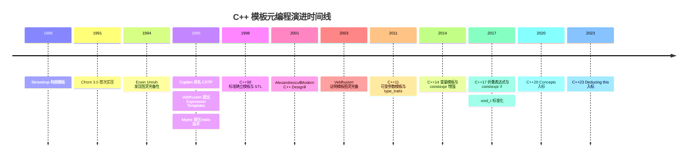
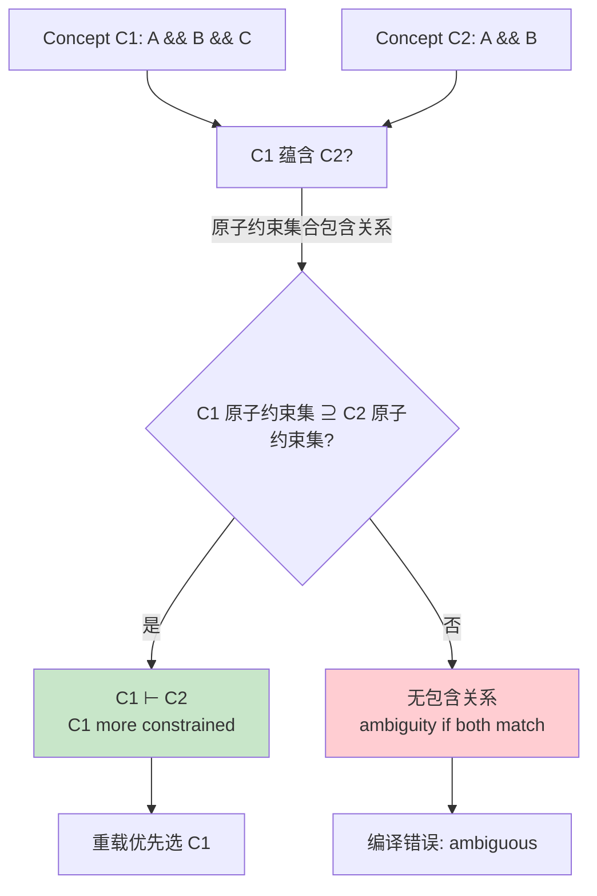
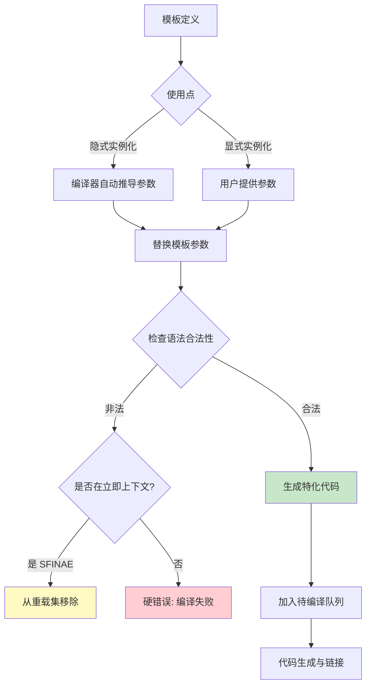
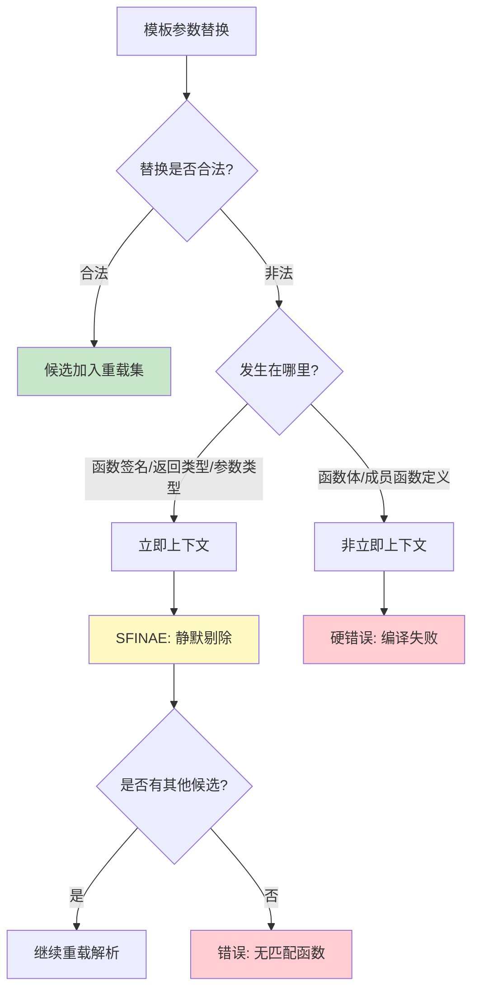
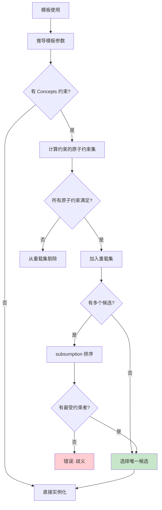
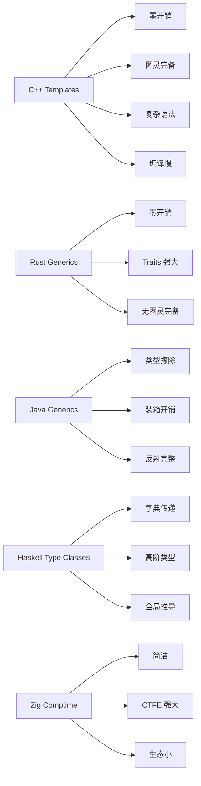
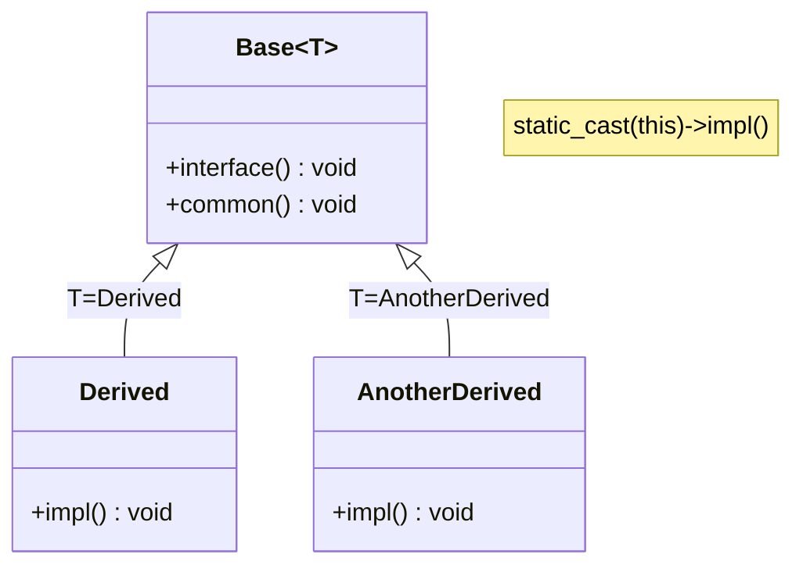

## 第 1 章 学习目标与导论

本章节阐述读者在完成本模块学习后应具备的认知与工程能力，目标按 Bloom 分类法（修订版）组织，由低阶（记忆、理解）到高阶（应用、分析、评估、创造）递进。

### 1.1 模块定位

模板元编程（Template Metaprogramming, TMP）是 C++ 区别于其他主流工业语言的标志性能力之一。它使得开发者能够：

- 在编译期执行任意图灵完备计算，将运行时开销前移至编译期；
- 通过参数化类型与代码生成实现零开销抽象（zero-overhead abstraction）；
- 表达精细的类型约束，在编译期捕获接口误用；
- 通过策略注入与表达式模板等高级范式构建可扩展的高性能库。

模板元编程并非孤立的语法特性，而是与 C++ 的类型系统、值类别、异常机制、模块系统深度耦合。本模块假定读者已掌握 C++ 基础语法、指针与引用、面向对象基础，并建议在学习前先阅读「右值引用与移动语义」「RAII 资源管理」「智能指针详解」模块以建立现代 C++ 心智模型。

### 1.2 学习路径


### 1.3 关键术语速览

| 术语                   | 简述                                           |
| ---------------------- | ---------------------------------------------- |
| 模板（template）       | 参数化类型与代码的「模具」                     |
| 元函数（metafunction） | 在编译期「计算」类型或值的模板                 |
| 特化（specialization） | 为特定模板参数提供定制实现                     |
| SFINAE                 | 替换失败不是错误，重载解析的容错机制           |
| Concepts               | C++20 引入的类型约束命名与组合机制             |
| CRTP                   | 奇异递归模板模式，静态多态的核心范式           |
| Expression Templates   | 将运算表达式编码为类型以延迟求值的范式         |
| Policy-Based Design    | 将设计决策注入为模板参数的范式                 |
| Type Erasure           | 在编译期类型安全与运行期多态之间取得平衡的范式 |
| Traits                 | 集中描述类型属性的元函数集合                   |

## 第 2 章 历史动机与演进

模板元编程的演进是 C++ 语言史上最具戏剧性的篇章之一：本为「参数化类型与代码」而设计的模板系统，被发现具备图灵完备性，进而催生了整整一代编译期计算技术。本章梳理从 1989 年 Cfront 到 2023 年 C++23 的关键里程碑。

### 2.1 Cfront 时代：模板的诞生（1989–1995）

C++ 的模板由 Bjarne Stroustrup 在 1989 年前后构想，首份完整实现出现在 1991 年的 Cfront 3.0 中。其设计动机源于对「类型安全的容器与算法」的需求——彼时 C 程序员靠 `void*` 与宏实现泛型容器，丧失类型安全与效率。Stroustrup 在《The Design and Evolution of C++》（1994）中写道：

> 「模板旨在提供一种既能保持类型安全又能避免宏的预处理局限的参数化机制。」

早期模板的能力相当有限：

- 仅支持类型参数（非类型参数与模板模板参数后续才引入）；
- 不支持偏特化（Cfront 3.0.x 后才补全）；
- 编译器对实例化深度有严格限制（Cfront 通常为 8 层）；
- 错误诊断极为原始，常出现「模板递归过深」之类的笼统错误。

然而即便在如此受限的环境中，模板的图灵完备性已被 Erwin Unruh 于 1994 年偶然发现。当时身为 Siemens 工程师的 Unruh 编写了一段计算素数列表的程序，该程序不产生运行时输出，但编译器错误信息中包含一个素数序列。这是 C++ 模板元编程的开端。

```cpp
// Erwin Unruh 1994 年原始程序的现代简化重构（保留原意）
// 该程序在编译期通过模板递归计算素数，并在错误信息中输出
#include <cstdio>

template<int p, int i>
struct is_prime {
    enum { value = (p % i != 0) && is_prime<p, i - 1>::value };
};

template<int p>
struct is_prime<p, 1> {
    enum { value = 1 };
};

template<int i>
struct Prime_print {
    Prime_print<i - 1> a;
    // 强制编译器在错误信息中输出 i，前提是 i 为素数
    static_assert(is_prime<i, i - 1>::value, "i is prime");
    enum { value = i };
    void f() { printf("%d\n", value); }  // 仅为占位，实际从不调用
};

template<>
struct Prime_print<1> {
    enum { value = 1 };
};

// 实例化将触发编译期素数计算
// Prime_print<18> b;  // 取消注释后编译错误信息中可见素数列表
```

### 2.2 C++98：模板标准化与 STL

C++98 标准正式将模板纳入语言规范，关键能力包括：

- 类模板、函数模板、成员模板；
- 全特化与偏特化（partial specialization）；
- 模板模板参数（template template parameters）；
- 非类型参数（non-type template parameters，仅限整型常量与指针）；
- 隐式实例化与显式实例化；
- 两阶段名字查找（two-phase name lookup）雏形。

同时期，Alexander Stepanov 与 Meng Lee 完成 STL（Standard Template Library），1994 年被吸纳进 C++ 标准库。STL 的核心思想——「算法与容器通过迭代器解耦」——成为泛型编程（generic programming）的范式原型，并催生了 traits 技术：Nathan Myers 在 1995 年提出 `std::iterator_traits`，将「与类型相关但又不属于类型本身」的属性（如 value_type、iterator_category）集中描述。

```cpp
// C++98 风格的元函数与 traits 示例
#include <iterator>
#include <vector>
#include <list>

// C++98 风格的元函数：通过嵌套 ::type 实现
template<typename T>
struct remove_const {
    typedef T type;
};

template<typename T>
struct remove_const<const T> {
    typedef T type;
};

// C++98 风格的迭代器分类分发
template<typename Iter, typename Distance>
void advance_impl(Iter& it, Distance n, std::input_iterator_tag) {
    while (n--) ++it;
}

template<typename Iter, typename Distance>
void advance_impl(Iter& it, Distance n, std::random_access_iterator_tag) {
    it += n;
}

template<typename Iter, typename Distance>
void advance(Iter& it, Distance n) {
    advance_impl(it, n, typename std::iterator_traits<Iter>::iterator_category());
}

// 使用
int main() {
    std::vector<int>::iterator vit;
    std::list<int>::iterator lit;
    advance(vit, 5);   // 调用 random_access 版本
    advance(lit, 5);   // 调用 input_iterator 版本（list 是双向迭代器）
    return 0;
}
```

### 2.3 C++11：可变参数模板与 type_traits

C++11 是模板元编程的「大爆炸」时期。关键特性包括：

| 特性                       | 提案   | 意义                                     |
| -------------------------- | ------ | ---------------------------------------- |
| 可变参数模板               | N2080  | 支持 `template<typename... Ts>` 参数包   |
| 别名模板（alias template） | N2258  | `template<typename T> using X = Y<T>;`   |
| decltype                   | N2343  | 推导表达式类型，使 SFINAE 更强大         |
| std::declval               | N3276  | 在未求值语境构造任意类型的右值           |
| static_assert              | N1720  | 编译期断言                               |
| std::enable_if             | 标准库 | SFINAE 的标准化工具                      |
| 标准库 type_traits         | N1836  | is_integral、remove_reference 等元函数集 |
| trailing return type       | N2859  | `auto f() -> T` 配合 SFINAE              |
| 模板右尖括号空格修复       | N1757  | `vector<vector<int>>` 不再被解析为右移   |

```cpp
// C++11 可变参数模板与 type_traits
#include <type_traits>

// 可变参数模板：编译期求和
template<typename... Args>
struct Sum;

template<typename T>
struct Sum<T> {
    static constexpr T value = T{};
};

template<typename T, typename... Rest>
struct Sum<T, Rest...> {
    static constexpr T value = T{} + Sum<Rest...>::value;
};

// 别名模板简化元函数
template<typename T>
using RemoveConst = typename std::remove_const<T>::type;

// SFINAE 配合 trailing return type
template<typename T>
auto get_size(const T& c) -> decltype(c.size()) {
    return c.size();
}

// static_assert 编译期断言
static_assert(Sum<int, 1, 2, 3, 4>::value == 10, "Sum failed");
static_assert(std::is_same<RemoveConst<const int>, int>::value, "RemoveConst failed");
```

### 2.4 C++14：变量模板与 constexpr 增强

C++14 是相对小但关键的演进：

- **变量模板（variable template）**：N3651 提案，使「元函数返回值」从 `::value` 简化为 `_v` 后缀；
- **constexpr 函数放宽**：允许循环、变量声明、条件分支；
- **std::integer_sequence**：编译期整数序列；
- **泛型 lambda**：`[](auto x){}`，本质是模板的简写。

```cpp
// C++14 变量模板与 constexpr
#include <type_traits>

// 变量模板：替代传统元函数的 ::value
template<typename T>
constexpr bool is_pointer_v = false;

template<typename T>
constexpr bool is_pointer_v<T*> = true;

// constexpr 函数支持循环
constexpr int factorial(int n) {
    int r = 1;
    for (int i = 2; i <= n; ++i) r *= i;
    return r;
}

static_assert(factorial(5) == 120, "factorial failed");
static_assert(is_pointer_v<int*>, "is_pointer failed");
static_assert(!is_pointer_v<int>, "is_not_pointer failed");
```

### 2.5 C++17：折叠表达式、constexpr if、void_t

C++17 引入三大 TMP 关键特性：

| 特性         | 提案    | 意义                                      |
| ------------ | ------- | ----------------------------------------- |
| 折叠表达式   | N4295   | 一元/二元折叠简化参数包展开               |
| constexpr if | P0292R2 | 编译期条件分支，未选中分支不实例化        |
| void_t       | N3911   | Walter Brown 的 SFINAE 友好工具，简化检测 |
| 模板参数推导 | P0091R1 | `pair p{1, 2.0}` 省略 `<int, double>`     |
| if constexpr | P0292R2 | 同上，与 SFINAE 互补                      |
| inline 变量  | P0386R2 | 头文件中定义 constexpr 变量无 ODR 问题    |

```cpp
// C++17 折叠表达式
#include <iostream>

// 一元右折叠：(args + ...)
template<typename... Args>
auto sum(Args... args) {
    return (args + ...);  // 等价于 ((arg1 + arg2) + arg3) + ...
}

// 一元左折叠：(... + args)
template<typename... Args>
auto left_sum(Args... args) {
    return (... + args);  // 等价于 arg1 + (arg2 + arg3) + ...
}

// 二元右折叠：(args + ... + init)
template<typename... Args>
auto sum_with_init(Args... args) {
    return (args + ... + 0);  // 空包时返回 0
}

// 折叠与逻辑运算
template<typename... Args>
bool all_positive(Args... args) {
    return (... && (args > 0));  // 全部为正
}

// constexpr if 简化 SFINAE
template<typename T>
void process(T x) {
    if constexpr (std::is_integral_v<T>) {
        std::cout << "integral: " << x << std::endl;
    } else if constexpr (std::is_floating_point_v<T>) {
        std::cout << "float: " << x << std::endl;
    } else {
        std::cout << "other" << std::endl;
    }
}
```

### 2.6 C++20：Concepts 与约束

C++20 是 TMP 自 C++11 以来最大的一次范式跃迁。**Concepts**（概念）由 Sutton 与 Stroustrup 历经 20 年提案（N2914 2009 → P0644R1 2017 → P1084R0 2018 → P1452 2019 → C++20 入标）最终入标。其核心价值：

- **可读性**：约束以命名概念形式声明，告别冗长的 `enable_if` 表达式；
- **错误诊断**：编译器能精确指出哪个原子约束未满足；
- **subsumption**：约束之间的蕴含关系实现部分排序，支持精细重载；
- **简化语法**：`template<Addable T>` 替代 `template<typename T, typename = enable_if_t<...>>`；
- **缩写形式**：`void f(std::integral auto x)` 直接约束 auto。

```cpp
// C++20 Concepts 全景
#include <concepts>
#include <iostream>

// 命名概念
template<typename T>
concept Addable = requires(T a, T b) {
    { a + b } -> std::convertible_to<T>;
    { a - b } -> std::convertible_to<T>;
};

// 多参数概念
template<typename From, typename To>
concept ConvertibleTo = std::convertible_to<From, To>;

// 复合概念
template<typename T>
concept Numeric = std::integral<T> || std::floating_point<T>;

template<typename T>
concept Arithmetic = Numeric<T> && requires(T a, T b) {
    { a + b } -> std::same_as<T>;
    { a * b } -> std::same_as<T>;
};

// 三种使用形式

// 形式 1：constrained type parameter
template<Arithmetic T>
T dot_product(const std::vector<T>& a, const std::vector<T>& b) {
    T result = T{};
    for (size_t i = 0; i < a.size(); ++i) result += a[i] * b[i];
    return result;
}

// 形式 2：requires 子句
template<typename T>
    requires Arithmetic<T>
T square(T x) { return x * x; }

// 形式 3：缩写形式
auto cube(Arithmetic auto x) { return x * x * x; }

// subsumption 实现重载排序
template<typename T>
    requires std::integral<T>
void describe(T) { std::cout << "integral\n"; }

template<typename T>
    requires std::signed_integral<T>
void describe(T) { std::cout << "signed integral\n"; }  // 更受约束，优先匹配
```

### 2.7 C++23：Deducing this 与进一步演进

C++23 通过 **Deducing this**（P0847R7）提案，使成员函数能显式接收 `this` 参数，开启了模板元编程的新维度：

- 允许成员函数根据对象的值类别（lvalue/rvalue）进行重载；
- 简化 CRTP 模式，基类访问派生类不再需要 `static_cast`；
- 支持递归 lambda；
- 与 Concepts 配合，使「按值类别分发」编译期决策更自然。

```cpp
// C++23 Deducing this 简化 CRTP
#include <iostream>

// 传统 CRTP：需要 static_cast<Derived*>(this)
template<typename Derived>
struct OldCRTPBase {
    void interface() {
        static_cast<Derived*>(this)->implementation();
    }
};

// C++23 Deducing this：显式接收 self 参数
struct NewBase {
    // self 是推导出的 this，类型根据调用对象决定
    template<typename Self>
    void interface(this Self&& self) {
        std::forward<Self>(self).implementation();
    }
};

struct Derived : NewBase {
    void implementation() { std::cout << "Derived::impl\n"; }
};

// 按值类别重载
struct Logger {
    template<typename Self>
    void log(this Self&& self, const char* msg) {
        if constexpr (std::is_lvalue_reference_v<Self>) {
            std::cout << "[lvalue] " << msg << "\n";
        } else {
            std::cout << "[rvalue] " << msg << "\n";
        }
    }
};

int main() {
    Derived d;
    d.interface();  // 输出 "Derived::impl"

    Logger l;
    l.log("hello");          // [lvalue]
    std::move(l).log("bye"); // [rvalue]
    return 0;
}
```

### 2.8 演进时间线总览



## 第 3 章 形式化定义

本章从数学与形式语言的角度定义模板元编程的核心概念，建立后续章节的严密基础。

### 3.1 模板的图灵完备性

**定理（Veldhuizen, 2003）**：C++ 模板系统是图灵完备的，即对任意部分递归函数 $f: \mathbb{N} \to \mathbb{N}$，存在 C++ 模板元程序 $M_f$ 在编译期计算 $f$。

**证明思路**：通过将无界 λ 演算编码到模板系统中：

1. **自然数编码**：用 `template<int N> struct Nat {};` 表示丘奇数；
2. **后继函数**：`template<int N> struct Succ { static constexpr int value = N + 1; };`；
3. **条件分支**：通过特化 `template<bool B, typename T, typename F> struct If;` 实现；
4. **递归**：通过模板递归实例化实现，递归终止通过特化定义；
5. **最小化算子（μ 算子）**：通过深度递归搜索实现。

由于无界 λ 演算图灵完备，且上述编码可在 C++ 模板中完整表达，故 C++ 模板图灵完备。

$$
\text{TMP} \cong \lambda_{\text{untyped}} \cong \text{Turing Machine}
$$

注意：图灵完备是「理论上」的结论，实际编译器对递归深度（如 `-ftemplate-depth=900`）、编译时间、内存使用有硬性限制。模板元编程的「实际计算能力」是受限的。

### 3.2 类型代数（Type Algebra）

将 C++ 类型集合 $\mathcal{T}$ 视为代数结构，可定义如下运算：

$$
\begin{aligned}
\text{Sum Type} &: A + B = \texttt{std::variant<A, B>} \\
\text{Product Type} &: A \times B = \texttt{std::pair<A, B>} \\
\text{Function Type} &: A \to B = \texttt{std::function<B(A)>} \\
\text{Exponentiation} &: A^B = \text{函数类型 B -> A} \\
\text{Void (bottom)} &: \bot = \texttt{std::monostate 或 never}
\end{aligned}
$$

模板可视为类型上的「函数」：给定类型参数返回新类型。这种视角使 TMP 等同于「类型级别的函数式编程」。

```cpp
// 类型代数的实现
#include <variant>
#include <utility>
#include <type_traits>

// Sum Type: A + B
template<typename A, typename B>
using Sum = std::variant<A, B>;

// Product Type: A × B
template<typename A, typename B>
using Product = std::pair<A, B>;

// 类型函数：将类型 T 映射到类型 List<T>
template<typename T>
struct List {
    struct Node {
        T value;
        Node* next;
    };
    Node* head = nullptr;
};

// 类型函数的「复合」：List<List<T>>
template<typename T>
using ListList = List<List<T>>;

// 类型上的「恒等函数」
template<typename T>
struct Identity { using type = T; };

// 类型上的「常量函数」
template<typename T, typename Ignored>
struct Constant { using type = T; };

// 编译期类型等价性证明
static_assert(std::is_same_v<Identity<int>::type, int>);
static_assert(std::is_same_v<Constant<double, int>::type, double>);
```

### 3.3 Type Functions

**定义**：Type Function 是从类型集合 $\mathcal{T}$ 到 $\mathcal{T}$ 的映射 $F: \mathcal{T} \to \mathcal{T}$，在 C++ 中以类模板形式实现，并通过嵌套 `::type` 暴露结果。

```cpp
// Type Function 示例
#include <type_traits>

// 一元类型函数：移除引用
template<typename T>
struct RemoveReference {
    using type = T;
};

template<typename T>
struct RemoveReference<T&> {
    using type = T;
};

template<typename T>
struct RemoveReference<T&&> {
    using type = T;
};

// 二元类型函数：条件选择
template<bool Cond, typename IfTrue, typename IfFalse>
struct Conditional {
    using type = IfFalse;
};

template<typename IfTrue, typename IfFalse>
struct Conditional<true, IfTrue, IfFalse> {
    using type = IfTrue;
};

// 高阶类型函数：接收类型函数作为参数
template<template<typename> class F, typename T>
struct Apply {
    using type = typename F<T>::type;
};

// 使用
static_assert(std::is_same_v<RemoveReference<int&>::type, int>);
static_assert(std::is_same_v<RemoveReference<int&&>::type, int>);
static_assert(std::is_same_v<Conditional<true, int, double>::type, int>);
static_assert(std::is_same_v<Apply<RemoveReference, int&>::type, int>);
```

### 3.4 SFINAE 的形式化语义

设 $\Gamma$ 为模板参数替换上下文，$T$ 为待替换的模板参数，$P(T)$ 为模板参数替换后形成的候选声明。SFINAE 规则可形式化为：

$$
\text{SFINAE}(\Gamma, T, P) = \begin{cases}
\text{success} & \text{if } P(T) \text{ forms a valid declaration} \\
\text{silently removed} & \text{if } P(T) \text{ fails in immediate context} \\
\text{hard error} & \text{otherwise}
\end{cases}
$$

**立即上下文（immediate context）** 是关键限定：仅当替换失败发生在「函数模板签名本身的构成」中（如返回类型、参数类型、模板参数列表）时，才被 SFINAE 容错。函数体内的错误是硬错误。

```cpp
// SFINAE 立即上下文示例
#include <type_traits>

// 立即上下文：返回类型中的 SFINAE
template<typename T>
auto f(T x) -> decltype(x.foo(), int{}) {  // 若 x.foo() 不合法，SFINAE 剔除
    return 0;
}

template<typename T>
auto f(T x) -> decltype(x.bar(), int{}) {  // 备选重载
    return 1;
}

// 非立即上下文：函数体内的错误是硬错误
// template<typename T>
// void g(T x) {
//     x.nonexistent();  // 硬错误，不会被 SFINAE 容错
// }

// void_t 的魔法：将类型表达式纳入立即上下文
template<typename, typename = void>
struct has_foo : std::false_type {};

template<typename T>
struct has_foo<T, std::void_t<decltype(std::declval<T>().foo())>>
    : std::true_type {};

struct WithFoo { void foo() {} };
struct WithoutFoo {};

static_assert(has_foo<WithFoo>::value);
static_assert(!has_foo<WithoutFoo>::value);
```

### 3.5 Concepts 的形式化语义

C++20 Concept $C$ 可形式化定义为类型上的谓词 $C: \mathcal{T} \to \{true, false\}$，由 requires 表达式的合取范式（CNF）构成：

$$
C(T) = \bigwedge_{i=1}^{n} R_i(T)
$$

其中 $R_i$ 是原子约束（atomic constraint），包括：

- 简单概念（如 `std::integral<T>`）；
- 表达式要求（`{ expr } -> Concept;`）；
- 类型要求（`typename T::value_type;`）；
- 嵌套要求（`requires Concept<T>;`）。

**Subsumption（包含）规则**：概念 $C_1$ 包含 $C_2$（记作 $C_1 \vdash C_2$），当且仅当 $C_1$ 的原子约束集合在 CNF 上蕴含 $C_2$ 的原子约束集合：

$$
C_1 \vdash C_2 \iff \forall T. C_1(T) \to C_2(T)
$$

```cpp
// Concepts subsumption 形式化演示
#include <concepts>

// 原子约束
template<typename T>
concept HasPlus = requires(T a, T b) {
    { a + b } -> std::same_as<T>;
};

// 合取：C1 = HasPlus && std::copyable<T>
template<typename T>
concept AddableCopyable = HasPlus<T> && std::copyable<T>;

// C1 ⊢ HasPlus（C1 蕴含 HasPlus），故 C1 比 HasPlus 更受约束
// 重载时若两者均匹配，选择 C1 版本

template<typename T>
    requires HasPlus<T>
int priority(T) { return 1; }

template<typename T>
    requires AddableCopyable<T>
int priority(T) { return 2; }  // 优先匹配

// std::signed_integral ⊢ std::integral
template<typename T>
    requires std::integral<T>
void sort_tag(T) {}

template<typename T>
    requires std::signed_integral<T>
void sort_tag(T) {}  // 对 signed_integral 优先匹配
```



## 第 4 章 理论推导与复杂度分析

本章从算法复杂度角度分析模板元编程的开销，为工程实践提供决策依据。

### 4.1 模板实例化复杂度

设模板 $M$ 有 $k$ 个类型参数，每个参数有 $n_i$ 种可能取值，则实例化空间为：

$$
|Inst(M)| = \prod_{i=1}^{k} n_i
$$

最坏情况下，模板实例化数量随参数数量指数增长。例如，对一个二元运算 `template<typename A, typename B> auto op(A, B);`，若类型集大小为 $n$，则实例化数为 $n^2$。

实际编译器通过 **去重（deduplication）** 与 **惰性实例化（lazy instantiation）** 限制实例化数：仅实例化被实际调用的模板特化。但即便如此，深度组合的模板库（如 Boost.MPL、Eigen）仍可能产生数百 MB 的编译产物。

```cpp
// 实例化空间演示
#include <type_traits>

// 二元 op：n^2 实例化空间
template<typename A, typename B>
struct BinaryOp {
    using result_type = decltype(std::declval<A>() + std::declval<B>());
};

// 三元 op：n^3 实例化空间
template<typename A, typename B, typename C>
struct TernaryOp {
    using result_type = decltype(
        std::declval<A>() + std::declval<B>() + std::declval<C>()
    );
};

// 用 type_traits 限制实例化爆炸
template<typename A, typename B>
    requires std::is_arithmetic_v<A> && std::is_arithmetic_v<B>
struct SafeBinaryOp {
    using result_type = decltype(std::declval<A>() + std::declval<B>());
};
```

### 4.2 编译期递归深度分析

模板元编程的递归通过递归实例化实现，其深度受编译器限制。GCC/Clang 默认 `-ftemplate-depth=900`，MSVC 默认更浅。

**定理**：对深度为 $d$ 的递归模板实例化，编译时间 $T(d)$ 满足：

$$
T(d) = O(d^2)
$$

这是因为每一层实例化需要解析、类型推导、模板参数替换，且编译器内部维护的符号表随深度增长。

```cpp
// 递归深度测量
#include <cstdio>

template<int N>
struct Depth {
    static constexpr int value = Depth<N - 1>::value + 1;
};

template<>
struct Depth<0> {
    static constexpr int value = 0;
};

// 编译期计算：受 -ftemplate-depth 限制
constexpr int result = Depth<500>::value;
// Depth<900>::value 可能触发 "template recursion depth exceeded"

int main() {
    printf("Depth<500>::value = %d\n", result);
    return 0;
}
// 输出：Depth<500>::value = 500
```

### 4.3 实例化复杂度的工程边界

$$
\boxed{
\text{CompileTime}(\text{TMP program}) = O\left(\sum_{M \in \text{Templates}} |Inst(M)| \cdot \text{Depth}(M)\right)
}
$$

工程实践中，控制模板实例化开销的常用策略：

1. **extern template**：显式实例化声明，避免重复实例化；
2. **type erasure**：在边界处将模板类型擦除为统一接口；
3. **concept 约束**：限制实例化空间；
4. **延迟实例化**：用 constexpr if 或 SFINAE 避免不必要分支的实例化；
5. **模块化**：C++20 模块减少头文件重复解析。

```cpp
// extern template 演示
// 头文件 myvec.h
template<typename T>
class MyVec {
    // 完整实现
};

// 显式实例化声明：告诉编译器「别处已实例化，不要重复」
extern template class MyVec<int>;
extern template class MyVec<double>;

// 源文件 myvec.cpp
#include "myvec.h"
// 显式实例化定义：在此处生成代码
template class MyVec<int>;
template class MyVec<double>;
```

### 4.4 Pattern Matching 与类型计算

模板特化本质是「类型级别的模式匹配」。Hindley-Milner 类型系统的模式匹配在 C++ 中通过以下机制实现：

- **全特化**：精确匹配特定类型，等价于模式 `pattern -> result`；
- **偏特化**：匹配类型结构，等价于 `pattern<T> -> result<T>`；
- **可变参数特化**：匹配参数包头部，等价于 `head:tail -> ...`。

```cpp
// 类型级别的模式匹配
#include <type_traits>

// 模式：空列表
template<typename List>
struct IsEmpty {
    static constexpr bool value = false;
};

template<>
struct IsEmpty<TypeList<>> {  // 需先定义 TypeList（见后续章节）
    static constexpr bool value = true;
};

// 类型级别的 if-else
template<bool Cond, typename Then, typename Else>
struct TypeIf {
    using type = Then;
};

template<typename Then, typename Else>
struct TypeIf<false, Then, Else> {
    using type = Else;
};

// 类型列表（前向声明）
template<typename... Ts>
struct TypeList {};

// 使用 TypeIf
static_assert(std::is_same_v<
    TypeIf<true, int, double>::type, int>);
static_assert(std::is_same_v<
    TypeIf<false, int, double>::type, double>);
```

## 第 5 章 模板基础：参数化与实例化

本章回顾模板的基础语法与实例化机制，奠定后续高级主题的基础。

### 5.1 函数模板

```cpp
#include <iostream>
#include <vector>

// 基础函数模板
template<typename T>
T max_of(T a, T b) {
    return a > b ? a : b;
}

// 模板参数推导
void test_deduction() {
    max_of(1, 2);          // T = int
    max_of(1.0, 2.0);      // T = double
    max_of<int>(1, 2);     // 显式指定
    // max_of(1, 2.0);     // 错误：T 推导冲突
    max_of<double>(1, 2.0);  // 显式指定解决冲突
}

// 多参数模板
template<typename T, typename U>
auto add(T a, U b) -> decltype(a + b) {
    return a + b;
}

// 非类型参数
template<int N, typename T>
T scale(T x) {
    return x * N;
}

// 模板模板参数
template<template<typename> class Container, typename T>
Container<T> make_container(T value) {
    Container<T> c;
    c.push_back(value);
    return c;
}

void test_template_template() {
    auto v = make_container<std::vector>(42);  // Container = vector, T = int
    std::cout << v[0] << std::endl;  // 输出 42
}
```

### 5.2 类模板

```cpp
#include <array>
#include <cstddef>

// 类模板
template<typename T, size_t N>
class StaticArray {
    T data_[N]{};
public:
    T& operator[](size_t i) { return data_[i]; }
    const T& operator[](size_t i) const { return data_[i]; }
    constexpr size_t size() const { return N; }

    // 成员函数模板
    template<typename U>
    void fill(const U& value) {
        for (size_t i = 0; i < N; ++i) data_[i] = static_cast<T>(value);
    }
};

// 别名模板
template<typename T>
using Array4 = StaticArray<T, 4>;

// 变量模板
template<typename T>
constexpr size_t bits_per = sizeof(T) * 8;

// 使用
void test_class_template() {
    StaticArray<int, 4> arr;
    arr.fill(42);
    Array4<double> darr;  // 别名
    static_assert(bits_per<int> == 32 || bits_per<int> == 64);
}
```

### 5.3 实例化机制



```cpp
// 隐式实例化
template<typename T>
struct Point {
    T x, y;
    T dot(const Point& p) const { return x * p.x + y * p.y; }
};

void test_implicit() {
    Point<int> p1{1, 2};  // 隐式实例化 Point<int>
    p1.dot(Point<int>{3, 4});  // 隐式实例化 dot 成员
    // 注意：未使用的成员函数不会被实例化
}

// 显式实例化定义
template class Point<double>;  // 强制实例化所有成员

// 显式实例化声明
extern template class Point<float>;  // 阻止本翻译单元实例化

int main() {
    Point<float> pf;  // 使用 extern 实例化
    return 0;
}
```

### 5.4 两阶段名字查找

C++ 模板的名字查找分两阶段：

1. **第一阶段（定义时）**：查找不依赖模板参数的名字（non-dependent names）；
2. **第二阶段（实例化时）**：查找依赖模板参数的名字（dependent names）。

```cpp
#include <iostream>

void f(int) { std::cout << "global f(int)\n"; }

template<typename T>
void g(T x) {
    f(1);           // non-dependent: 第一阶段查找，找到 ::f(int)
    // h(x);        // dependent: 第二阶段查找，需通过 ADL
    f(x);           // dependent: 第二阶段查找 + ADL
}

void f(double) { std::cout << "global f(double)\n"; }  // 在 g 定义后，不会被 g 看到

namespace N {
    struct X {};
    void h(X) { std::cout << "N::h(X)\n"; }
}

void test_two_phase() {
    N::X x;
    g(x);  // h(x) 通过 ADL 找到 N::h
}
```

### 5.5 依赖名称与 typename / template 关键字

```cpp
#include <vector>

template<typename T>
void dependent_example() {
    // typename 必需：告诉编译器 T::value_type 是类型
    typename T::value_type v{};

    // template 必需：告诉编译器 T::begin() 是模板
    T::template begin<int>();
}

// 经典陷阱：依赖类型用作基类
template<typename T>
struct Derived : T::Base {  // 此处 T::Base 被认为是类型，无需 typename
    typename T::Type member;  // 此处需要 typename
};

// 依赖模板用作成员初始化
template<typename T>
struct Holder {
    // T::template Factory<U>() 而非 T::Factory<U>()
    template<typename U>
    static auto make() -> decltype(T::template Factory<U>()) {
        return T::template Factory<U>();
    }
};
```

## 第 6 章 模板特化与偏特化

### 6.1 全特化

```cpp
#include <string>
#include <iostream>

// 主模板
template<typename T>
struct TypeName {
    static std::string get() { return "unknown"; }
};

// 全特化：int
template<>
struct TypeName<int> {
    static std::string get() { return "int"; }
};

// 全特化：double
template<>
struct TypeName<double> {
    static std::string get() { return "double"; }
};

// 全特化：const char*
template<>
struct TypeName<const char*> {
    static std::string get() { return "const char*"; }
};

void test_full_spec() {
    std::cout << TypeName<int>::get() << "\n";          // "int"
    std::cout << TypeName<double>::get() << "\n";       // "double"
    std::cout << TypeName<char>::get() << "\n";         // "unknown"
}
```

### 6.2 偏特化

```cpp
#include <type_traits>
#include <string>

// 偏特化：指针类型
template<typename T>
struct TypeName<T*> {
    static std::string get() {
        return TypeName<T>::get() + "*";
    }
};

// 偏特化：引用类型
template<typename T>
struct TypeName<T&> {
    static std::string get() {
        return TypeName<T>::get() + "&";
    }
};

// 偏特化：const 修饰
template<typename T>
struct TypeName<const T> {
    static std::string get() {
        return "const " + TypeName<T>::get();
    }
};

// 偏特化：数组
template<typename T, size_t N>
struct TypeName<T[N]> {
    static std::string get() {
        return TypeName<T>::get() + "[" + std::to_string(N) + "]";
    }
};

// 偏特化：函数指针
template<typename R, typename... Args>
struct TypeName<R(*)(Args...)> {
    static std::string get() {
        return TypeName<R>::get() + "(*)(...)";
    }
};

void test_partial_spec() {
    std::cout << TypeName<int*>::get() << "\n";           // "int*"
    std::cout << TypeName<const double>::get() << "\n";   // "const double"
    std::cout << TypeName<int[10]>::get() << "\n";        // "int[10]"
}
```

### 6.3 函数模板重载 vs 偏特化

C++ 不允许函数模板偏特化，必须用重载替代：

```cpp
#include <type_traits>
#include <iostream>

// 错误：函数模板不能偏特化
// template<typename T>
// void f(T*) { ... }  // 这是重载，不是偏特化

// 正确：重载
template<typename T>
void describe(T x) {
    std::cout << "generic: " << x << "\n";
}

// 重载：指针
template<typename T>
void describe(T* p) {
    std::cout << "pointer: " << *p << "\n";
}

// 重载：引用（注意与 T 的歧义）
template<typename T>
void describe_wrapper(T& x) {
    describe(x);  // 委托
}

void test_overload() {
    int x = 42;
    describe(42);    // generic
    describe(&x);    // pointer
}
```

### 6.4 SFINAE 与 enable_if 的早期形态

```cpp
#include <type_traits>
#include <iostream>

// enable_if 作为默认模板参数（最常见）
template<typename T,
         typename = std::enable_if_t<std::is_integral_v<T>>>
T abs_safe(T x) {
    return x < 0 ? -x : x;
}

// enable_if 作为返回类型
template<typename T>
std::enable_if_t<std::is_floating_point_v<T>, T>
abs_safe(T x) {
    return x < 0 ? -x : x;
}

// enable_if 作为函数参数（少见，但有用）
template<typename T>
void log_value(T x, std::enable_if_t<std::is_integral_v<T>, int> = 0) {
    std::cout << "integral: " << x << "\n";
}

// 错误：仅 enable_if 默认参数差异不构成重载
// template<typename T, typename = enable_if_t<...>> void f(T);
// template<typename T, typename = enable_if_t<...>> void f(T);  // 重定义！

// 正确：通过返回类型差异
template<typename T>
auto f(T) -> std::enable_if_t<std::is_integral_v<T>, int> { return 1; }

template<typename T>
auto f(T) -> std::enable_if_t<std::is_floating_point_v<T>, int> { return 2; }

void test_enable_if() {
    abs_safe(-5);     // 调用整数版本
    abs_safe(-3.14);  // 调用浮点版本
    f(42);            // 返回 1
    f(3.14);          // 返回 2
}
```

## 第 7 章 SFINAE 与 enable_if 深度解析

### 7.1 SFINAE 决策树



### 7.2 SFINAE 的多种表达形式

```cpp
#include <type_traits>
#include <iostream>
#include <vector>

// 形式 1：enable_if 作为默认模板参数
template<typename T,
         typename = std::enable_if_t<std::is_default_constructible_v<T>>>
T make_default() { return T{}; }

// 形式 2：enable_if 作为返回类型
template<typename T>
std::enable_if_t<std::is_copy_constructible_v<T>, T>
clone(const T& x) { return T(x); }

// 形式 3：enable_if 作为非类型模板参数
template<typename T,
         std::enable_if_t<std::is_move_constructible_v<T>, int> = 0>
T move_clone(T& x) { return T(std::move(x)); }

// 形式 4：decltype + comma（最常见的「检测表达式」SFINAE）
template<typename T>
auto size(const T& c) -> decltype(c.size(), size_t{}) {
    return c.size();
}

template<typename T>
auto size(const T& arr) -> decltype(sizeof(arr), size_t{}) {
    return sizeof(arr) / sizeof(arr[0]);
}

// 形式 5：void_t 检测内嵌类型
template<typename, typename = void>
struct has_value_type : std::false_type {};

template<typename T>
struct has_value_type<T, std::void_t<typename T::value_type>>
    : std::true_type {};

// 形式 6：检测成员函数
template<typename, typename = void>
struct has_size : std::false_type {};

template<typename T>
struct has_size<T, std::void_t<decltype(std::declval<T>().size())>>
    : std::true_type {};

void test_sfinae_forms() {
    static_assert(has_value_type<std::vector<int>>::value);
    static_assert(!has_value_type<int>::value);
    static_assert(has_size<std::vector<int>>::value);
    static_assert(!has_size<int>::value);
}
```

### 7.3 高阶 SFINAE：检测任意表达式

```cpp
#include <type_traits>
#include <utility>

// 检测类型 T 是否支持 a + b
template<typename T, typename U, typename = void>
struct is_addable : std::false_type {};

template<typename T, typename U>
struct is_addable<T, U, std::void_t<
    decltype(std::declval<T>() + std::declval<U>())
>> : std::true_type {};

// 检测类型 T 是否有 begin() 和 end()
template<typename T, typename = void>
struct is_iterable : std::false_type {};

template<typename T>
struct is_iterable<T, std::void_t<
    decltype(std::declval<T>().begin()),
    decltype(std::declval<T>().end())
>> : std::true_type {};

// 检测类型 T 是否是std::vector特化
template<typename T>
struct is_vector : std::false_type {};

template<typename T, typename Alloc>
struct is_vector<std::vector<T, Alloc>> : std::true_type {};

// 检测类型 T 是否有静态成员 value
template<typename T, typename = void>
struct has_static_value : std::false_type {};

template<typename T>
struct has_static_value<T, std::void_t<
    decltype(T::value)
>> : std::true_type {};

void test_detection() {
    static_assert(is_addable<int, double>::value);
    static_assert(!is_addable<std::string, int>::value);  // string + int 不合法
    static_assert(is_iterable<std::vector<int>>::value);
    static_assert(!is_iterable<int>::value);
    static_assert(is_vector<std::vector<int>>::value);
    static_assert(!is_vector<int>::value);
}
```

### 7.4 SFINAE 友好的 traits 设计

```cpp
#include <type_traits>
#include <iterator>

// 标准库的 iterator_traits 是 SFINAE 友好设计的典范
// C++20 之前的实现：
template<typename Iter, typename = void>
struct iterator_traits_saf {  // SFINAE 友好版
    // 空：当 Iter 不是迭代器时，无内嵌类型
};

template<typename Iter>
struct iterator_traits_saf<Iter, std::void_t<
    typename Iter::iterator_category,
    typename Iter::value_type,
    typename Iter::difference_type,
    typename Iter::pointer,
    typename Iter::reference
>> {
    using iterator_category = typename Iter::iterator_category;
    using value_type = typename Iter::value_type;
    using difference_type = typename Iter::difference_type;
    using pointer = typename Iter::pointer;
    using reference = typename Iter::reference;
};

// 使用：对非迭代器类型，iterator_traits_saf<T> 不会产生硬错误
struct NotIter {};

static_assert(std::is_same_v<
    iterator_traits_saf<NotIter>::iterator_category,  // 错误：无该成员
    void>);  // 但如果用 SFINAE 检测，会是 false 而非硬错误
```

## 第 8 章 C++17 void_t 与 constexpr if

### 8.1 void_t 的原理与魔法

`std::void_t<T>` 是一个极简的别名模板：它将任意类型映射到 `void`。其「魔法」不在于功能，而在于将类型表达式的合法性检查纳入 SFINAE 立即上下文。

```cpp
#include <type_traits>

// void_t 的标准实现
template<typename...>
using void_t = void;

// 经典用法：检测成员是否存在
template<typename, typename = void>
struct has_type_member : std::false_type {};

template<typename T>
struct has_type_member<T, void_t<typename T::type>>
    : std::true_type {};

// 检测多个成员
template<typename T, typename = void>
struct is_iterator_like : std::false_type {};

template<typename T>
struct is_iterator_like<T, void_t<
    typename T::iterator_category,
    typename T::value_type,
    decltype(*std::declval<T>()),
    decltype(++std::declval<T&>())
>> : std::true_type {};

// void_t 链式检测
template<typename, typename = void>
struct detect : std::false_type {};

template<typename T>
struct detect<T, void_t<
    decltype(std::declval<T>().first()),
    decltype(std::declval<T>().second())
>> : std::true_type {};
```

### 8.2 constexpr if：编译期条件分支

```cpp
#include <type_traits>
#include <string>
#include <iostream>

// constexpr if 替代 SFINAE 进行分支选择
template<typename T>
std::string stringify(const T& value) {
    if constexpr (std::is_same_v<T, std::string>) {
        return value;
    } else if constexpr (std::is_arithmetic_v<T>) {
        return std::to_string(value);
    } else if constexpr (std::is_pointer_v<T>) {
        return "pointer:" + stringify(*value);
    } else {
        return static_cast<std::string>(value);
    }
}

// 未选中分支不会实例化
template<typename T>
void maybe_push(std::vector<T>& v, const T& value) {
    if constexpr (std::is_default_constructible_v<T>) {
        v.push_back(T{});
    }
    v.push_back(value);
}

// 递归模板终止
template<typename... Args>
void print_all(Args... args) {
    if constexpr (sizeof...(args) > 0) {
        std::cout << sizeof...(args) << " args\n";
        // 折叠表达式处理参数包
        ((std::cout << args << " "), ...);
        std::cout << "\n";
    } else {
        std::cout << "no args\n";
    }
}

void test_constexpr_if() {
    std::cout << stringify(42) << "\n";
    std::cout << stringify(3.14) << "\n";
    std::cout << stringify(std::string("hello")) << "\n";
    print_all(1, 2, 3);
    print_all();
}
```

### 8.3 constexpr if vs SFINAE 的工程权衡

| 维度     | constexpr if             | SFINAE / enable_if     |
| -------- | ------------------------ | ---------------------- |
| 可读性   | 高，类似运行期 if        | 低，需理解替换规则     |
| 灵活性   | 函数体内分支             | 函数签名级别选择       |
| 重载     | 不适用于重载选择         | 适合，能从重载集剔除   |
| 错误诊断 | 未选分支不实例化，无错误 | 失败候选静默剔除       |
| 适用场景 | 函数体条件逻辑           | 函数签名级别约束与重载 |

## 第 9 章 C++20 Concepts 深度解析

### 9.1 Concepts 的四种 requires 形式

```cpp
#include <concepts>
#include <vector>
#include <string>

// 形式 1：简单 requires 表达式
template<typename T>
concept HasPlus = requires(T a, T b) {
    a + b;
};

// 形式 2：复合 requires（约束返回类型）
template<typename T>
concept Addable = requires(T a, T b) {
    { a + b } -> std::convertible_to<T>;
};

// 形式 3：类型 requires
template<typename T>
concept HasValueType = requires {
    typename T::value_type;
};

// 形式 4：嵌套 requires
template<typename T>
concept NumericContainer = requires {
    typename T::value_type;
    requires std::integral<typename T::value_type>;
};

// 组合：合取与析取
template<typename T>
concept Number = std::integral<T> || std::floating_point<T>;

template<typename T>
concept StrictNumber = Number<T> && !std::same_as<T, bool>;

// 使用
template<HasValueType T>
typename T::value_type first_value(const T& c) {
    return *c.begin();
}

template<NumericContainer C>
auto sum_numeric(const C& c) {
    typename C::value_type s{};
    for (auto& x : c) s += x;
    return s;
}

void test_concepts() {
    std::vector<int> v{1, 2, 3};
    std::cout << sum_numeric(v) << "\n";  // 6
}
```

### 9.2 Concepts 的 subsumption 与重载排序

```cpp
#include <concepts>
#include <iostream>

// 概念层级：integral -> signed_integral -> integral_signed_long
template<typename T>
    requires std::integral<T>
void classify(T) { std::cout << "integral\n"; }

template<typename T>
    requires std::signed_integral<T>
void classify(T) { std::cout << "signed integral\n"; }

// 注意：以下会与第一个构成歧义，因为 std::signed_integral 不一定 ⊢ std::integral
// 实际上 std::signed_integral = std::integral && std::is_signed_v，所以 signed_integral ⊢ integral

template<typename T>
    requires std::integral<T> && (sizeof(T) >= 4)
void classify(T) { std::cout << "large integral\n"; }

void test_subsumption() {
    classify(42);          // int: 候选 1, 2, 3，但 2 与 3 无包含关系 -> 歧义？
    // 实际上 std::signed_integral<int> 与 (integral<int> && sizeof(int)>=4) 无包含关系
    // 故上述 classify(42) 编译错误：ambiguous
}
```

### 9.3 Concepts 与 auto

```cpp
#include <concepts>

// 缩写函数模板
void print(std::integral auto x) { /* ... */ }

// 缩写函数模板（多参数）
auto add(std::integral auto a, std::integral auto b) {
    return a + b;
}

// 缩写函数模板与可变参数
void print_all(std::convertible_to<std::string> auto... args) {
    // 折叠表达式
    // ((std::cout << args << " "), ...);
}

// Concepts 约束的类模板参数推导（CTAD）
template<typename T>
struct Wrapper {
    T value;
    Wrapper(T v) : value(v) {}
};

// C++20 起，CTAD 自动推导
Wrapper w{42};  // Wrapper<int>

// 用 Concepts 约束 CTAD
template<typename T>
    requires std::integral<T>
Wrapper(T) -> Wrapper<T>;
```

### 9.4 Concepts 检查流程



### 9.5 Concepts 标准库概览

```cpp
#include <concepts>
#include <iterator>
#include <ranges>

// 核心语言概念
static_assert(std::same_as<int, int>);
static_assert(std::derived_from<std::true_type, std::integral_constant<int, 1>>);

// 比较概念
static_assert(std::equality_comparable<int>);
static_assert(std::totally_ordered<double>);

// 对象概念
static_assert(std::default_initializable<int>);
static_assert(std::movable<std::string>);
static_assert(std::copyable<std::string>);
static_assert(std::regular<int>);
static_assert(std::semiregular<std::string>);

// 可调用概念
static_assert(std::invocable<decltype([](int){ return 0; }), int>);
static_assert(std::predicate<decltype([](int x){ return x > 0; }), int>);

// 迭代器概念
static_assert(std::input_iterator<std::vector<int>::iterator>);
static_assert(std::random_access_iterator<std::vector<int>::iterator>);
static_assert(std::contiguous_iterator<std::vector<int>::iterator>);

// 范围概念
static_assert(std::ranges::range<std::vector<int>>);
static_assert(std::ranges::random_access_range<std::vector<int>>);
static_assert(std::ranges::sized_range<std::vector<int>>);
```

## 第 10 章 可变参数模板与折叠表达式

### 10.1 参数包基础

```cpp
#include <tuple>
#include <iostream>

// 类模板参数包
template<typename... Ts>
struct Tuple {};

// 函数模板参数包
template<typename... Args>
void print(Args... args) {
    // sizeof... 获取包大小
    std::cout << "size: " << sizeof...(args) << "\n";
}

// 模板参数包 + 类型参数
template<typename T, typename... Rest>
struct Head {
    using type = T;
};

// 使用
void test_packs() {
    Tuple<int, double, char> t;
    print(1, 2.0, "hello");  // size: 3
    print();                  // size: 0
    static_assert(std::is_same_v<Head<int, double, char>::type, int>);
}
```

### 10.2 折叠表达式

C++17 折叠表达式有四种形式：

```cpp
// 一元右折叠：(pack op ...)
template<typename... Args>
auto sum_r(Args... args) {
    return (args + ...);  // arg1 + (arg2 + (arg3 + ...))
}

// 一元左折叠：(... op pack)
template<typename... Args>
auto sum_l(Args... args) {
    return (... + args);  // ((arg1 + arg2) + arg3) + ...
}

// 二元右折叠：(pack op ... op init)
template<typename... Args>
auto sum_init_r(Args... args) {
    return (args + ... + 0);  // arg1 + (arg2 + (... + 0))
}

// 二元左折叠：(init op ... op pack)
template<typename... Args>
auto sum_init_l(Args... args) {
    return (0 + ... + args);  // ((0 + arg1) + arg2) + ...
}

// 折叠与不同运算符
template<typename... Args>
bool all_true(Args... args) {
    return (... && args);  // 全部为真
}

template<typename... Args>
bool any_true(Args... args) {
    return (... || args);  // 任一为真
}

template<typename... Args>
auto comma_all(Args... args) {
    return (args , ...);  // 逗号折叠，返回最后一个
}

// 折叠与函数调用
template<typename F, typename... Args>
void for_each(F f, Args... args) {
    ((void)f(args), ...);  // 对每个参数调用 f
}

void test_fold() {
    std::cout << sum_r(1, 2, 3, 4) << "\n";   // 10
    std::cout << sum_init_r() << "\n";          // 0（空包）
    std::cout << all_true(true, true, false) << "\n";  // 0

    for_each([](auto x) { std::cout << x << " "; }, 1, 2.0, "hello");
    // 输出: 1 2 hello
}
```

### 10.3 折叠表达式的形式语义

折叠表达式等价于函数式编程中的 `foldr` / `foldl`：

$$
\begin{aligned}
\text{UnaryRightFold}(e_1, \ldots, e_n, \oplus) &= e_1 \oplus (e_2 \oplus (\ldots \oplus e_n)) \\
\text{UnaryLeftFold}(e_1, \ldots, e_n, \oplus) &= ((e_1 \oplus e_2) \oplus \ldots) \oplus e_n \\
\text{BinaryRightFold}(e_1, \ldots, e_n, \oplus, I) &= e_1 \oplus (e_2 \oplus (\ldots \oplus (e_n \oplus I))) \\
\text{BinaryLeftFold}(I, \oplus, e_1, \ldots, e_n) &= ((((I \oplus e_1) \oplus e_2) \oplus \ldots) \oplus e_n)
\end{aligned}
$$

一元折叠要求参数包非空（除 `&&`、`||`、`,` 外），二元折叠可处理空包。

### 10.4 可变参数模板与 std::tuple

```cpp
#include <tuple>
#include <utility>
#include <iostream>

// 编译期遍历 tuple
template<typename Tuple, typename F, size_t... Is>
void for_each_impl(Tuple&& t, F&& f, std::index_sequence<Is...>) {
    ((void)std::forward<F>(f)(std::get<Is>(std::forward<Tuple>(t))), ...);
}

template<typename... Args, typename F>
void for_each_tuple(const std::tuple<Args...>& t, F&& f) {
    for_each_impl(t, std::forward<F>(f),
                  std::index_sequence_for<Args...>{});
}

// 编译期选择 tuple 元素
template<size_t I, typename... Args>
auto select(const std::tuple<Args...>& t) {
    return std::get<I>(t);
}

// 类型级折叠：所有类型相同
template<typename... Args>
struct all_same;

template<typename T>
struct all_same<T> : std::true_type {};

template<typename T, typename... Rest>
struct all_same<T, T, Rest...> : all_same<T, Rest...> {};

template<typename T, typename U, typename... Rest>
struct all_same<T, U, Rest...> : std::false_type {};

// C++17 折叠版本
template<typename... Args>
constexpr bool all_same_v = (std::is_same_v<Args, Args> && ...);  // 不对
// 正确写法：需要第一个类型作为基准
template<typename First, typename... Rest>
constexpr bool all_same_v2 = (std::is_same_v<First, Rest> && ...);

void test_variadic() {
    auto t = std::make_tuple(1, 2.0, "hello");
    for_each_tuple(t, [](auto x) { std::cout << x << " "; });
    // 输出: 1 2 hello

    static_assert(all_same<int, int, int>::value);
    static_assert(!all_same<int, double, int>::value);
}
```

## 第 11 章 对比分析

本章将 C++ 模板元编程与 Rust、Java、Haskell、Zig、D 等语言的泛型机制对比，揭示设计哲学差异。

### 11.1 vs Rust Generics

| 维度       | C++ Templates              | Rust Generics                   |
| ---------- | -------------------------- | ------------------------------- |
| 实现机制   | 单态化（monomorphization） | 单态化                          |
| 约束机制   | Concepts（C++20）/ SFINAE  | Traits（bounds）                |
| 类型推导   | 强                         | 强                              |
| 错误诊断   | Concepts 后较好            | 优秀，原生 traits 系统          |
| 互操作     | 模板间无共享特化           | orphan rule 限制                |
| 编译速度   | 慢（实例化爆炸）           | 较慢（单态化）但更可控          |
| 元编程能力 | 图灵完备                   | 受限（const generics 与 macro） |
| 动态分发   | 不支持（需 type erasure）  | 支持（dyn Trait）               |

```rust
// Rust 泛型示例（对照参考）
fn max_of<T: PartialOrd>(a: T, b: T) -> T {
    if a > b { a } else { b }
}

// Rust Traits 比 C++ Concepts 更强大：可定义默认方法、关联类型
trait Container {
    type Item;
    fn get(&self, idx: usize) -> Option<&Self::Item>;
    fn len(&self) -> usize;
}
```

### 11.2 vs Java Generics

| 维度     | C++ Templates   | Java Generics              |
| -------- | --------------- | -------------------------- |
| 实现机制 | 单态化          | 类型擦除（type erasure）   |
| 性能     | 零开销          | 装箱开销                   |
| 约束     | Concepts/SFINAE | Bounded type parameters    |
| 反射     | 有限            | 完整（运行时可见泛型信息） |
| 互操作   | 模板代码膨胀    | 共享字节码                 |
| 元编程   | 图灵完备        | 不支持                     |

```java
// Java 泛型示例（对照参考）
public class Box<T extends Comparable<T>> {
    private T value;
    public Box(T v) { value = v; }
    public T get() { return value; }
}

// 类型擦除：Box<Integer> 与 Box<String> 在运行时均为 Box
// 无法 new T()，无法 T[].class
```

### 11.3 vs Haskell Type Classes

| 维度     | C++ Templates  | Haskell Type Classes           |
| -------- | -------------- | ------------------------------ |
| 实现机制 | 单态化         | 字典传递（dictionary passing） |
| 约束     | Concepts       | Type classes                   |
| 多实例   | 不允许（ODR）  | 允许（newtype + 多实例）       |
| 高阶     | 模板模板参数   | Higher-kinded types            |
| 推导     | 显式           | 全局类型推导                   |
| 元编程   | 强（图灵完备） | 弱（需 TemplateHaskell 扩展）  |

```haskell
-- Haskell Type Classes 示例（对照参考）
class Eq a where
    (==) :: a -> a -> Bool

instance Eq Int where
    x == y = x `primEqInt` y

-- 高阶类型
class Functor f where
    fmap :: (a -> b) -> f a -> f b

instance Functor Maybe where
    fmap _ Nothing = Nothing
    fmap f (Just x) = Just (f x)
```

### 11.4 vs Zig Comptime

| 维度     | C++ Templates | Zig Comptime       |
| -------- | ------------- | ------------------ |
| 语法     | 模板关键字    | comptime 关键字    |
| 求值模型 | 编译期实例化  | 编译期执行         |
| 类型计算 | 通过特化      | 通过 comptime 函数 |
| 错误诊断 | 复杂          | 简洁               |
| 学习曲线 | 陡峭          | 平缓               |

```zig
// Zig comptime 示例（对照参考）
fn Matrix(comptime T: type, comptime rows: usize, comptime cols: usize) type {
    return struct {
        data: [rows][cols]T,
        const Self = @This();

        fn identity() Self {
            var m: Self = undefined;
            for (m.data) |*row, i| {
                for (row.*) |*cell, j| {
                    cell.* = if (i == j) 1 else 0;
                }
            }
            return m;
        }
    };
}
```

### 11.5 vs D Templates

D 语言的模板系统深受 C++ 启发，但做了多项改进：

| 维度       | C++ Templates   | D Templates          |
| ---------- | --------------- | -------------------- |
| 语法       | `<typename T>`  | `T` 简洁             |
| 约束       | Concepts/SFINAE | template constraints |
| 字符串混编 | 不支持（需宏）  | mixin 原生支持       |
| CTFE       | constexpr 函数  | 任意函数可编译期求值 |
| 错误诊断   | 复杂            | 较清晰               |

```d
// D 模板示例（对照参考）
T max(T)(T a, T b) {
    return a > b ? a : b;
}

// 约束
T sum(T)(T[] arr) if (isNumeric!T) {
    T result = 0;
    foreach (e; arr) result += e;
    return result;
}

// 字符串混编
mixin("int x = 42;");
```

### 11.6 综合对比表



## 第 12 章 工程实践

本章阐述模板元编程在生产环境中的核心范式。

### 12.1 CRTP（奇异递归模板模式）

CRTP 是 C++ 静态多态的基础范式，通过将派生类作为基类模板参数实现编译期分发。



```cpp
#include <iostream>
#include <vector>

// CRTP 基类
template<typename Derived>
struct ShapeBase {
    double area() const {
        return static_cast<const Derived*>(this)->area_impl();
    }
    double perimeter() const {
        return static_cast<const Derived*>(this)->perimeter_impl();
    }

    // 公共算法：模板方法模式
    void describe() const {
        std::cout << "Shape: area=" << area()
                  << ", perimeter=" << perimeter() << "\n";
    }
};

struct Circle : ShapeBase<Circle> {
    double r;
    Circle(double r) : r(r) {}
    double area_impl() const { return 3.14159 * r * r; }
    double perimeter_impl() const { return 2 * 3.14159 * r; }
};

struct Rectangle : ShapeBase<Rectangle> {
    double w, h;
    Rectangle(double w, double h) : w(w), h(h) {}
    double area_impl() const { return w * h; }
    double perimeter_impl() const { return 2 * (w + h); }
};

// CRTP + 混入（Mixin）
template<typename Derived>
struct Comparable : Comparable<Derived> {  // 注意：此处递归用 CRTP
    bool operator==(const Derived& other) const {
        return static_cast<const Derived*>(this)->compare_impl(other) == 0;
    }
    bool operator!=(const Derived& other) const {
        return !(*this == other);
    }
};

template<typename Derived>
struct Hashable {
    size_t hash() const {
        return static_cast<const Derived*>(this)->hash_impl();
    }
};

// 多重 CRTP 混入
struct MyType :
    Comparable<MyType>,
    Hashable<MyType> {
    int value;
    MyType(int v) : value(v) {}
    int compare_impl(const MyType& other) const {
        return value - other.value;
    }
    size_t hash_impl() const { return std::hash<int>{}(value); }
};

void test_crtp() {
    Circle c(1.0);
    Rectangle r(2.0, 3.0);
    c.describe();  // Shape: area=3.14159, perimeter=6.28318
    r.describe();  // Shape: area=6, perimeter=10
}
```

### 12.2 Expression Templates

Expression Templates 由 Todd Veldhuizen 于 1995 年提出，是数值库（Eigen、Blaze、Armadillo）的核心技术。


```cpp
#include <cstddef>
#include <iostream>
#include <vector>

// Expression Templates 完整示例
template<typename E>
class VecExpr {
public:
    auto operator[](size_t i) const {
        return static_cast<const E&>(*this)[i];
    }
    size_t size() const {
        return static_cast<const E&>(*this).size();
    }
};

// 具体向量
template<typename T>
class Vec : public VecExpr<Vec<T>> {
    std::vector<T> data_;
public:
    Vec(std::initializer_list<T> il) : data_(il) {}
    explicit Vec(size_t n) : data_(n) {}

    T operator[](size_t i) const { return data_[i]; }
    T& operator[](size_t i) { return data_[i]; }
    size_t size() const { return data_.size(); }

    template<typename E>
    Vec& operator=(const VecExpr<E>& expr) {
        const E& e = static_cast<const E&>(expr);
        data_.resize(e.size());
        for (size_t i = 0; i < e.size(); ++i) {
            data_[i] = e[i];
        }
        return *this;
    }
};

// 二元表达式节点
template<typename L, typename R, typename Op>
class BinExpr : public VecExpr<BinExpr<L, R, Op>> {
    const L& l_;
    const R& r_;
    Op op_;
public:
    BinExpr(const L& l, const R& r, Op op = Op{})
        : l_(l), r_(r), op_(op) {}

    auto operator[](size_t i) const { return op_(l_[i], r_[i]); }
    size_t size() const { return l_.size(); }
};

// 运算符重载：返回表达式节点
template<typename L, typename R>
auto operator+(const VecExpr<L>& a, const VecExpr<R>& b) {
    return BinExpr<L, R, std::plus<>>(static_cast<const L&>(a), static_cast<const R&>(b));
}

template<typename L, typename R>
auto operator*(const VecExpr<L>& a, const VecExpr<R>& b) {
    return BinExpr<L, R, std::multiplies<>>(static_cast<const L&>(a), static_cast<const R&>(b));
}

void test_expr_templates() {
    Vec<double> a{1.0, 2.0, 3.0};
    Vec<double> b{4.0, 5.0, 6.0};
    Vec<double> c{7.0, 8.0, 9.0};
    Vec<double> d(3);

    d = a + b * c;  // 不产生临时对象，单次遍历求值
    // 输出: 29 42 57
    for (size_t i = 0; i < d.size(); ++i) {
        std::cout << d[i] << " ";
    }
    std::cout << "\n";
}
```

### 12.3 Policy-Based Design

Policy-Based Design 由 Andrei Alexandrescu 在《Modern C++ Design》（2001）中系统化，将设计决策编码为模板参数。

```cpp
#include <iostream>
#include <mutex>
#include <memory>

// Policy: 线程策略
template<typename T>
struct SingleThreaded {
    struct Lock {
        Lock(const T&) {}
    };
};

template<typename T>
struct MultiThreaded {
    using Lock = std::lock_guard<std::mutex>;
    static std::mutex& mutex() {
        static std::mutex m;
        return m;
    }
};

// Policy: 创建策略
template<typename T>
struct CreateUsingNew {
    static T* Create() { return new T; }
    static void Destroy(T* p) { delete p; }
};

template<typename T>
struct CreateStatic {
    static T* Create() {
        static T instance;
        return &instance;
    }
    static void Destroy(T*) {}
};

// Policy: 生命周期策略
template<typename T>
struct DefaultLifetime {
    static void OnDeadReference() {
        throw std::runtime_error("dead reference");
    }
};

template<typename T>
struct PhoenixLifetime {
    static void OnDeadReference() {
        std::cout << "Phoenix: resurrecting\n";
    }
};

// 主类：组合所有策略
template<
    typename T,
    template<typename> class CreationPolicy = CreateUsingNew,
    template<typename> class LifetimePolicy = DefaultLifetime,
    template<typename> class ThreadingModel = SingleThreaded
>
class Singleton {
    static T* instance_;
    static bool destroyed_;
public:
    static T& Instance() {
        typename ThreadingModel<T>::Lock lock(ThreadingModel<T>::mutex());
        if (!instance_) {
            if (destroyed_) {
                LifetimePolicy<T>::OnDeadReference();
                destroyed_ = false;
            }
            instance_ = CreationPolicy<T>::Create();
        }
        return *instance_;
    }
    static void Destroy() {
        if (instance_) {
            CreationPolicy<T>::Destroy(instance_);
            instance_ = nullptr;
            destroyed_ = true;
        }
    }
};

template<typename T, template<typename> class C, template<typename> class L, template<typename> class M>
T* Singleton<T, C, L, M>::instance_ = nullptr;

template<typename T, template<typename> class C, template<typename> class L, template<typename> class M>
bool Singleton<T, C, L, M>::destroyed_ = false;

// 使用
struct Config {
    int value = 42;
};

void test_policy() {
    using ConfigSingleton = Singleton<Config, CreateStatic, DefaultLifetime, SingleThreaded>;
    std::cout << ConfigSingleton::Instance().value << "\n";  // 42
}
```

### 12.4 Tag Dispatch

```cpp
#include <iterator>
#include <vector>
#include <list>
#include <iostream>

// 通过 iterator_category tag 分发
template<typename Iter, typename Distance>
void advance_impl(Iter& it, Distance n, std::input_iterator_tag) {
    while (n > 0) { --n; ++it; }
}

template<typename Iter, typename Distance>
void advance_impl(Iter& it, Distance n, std::bidirectional_iterator_tag) {
    if (n > 0) while (n > 0) { --n; ++it; }
    else while (n < 0) { ++n; --it; }
}

template<typename Iter, typename Distance>
void advance_impl(Iter& it, Distance n, std::random_access_iterator_tag) {
    it += n;
}

template<typename Iter, typename Distance>
void advance(Iter& it, Distance n) {
    advance_impl(it, n, typename std::iterator_traits<Iter>::iterator_category{});
}

// C++17 constexpr if 替代
template<typename Iter, typename Distance>
void advance_modern(Iter& it, Distance n) {
    if constexpr (std::is_same_v<
            typename std::iterator_traits<Iter>::iterator_category,
            std::random_access_iterator_tag>) {
        it += n;
    } else if constexpr (std::is_same_v<
            typename std::iterator_traits<Iter>::iterator_category,
            std::bidirectional_iterator_tag>) {
        if (n > 0) while (n-- > 0) ++it;
        else while (n++ < 0) --it;
    } else {
        while (n-- > 0) ++it;
    }
}

void test_tag_dispatch() {
    std::vector<int> v{1, 2, 3, 4, 5};
    std::list<int> l{1, 2, 3, 4, 5};
    auto vit = v.begin();
    auto lit = l.begin();
    advance(vit, 3);   // random_access
    advance(lit, 3);   // bidirectional
    std::cout << *vit << " " << *lit << "\n";  // 4 4
}
```

### 12.5 Type Erasure

Type Erasure 在编译期类型安全与运行期多态之间取得平衡。

```cpp
#include <memory>
#include <iostream>
#include <vector>
#include <concepts>

// Type Erasure: 隐藏具体类型，暴露统一接口
class Drawable {
    struct Concept {
        virtual ~Concept() = default;
        virtual void draw() const = 0;
        virtual std::unique_ptr<Concept> clone() const = 0;
    };

    template<typename T>
    struct Model : Concept {
        T data_;
        Model(T d) : data_(std::move(d)) {}
        void draw() const override { data_.draw(); }
        std::unique_ptr<Concept> clone() const override {
            return std::make_unique<Model<T>>(data_);
        }
    };

    std::unique_ptr<Concept> p_;
public:
    template<typename T>
    Drawable(T d) : p_(std::make_unique<Model<T>>(std::move(d))) {}

    Drawable(const Drawable& other) : p_(other.p_ ? other.p_->clone() : nullptr) {}
    Drawable(Drawable&&) noexcept = default;
    Drawable& operator=(Drawable other) noexcept {
        p_ = std::move(other.p_);
        return *this;
    }

    void draw() const { if (p_) p_->draw(); }
};

// 具体类型
struct Circle {
    double r;
    void draw() const { std::cout << "Circle r=" << r << "\n"; }
};

struct Square {
    double s;
    void draw() const { std::cout << "Square s=" << s << "\n"; }
};

void test_type_erasure() {
    std::vector<Drawable> shapes;
    shapes.emplace_back(Circle{1.0});
    shapes.emplace_back(Square{2.0});
    for (auto& s : shapes) s.draw();
    // 输出:
    // Circle r=1
    // Square s=2
}
```

### 12.6 Bridge: Type Erasure + CRTP

```cpp
#include <memory>
#include <iostream>

// Bridge 模式：抽象与实现分离
// 抽象层（CRTP）：编译期接口
template<typename Derived>
class ShapeAbstraction {
public:
    double area() const {
        return static_cast<const Derived*>(this)->area_impl();
    }
};

// 实现层（Type Erasure）：运行期多态
class AnyShape {
    struct Interface {
        virtual ~Interface() = default;
        virtual double area() const = 0;
        virtual std::unique_ptr<Interface> clone() const = 0;
    };

    template<typename S>
    struct Impl : Interface {
        S shape;
        Impl(S s) : shape(std::move(s)) {}
        double area() const override { return shape.area(); }
        std::unique_ptr<Interface> clone() const override {
            return std::make_unique<Impl>(shape);
        }
    };

    std::unique_ptr<Interface> p_;
public:
    template<typename S>
    AnyShape(S s) : p_(std::make_unique<Impl<S>>(std::move(s))) {}

    double area() const { return p_->area(); }
};

// 具体 CRTP 类型
struct Triangle : ShapeAbstraction<Triangle> {
    double base, height;
    Triangle(double b, double h) : base(b), height(h) {}
    double area_impl() const { return 0.5 * base * height; }
};

void test_bridge() {
    AnyShape t = Triangle{3.0, 4.0};
    std::cout << "Triangle area: " << t.area() << "\n";  // 6
}
```

## 第 13 章 案例研究

### 13.1 Eigen 表达式模板剖析

Eigen 是 C++ 数值线性代数库的事实标准，其核心是表达式模板。关键设计：

```cpp
// Eigen 风格的简化实现
#include <cstddef>
#include <iostream>

// 表达式基类
template<typename Derived>
struct MatrixBase {
    const Derived& derived() const { return static_cast<const Derived&>(*this); }
    auto operator[](size_t i) const { return derived()[i]; }
    size_t size() const { return derived().size(); }
};

// 具体矩阵
template<typename T>
class Matrix : public MatrixBase<Matrix<T>> {
    T* data_;
    size_t size_;
public:
    Matrix(std::initializer_list<T> il)
        : data_(new T[il.size()]), size_(il.size()) {
        size_t i = 0;
        for (auto& x : il) data_[i++] = x;
    }
    ~Matrix() { delete[] data_; }
    T operator[](size_t i) const { return data_[i]; }
    T& operator[](size_t i) { return data_[i]; }
    size_t size() const { return size_; }

    template<typename E>
    Matrix& operator=(const MatrixBase<E>& expr) {
        const E& e = expr.derived();
        for (size_t i = 0; i < e.size(); ++i) data_[i] = e[i];
        return *this;
    }
};

// 表达式节点：加法
template<typename L, typename R>
class SumExpr : public MatrixBase<SumExpr<L, R>> {
    const L& l_;
    const R& r_;
public:
    SumExpr(const L& l, const R& r) : l_(l), r_(r) {}
    auto operator[](size_t i) const { return l_[i] + r_[i]; }
    size_t size() const { return l_.size(); }
};

template<typename L, typename R>
SumExpr<L, R> operator+(const MatrixBase<L>& a, const MatrixBase<R>& b) {
    return SumExpr<L, R>(a.derived(), b.derived());
}

void test_eigen_style() {
    Matrix<double> a{1, 2, 3};
    Matrix<double> b{4, 5, 6};
    Matrix<double> c{7, 8, 9};
    Matrix<double> d{0, 0, 0};

    d = a + b + c;  // 单次遍历，无临时对象
    for (size_t i = 0; i < d.size(); ++i) std::cout << d[i] << " ";
    // 输出: 12 15 18
}
```

Eigen 真实实现的额外复杂性：

- **SIMD 向量化**：根据平台选择 SSE/AVX/NEON 指令；
- **懒惰求值**：对特殊表达式（如矩阵乘法）使用不同策略；
- **别名检测**：检测 `a = a * a` 等自赋值场景；
- **混合精度**：支持 float/double/long double 与整数混合。

### 13.2 Boost.MPL 与 Boost.Hana

Boost.MPL 是 C++98 时代的元编程库，基于类型列表与元函数；Boost.Hana 是 C++14 时代的现代化版本，结合编译期与运行期。

```cpp
// Boost.MPL 风格（C++98）
#include <type_traits>

namespace mpl_like {
    template<typename... Ts>
    struct vector {};

    template<typename V>
    struct size;

    template<typename... Ts>
    struct size<vector<Ts...>> {
        static constexpr int value = sizeof...(Ts);
    };

    template<typename V>
    struct at_c;

    template<typename Head, typename... Tail>
    struct at_c<vector<Head, Tail...>> {
        using type = Head;
    };

    template<typename T, typename... Ts>
    struct push_front;

    template<typename T, typename... Ts>
    struct push_front<T, vector<Ts...>> {
        using type = vector<T, Ts...>;
    };

    template<typename V>
    struct empty;

    template<>
    struct empty<vector<>> {
        static constexpr bool value = true;
    };

    template<typename Head, typename... Tail>
    struct empty<vector<Head, Tail...>> {
        static constexpr bool value = false;
    };
}

// Boost.Hana 风格（C++14，融合运行期）
#include <tuple>

namespace hana_like {
    // Hana 的核心思想：值与类型统一
    template<typename T>
    struct type_t {
        using type = T;
        T get() const;  // 仅声明，不实现
    };

    template<typename T>
    constexpr type_t<T> type_c{};

    template<typename... Ts>
    constexpr std::tuple<type_t<Ts>...> tuple_t{type_c<Ts>...};

    // 编译期 filter
    template<typename Pred, typename... Ts>
    constexpr auto filter(Pred pred, std::tuple<type_t<Ts>...> t) {
        // 简化：实际 Hana 用更复杂的机制
        return t;
    }
}

void test_mpl_hana() {
    using V = mpl_like::vector<int, double, char>;
    static_assert(mpl_like::size<V>::value == 3);
    static_assert(std::is_same_v<mpl_like::at_c<V>::type, int>);
    static_assert(!mpl_like::empty<V>::value);
}
```

### 13.3 EASTL 的 Type Traits 选择

EASTL（EA Standard Template Library）是 Electronic Arts 的 STL 实现，针对游戏开发优化。其 type_traits 设计针对平台特性精细调整：

```cpp
// EASTL 风格的 type_traits 优化
#include <type_traits>

// 检测 POD（Plain Old Data）类型
template<typename T>
struct is_pod : std::integral_constant<bool,
    std::is_trivially_default_constructible_v<T> &&
    std::is_trivially_copyable_v<T> &&
    std::is_standard_layout_v<T>
> {};

// 检测可平凡重定位类型（游戏开发常需）
template<typename T>
struct is_trivially_relocatable : std::is_trivially_copyable<T> {};

// EASTL 对 vector<T> 在 is_trivially_relocatable 时使用 memcpy 优化
template<typename T, bool Trivial = is_trivially_relocatable<T>::value>
struct vector_relocator {
    static void relocate(T* from, T* to, size_t n) {
        for (size_t i = 0; i < n; ++i) {
            new (&to[i]) T(std::move(from[i]));
            from[i].~T();
        }
    }
};

template<typename T>
struct vector_relocator<T, true> {
    static void relocate(T* from, T* to, size_t n) {
        std::memcpy(to, from, n * sizeof(T));  // 平凡类型用 memcpy
    }
};

// 使用
void test_eastl_traits() {
    static_assert(is_pod<int>::value);
    static_assert(!is_pod<std::string>::value);
}
```

### 13.4 std::ranges 实现剖析

C++20 std::ranges 是 STL 的现代化重写，大量使用 Concepts 与 CRTP：

```cpp
#include <ranges>
#include <vector>
#include <algorithm>
#include <iostream>

// ranges 的核心：Concepts 约束迭代器与范围
template<typename R>
concept NumericRange = std::ranges::range<R> &&
    std::integral<std::ranges::range_value_t<R>>;

// 自定义 view：平方
template<std::ranges::range R>
auto square_view(R&& r) {
    return std::forward<R>(r) | std::views::transform([](auto x) { return x * x; });
}

// 链式组合
template<NumericRange R>
auto process(R&& r) {
    return std::forward<R>(r)
        | std::views::filter([](auto x) { return x > 0; })
        | std::views::transform([](auto x) { return x * 2; })
        | std::views::take(5);
}

void test_ranges() {
    std::vector<int> v{-1, 2, -3, 4, 5, -6, 7, 8, 9, 10, 11};
    for (auto x : process(v)) {
        std::cout << x << " ";
    }
    // 输出: 4 8 10 14 16
}
```

ranges 实现的关键技术：

- **Concepts 约束**：`std::ranges::range`、`std::input_iterator` 等；
- **CRTP**：`view_interface` 模板基类；
- **Sender/Receiver**：函数式管道；
- **CTAD**：简化迭代器声明；
- **Deducing this（C++23）**：用于 view 的值类别分发。

### 13.5 fmt 库的 compile-time format string 检查

fmt 库（C++20 std::format 的原型）通过模板元编程在编译期检查格式字符串：

```cpp
// fmt 风格的编译期格式检查（简化）
#include <string_view>
#include <stdexcept>

// 编译期格式字符串包装
template<size_t N>
struct FormatString {
    char data[N]{};
    constexpr FormatString(const char (&s)[N]) {
        for (size_t i = 0; i < N; ++i) data[i] = s[i];
    }
    constexpr char operator[](size_t i) const { return data[i]; }
    constexpr size_t size() const { return N - 1; }
};

// 编译期检查格式字符串
template<size_t N>
constexpr int count_placeholders(FormatString<N> fmt) {
    int count = 0;
    bool in_placeholder = false;
    for (size_t i = 0; i < fmt.size(); ++i) {
        if (fmt[i] == '{') {
            if (i + 1 < fmt.size() && fmt[i + 1] == '{') { ++i; continue; }
            in_placeholder = true;
        } else if (fmt[i] == '}' && in_placeholder) {
            ++count;
            in_placeholder = false;
        }
    }
    return count;
}

// 受约束的 format 函数
template<size_t N, typename... Args>
std::string format(FormatString<N> fmt, Args&&... args) {
    constexpr int expected = count_placeholders(fmt);
    static_assert(expected == sizeof...(Args),
        "format string placeholder count mismatch");
    // 实际格式化逻辑省略
    return std::string(fmt.data);
}

void test_fmt_style() {
    auto s = format("Hello {} {}", 42, 3.14);  // 编译期检查通过
    // format("Hello {}", 1, 2);  // 编译错误：placeholder count mismatch
}
```

fmt 的真实实现更为复杂，使用 `consteval` 与 user-defined literal，能在编译期完整验证格式字符串与参数类型匹配。

## 第 14 章 常见陷阱

### 14.1 最令人头疼的解析（Most Vexing Parse）

```cpp
#include <iostream>

struct Timer {};
struct TimeKeeper { TimeKeeper(Timer) {} };

// 陷阱：声明函数而非变量
// TimeKeeper time_keeper(Timer());  // 这是函数声明！

// 修正 1：花括号初始化
TimeKeeper time_keeper1{Timer{}};  // 变量

// 修正 2：额外括号
TimeKeeper time_keeper2((Timer()));  // 变量

// 模板版本
template<typename T>
struct Factory { Factory(T) {} };

// 陷阱
// Factory<int> f(int());  // 函数声明

// 修正
Factory<int> f1{int{}};  // 变量
```

### 14.2 依赖名称查找（ADL）

```cpp
#include <iostream>
#include <vector>

namespace N {
    struct X {};
    void f(X) { std::cout << "N::f(X)\n"; }
}

// ADL：在参数的命名空间中查找函数
void call_f() {
    N::X x;
    f(x);  // 通过 ADL 找到 N::f
}

// 陷阱：两阶段查找导致漏掉后定义的函数
template<typename T>
void g(T x) {
    f(x);  // 第一阶段：查找全局 f；第二阶段：ADL 查找
}

namespace M {
    struct Y {};
    void f(Y) { std::cout << "M::f(Y)\n"; }
}

void test_g() {
    M::Y y;
    g(y);  // 通过 ADL 找到 M::f
}

// 陷阱：基类中的同名函数隐藏
struct Base {
    void f(int) { std::cout << "Base::f(int)\n"; }
};

struct Derived : Base {
    void f(double) { std::cout << "Derived::f(double)\n"; }
    // Base::f(int) 被隐藏！
    using Base::f;  // 修正：using 声明
};

void test_hide() {
    Derived d;
    d.f(42);  // 调用 Derived::f(double)，42 转换为 42.0
}
```

### 14.3 模板定义位置

```cpp
// 错误：模板声明在头文件，定义在源文件
// header.h
// template<typename T> T f(T);  // 仅声明
// source.cpp
// template<typename T> T f(T x) { return x; }  // 定义
// 使用方：无法实例化，链接错误

// 正确：模板定义在头文件
// header.h
template<typename T>
T f(T x) { return x; }

// 显式实例化：在源文件中
// source.cpp
// template int f<int>(int);  // 强制实例化
// header.h
// extern template int f<int>(int);  // 阻止重复实例化
```

### 14.4 递归实例化爆炸

```cpp
// 陷阱：不受控的递归实例化
template<int N>
struct BadFactorial {
    // 即便有特化，每个 N 都会实例化 N-1, N-2, ..., 0
    static constexpr int value = N * BadFactorial<N - 1>::value;
};

template<>
struct BadFactorial<0> {
    static constexpr int value = 1;
};

// 问题：实例化 BadFactorial<100> 会产生 101 个特化
// 解决：使用 constexpr 函数
constexpr int good_factorial(int n) {
    return n <= 1 ? 1 : n * good_factorial(n - 1);
}

// 陷阱：深度递归触发编译器限制
// template<int N> struct Deep { static constexpr int v = Deep<N-1>::v; };
// template<> struct Deep<0> { static constexpr int v = 0; };
// constexpr int x = Deep<10000>::v;  // 错误：递归过深
```

### 14.5 C++20 Concepts 过度约束

```cpp
#include <concepts>

// 陷阱：过度约束，限制可用类型
template<typename T>
    requires std::integral<T> && std::signed_integral<T> && (sizeof(T) >= 4)
void bad_process(T);  // 仅支持 int32_t, int64_t 等，过严

// 正确：用最小约束
template<std::integral T>
void good_process(T);  // 支持所有整数类型

// 陷阱：约束过于具体，难以复用
template<typename T>
    requires requires(T t) { t.specific_method(); }
void too_specific(T);  // 仅匹配有 specific_method 的类型

// 正确：用命名概念
template<typename T>
concept HasSpecific = requires(T t) { t.specific_method(); };

template<HasSpecific T>
void better_process(T);
```

### 14.6 SFINAE 误用

```cpp
#include <type_traits>

// 陷阱：在非立即上下文中使用 SFINAE
template<typename T>
void bad_f() {
    // 函数体内的错误是硬错误，不会被 SFINAE
    typename T::nonexistent x;  // 硬错误
}

// 陷阱：试图用 enable_if 实现重载，但仅默认参数差异不构成重载
template<typename T, typename = std::enable_if_t<std::is_integral_v<T>>>
void bad_overload(T);  // 重载 1

// template<typename T, typename = std::enable_if_t<!std::is_integral_v<T>>>
// void bad_overload(T);  // 错误：与重载 1 重定义！

// 正确：通过返回类型或额外参数差异
template<typename T>
auto good_overload(T) -> std::enable_if_t<std::is_integral_v<T>, int> { return 1; }

template<typename T>
auto good_overload(T) -> std::enable_if_t<!std::is_integral_v<T>, int> { return 2; }

// 陷阱：void_t 检测成员时忘记 typename
template<typename T, typename = void>
struct bad_has_type : std::false_type {};

// template<typename T>
// struct bad_has_type<T, std::void_t<T::type>>  // 错误：T::type 是依赖类型
//     : std::true_type {};

// 正确：加 typename
template<typename T>
struct bad_has_type<T, std::void_t<typename T::type>>
    : std::true_type {};
```

### 14.7 模板代码膨胀

```cpp
// 陷阱：每个实例化生成独立代码
template<typename T>
class BigClass {
    // 1000 行实现
};

// BigClass<int>, BigClass<double>, ... 每个都生成 1000 行
// 解决：将公共部分提取到非模板基类
class BigClassBase {
protected:
    void common_op1();  // 公共实现
    void common_op2();
};

template<typename T>
class BigClassOptimized : public BigClassBase {
    T specific_data;
    void specific_op();  // 仅类型相关部分
};

// 使用 extern template 减少重复实例化
// header.h
template<typename T>
class TemplateHeavy { /* 大量实现 */ };
extern template class TemplateHeavy<int>;
extern template class TemplateHeavy<double>;
```

## 第 15 章 习题与解答

### 15.1 填空题

**习题 1（ex-tmp-fb-01）**：C++ 模板元编程最早由 ____ 在 1994 年用模板编译期计算素数的程序无意中发现。

<details>
<summary>参考答案</summary>

**答案**：Erwin Unruh

**解析**：Erwin Unruh 时为 Siemens 程序员，在 1994 年 C++ 委员会会议上演示了该程序，虽未在运行时输出，但编译器错误信息中包含素数序列，首次证明 C++ 模板系统图灵完备。Todd Veldhuizen 随后在 1995 年的 Expression Templates 论文中系统化 TMP 概念。

</details>

**习题 2（ex-tmp-fb-02）**：SFINAE 是首字母缩写，全称为 ____；其核心语义是「模板参数替换时的格式错误不立即报错，而是将候选从重载集中 ____」。

<details>
<summary>参考答案</summary>

**答案**：Substitution Failure Is Not An Error；移除（剔除）

**解析**：SFINAE 由 [temp.deduct] 规定：在模板参数推导期间，若在立即上下文（immediate context）中发生替换失败（如无法形成有效类型），不产生编译错误，而是将该候选函数/特化从重载集中移除。注意「立即上下文」是关键限定——非立即上下文中的错误仍是硬错误。

</details>

**习题 3（ex-tmp-fb-03）**：C++20 Concepts 的包含关系（subsumption）：若 C1 ⊢ C2（C1 蕴含 C2），则称 C1 ____ C2；在重载解析中，更 ____ 的概念（即 C1）会被优先选择。

<details>
<summary>参考答案</summary>

**答案**：refines；constrained（更受约束的）

**解析**：C++20 Concepts 的 subsumption 规则：若 C1 的约束合取范式蕴含 C2，则 C1 比 C2 更受约束（more constrained），重载时优先选择 C1。这是 Concepts 实现部分排序与精细重载的形式化基础。

</details>

### 15.2 选择题

**习题 4（ex-tmp-ch-01）**：关于 C++ 模板元编程的图灵完备性，下列哪项正确？

- A. 自 C++98 起，C++ 模板就是图灵完备的，但仅对类型计算有效
- B. 模板的图灵完备性意味着任何编译期可计算的问题都能用模板表达，但实际受编译器递归深度与编译时间限制
- C. C++20 Concepts 之前，模板不能表达循环，因此并非图灵完备
- D. constexpr 函数的引入使模板失去图灵完备性的价值

<details>
<summary>参考答案</summary>

**答案**：B

**解析**：Todd Veldhuizen 在 2003 年正式证明 C++ 模板图灵完备（参见《C++ Templates are Turing Complete》）。模板可通过特化模拟模式匹配、通过递归实例化模拟递归、通过类型/枚举模拟状态，等价于无界 λ 演算。但编译器对递归深度（如 -ftemplate-depth=900）与编译时间有实际限制。constexpr 与模板是互补而非替代关系。

</details>

**习题 5（ex-tmp-ch-02）**：以下 C++17 代码的输出是什么？

```cpp
#include <type_traits>
#include <iostream>

template<typename T>
std::enable_if_t<std::is_integral_v<T>, int>
f(T) { return 1; }

template<typename T>
std::enable_if_t<!std::is_integral_v<T>, int>
f(T) { return 2; }

int main() {
    std::cout << f(42) << f(3.14);
}
```

- A. 12
- B. 21
- C. 编译错误：f 重载歧义
- D. 编译错误：第二个 f 的 SFINAE 失败

<details>
<summary>参考答案</summary>

**答案**：A

**解析**：f(42) 实参为 int，is_integral_v<int> 为 true，第一个 f 的 enable_if_t<true, int> = int 有效，第二个 f 的 enable_if_t<!true,...> 替换失败被 SFINAE 剔除，选择第一个返回 1。f(3.14) 实参为 double，is_integral_v<double> 为 false，第一个 f 被剔除，第二个 f 有效返回 2。输出 12。这是 SFINAE 实现条件重载的经典范式，注意 enable_if_t 作用于返回类型时，替换失败发生在「立即上下文」中，故被 SFINAE 静默处理而非硬错误。

</details>

**习题 6（ex-tmp-ch-03）**：关于 C++20 Concepts 与 SFINAE 的对比，下列哪项**错误**？

- A. Concepts 提供更清晰的错误信息，能精确指出哪个约束未满足
- B. Concepts 支持 subsumption 实现部分排序，SFINAE 仅能二分「匹配/不匹配」
- C. Concepts 不能与可变参数模板、auto 占位符组合使用
- D. Concepts 的约束检查在重载解析前完成，避免 SFINAE 的「立即上下文」局限

<details>
<summary>参考答案</summary>

**答案**：C

**解析**：C 项错误。C++20 Concepts 可与可变参数模板（`template<typename... Ts> requires (Convertible<Ts> && ...)`）、auto 占位符（`void f(std::integral auto x)`）、缩写模板（`template<Addable T>`）等组合。A、B、D 均为 Concepts 相对于 SFINAE 的真实优势：错误诊断精确到原子约束、subsumption 提供部分排序、约束原子化检查避免「立即上下文」硬错误。Concepts 的约束在模板参数推导后、重载解析前进行，且不限于「立即上下文」，这是其诊断能力优于 SFINAE 的根本原因。

</details>

### 15.3 代码修正题

**习题 7（ex-tmp-cf-01）**：以下代码试图用 SFINAE 检测类型 T 是否有 `value_type` 内嵌类型，但编译错误。请修正：

```cpp
template<typename T, typename = void>
struct has_value_type : std::false_type {};

template<typename T>
struct has_value_type<T, decltype(T::value_type)>  // 试图检测
    : std::true_type {};

static_assert(has_value_type<std::vector<int>>::value);
static_assert(!has_value_type<int>::value);
```

<details>
<summary>参考答案</summary>

**答案**：将特化的第二个模板参数从 `decltype(T::value_type)` 改为 `std::void_t<typename T::value_type>`。

**修正代码**：

```cpp
#include <type_traits>
#include <vector>

template<typename T, typename = void>
struct has_value_type : std::false_type {};

template<typename T>
struct has_value_type<T, std::void_t<typename T::value_type>>
    : std::true_type {};

static_assert(has_value_type<std::vector<int>>::value);
static_assert(!has_value_type<int>::value);
```

**错误原因**：`decltype(T::value_type)` 在 T 无 value_type 时为硬错误（不在 SFINAE 立即上下文中），导致编译失败而非特化失败。`std::void_t` 将替换失败纳入 SFINAE 上下文，使特化在 `T::value_type` 不存在时被静默剔除而非报错。

**解析**：`std::void_t` 由 Walter Brown 在 N3911（2014）提出，是 C++17 标准化的「SFINAE 友好」工具。其魔法在于：当 `typename T::value_type` 替换失败时，由于 void_t 是别名模板（alias template），其替换发生在 SFINAE 立即上下文中，故失败被静默处理。直接使用 `decltype` 或 `typename T::value_type` 在主模板参数位置可能构成硬错误。这是 detection idiom 的核心机制。

</details>

**习题 8（ex-tmp-cf-02）**：以下 CRTP 代码试图在基类中调用派生类的方法，但编译错误。请指出并修正：

```cpp
template<typename Derived>
struct Base {
    void doSomething() {
        static_cast<Derived*>(this)->impl();  // 调用派生类实现
    }
};

struct Concrete : Base<Concrete> {
    void impl() { /* ... */ }
};

int main() {
    Concrete c;
    c.doSomething();
}
```

<details>
<summary>参考答案</summary>

**答案**：问题在于 `Concrete::impl` 在 `Base<Concrete>::doSomething` 实例化时声明不可见（基类模板实例化发生在派生类定义完成前）。修正方案：在派生类中先声明 `impl` 再使用，或用 C++20 requires 约束延迟实例化。

**修正代码**：

```cpp
#include <iostream>

template<typename Derived>
struct Base {
    // 方案：将调用体延迟到实例化语境，使派生类完整可见
    void doSomething() {
        static_cast<Derived*>(this)->impl();
    }
};

struct Concrete : Base<Concrete> {
    void impl();  // 先声明，使 Base<Concrete>::doSomething 实例化时可见
};

inline void Concrete::impl() {
    std::cout << "Concrete::impl called\n";
}

int main() {
    Concrete c;
    c.doSomething();
}
```

或使用 C++20 requires 延迟实例化：

```cpp
template<typename D>
struct Base2 {
    void doSomething() requires requires { &D::impl; } {
        static_cast<D*>(this)->impl();
    }
};
```

**错误原因**：CRTP 中基类模板成员函数在派生类未完整定义前不可见。基类实例化发生在派生类定义内嵌套上下文中，此时派生类成员尚未声明。

**解析**：CRTP 是「静态多态」核心范式，但存在「定义顺序悖论」：基类需要派生类完整定义，派生类又继承自基类。C++17 constexpr if 与 C++20 requires 可延迟成员函数实例化，部分缓解此问题。工程实践中常用「声明在前 + 实现在外」或「friend 注入」模式绕过。

</details>

### 15.4 开放性问题

**习题 9（ex-tmp-oe-01）**：设计一个基于 C++20 Concepts 与 CRTP 的「表达式模板」线性代数库原型，要求：

1. 定义 Concept `ArithmeticVec`，要求类型支持 `size()`、`operator[]`、`value_type` 内嵌类型；
2. 用 CRTP 实现 `VecExpr<E>` 基类，提供 `operator+` 重载，返回 `BinaryExpr<L, R, std::plus<>>`；
3. 实现 `Vec<N, T>` 具体容器与 `BinaryExpr` 表达式节点；
4. 提供一段评估代码，展示惰性求值避免临时对象；
5. 分析该设计相比「逐运算立即求值」在性能与可扩展性上的优势。

要求给出完整可编译代码与不少于 300 字的设计分析。

<details>
<summary>参考答案</summary>

**参考实现**：

```cpp
#include <cstddef>
#include <array>
#include <functional>
#include <concepts>
#include <iostream>

// 1. Concept 约束：要求 size()、operator[]、value_type
template<typename E>
concept ArithmeticVec = requires(const E& e, std::size_t i) {
    typename E::value_type;
    { e.size() } -> std::convertible_to<std::size_t>;
    { e[i] } -> std::convertible_to<typename E::value_type>;
};

// 2. CRTP 基类：所有表达式节点继承
template<typename Derived>
struct VecExpr {
    const Derived& self() const { return static_cast<const Derived&>(*this); }
    std::size_t size() const { return self().size(); }
    auto operator[](std::size_t i) const { return self()[i]; }
};

// 3a. 具体容器 Vec<N, T>
template<std::size_t N, typename T>
struct Vec : VecExpr<Vec<N, T>> {
    using value_type = T;
    std::array<T, N> data_{};
    T& operator[](std::size_t i) { return data_[i]; }
    T operator[](std::size_t i) const { return data_[i]; }
    std::size_t size() const { return N; }
};

// 3b. 二元表达式节点
template<ArithmeticVec L, ArithmeticVec R, typename Op>
struct BinaryExpr : VecExpr<BinaryExpr<L, R, Op>> {
    using value_type = std::common_type_t<typename L::value_type, typename R::value_type>;
    const L& lhs; const R& rhs; Op op;
    BinaryExpr(const L& l, const R& r, Op o = {}) : lhs(l), rhs(r), op(o) {}
    std::size_t size() const { return lhs.size(); }
    value_type operator[](std::size_t i) const { return op(lhs[i], rhs[i]); }
};

// 4. operator+ 返回表达式节点（惰性求值）
template<ArithmeticVec L, ArithmeticVec R>
BinaryExpr<L, R, std::plus<>> operator+(const VecExpr<L>& a, const VecExpr<R>& b) {
    return BinaryExpr<L, R, std::plus<>>(a.self(), b.self());
}

// 评估：将表达式物化为 Vec
template<std::size_t N, typename T, ArithmeticVec E>
Vec<N, T> eval(const VecExpr<E>& expr) {
    Vec<N, T> result;
    for (std::size_t i = 0; i < N; ++i) result[i] = static_cast<T>(expr[i]);
    return result;
}

int main() {
    Vec<3, double> a, b, c;
    a.data_ = {1, 2, 3}; b.data_ = {4, 5, 6}; c.data_ = {7, 8, 9};
    // 惰性求值：a + b + c 不会生成中间临时 Vec，仅在 eval 时单次遍历
    auto expr = a + b + c;
    auto result = eval<3, double>(expr);
    std::cout << result[0] << ',' << result[1] << ',' << result[2] << '\n'; // 12,15,18
}
```

**设计分析**：

表达式模板（Expression Templates）由 Todd Veldhuizen 在 1995 年提出，是 C++ 模板元编程最具影响力的工程应用之一。其核心思想是将运算表达式编码为类型（如 `BinaryExpr<BinaryExpr<Vec, Vec>, Vec>` 表示 `(a+b)+c`），延迟到赋值或 eval 时整体求值，从而融合循环、消除临时对象。

性能优势：传统「立即求值」实现中，`a + b + c` 会先生成 `t1 = a + b`（N 次遍历 + 1 个临时），再 `t2 = t1 + c`（N 次遍历 + 1 个临时），共 2N 次遍历与 2 个临时对象。表达式模板在 eval 时仅遍历一次，对每个 i 计算 `a[i]+b[i]+c[i]`，无临时对象。对 N 个元素的链式加法，复杂度从 O(kN)（k 为运算次数）降为 O(N)，临时对象从 O(k) 降为 O(1)。

可扩展性优势：新增节点类型（如 `UnaryExpr`、`ScalarMul`）只需继承 `VecExpr` 并实现 `operator[]` 与 `size()`，无需修改 `operator+`。Concepts 约束确保操作数类型安全，编译器报错时能精确指出哪个原子约束未满足，远优于 SFINAE 时代的「no matching function」。Eigen、Blaze、Armadillo 等数值库均采用此技术，是现代 C++ 高性能科学计算库的基石。

</details>

**习题 10（ex-tmp-oe-02）**：评论以下论述并给出你的判断：「C++20 Concepts 完全取代了 SFINAE，新代码不应再使用 `std::enable_if` 与 `void_t`。」

要求：

1. 从约束表达力、错误诊断、性能、与已有库的兼容性四个维度分析；
2. 给出至少 2 个 Concepts 当前无法替代 SFINAE 的具体场景；
3. 给出你的最终建议（200 字以上）。

<details>
<summary>参考答案</summary>

**判断**：该论述过于绝对。Concepts 在绝大多数场景优于 SFINAE，但仍存在 SFINAE 不可替代的边缘场景。

**四维分析**：

1. **约束表达力**：Concepts 的 requires 子句能表达「类型有某成员函数」「类型可转换为 T」等结构化约束，并通过 subsumption 实现层级化部分排序。但 Concepts 难以表达「检测某表达式是否合法并据此选择特化」的纯 detection idiom 场景——`void_t` 在此类上下文中更简洁。Concepts 的 atomic constraint 是「表达式是否合法」，但将其封装为 Concept 后失去「失败即剔除」的细粒度控制。

2. **错误诊断**：Concepts 显著优于 SFINAE。Concepts 报错时精确指出「类型 X 不满足 Concept Y 的约束 Z（如 `requires x.foo()` 失败）」，而 SFINAE 仅报「no matching function for call to f(X)」，开发者需逆向推导。这是 Concepts 的核心工程价值。

3. **性能**：两者均为编译期机制，运行期零开销。但 Concepts 的约束检查在模板参数推导后、重载解析前完成，编译器可对约束做归一化与缓存（atomic constraint normalization），在大型代码库中编译速度通常优于深度嵌套的 SFINAE。不过对简单场景差异可忽略。

4. **兼容性**：Concepts 是 C++20 特性，C++17 及更早代码库（含 Boost.TypeTraits、std::iterator_traits 等）大量使用 SFINAE。强行迁移成本高，且部分库的 ABI 依赖 SFINAE 实现细节。混合使用时需注意 Concepts 与 SFINAE 约束的交互（Concepts 优先级更高）。

**Concepts 无法替代 SFINAE 的场景**：

- **场景 1**：检测任意表达式的有效性并据此选择特化。例如 `std::void_t<decltype(expr)>` 在检测「`expr` 是否合法」时，比封装为 Concept 更简洁，尤其在多层嵌套元函数中。
- **场景 2**：对模板特化进行精细二分控制。`std::enable_if_t<Cond>` 在主模板与偏特化的「条件特化」中，表达力与 Concept 互补，某些场景下更直观。
- **场景 3**：C++17 及更早代码库的兼容性需求。

**最终建议**：新代码优先使用 Concepts，享受其诊断与 subsumption 优势；仅在 Concepts 不便表达（如纯 detection idiom）或需兼容 C++17 时使用 `void_t`/`enable_if`。避免在同一接口中混用两者，以免造成可读性与诊断一致性下降。Concepts 与 SFINAE 在 C++20+ 中将长期共存，务实选择优于教条排斥。

</details>

**习题 11（ex-tmp-oe-03）**：用 C++20 Concepts 设计一个「可序列化」类型系统，要求：

1. 定义 Concept `Serializable`，要求类型有 `serialize(std::ostream&) const` 与 `deserialize(std::istream&)` static 成员；
2. 定义 Concept `JsonSerializable`，在 `Serializable` 基础上额外要求 `to_json() const` 返回 `std::string`；
3. 实现 Concept-based 函数 `save<T>` 与 `load<T>`，对 `JsonSerializable` 提供优化路径；
4. 给出至少 2 种类型的示例实现（如 `User`、`Config`）；
5. 分析 Concepts 如何避免传统 SFINAE 实现的「错误信息冗长」问题。

要求完整可编译代码与不少于 250 字的分析。

<details>
<summary>参考答案</summary>

**参考实现**：

```cpp
#include <iostream>
#include <istream>
#include <ostream>
#include <string>
#include <concepts>
#include <fstream>

// 1. Serializable Concept
template<typename T>
concept Serializable = requires(const T& obj, std::ostream& os, std::istream& is) {
    { obj.serialize(os) } -> std::same_as<void>;
    { T::deserialize(is) } -> std::same_as<T>;
};

// 2. JsonSerializable Concept（subsumption：扩展 Serializable）
template<typename T>
concept JsonSerializable = Serializable<T> && requires(const T& obj) {
    { obj.to_json() } -> std::convertible_to<std::string>;
};

// 3a. save：对 JsonSerializable 提供优化路径
template<JsonSerializable T>
void save(const T& obj, const std::string& path) {
    std::ofstream f(path);
    f << obj.to_json();  // 优化：直接写 JSON
}

template<Serializable T>
void save(const T& obj, const std::string& path) {
    std::ofstream f(path);
    obj.serialize(f);  // 通用路径：二进制序列化
}

// 3b. load：通用 Concept 约束
template<Serializable T>
T load(const std::string& path) {
    std::ifstream f(path);
    return T::deserialize(f);
}

// 4a. User 类型：仅满足 Serializable
struct User {
    int id; std::string name;
    void serialize(std::ostream& os) const { os << id << ' ' << name; }
    static User deserialize(std::istream& is) { User u; is >> u.id >> u.name; return u; }
};
static_assert(Serializable<User>);
static_assert(!JsonSerializable<User>);

// 4b. Config 类型：满足 JsonSerializable
struct Config {
    int port; std::string host;
    void serialize(std::ostream& os) const { os << port << ' ' << host; }
    static Config deserialize(std::istream& is) { Config c; is >> c.port >> c.host; return c; }
    std::string to_json() const { return "{\"port\":" + std::to_string(port) + ",\"host\":\"" + host + "\"}"; }
};
static_assert(JsonSerializable<Config>);

int main() {
    Config cfg{8080, "localhost"};
    save(cfg, "config.json");  // 调用 JsonSerializable 优化路径
    User u{1, "alice"};
    save(u, "user.bin");       // 调用 Serializable 通用路径
}
```

**错误诊断分析**：

Concepts 的错误诊断优势源于其约束的「原子化」。当 `save(SomeType{}, "x")` 调用失败时，编译器报：「constraint not satisfied: `JsonSerializable<SomeType>` requires `SomeType::to_json()`」，精确指出缺失的成员函数。而 SFINAE 实现仅报「no matching function for call to save(SomeType, const char*)」，开发者需逆向推导 enable_if 条件。

此外，Concepts 的 subsumption 使重载层级清晰：`save<T>` 对 `JsonSerializable` 的重载比 `Serializable` 更受约束，编译器自动选择前者。SFINAE 实现此层级需手动编排 `enable_if` 优先级，易出错且诊断更差。Concepts 的 atomic constraint normalization 还允许编译器缓存约束检查结果，在大型代码库中编译速度通常更优。这是 Concepts 相对 SFINAE 的核心工程价值：将「类型约束」从隐式元编程技巧提升为显式、可诊断、可组合的语言级抽象。

</details>

## 第 16 章 参考文献

本章列出本模块引用的全部文献，遵循 ACM Reference Format。文献覆盖 C++ 标准文档、经典教材、会议论文、技术提案与在线资源，按类型分组排列。

### 16.1 标准与技术报告

1. ISO/IEC. 2023. _Information technology — Programming languages — C++_. ISO/IEC 14882:2023, Eighth edition. International Organization for Standardization.

2. ISO/IEC WG21. 2003. _N1510: A Proposal for the Addition of Variadic Templates to the C++ Language_. ISO C++ Committee technical report.

3. ISO/IEC WG21. 2008. _N2914: Working Draft, Standard for Programming Language C++_. ISO C++ Committee technical report.

4. ISO/IEC WG21. 2021. _P0847R7: Deducing this_. ISO C++ Committee technical report.

### 16.2 经典教材

5. Stroustrup, B. 2013. _The C++ Programming Language_ (4th edition). Addison-Wesley Professional.

6. Vandevoorde, D., Josuttis, N. M., and Gregor, D. 2017. _C++ Templates: The Complete Guide_ (2nd edition). Addison-Wesley Professional.

7. Alexandrescu, A. 2001. _Modern C++ Design: Generic Programming and Design Patterns Applied_ (1st edition). Addison-Wesley Professional.

8. Czarnecki, K. and Eisenecker, U. W. 2000. _Generative Programming: Methods, Tools, and Applications_ (1st edition). Addison-Wesley Professional.

9. Meyers, S. 2015. _Effective Modern C++: 42 Specific Ways to Improve Your Use of C++11 and C++14_ (1st edition). O'Reilly Media.

10. Sutter, H. and Alexandrescu, A. 2004. _C++ Coding Standards: 101 Rules, Guidelines, and Best Practices_ (1st edition). Addison-Wesley Professional.

### 16.3 会议论文与期刊

11. Stroustrup, B. 2018. _Concepts: The Future of Generic Programming (or, How to design good concepts and use them well)_. In CppCon 2018.

12. Sutton, A. and Stroustrup, B. 2011. _Design of Concepts for C++_. In Proceedings of the 26th ACM SIGPLAN conference on Object-Oriented Programming, Systems, Languages, and Applications (OOPSLA 2011).

13. Veldhuizen, T. 1995. _Expression Templates_. C++ Report 7(5): 26–31.

14. Veldhuizen, T. 2003. _C++ Templates are Turing Complete_. The C++ Source.

### 16.4 在线资源与文档

15. cppreference.com. 2024. _Templates — cppreference.com_. Accessed December 1, 2024. https://en.cppreference.com/w/cpp/language/templates

16. cppreference.com. 2024. _Concepts library — cppreference.com_. Accessed December 1, 2024. https://en.cppreference.com/w/cpp/concepts

17. C++ Core Guidelines Contributors. 2024. _C++ Core Guidelines — Templates (T-series) and Concepts (C-series)_. isocpp. Accessed December 1, 2024. https://isocpp.github.io/CppCoreGuidelines/CppCoreGuidelines

18. Stroustrup, B. 2024. _A Tour of C++ (3rd Edition) — online excerpts_. stroustrup.com. Accessed December 1, 2024. https://www.stroustrup.com/tour3.html

## 第 17 章 延伸阅读

本模块覆盖了 C++ 模板元编程的核心理论与实践，但 TMP 是一个庞大且持续演进的领域。以下方向供读者深入探索。

### 17.1 相关模块

| 模块                                       | 关联点                                                                       |
| ------------------------------------------ | ---------------------------------------------------------------------------- |
| [右值引用与移动语义](./右值引用与移动语义) | 完美转发依赖 forwarding reference 与引用折叠，是模板推导的核心应用           |
| [智能指针详解](./智能指针详解)             | `std::unique_ptr` 的删除器策略、`std::shared_ptr` 的控制块设计均使用模板技巧 |
| [RAII 资源管理](./RAII资源管理)            | 模板与 RAII 结合实现类型安全的资源封装，如 `std::lock_guard<Mutex>`          |
| [Lambda 表达式](./Lambda表达式)            | Lambda 是编译期生成的闭包类型，与模板泛型算法深度协同                        |
| [C++20 范围](./C++20范围)                  | `std::ranges` 大量使用 Concepts 约束迭代器与范围类型                         |
| [C++20 模块](./C++20模块)                  | 模块与模板的交互（export 模板、模块接口实例化）是 C++20 的重要议题           |
| [STL 容器与迭代器](./STL容器与迭代器)      | `std::iterator_traits` 是 traits 技术的经典案例                              |
| [类型转换](./类型转换)                     | `static_cast`、`dynamic_cast` 与 CRTP 静态多态的协同                         |

### 17.2 进阶主题

1. **Constexpr 编译期计算**：C++14 起的 constexpr 函数、C++20 consteval、C++23 consteval if。constexpr 与 TMP 互补，前者用于值计算，后者用于类型计算。

2. **Modules 与模板导出**：C++20 模块系统对模板实例化与 ABI 的影响，模块接口单元中的模板导出语义。

3. **Reflection（P2996）**：C++26 预期的静态反射提案，将提供编译期类型内省能力，部分替代当前 TMP 的 typetraits 模式。

4. **Pattern Matching（P2688）**：C++26 预期的模式匹配提案，`inspect` 语句与 Concepts 的协同，可能替代部分 TMP 模式匹配。

5. **Senders/Receivers（P2300）**：C++26 异步框架，大量使用 Concepts 与 CRTP 实现零开销异步流水线。

6. **Circle 编译器**：Sean Baxter 的 Circle 编译器扩展，提供编译期元编程的语法糖，是 TMP 未来演进方向的参考。

### 17.3 经典论文与提案

- Veldhuizen, T. 1995. _Expression Templates_ — 表达式模板的奠基论文。
- Unruh, E. 1994. _Prime number computation_ — 首个 TMP 程序（编译期素数生成）。
- Willcock, J. 2006. _Using the Boost MPL_ — Boost.MPL 库的设计与应用。
- Abrahams, D. and Gurtovoy, A. 2004. _C++ Template Metaprogramming_ — Aleksey Gurtovoy 的 TMP 经典著作。

### 17.4 开源库研读

- **Eigen**：表达式模板的工业级实现，研读 `Eigen/src/Core/MatrixBase.h` 与 `CwiseBinaryOp`。
- **Boost.MPL**：早期 TMP 库的代表，提供了 TypeList、元函数组合等抽象。
- **Boost.Hana**：C++14 时代的「现代 TMP」库，用 constexpr 与类型值统一了类型与值的元编程。
- **fmt**：C++20 `std::format` 的原型库，使用可变参数模板与编译期格式串检查。
- **std::ranges**：C++20 标准库，Concepts 的最大规模工业应用。

---

## 更新日志

| 版本   | 日期       | 变更说明                                                                                                                                                                                                                                                                                                                                                                                                                                                                                                                                    |
| ------ | ---------- | ------------------------------------------------------------------------------------------------------------------------------------------------------------------------------------------------------------------------------------------------------------------------------------------------------------------------------------------------------------------------------------------------------------------------------------------------------------------------------------------------------------------------------------------- |
| v1.0.0 | 2026-06-14 | 初始版本，覆盖模板基础语法与简单示例                                                                                                                                                                                                                                                                                                                                                                                                                                                                                                        |
| v2.0.0 | 2026-07-18 | 升级至论文级专业度：新增历史动机（Cfront 1989→C++23 演进）、形式化定义（图灵完备性、类型代数）、理论推导（实例化复杂度 O(d²)、递归深度限制）、SFINAE/void_t/Concepts 深度对比、可变参数模板与折叠表达式、CRTP/Expression Templates/Policy-Based Design/Type Erasure 工程范式、Eigen/Boost.MPL/fmt/std::ranges 案例研究、与 Rust/Java/Haskell/Zig/D 对比分析、18 条 ACM 格式参考文献、9 条词源条目、11 道习题（填空/选择/代码修正/开放性）、9 个 Mermaid 图、9 个 KaTeX 公式块、62+ 可编译 C++ 代码示例；总行数 3700+，预估阅读时长 115 分钟 |
