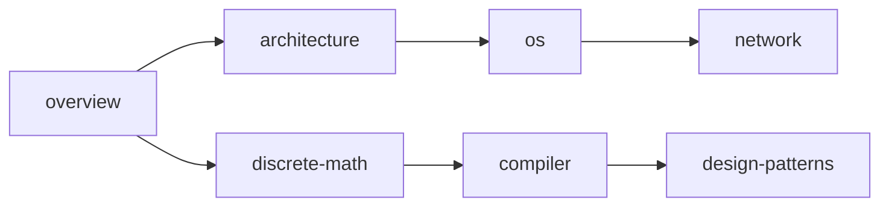

## 1. 学科定义与边界

### 1.1 核心问题

计算机科学的核心问题不是"计算机是什么"，而是"什么是可计算的"。这一区别至关重要：

- **工程学视角**：关注如何构建更快、更可靠的计算装置
- **数学视角**：关注哪些问题在原则上可以被算法求解
- **计算机科学视角**：关注可计算性的边界、计算的复杂性、以及信息处理的本质

三个奠基性成果定义了学科的边界：

| 成果       | 人物           | 年份 | 核心贡献                 |
| ---------- | -------------- | ---- | ------------------------ |
| 图灵机模型 | Alan Turing    | 1936 | 定义了"可计算"的精确边界 |
| lambda演算 | Alonzo Church  | 1936 | 从函数式角度定义可计算性 |
| 信息论     | Claude Shannon | 1948 | 量化信息的度量与传输极限 |

### 1.2 与数学的边界

计算机科学从数学继承了形式化推理的传统，但两者有本质区别：

- 数学关注**存在性证明**（存在一个解）
- 计算机科学关注**构造性证明**（如何找到这个解，以及找到它的代价）

```
数学: EXISTS x: P(x)           -- 存在性
CS:   FIND x: P(x) in T(n)    -- 构造性 + 复杂性
```

### 1.3 与工程的边界

工程学关注"如何在约束下实现目标"，计算机科学同样如此，但约束的性质不同：

- 传统工程：物理约束（材料强度、热力学极限）
- 计算机工程：逻辑约束（可计算性、复杂度类、信息熵）

### 1.4 学科演进时间线

```
1936  图灵机 / lambda演算         -- 可计算性理论奠基
1945  冯诺依曼架构                 -- 存储程序概念
1948  信息论                       -- 信息的数学基础
1950s 编译器 / 高级语言            -- 抽象层级跃升
1960s 操作系统 / 分时系统          -- 资源管理抽象
1970s 关系数据库 / TCP/IP          -- 数据与通信抽象
1980s 面向对象 / 分布式系统        -- 设计范式变革
1990s 万维网 / 开源运动            -- 全球互联
2000s 多核 / 云计算 / 大数据       -- 规模化并行
2010s 深度学习 / 容器化            -- 智能与部署
2020s 大语言模型 / RISC-V          -- 生成式AI与开放架构
```

---

## 2. 知识体系全景图

### 2.1 分支树

以树状结构呈现 CS 的主要分支，每个分支标注与本书其他模块的映射关系：

```
Computer Science
+-- Theory of Computation -------> [离散数学](discrete-math)
|   +-- Automata Theory
|   +-- Computability
|   +-- Complexity Theory
+-- Computer Architecture -------> [体系结构](architecture)
|   +-- ISA Design
|   +-- Pipeline & Superscalar
|   +-- Memory Hierarchy
+-- Systems Software -----------> [操作系统](os) / [编译原理](compiler)
|   +-- Process Management
|   +-- Memory Management
|   +-- Code Generation
+-- Networking -----------------> [计算机网络](network)
|   +-- Protocol Stack
|   +-- Routing & Switching
|   +-- Application Protocols
+-- Programming Languages ------> [编译原理](compiler) / [设计模式](design-patterns)
|   +-- Syntax & Semantics
|   +-- Type Systems
|   +-- Paradigms (OOP/FP/LP)
+-- Algorithms & DS ------------> (贯穿全模块)
|   +-- Sorting & Searching
|   +-- Graph Algorithms
|   +-- NP-Completeness
+-- Software Engineering -------> [设计模式](design-patterns)
    +-- Design Patterns
    +-- Architecture Patterns
    +-- Testing & Verification
```

### 2.2 分支间交叉矩阵

各分支并非孤立，以下矩阵展示核心交叉关系：

```
              Theory  Arch  SysSoft  Net  PL  Algo  SE
Theory         -      x      x      .    x    x    .
Arch           x      -      x      .    .    .    .
SysSoft        x      x      -      x    x    .    x
Net            .      .      x      -    .    x    .
PL             x      .      x      .    -    x    x
Algo           x      .      .      x    x    -    x
SE             .      .      x      .    x    x    -
```

`x` = 强交叉，`.` = 弱交叉，`-` = 自身

---

## 3. 抽象层级模型

### 3.1 七层抽象模型

从晶体管到应用的自底向上分层，每一层都定义了清晰的接口契约与信息隐藏原理：

```
Layer 7: Application Layer        -- 用户可感知的功能
         |  API / System Call Interface
Layer 6: Language Runtime Layer    -- GC, Thread Scheduler, Type System
         |  ABI / Bytecode / IR
Layer 5: Operating System Layer    -- Process, VFS, Socket
         |  System Call Interface (syscall)
Layer 4: Instruction Set Layer     -- ISA (x86, ARM, RISC-V)
         |  Instruction Encoding
Layer 3: Microarchitecture Layer   -- Pipeline, Cache, Branch Predictor
         |  Micro-ops / Control Signals
Layer 2: Digital Logic Layer       -- ALU, Register File, FSM
         |  Boolean Functions / Gates
Layer 1: Physics Layer             -- Transistor, CMOS, Voltage Levels
         |  Device Physics
```

### 3.2 接口契约原理

每一层向上提供**接口契约**（Interface Contract），向下隐藏**实现细节**（Implementation Detail）。这是计算机科学最核心的设计原则：

```
+-------------------+
|   Upper Layer     |  只看到接口契约
+-------------------+
        |  Interface Contract: WHAT it does
        |  Implementation Detail: HOW it does (hidden)
+-------------------+
|   Lower Layer     |  实现细节被隐藏
+-------------------+
```

**关键洞察**：接口契约的稳定性决定了系统的可演化性。只要接口不变，下层实现可以任意替换（例如：同一ISA可以有不同的微架构实现）。

### 3.3 跨层交互模式

| 模式     | 描述                 | 示例                             |
| -------- | -------------------- | -------------------------------- |
| 逐层调用 | 上层严格调用下层接口 | 应用 -> 系统调用 -> 内核 -> 驱动 |
| 跨层优化 | 跳过中间层直接交互   | 用户态IO (DPDK) / 用户态网络栈   |
| 层泄漏   | 下层细节穿透到上层   | CPU缓存行对齐影响程序性能        |
| 反向通知 | 下层主动通知上层     | 中断 / 信号 / 回调               |

### 3.4 抽象的代价

抽象并非免费，每次跨越抽象边界都有代价：

- **性能代价**：系统调用开销（上下文切换）、虚拟化开销（地址翻译）
- **语义鸿沟**：高层语义与底层实现的不匹配（如：C++虚函数 vs 分支预测）
- **调试困难**：跨层问题难以定位（如：内存屏障导致的并发Bug）

> 跨模块引用：[C语言](c/overview)的指针操作直接穿透了语言运行时层到达指令集层，这是C语言"接近硬件"的本质原因。[C++](cpp/overview)的RAII则在语言运行时层提供了资源管理的抽象。

---

## 4. 三大主线：体系结构 / 协议栈 / 状态机

本模块以三条主线贯穿所有章节，它们分别回答了计算系统的三个根本问题：

### 4.1 体系结构主线 -- "资源如何组织"

**核心问题**：硬件资源如何被组织、寻址、调度？

体系结构主线关注的是**空间维度**的布局：计算单元、存储层次、互连网络如何构成一个可编程的系统。

```
体系结构主线贯穿图:

[architecture]  CPU微架构 + 存储层次 + 总线协议
      |
      v
[os]            虚拟化体系: 虚拟CPU(进程) + 虚拟内存 + 虚拟文件系统
      |
      v
[network]       网络拓扑: 端系统 + 路由器 + 链路
      |
      v
[compiler]      代码布局: 指令调度 + 寄存器分配 + 缓存优化
```

### 4.2 协议栈主线 -- "数据如何传输"

**核心问题**：数据如何在不同抽象层间被封装、传输、解封？

协议栈主线关注的是**通信维度**的规则：每一层添加自己的头部/尾部，形成封装-传输-解封的流水线。

```
协议栈主线贯穿图:

[architecture]  总线协议: 请求/响应握手、缓存一致性协议(MESI)
      |
      v
[os]            系统调用协议: ABI约定、进程间通信协议
      |
      v
[network]       TCP/IP协议栈: 应用层/传输层/网络层/链路层
      |
      v
[compiler]      编译协议: 词法->语法->语义->中间码->目标码
```

**封装原理的统一性**：无论是网络包的封装还是函数调用的栈帧构建，本质都是同一模式：

```
// 封装模式伪代码
struct EncapsulatedData {
    Header  header;      // 本层的元数据
    Payload payload;     // 上层传递下来的数据
    Trailer trailer;     // 可选的尾部校验
};
```

### 4.3 状态机主线 -- "行为如何建模"

**核心问题**：动态行为如何被建模为状态转移图？

状态机主线关注的是**时间维度**的演化：系统在不同状态间如何转移，转移条件是什么，哪些状态是安全的。

```
状态机主线贯穿图:

[architecture]  CPU控制单元FSM: 取指->译码->执行->访存->写回
      |
      v
[os]            进程状态机: 创建->就绪->运行->阻塞->终止
      |
      v
[network]       TCP状态机: CLOSED->SYN_SENT->ESTABLISHED->...
      |
      v
[compiler]      词法分析器FSM / 解析器状态栈
```

**状态机的形式化定义**：

```
FSM = (Q, Sigma, delta, q0, F)

Q     = 有限状态集合
Sigma = 输入字母表
delta = Q x Sigma -> Q  (转移函数)
q0    = 初始状态
F     = 接受状态集合
```

> 跨模块引用：[离散数学](discrete-math)中的自动机理论是状态机主线的数学基础。[Java](java/overview)线程的状态模型与OS进程状态机直接对应。

### 4.4 三线交叉矩阵

| 章节            | 体系结构       | 协议栈           | 状态机              |
| --------------- | -------------- | ---------------- | ------------------- |
| architecture    | 主导           | 辅助(总线协议)   | 辅助(控制单元FSM)   |
| os              | 主导(虚拟化)   | 辅助(IPC协议)    | 主导(进程/线程状态) |
| network         | 辅助(拓扑)     | 主导(TCP/IP)     | 主导(TCP FSM)       |
| compiler        | 辅助(目标机)   | 辅助(编译流水线) | 主导(词法/语法FSM)  |
| discrete-math   | -              | -                | 主导(自动机理论)    |
| design-patterns | 辅助(架构模式) | 辅助(通信模式)   | 主导(状态模式)      |

---

## 5. 计算理论的哲学基础

### 5.1 可计算性理论

**丘奇-图灵论题**（Church-Turing Thesis）：任何"可有效计算"的函数都可以被图灵机计算。这不是定理，而是关于"计算"这一直觉概念的论题。

**图灵机的形式化定义**：

```
TM = (Q, Sigma, Gamma, delta, q0, B, F)

Q      = 状态集合
Sigma  = 输入字母表 (不含空白符B)
Gamma  = 纸带字母表 (Sigma的超集, 含B)
delta  = Q x Gamma -> Q x Gamma x {L, R}
q0     = 初始状态
B      = 空白符
F      = 终止状态集合
```

**图灵机模拟器伪代码**：

```python
def turing_machine(tape, transition_fn, initial_state, accept_states):
    head = 0
    state = initial_state
    while state not in accept_states:
        symbol = tape[head]
        new_state, new_symbol, direction = transition_fn(state, symbol)
        tape[head] = new_symbol
        state = new_state
        head += 1 if direction == 'R' else -1
    return tape
```

### 5.2 停机问题

**定理**：不存在通用算法H，使得对任意程序P和输入I，H(P, I)能判定P(I)是否停机。

**反证法证明概要**：

```
假设存在停机判定器 H(P, I):
  H(P, I) =   如果 P(I) 停机
  H(P, I) = false 如果 P(I) 不停机

构造悖论程序 D:
  D(P):
    if H(P, P) == true:
      loop_forever()    // 如果P(P)停机，则D(P)不停机
    else:
      halt()            // 如果P(P)不停机，则D(P)停机

考虑 D(D):
  若 H(D, D) ==   => D(D)不停机 => 矛盾
  若 H(D, D) == false => D(D)停机   => 矛盾
故 H 不存在。
```

### 5.3 计算复杂性类

```
复杂性类层次:

ALL (所有判定问题)
 |
PSPACE (多项式空间可解)
 |
 NP (非确定性多项式时间可解)
  |
  P (确定性多项式时间可解)
   |
  LOGSPACE (对数空间可解)
```

| 复杂性类    | 定义                    | 典型问题                    |
| ----------- | ----------------------- | --------------------------- |
| P           | O(n^k) 时间可解         | 排序、最短路径、矩阵乘法    |
| NP          | 多项式时间可验证        | 旅行商(判定版)、SAT、子集和 |
| NP-complete | NP中最难的问题          | 3-SAT、图着色、背包         |
| NP-hard     | 至少和NP-complete一样难 | 停机问题、最优旅行商        |
| PSPACE      | 多项式空间可解          | QBF、地理游戏               |

**P vs NP问题**：P = NP 是否成立是千禧年数学难题之一。若P=NP，则所有可快速验证的问题都可快速求解，密码学体系将崩塌。

### 5.4 对后续模块的影响

| 理论结果         | 影响的模块                  | 具体影响                                           |
| ---------------- | --------------------------- | -------------------------------------------------- |
| 停机问题不可判定 | [编译原理](compiler)        | 无法构建完美的程序分析器                           |
| Chomsky层次      | [编译原理](compiler)        | 正则语言/上下文无关语言决定词法/语法分析的能力边界 |
| NP-completeness  | [设计模式](design-patterns) | 某些优化问题需要启发式/近似算法                    |
| 信息熵           | [计算机网络](network)       | 信道容量、数据压缩的理论极限                       |
| 自动机理论       | [离散数学](discrete-math)   | DFA/NFA/正则表达式的等价性                         |

---

## 6. 本模块的知识依赖图

### 6.1 DAG依赖关系

以有向无环图（DAG）呈现各章节间的前置依赖关系：



### 6.2 推荐阅读路径

```
路径A (系统方向):  overview -> architecture -> os -> network
路径B (语言方向):  overview -> discrete-math -> compiler -> design-patterns
路径C (全栈方向):  overview -> architecture -> discrete-math -> os -> compiler -> network -> design-patterns
```

### 6.3 与其他模块的交叉引用

| 本模块章节      | 外部模块引用                                  | 交叉原因                     |
| --------------- | --------------------------------------------- | ---------------------------- |
| architecture    | [C语言](c/overview\)                          | C的内存模型直接映射到硬件    |
| os              | [C++](cpp/overview\)                          | C++的线程模型与OS线程对应    |
| compiler        | [Java](java/overview\)                        | JVM是编译目标+运行时的统一体 |
| network         | [Java](java/overview\)                        | Java NIO/Netty与网络编程     |
| design-patterns | [C++](cpp/overview\) / [Java](java/overview\) | 设计模式的语言实现差异       |

---

## 7. 速查表

### 7.1 核心概念速查

| 概念         | 一句话定义             | 所属主线        |
| ------------ | ---------------------- | --------------- |
| 冯诺依曼架构 | 存储程序 + 顺序执行    | 体系结构        |
| 缓存一致性   | 多核间数据一致性协议   | 体系结构/协议栈 |
| 进程         | 资源分配的基本单位     | 体系结构/状态机 |
| 虚拟内存     | 地址空间的间接映射     | 体系结构        |
| TCP三次握手  | 连接建立的状态同步     | 协议栈/状态机   |
| 词法分析     | 字符流到Token流的FSM   | 状态机          |
| P vs NP      | 验证与求解的复杂度鸿沟 | 计算理论        |

### 7.2 抽象层级速查

| 层级        | 关键抽象         | 接口类型     | 典型实现              |
| ----------- | ---------------- | ------------ | --------------------- |
| L7 应用     | 用户功能         | API / GUI    | 浏览器、编辑器        |
| L6 运行时   | 类型/线程/GC     | ABI / 字节码 | JVM、CLR、V8          |
| L5 操作系统 | 进程/文件/Socket | 系统调用     | Linux、Windows        |
| L4 指令集   | 指令/寄存器      | ISA规范      | x86-64、ARMv8、RISC-V |
| L3 微架构   | 流水线/缓存      | 微操作       | Intel Core、Apple M1  |
| L2 数字逻辑 | 门/触发器/FSM    | 布尔函数     | ALU、寄存器堆         |
| L1 物理     | 晶体管/电压      | 电信号       | CMOS工艺              |

### 7.3 三大主线速查

```
体系结构主线:  空间布局  -- "在哪里"
  CPU -> Cache -> Memory -> Disk -> Network
  核心问题: 寻址、层次、局部性

协议栈主线:    通信规则  -- "怎么传"
  封装 -> 传输 -> 解封
  核心问题: 头部格式、握手协议、错误恢复

状态机主线:    时间演化  -- "何时变"
  状态 -> 事件 -> 新状态
  核心问题: 状态定义、转移条件、终止判定
```

---

## 延伸阅读

- _The Computer Science and Engineering Handbook_ -- Tucker
- _Introduction to the Theory of Computation_ -- Michael Sipser
- _Computer Science: An Overview_ -- J. Glenn Brookshear
- _Structure and Interpretation of Computer Programs_ -- Abelson & Sussman
- _The Art of Computer Programming_ -- Donald Knuth
