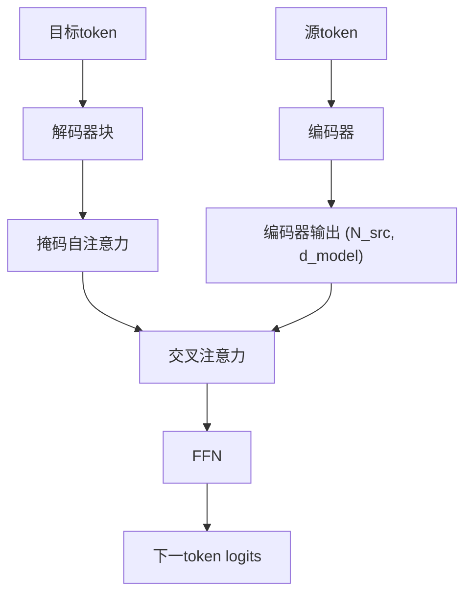

# T5, BART — 编码器-解码器模型

> 编码器理解。解码器生成。把它们放回去你就得到一个为输入→输出任务构建的模型:翻译、摘要、改写、转录。

**类型:** 学习
**语言:** Python
**前置知识:** 阶段7 · 05(完整Transformer), 阶段7 · 06(BERT), 阶段7 · 07(GPT)
**预计时间:** ~45分钟

## 问题所在

仅解码器的GPT和仅编码器的BERT各自为不同目标精简了2017年的架构。但许多任务天然是输入-输出的:

- 翻译: 英语 → 法语。
- 摘要: 5,000-token文章 → 200-token摘要。
- 语音识别: 音频token → 文本token。
- 结构化提取: 散文 → JSON。

对于这些,编码器-解码器是最干净的适配。编码器产生源的密集表示。解码器生成输出,在每一步交叉关注该表示。训练在输出侧是移位一的。与GPT相同的损失,只是以编码器输出为条件。

两篇论文定义了现代手册:

1. **T5** (Raffel et al. 2019)。"Text-to-Text Transfer Transformer。"每个NLP任务重新构建为文本输入、文本输出。单一架构,单一词汇,单一损失。在掩码跨度预测上预训练(破坏输入中的跨度,在输出中解码它们)。
2. **BART** (Lewis et al. 2019)。"Bidirectional and Auto-Regressive Transformer。"去噪自编码器:以多种方式破坏输入(打乱、掩码、删除、旋转),要求解码器重建原始内容。

2026年,编码器-解码器格式在输入结构重要的地方继续存在:

- Whisper(语音 → 文本)。
- Google的翻译栈。
- 一些具有明确上下文-编辑结构的代码补全/修复模型。
- Flan-T5及其用于结构化推理任务的变体。

仅解码器赢得了聚光灯,但编码器-解码器从未消失。

## 核心概念

### 前向循环



关键的是,编码器对每个输入运行一次。解码器自回归运行,但在每一步交叉关注*相同*的编码器输出。缓存编码器输出是对长输入的免费加速。

### T5预训练 — 跨度破坏

选择输入中的随机跨度(平均长度3个token,总共15%)。用唯一哨兵替换每个跨度: `<extra_id_0>`, `<extra_id_1>` 等。解码器只输出被破坏的跨度及其哨兵前缀:

```
source: The quick <extra_id_0> fox jumps <extra_id_1> dog
target: <extra_id_0> brown <extra_id_1> over the lazy
```

比预测整个序列更便宜的信号。在T5论文的消融中与MLM(BERT)和prefix-LM(UniLM)竞争。

### BART预训练 — 多噪声去噪

BART尝试五种噪声函数:

1. Token掩码。
2. Token删除。
3. 文本填充(掩码一个跨度,解码器插入正确长度)。
4. 句子排列。
5. 文档旋转。

文本填充 + 句子排列的组合产生了最好的下游结果。解码器总是重建原始内容。BART的输出是完整序列,而不仅是被破坏的跨度——所以预训练计算高于T5。

### 推理

与GPT相同的自回归生成。贪心/束/top-p采样都适用。束搜索(宽度4-5)是翻译和摘要的标准,因为输出分布比聊天更窄。

### 2026年何时选择每种变体

| 任务       | 编码器-解码器? | 原因                                                        |
| ---------- | -------------- | ----------------------------------------------------------- |
| 翻译       | 是,通常        | 明确的源序列;固定的输出分布;束搜索有效                      |
| 语音转文本 | 是(Whisper)    | 输入模态与输出不同;编码器塑造音频特征                       |
| 聊天/推理  | 否,仅解码器    | 没有持久的"输入"——对话就是序列                              |
| 代码补全   | 通常否         | 带长上下文的仅解码器胜出;Qwen 2.5 Coder等代码模型是仅解码器 |
| 摘要       | 两者都可以     | BART, PEGASUS击败了早期仅解码器基线;现代仅解码器LLM匹配它们 |
| 结构化提取 | 两者都可以     | T5更干净,因为"text → text"吸收任何输出格式                  |

自2022年左右的趋势:仅解码器接管了编码器-解码器曾经拥有的任务,因为(a)指令调优的仅解码器LLM通过提示泛化到任何任务,(b)一种架构比两种更容易扩展,(c)RLHF假设是解码器。编码器-解码器在输入模态不同(语音、图像)或束搜索质量重要的地方保持。

## 动手构建

参见 `code/main.py`。我们为玩具语料实现T5风格的跨度破坏——本课最有用的单个部分,因为它出现在2017年以来每个编码器-解码器预训练方案中。

### 步骤1:跨度破坏

```python
def corrupt_spans(tokens, mask_rate=0.15, mean_span=3.0, rng=None):
    """选择总计约mask_rate的token的跨度。返回(corrupted_input, target)。"""
    n = len(tokens)
    n_mask = max(1, int(n * mask_rate))
    n_spans = max(1, int(round(n_mask / mean_span)))
    ...
```

目标格式是T5约定: `<sent0> span0 <sent1> span1 ...`。被破坏的输入将未改变的token与跨度位置的哨兵token交错。

### 步骤2:验证往返

给定被破坏的输入和目标,重建原始句子。如果你的破坏是可逆的,前向传播就是良定义的。这是一个健全性检查——真正的训练从不这样做,但测试很便宜,可以捕获跨度簿记中的差一错误。

### 步骤3:BART噪声

五个函数: `token_mask`, `token_delete`, `text_infill`, `sentence_permute`, `document_rotate`。组合其中两个并显示结果。

## 实际应用

HuggingFace参考:

```python
from transformers import T5ForConditionalGeneration, T5Tokenizer
tok = T5Tokenizer.from_pretrained("google/flan-t5-base")
model = T5ForConditionalGeneration.from_pretrained("google/flan-t5-base")

inputs = tok("translate English to French: Attention is all you need.", return_tensors="pt")
out = model.generate(**inputs, max_new_tokens=32)
print(tok.decode(out[0], skip_special_tokens=True))
```

T5的技巧:任务名称进入输入文本。同一模型处理数十个任务,因为每个任务都是文本输入、文本输出。2026年,这种模式已被指令调优的仅解码器模型泛化,但T5首先编纂了它。

## 交付成果

参见 `outputs/skill-seq2seq-picker.md`。该技能根据输入-输出结构、延迟和质量目标为新任务在编码器-解码器和仅解码器之间选择。

## 练习

1. **简单。** 运行 `code/main.py`,对30-token句子应用跨度破坏,验证将非哨兵源token与解码目标跨度拼接可重现原始内容。
2. **中等。** 实现BART的 `text_infill` 噪声:用单个 `<mask>` token替换随机跨度,解码器必须推断正确的跨度长度加内容。展示一个示例。
3. **困难。** 在微型英语 → pig-Latin语料(200对)上微调 `flan-t5-small`。在保留的50对集合上测量BLEU。与在相同数据和相同计算上微调 `Llama-3.2-1B` 比较。

## 关键术语

| 术语          | 人们怎么说             | 实际含义                                                         |
| ------------- | ---------------------- | ---------------------------------------------------------------- |
| 编码器-解码器 | "Seq2seq transformer"  | 两个栈:用于输入的双向编码器,带交叉注意力的因果解码器用于输出。   |
| 交叉注意力    | "源与目标对话的地方"   | 解码器的Q × 编码器的K/V。编码器信息进入解码器的唯一地方。        |
| 跨度破坏      | "T5的预训练技巧"       | 用哨兵token替换随机跨度;解码器输出这些跨度。                     |
| 去噪目标      | "BART的游戏"           | 对输入应用噪声函数,训练解码器重建干净序列。                      |
| 哨兵token     | "`<extra_id_N>`占位符" | 在源中标记被破坏跨度并在目标中重新标记的特殊token。              |
| Flan          | "指令调优的T5"         | 在>1,800个任务上微调的T5;使编码器-解码器在指令遵循上具有竞争力。 |
| 束搜索        | "解码策略"             | 每步保留top-k部分序列;翻译/摘要的标准。                          |
| 教师强制      | "训练时输入"           | 训练时,向解码器喂入真实的上一个输出token,而非采样的。            |

## 延伸阅读

- [Raffel et al. (2019). Exploring the Limits of Transfer Learning with a Unified Text-to-Text Transformer](https://arxiv.org/abs/1910.10683) — T5。
- [Lewis et al. (2019). BART: Denoising Sequence-to-Sequence Pre-training for Natural Language Generation, Translation, and Comprehension](https://arxiv.org/abs/1910.13461) — BART。
- [Chung et al. (2022). Scaling Instruction-Finetuned Language Models](https://arxiv.org/abs/2210.11416) — Flan-T5。
- [Radford et al. (2022). Robust Speech Recognition via Large-Scale Weak Supervision](https://arxiv.org/abs/2212.04356) — Whisper, 2026年规范的编码器-解码器。
- [HuggingFace `modeling_t5.py`](https://github.com/huggingface/transformers/blob/main/src/transformers/models/t5/modeling_t5.py) — 参考实现。
