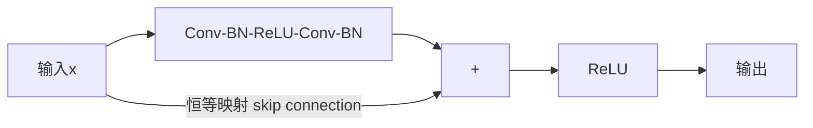

## 1. 卷积操作

### 1.1 二维卷积

输入 $\mathbf{X} \in \mathbb{R}^{H \times W}$，卷积核 $\mathbf{K} \in \mathbb{R}^{k_h \times k_w}$：

$$(\mathbf{X} * \mathbf{K})[i,j] = \sum_{m=0}^{k_h-1}\sum_{n=0}^{k_w-1} \mathbf{X}[i+m, j+n] \cdot \mathbf{K}[m,n]$$

### 1.2 输出尺寸计算

$$H_{out} = \left\lfloor \frac{H_{in} + 2P - K}{S} \right\rfloor + 1$$

| 参数     | 说明            |
| :------- | :-------------- |
| $H_{in}$ | 输入高度        |
| $K$      | 卷积核大小      |
| $P$      | 填充（Padding） |
| $S$      | 步幅（Stride）  |

### 1.3 卷积类型

| 类型           | 说明           | 输出尺寸 |
| :------------- | :------------- | :------- |
| 标准卷积       | 普通卷积       | 缩小     |
| Same Padding   | 零填充保持尺寸 | 不变     |
| 1×1卷积        | 通道混合/降维  | 不变     |
| 空洞卷积       | 扩大感受野     | 可变     |
| 深度可分离卷积 | 逐通道+逐点    | 缩小     |
| 转置卷积       | 上采样         | 放大     |

**深度可分离卷积**参数量对比：

$$\text{标准}: C_{in} \times C_{out} \times K^2$$
$$\text{分离}: C_{in} \times K^2 + C_{in} \times C_{out}$$

参数减少比例：$\frac{1}{C_{out}} + \frac{1}{K^2}$

## 2. 池化操作

### 2.1 池化类型

| 类型         | 操作             | 作用           |
| :----------- | :--------------- | :------------- |
| 最大池化     | 取窗口内最大值   | 保留最显著特征 |
| 平均池化     | 取窗口内平均值   | 保留整体信息   |
| 全局平均池化 | 整个特征图取平均 | 替代全连接层   |

### 2.2 池化作用

- **降维**：减少特征图尺寸和计算量
- **平移不变性**：小幅位移不影响输出
- **防止过拟合**：减少参数数量

## 3. 经典架构

### 3.1 LeNet-5（1998）

```
Input(32×32×1) → Conv(5×5,6) → Pool(2×2) → Conv(5×5,16) → Pool(2×2)
→ FC(120) → FC(84) → FC(10)
```

- 首个成功的CNN架构
- 应用于手写数字识别

### 3.2 AlexNet（2012）

```
Input(227×227×3) → Conv(11×11,96,s=4) → Conv(5×5,256) → Conv(3×3,384)
→ Conv(3×3,384) → Conv(3×3,256) → Pool → FC(4096) → FC(4096) → FC(1000)
```

**创新点**：

- ReLU激活函数（替代Sigmoid）
- Dropout正则化
- GPU并行训练
- 数据增强
- Local Response Normalization

### 3.3 VGGNet（2014）

**核心设计原则**：全部使用3×3小卷积核

```
VGG-16:
Conv3-64 ×2 → Pool → Conv3-128 ×2 → Pool → Conv3-256 ×3 → Pool
→ Conv3-512 ×3 → Pool → Conv3-512 ×3 → Pool → FC-4096 → FC-4096 → FC-1000
```

**3×3卷积核的优势**：

- 两个3×3卷积 = 一个5×5感受野，参数更少
- 三个3×3卷积 = 一个7×7感受野
- 更多非线性变换

**参数量**：1.38亿（主要在全连接层）

### 3.4 ResNet（2015）

**核心创新**：残差连接（Skip Connection）

$$\mathbf{y} = \mathcal{F}(\mathbf{x}) + \mathbf{x}$$

网络只需学习残差 $\mathcal{F}(\mathbf{x}) = \mathbf{y} - \mathbf{x}$：



**为什么有效**：

- 恒等映射容易学习：$\mathcal{F}(\mathbf{x}) = 0$
- 梯度可以直接回传：$\frac{\partial \mathbf{y}}{\partial \mathbf{x}} = \frac{\partial \mathcal{F}}{\partial \mathbf{x}} + 1$
- 解决深层网络退化问题

**ResNet变体**：

| 模型       | 层数 | Top-5错误率 |
| :--------- | :--- | :---------- |
| ResNet-18  | 18   | 10.52%      |
| ResNet-34  | 34   | 8.58%       |
| ResNet-50  | 50   | 6.71%       |
| ResNet-101 | 101  | 5.69%       |
| ResNet-152 | 152  | 5.13%       |

### 3.5 架构演进总结

| 架构         | 年份 | 核心创新      | 参数量   | Top-5 |
| :----------- | :--- | :------------ | :------- | :---- |
| LeNet        | 1998 | 开创CNN       | 60K      | —     |
| AlexNet      | 2012 | ReLU+GPU      | 61M      | 16.4% |
| VGG          | 2014 | 小卷积核      | 138M     | 7.3%  |
| GoogLeNet    | 2014 | Inception模块 | 7M       | 6.7%  |
| ResNet       | 2015 | 残差连接      | 26M      | 3.6%  |
| DenseNet     | 2017 | 密集连接      | 8M       | 3.5%  |
| EfficientNet | 2019 | 复合缩放      | 5M~66M   | 2.9%  |
| ConvNeXt     | 2022 | 现代化CNN     | 28M~350M | 2.3%  |
