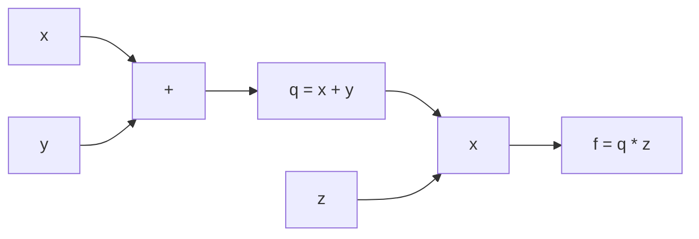

## 1. 链式法则

### 1.1 标量链式法则

若 $y = f(u)$，$u = g(x)$，则：

$$\frac{\partial y}{\partial x} = \frac{\partial y}{\partial u} \cdot \frac{\partial u}{\partial x}$$

### 1.2 向量链式法则

若 $\mathbf{y} = f(\mathbf{u})$，$\mathbf{u} = g(\mathbf{x})$，则：

$$\frac{\partial L}{\partial \mathbf{x}} = \frac{\partial \mathbf{u}}{\partial \mathbf{x}} \cdot \frac{\partial L}{\partial \mathbf{u}}$$

## 2. 计算图

### 2.1 前向计算图

以 $f(x, y, z) = (x + y) \cdot z$ 为例：



### 2.2 反向传播

从输出向输入逐层计算梯度：

$$\frac{\partial f}{\partial z} = q = x + y$$

$$\frac{\partial f}{\partial q} = z$$

$$\frac{\partial f}{\partial x} = \frac{\partial f}{\partial q} \cdot \frac{\partial q}{\partial x} = z \cdot 1 = z$$

$$\frac{\partial f}{\partial y} = \frac{\partial f}{\partial q} \cdot \frac{\partial q}{\partial y} = z \cdot 1 = z$$

### 2.3 通用反向传播规则

对于任意节点 $v$：

$$\frac{\partial L}{\partial v} = \sum_{c \in \text{children}(v)} \frac{\partial L}{\partial c} \cdot \frac{\partial c}{\partial v}$$

## 3. 神经网络反向传播

### 3.1 符号定义

| 符号           | 含义            |
| :------------- | :-------------- |
| $\mathbf{a}^l$ | 第$l$层激活值   |
| $\mathbf{z}^l$ | 第$l$层加权输入 |
| $\mathbf{W}^l$ | 第$l$层权重     |
| $\mathbf{b}^l$ | 第$l$层偏置     |
| $\delta^l$     | 第$l$层误差项   |

### 3.2 四个基本方程

**BP1**：输出层误差

$$\delta^L = \nabla_a L \odot \sigma'(\mathbf{z}^L)$$

**BP2**：隐藏层误差

$$\delta^l = ((\mathbf{W}^{l+1})^T \delta^{l+1}) \odot \sigma'(\mathbf{z}^l)$$

**BP3**：偏置梯度

$$\frac{\partial L}{\partial \mathbf{b}^l} = \delta^l$$

**BP4**：权重梯度

$$\frac{\partial L}{\partial \mathbf{W}^l} = \delta^l (\mathbf{a}^{l-1})^T$$

### 3.3 完整算法

```
前向传播:
  对于 l = 1, 2, ..., L:
    z^l = W^l · a^{l-1} + b^l
    a^l = σ(z^l)

反向传播:
  δ^L = ∇_a L ⊙ σ'(z^L)
  对于 l = L-1, L-2, ..., 1:
    δ^l = (W^{l+1})^T · δ^{l+1} ⊙ σ'(z^l)
    ∂L/∂W^l = δ^l · (a^{l-1})^T
    ∂L/∂b^l = δ^l

参数更新:
  W^l ← W^l - η · ∂L/∂W^l
  b^l ← b^l - η · ∂L/∂b^l
```

## 4. 梯度问题

### 4.1 梯度消失

$$\|\delta^1\| \propto \prod_{l=1}^{L-1} \|\mathbf{W}^l\| \cdot \|\sigma'(\mathbf{z}^l)\|$$

当 $|\sigma'(z)| < 1$ 时，梯度指数衰减。

**解决方案**：ReLU、残差连接、BatchNorm、合适的初始化

### 4.2 梯度爆炸

当权重矩阵的谱半径 $\rho(\mathbf{W}) > 1$ 时，梯度指数增长。

**解决方案**：梯度裁剪、权重正则化、BatchNorm

### 4.3 梯度裁剪

**按值裁剪**：

$$\nabla_{clipped} = \text{clip}(\nabla, -\theta, \theta)$$

**按范数裁剪**：

$$\nabla_{clipped} = \begin{cases} \nabla & \|\nabla\| \leq \theta \\ \frac{\theta}{\|\nabla\|}\nabla & \|\nabla\| > \theta \end{cases}$$

## 5. 优化器

### 5.1 SGD及其变体

**SGD**：

$$\theta_{t+1} = \theta_t - \eta \nabla_\theta L$$

**SGD + Momentum**：

$$\mathbf{v}_t = \beta \mathbf{v}_{t-1} + \eta \nabla_\theta L$$
$$\theta_{t+1} = \theta_t - \mathbf{v}_t$$

**Nesterov Momentum**：

$$\mathbf{v}_t = \beta \mathbf{v}_{t-1} + \eta \nabla_\theta L(\theta_t + \beta \mathbf{v}_{t-1})$$
$$\theta_{t+1} = \theta_t - \mathbf{v}_t$$

### 5.2 自适应学习率

**AdaGrad**：

$$\theta_{t+1} = \theta_t - \frac{\eta}{\sqrt{G_t + \epsilon}} \odot \nabla_\theta L$$

**RMSProp**：

$$E[g^2]_t = \beta E[g^2]_{t-1} + (1-\beta)g_t^2$$
$$\theta_{t+1} = \theta_t - \frac{\eta}{\sqrt{E[g^2]_t + \epsilon}} g_t$$

**Adam**：

$$m_t = \beta_1 m_{t-1} + (1-\beta_1)g_t$$
$$v_t = \beta_2 v_{t-1} + (1-\beta_2)g_t^2$$
$$\hat{m}_t = \frac{m_t}{1-\beta_1^t}, \quad \hat{v}_t = \frac{v_t}{1-\beta_2^t}$$
$$\theta_{t+1} = \theta_t - \frac{\eta}{\sqrt{\hat{v}_t} + \epsilon} \hat{m}_t$$

### 5.3 优化器选择

| 优化器       | 适用场景            | 推荐度 |
| :----------- | :------------------ | :----- |
| SGD+Momentum | CV、需要精细调优    | 中     |
| Adam         | 通用、NLP、快速原型 | 高     |
| AdamW        | Transformer、大模型 | 高     |
| LAMB         | 大batch训练         | 中     |
