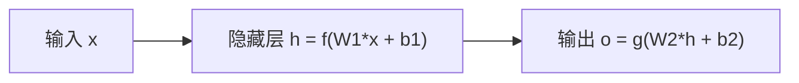

# 多层网络

> 多层网络堆叠神经元创建层次化表示，解决单层感知机无法处理的非线性问题。

**类型:** 构建
**语言:** Python
**前置条件:** Phase 3 第1课（感知机）
**时间:** ~90 分钟

## 学习目标

- 从零实现多层感知机(MLP)的前向传播
- 解释为什么隐藏层和非线性激活函数是必要的
- 证明两层网络可以表示任意连续函数（万能近似定理）
- 分析网络宽度、深度与表示能力的关系

## 问题

单层感知机只能画直线。现实世界的问题需要弯曲的决策边界。多层网络通过组合多个线性变换和非线性激活函数，创建任意形状的决策边界。

## 概念

### 为什么需要多层

单层：y = activation(Wx + b) —— 一个线性变换加一个非线性。

多层：y = activation(W2 _ activation(W1 _ x + b1) + b2) —— 两个线性变换，中间有非线性。

第一层创建中间表示（隐藏特征），第二层组合这些表示做最终预测。

### 前向传播



步骤：

1. 计算隐藏层：h = activation(W1 \* x + b1)
2. 计算输出层：o = activation(W2 \* h + b2)

每一层将输入空间变换为新的表示空间。隐藏层学到的表示不是手工设计的，而是从数据中自动学习的。

### 为什么需要非线性激活

如果所有激活函数都是线性的，多层网络等价于单层：

```
W2 * (W1 * x + b1) + b2 = (W2 * W1) * x + (W2 * b1 + b2)
```

一个线性变换。没有非线性，深度毫无意义。

非线性激活函数让每一层创建真正新的表示，而不是简单的线性组合。

### 万能近似定理

一个具有足够宽隐藏层和非线性激活函数的前馈网络，可以近似任意连续函数到任意精度。

但这只是存在性定理，不保证：

- 网络能通过梯度下降学到这个近似
- 需要多少数据
- 网络需要多宽

实践中，更深（更多层）的网络通常比更宽（更多神经元）的网络更高效。

### 深度 vs 宽度

深层网络的优势：层次化表示。每一层在前一层的基础上构建更抽象的特征。

图像识别：边缘 -> 纹理 -> 部件 -> 物体

浅而宽的网络理论上可以表示同样的函数，但需要指数级更多神经元。

### XOR的多层解

XOR可以用两层网络解决：

```
隐藏层1: h1 = AND(NOT x1, x2)  -> 检测(0,1)
隐藏层2: h2 = AND(x1, NOT x2)  -> 检测(1,0)
输出: OR(h1, h2)               -> XOR
```

网络自动学习这些中间特征，不需要手工设计。

## 动手构建

```python
import random
import math

def sigmoid(z):
    z = max(-500, min(500, z))
    return 1.0 / (1.0 + math.exp(-z))

def sigmoid_derivative(z):
    s = sigmoid(z)
    return s * (1 - s)

class MLP:
    def __init__(self, layer_sizes, learning_rate=0.1):
        self.layer_sizes = layer_sizes
        self.lr = learning_rate
        self.weights = []
        self.biases = []

        for i in range(len(layer_sizes) - 1):
            w = [[random.gauss(0, 1) / math.sqrt(layer_sizes[i])
                  for _ in range(layer_sizes[i])] for _ in range(layer_sizes[i + 1])]
            b = [0.0] * layer_sizes[i + 1]
            self.weights.append(w)
            self.biases.append(b)

    def forward(self, x):
        activations = [x]
        pre_activations = []

        current = x
        for i in range(len(self.weights)):
            z = [sum(self.weights[i][j][k] * current[k] for k in range(len(current))) + self.biases[i][j]
                 for j in range(len(self.weights[i]))]
            pre_activations.append(z)
            if i < len(self.weights) - 1:
                current = [sigmoid(zi) for zi in z]
            else:
                current = [sigmoid(zi) for zi in z]
            activations.append(current)

        return activations, pre_activations

    def predict(self, x):
        activations, _ = self.forward(x)
        return activations[-1]

    def predict_class(self, x):
        output = self.predict(x)
        return 1 if output[0] >= 0.5 else 0

    def backward(self, x, y, activations, pre_activations):
        n_layers = len(self.weights)
        deltas = [None] * n_layers

        output = activations[-1]
        output_error = [output[j] - y[j] for j in range(len(y))]
        deltas[-1] = [output_error[j] * sigmoid_derivative(pre_activations[-1][j])
                      for j in range(len(output_error))]

        for i in range(n_layers - 2, -1, -1):
            delta_next = deltas[i + 1]
            w_next = self.weights[i + 1]
            for j in range(len(deltas[i + 1])):
                pass
            deltas[i] = [
                sum(w_next[k][j] * delta_next[k] for k in range(len(delta_next)))
                * sigmoid_derivative(pre_activations[i][j])
                for j in range(len(self.weights[i]))
            ]

        for i in range(n_layers):
            for j in range(len(self.weights[i])):
                for k in range(len(self.weights[i][j])):
                    self.weights[i][j][k] -= self.lr * deltas[i][j] * activations[i][k]
                self.biases[i][j] -= self.lr * deltas[i][j]

    def fit(self, X, y, epochs=1000, print_every=200):
        for epoch in range(epochs):
            total_loss = 0
            for xi, yi in zip(X, y):
                activations, pre_activations = self.forward(xi)
                output = activations[-1]
                loss = -sum(yi[j] * math.log(max(output[j], 1e-15)) +
                           (1 - yi[j]) * math.log(max(1 - output[j], 1e-15))
                           for j in range(len(yi)))
                total_loss += loss
                self.backward(xi, yi, activations, pre_activations)

            if epoch % print_every == 0:
                avg_loss = total_loss / len(X)
                print(f"  Epoch {epoch:4d} | Loss: {avg_loss:.4f}")
        return self

    def accuracy(self, X, y):
        correct = 0
        for xi, yi in zip(X, y):
            pred = self.predict_class(xi)
            actual = 1 if yi[0] > 0.5 else 0
            if pred == actual:
                correct += 1
        return correct / len(y)

random.seed(42)

print("=== MLP on XOR Problem ===")
X_xor = [[0, 0], [0, 1], [1, 0], [1, 1]]
y_xor = [[0], [1], [1], [0]]

mlp = MLP(layer_sizes=[2, 4, 1], learning_rate=1.0)
mlp.fit(X_xor, y_xor, epochs=2000, print_every=500)
print(f"\nXOR Accuracy: {mlp.accuracy(X_xor, y_xor):.4f}")

for xi, yi in zip(X_xor, y_xor):
    output = mlp.predict(xi)[0]
    print(f"  Input {xi} -> Output {output:.4f} (target {yi[0]})")

print("\n=== MLP on Nonlinear Classification ===")
N = 200
X = []
y = []
for _ in range(N // 2):
    X.append([random.gauss(0, 1), random.gauss(0, 1)])
    y.append([0])
for _ in range(N // 2):
    X.append([random.gauss(3, 1), random.gauss(3, 1)])
    y.append([1])

mlp2 = MLP(layer_sizes=[2, 8, 1], learning_rate=0.5)
mlp2.fit(X, y, epochs=500, print_every=100)
print(f"Classification accuracy: {mlp2.accuracy(X, y):.4f}")
```

## 练习

1. 比较不同隐藏层大小(2, 4, 8, 16)在XOR问题上的收敛速度。更大的隐藏层总是更好吗？
2. 构建一个3隐藏层的MLP。与1隐藏层MLP比较。深度带来什么优势？
3. 用ReLU激活函数替换sigmoid。观察训练速度和收敛行为的差异。

## 关键术语

| 术语         | 人们怎么说     | 实际含义                               |
| ------------ | -------------- | -------------------------------------- |
| 多层感知机   | "多层神经网络" | 至少一个隐藏层的前馈神经网络           |
| 隐藏层       | "中间层"       | 输入和输出之间的层，学习中间表示       |
| 前向传播     | "从左到右算"   | 输入通过网络逐层计算到输出的过程       |
| 万能近似定理 | "能学任何函数" | 足够宽的单隐藏层网络可近似任意连续函数 |
| 非线性激活   | "弯曲变换"     | 使网络能学习非线性关系的函数           |
