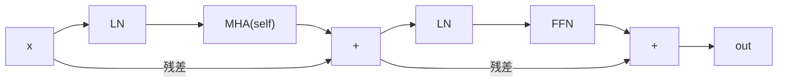

# 完整Transformer — 编码器 + 解码器

> 注意力是主角。其他一切——残差、归一化、前馈网络、交叉注意力——是让你能深度堆叠的脚手架。

**类型:** 构建
**语言:** Python
**前置知识:** 阶段7 · 02(自注意力), 阶段7 · 03(多头注意力), 阶段7 · 04(位置编码)
**预计时间:** ~75分钟

## 问题所在

单个注意力层是特征提取器,不是模型。每层一次矩阵乘法不足以处理语言。你需要深度——而没有正确的管道,深度会崩溃。

2017年Vaswani论文打包了六个设计决策,将一个注意力层变成了可堆叠的块。此后每个transformer——仅编码器(BERT)、仅解码器(GPT)、编码器-解码器(T5)——继承了相同的骨架。2026年,这些块已被改进(RMSNorm, SwiGLU, pre-norm, RoPE),但骨架完全相同。

本课是骨架。接下来的课程将专门化它——06课讲编码器,07课讲解码器,08课讲编码器-解码器。

## 核心概念

### 六个组件

1. **嵌入 + 位置信号。** Token → 向量。通过RoPE(现代)或正弦(经典)注入位置。
2. **自注意力。** 每个位置关注每个其他位置。解码器中带掩码。
3. **前馈网络(FFN)。** 逐位置的两层MLP: `W_2 · activation(W_1 · x)`。默认扩展比4倍。
4. **残差连接。** `x + sublayer(x)`。没有这个,梯度在~6层后消失。
5. **层归一化。** `LayerNorm` 或 `RMSNorm`(现代)。稳定残差流。
6. **交叉注意力(仅解码器)。** 查询来自解码器,键和值来自编码器输出。

观察一个向量流过一个块:注意力跨位置混合,残差将其向前传递,FFN变换它,归一化保持流稳定。

### 编码器块(用于BERT, T5编码器)



编码器是双向的。没有掩码。所有位置看到所有位置。

### 解码器块(用于GPT, T5解码器)

```
x → LN → MHA(masked self) → + → LN → MHA(cross to encoder) → + → LN → FFN → + → out
```

解码器每块有三个子层。中间那个——交叉注意力——是信息从编码器流向解码器的唯一地方。在纯仅解码器架构(GPT)中,交叉注意力被省略,只有掩码自注意力 + FFN。

### Pre-norm vs Post-norm

原始论文: `x + sublayer(LN(x))` vs `LN(x + sublayer(x))`。Post-norm在2019年左右失宠——没有仔细的预热很难深度训练。Pre-norm(`LN`在子层*之前*)是2026年的默认:Llama, Qwen, GPT-3+, Mistral都使用它。

### 2026年现代化块

Vaswani 2017发布的是LayerNorm + ReLU。现代栈替换了两者。生产块实际的样子:

| 组件    | 2017      | 2026                                 |
| ------- | --------- | ------------------------------------ |
| 归一化  | LayerNorm | RMSNorm                              |
| FFN激活 | ReLU      | SwiGLU                               |
| FFN扩展 | 4x        | 2.6x (SwiGLU使用三个矩阵,总参数匹配) |
| 位置    | 正弦绝对  | RoPE                                 |
| 注意力  | 完整MHA   | GQA(或MLA)                           |
| 偏置项  | 有        | 无                                   |

RMSNorm去掉了LayerNorm的均值中心化(少一次减法),节省计算且经验上至少同样稳定。SwiGLU(`Swish(W1 x) ⊙ W3 x`)在Llama、PaLM和Qwen论文中持续比ReLU/GELU FFN好约0.5点ppl。

### 参数量

对于 `d_model = d` 和FFN扩展 `r` 的一个块:

- MHA: `4 · d²` (Q, K, V, O投影)
- FFN(SwiGLU): `3 · d · (r · d)` ≈ `3rd²`
- 归一化: 可忽略

在 `d = 4096, r = 2.6, layers = 32`(大致Llama 3 8B)时,总计: `32 · (4·4096² + 3·2.6·4096²) ≈ 32 · (16 + 32) M = ~1.5B parameters per layer × 32 ≈ 7B`(加上嵌入和头)。与公布的数量匹配。

## 动手构建

### 步骤1:构建块

使用第03课的微型 `Matrix` 类(为独立性复制到此文件):

- `layer_norm(x, eps=1e-5)` — 减去均值,除以标准差。
- `rms_norm(x, eps=1e-6)` — 除以RMS。不减均值。
- `gelu(x)` 和 `silu(x) * W3 x` (SwiGLU)。
- `ffn_swiglu(x, W1, W2, W3)`。
- `encoder_block(x, params)` 和 `decoder_block(x, enc_out, params)`。

参见 `code/main.py` 的完整接线。

### 步骤2:连接2层编码器和2层解码器

堆叠它们。将编码器输出传入每个解码器交叉注意力。在输出投影之前添加最终LN。

```python
def encode(tokens, params):
    x = embed(tokens, params.emb) + sinusoidal(len(tokens), params.d)
    for block in params.encoder_blocks:
        x = encoder_block(x, block)
    return x

def decode(target_tokens, encoder_out, params):
    x = embed(target_tokens, params.emb) + sinusoidal(len(target_tokens), params.d)
    for block in params.decoder_blocks:
        x = decoder_block(x, encoder_out, block)
    return x
```

### 步骤3:在玩具示例上运行前向传播

输入6个token的源和5个token的目标。验证输出形状是 `(5, vocab)`。没有训练——本课关注架构,不是损失。

### 步骤4:替换为RMSNorm + SwiGLU

将LayerNorm和ReLU-FFN替换为RMSNorm和SwiGLU。确认形状仍然匹配。这是通过一次函数替换实现2026年现代化。

## 实际应用

PyTorch/TF参考实现: `nn.TransformerEncoderLayer`, `nn.TransformerDecoderLayer`。但2026年大多数生产代码自行编写块,因为:

- Flash Attention在注意力内部调用,而非通过 `nn.MultiheadAttention`。
- GQA / ML不在标准库参考中。
- RoPE, RMSNorm, SwiGLU不是PyTorch默认值。

HF `transformers` 有干净参考块,你应该阅读: `modeling_llama.py` 是2026年仅解码器块的规范。大约500行,值得通读一次。

**编码器 vs 解码器 vs 编码器-解码器 — 何时选择:**

| 需求                                | 选择          | 示例                      |
| ----------------------------------- | ------------- | ------------------------- |
| 分类、嵌入、文本QA                  | 仅编码器      | BERT, DeBERTa, ModernBERT |
| 文本生成、聊天、代码、推理          | 仅解码器      | GPT, Llama, Claude, Qwen  |
| 结构化输入 → 结构化输出(翻译、摘要) | 编码器-解码器 | T5, BART, Whisper         |

仅解码器赢得了语言,因为它扩展最干净,同时处理理解和生成。编码器-解码器在输入有明确"源序列"身份时仍然最佳(翻译、语音识别、结构化任务)。

## 交付成果

参见 `outputs/skill-transformer-block-reviewer.md`。该技能根据2026年默认值审查新的transformer块实现,并标记缺失的部分(pre-norm, RoPE, RMSNorm, GQA, FFN扩展比)。

## 练习

1. **简单。** 在 `d_model=512, n_heads=8, ffn_expansion=4, swiglu=True` 下计算你的encoder_block的参数量。通过实现块并使用 `sum(p.numel() for p in block.parameters())` 验证。
2. **中等。** 从post-norm切换到pre-norm。初始化两者并在随机输入上测量12个堆叠层后的激活范数。Post-norm的激活应该爆炸;pre-norm的应该保持有界。
3. **困难。** 在玩具复制任务(反向复制 `x`)上实现4层编码器-解码器。训练100步。报告损失。替换为RMSNorm + SwiGLU + RoPE — 损失是否下降?

## 关键术语

| 术语       | 人们怎么说              | 实际含义                                                |
| ---------- | ----------------------- | ------------------------------------------------------- |
| 块         | "一个transformer层"     | 归一化 + 注意力 + 归一化 + FFN的堆叠,包裹在残差连接中。 |
| 残差       | "跳跃连接"              | `x + f(x)` 输出;使梯度流通过深层栈。                    |
| Pre-norm   | "先归一化,不是后归一化" | 现代: `x + sublayer(LN(x))`。无需预热体操即可深度训练。 |
| RMSNorm    | "没有均值的LayerNorm"   | 除以RMS;少一个操作,经验上同样稳定。                     |
| SwiGLU     | "大家都换成的FFN"       | `Swish(W1 x) ⊙ W3 x → W2`。在LM ppl上优于ReLU/GELU。    |
| 交叉注意力 | "解码器如何看到编码器"  | Q来自解码器,K/V来自编码器输出的MHA。                    |
| FFN扩展    | "中间MLP有多宽"         | 隐藏大小与d_model的比率,通常4(LayerNorm)或2.6(SwiGLU)。 |
| 无偏置     | "去掉+b项"              | 现代栈省略线性层中的偏置;轻微ppl改善,更小的模型。       |

## 延伸阅读

- [Vaswani et al. (2017). Attention Is All You Need](https://arxiv.org/abs/1706.03762) — 原始块规范。
- [Xiong et al. (2020). On Layer Normalization in the Transformer Architecture](https://arxiv.org/abs/2002.04745) — 为什么pre-norm在深度上胜过post-norm。
- [Zhang, Sennrich (2019). Root Mean Square Layer Normalization](https://arxiv.org/abs/1910.07467) — RMSNorm。
- [Shazeer (2020). GLU Variants Improve Transformer](https://arxiv.org/abs/2002.05202) — SwiGLU论文。
- [HuggingFace `modeling_llama.py`](https://github.com/huggingface/transformers/blob/main/src/transformers/models/llama/modeling_llama.py) — 2026年规范的仅解码器块。
