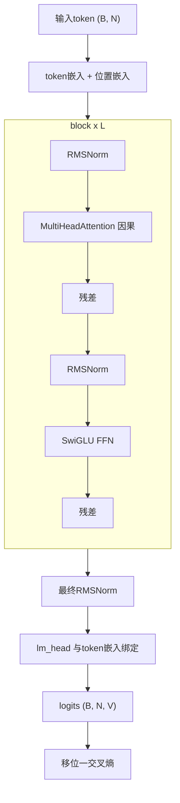

# 从零构建Transformer — 毕业项目

> 十三节课。一个模型。没有捷径。

**类型:** 构建
**语言:** Python
**前置知识:** 阶段7 · 01到13。不要跳过。
**预计时间:** ~120分钟

## 问题所在

你已经读了每篇论文。你已经实现了注意力、多头拆分、位置编码、编码器和解码器块、BERT和GPT损失、MoE、KV缓存。现在让它们在一个真实任务上协同工作。

毕业项目:在字符级语言建模任务上端到端训练一个小型仅解码器transformer。它读莎士比亚。它生成新的莎士比亚。它足够小,可以在笔记本上10分钟内训练。它足够正确,换入更大的数据集和更长的训练就能得到真正的LM。

这是课程的"nanoGPT"。它不是原创的——Karpathy 2023年的nanoGPT教程是每个学生至少写一次的参考实现。我们借用其形状,围绕我们覆盖的内容重新调整。

## 核心概念

架构,标注:



### 我们交付什么

- `GPTConfig` — 一个地方配置所有超参数。
- `MultiHeadAttention` — 因果,批量,带可选Flash风格路径(PyTorch的 `scaled_dot_product_attention`)。
- `SwiGLUFFN` — 现代FFN。
- `Block` — pre-norm,残差包裹的注意力 + FFN。
- `GPT` — 嵌入,堆叠块, LM头, generate()。
- 训练循环,使用AdamW, 余弦LR, 梯度裁剪。
- Shakespeare文本上的字符级分词器。

### 我们不交付什么

- RoPE — 在第04课概念上实现。这里我们使用学习的位置嵌入以求简单。练习要求你替换为RoPE。
- 生成期间的KV缓存 — 每个生成步骤重新计算对完整前缀的注意力。更慢但更简单。练习要求你添加KV缓存。
- Flash Attention — PyTorch 2.0+在输入匹配时自动调度;我们使用 `F.scaled_dot_product_attention`。
- MoE — 每块单个FFN。你在第11课见过MoE。

### 目标指标

在Mac M2笔记本上,4层,4头, d_model=128的GPT在 `tinyshakespeare.txt` 上训练2,000步:

- 训练损失从约4.2(随机)收敛到约1.5,大约6分钟。
- 采样输出看起来像莎士比亚:古词、换行、"ROMEO:"等专有名词出现。
- 验证损失(保留最后10%文本)紧跟训练损失;在此大小/预算下没有过拟合。

## 动手构建

本课使用PyTorch。安装 `torch`(CPU版本即可)。参见 `code/main.py`。脚本处理:

- 如果缺失则下载 `tinyshakespeare.txt`(或读取本地副本)。
- 字节级字符分词器。
- 90/10训练/验证拆分。
- 带bf16自动转换的训练循环(在支持的硬件上)。
- 训练完成后采样。

### 步骤1:数据

```python
text = open("tinyshakespeare.txt").read()
chars = sorted(set(text))
stoi = {c: i for i, c in enumerate(chars)}
itos = {i: c for c, i in stoi.items()}
encode = lambda s: [stoi[c] for c in s]
decode = lambda xs: "".join(itos[x] for x in xs)
```

65个唯一字符。微型词汇表。适合4字节vocab_size。没有BPE,没有分词器麻烦。

### 步骤2:模型

参见 `code/main.py`。块是第05课的教科书——pre-norm, RMSNorm, SwiGLU, 因果MHA。4/4/128的参数量:约800K。

### 步骤3:训练循环

获取随机批量的长度256 token窗口。前向。移位一交叉熵。反向。AdamW步。日志。重复。

```python
for step in range(max_steps):
    x, y = get_batch("train")
    logits = model(x)
    loss = F.cross_entropy(logits.view(-1, vocab_size), y.view(-1))
    loss.backward()
    torch.nn.utils.clip_grad_norm_(model.parameters(), 1.0)
    opt.step()
    opt.zero_grad()
```

### 步骤4:采样

给定提示,重复前向,从top-p logits采样,追加,继续。500个token后停止。

### 步骤5:阅读输出

2,000步后:

```
ROMEO:
Away and mild will not thy friend, that thou shalt wit:
The chief that well shame and hath been his friends,
...
```

不是莎士比亚。但莎士比亚形。约800K参数和笔记本6分钟的明显胜利。

## 实际应用

这个毕业项目是参考架构。三个扩展使其成为真实的东西:

1. **替换分词器。** 使用BPE(如 `tiktoken.get_encoding("cl100k_base")`)。词汇大小从65跳到约50,000。模型容量需要相应扩展。
2. **在更大的语料上训练。** 使用 `OpenWebText` 或 `fineweb-edu`(HuggingFace)。10B token在单个A100上125M参数GPT约需24小时。
3. **添加RoPE + KV缓存 + Flash Attention。** 下面的练习引导你完成每个。

这最终成为125M参数的GPT,生成流利的英语。不是前沿模型。但相同的代码路径——只是更大——是Karpathy、EleutherAI和Allen研究所在2026年训练研究检查点使用的。

## 交付成果

参见 `outputs/skill-transformer-review.md`。该技能根据前13课的所有内容审查从零构建的transformer实现的正确性。

## 练习

1. **简单。** 运行 `code/main.py`。验证你训练模型的最终步验证损失在2.0以下。将 `max_steps` 从2,000改为5,000 — 验证损失是否继续改善?
2. **中等。** 用RoPE替换学习的位置嵌入。在 `MultiHeadAttention` 内部对Q和K应用旋转。训练并验证验证损失至少一样低。
3. **中等。** 在采样循环中实现KV缓存。有缓存和无缓存生成500个token。笔记本上挂钟应改善5-20倍。
4. **困难。** 为模型添加第二个头,预测下下个token(MTP — 来自DeepSeek-V3的多token预测)。联合训练。是否有帮助?
5. **困难。** 用4专家MoE替换每块的单个FFN。路由器 + top-2路由。看验证损失在匹配活跃参数下如何变化。

## 关键术语

| 术语            | 人们怎么说           | 实际含义                                                    |
| --------------- | -------------------- | ----------------------------------------------------------- |
| nanoGPT         | "Karpathy的教程仓库" | 最小仅解码器transformer训练代码,约300行;规范参考。          |
| tinyshakespeare | "标准玩具语料"       | 约1.1 MB文本;2015年以来每个字符LM教程都使用它。             |
| 绑定嵌入        | "共享输入/输出矩阵"  | LM头权重 = token嵌入矩阵的转置;节省参数,改善质量。          |
| bf16自动转换    | "训练精度技巧"       | 在bf16中运行前向/反向,保持优化器状态在fp32;2021年以来标准。 |
| 梯度裁剪        | "阻止尖峰"           | 将全局梯度范数上限设为1.0;防止训练爆炸。                    |
| 余弦LR调度      | "2020+默认"          | LR线性预热然后余弦衰减到峰值的10%。                         |
| MFU             | "模型FLOP利用率"     | 实际FLOPs / 理论峰值;2026年40%稠密, 30% MoE是强的。         |
| 验证损失        | "保留损失"           | 模型从未见过的数据上的交叉熵;过拟合检测器。                 |

## 延伸阅读

- [The Annotated Transformer (Harvard NLP)](https://nlp.seas.harvard.edu/annotated-transformer/) — 经典注释实现。
