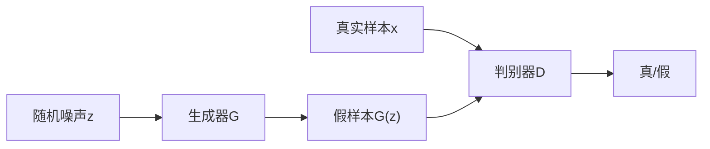

## 1. 生成模型概述

生成模型学习数据的**分布** $P(\mathbf{x})$，从而能够生成新的样本。

### 1.1 分类

| 类型         | 方法                     | 代表      |
| :----------- | :----------------------- | :-------- |
| 显式密度模型 | 直接建模 $P(\mathbf{x})$ | VAE、Flow |
| 隐式密度模型 | 不显式建模分布           | GAN       |
| 得分模型     | 学习得分函数             | Diffusion |

## 2. GAN（生成对抗网络）

### 2.1 基本原理

GAN 由**生成器**和**判别器**对抗训练：

$$\min_G \max_D V(D, G) = \mathbb{E}_{\mathbf{x} \sim p_{data}}[\log D(\mathbf{x})] + \mathbb{E}_{\mathbf{z} \sim p_z}[\log(1 - D(G(\mathbf{z})))]$$



### 2.2 训练过程

```
交替训练:
1. 固定G，训练D: 区分真假样本
   D_loss = -E[log D(x)] - E[log(1 - D(G(z)))]

2. 固定D，训练G: 生成更逼真的样本
   G_loss = -E[log D(G(z))]  (非饱和损失)
```

### 2.3 理论保证

**最优判别器**：

$$D^*(\mathbf{x}) = \frac{p_{data}(\mathbf{x})}{p_{data}(\mathbf{x}) + p_g(\mathbf{x})}$$

**全局最优**：当 $p_g = p_{data}$ 时，$D^*(\mathbf{x}) = 0.5$

### 2.4 GAN变体

| 变体     | 改进            | 说明           |
| :------- | :-------------- | :------------- |
| DCGAN    | 卷积架构        | 稳定训练       |
| WGAN     | Wasserstein距离 | 解决模式崩溃   |
| CGAN     | 条件生成        | 控制生成内容   |
| CycleGAN | 循环一致性      | 无配对图像转换 |
| StyleGAN | 风格控制        | 高质量人脸生成 |
| SAGAN    | 自注意力        | 全局一致性     |

**WGAN**：用Wasserstein距离替代JS散度：

$$W(p_{data}, p_g) = \sup_{\|f\|_L \leq 1} \mathbb{E}_{\mathbf{x} \sim p_{data}}[f(\mathbf{x})] - \mathbb{E}_{\mathbf{x} \sim p_g}[f(\mathbf{x})]$$

### 2.5 GAN训练问题

| 问题       | 原因            | 解决方案            |
| :--------- | :-------------- | :------------------ |
| 模式崩溃   | G只生成少数样本 | WGAN、Minibatch判别 |
| 训练不稳定 | D和G能力不匹配  | 谱归一化、梯度惩罚  |
| 评估困难   | 无显式似然      | FID、IS指标         |

## 3. VAE（变分自编码器）

### 3.1 基本原理

VAE 通过**编码器-解码器**结构学习数据的潜在表示：

$$\text{编码器}: q_\phi(\mathbf{z}|\mathbf{x}) \approx p(\mathbf{z}|\mathbf{x})$$
$$\text{解码器}: p_\theta(\mathbf{x}|\mathbf{z})$$

### 3.2 损失函数（ELBO）

$$\mathcal{L}(\theta, \phi) = \mathbb{E}_{q_\phi(\mathbf{z}|\mathbf{x})}[\log p_\theta(\mathbf{x}|\mathbf{z})] - D_{KL}(q_\phi(\mathbf{z}|\mathbf{x}) \| p(\mathbf{z}))$$

| 项 | 含义 | 作用 |
| :------- | :------------------------------------ | :--------------------- | -------- |
| 重建项 | $\mathbb{E}[\log p\_\theta(\mathbf{x} | \mathbf{z})]$ | 重建质量 |
| KL散度项 | $D_{KL}(q_\phi \| p)$ | 正则化，使后验接近先验 |

### 3.3 重参数化技巧

直接从 $q_\phi(\mathbf{z}|\mathbf{x})$ 采样不可微，使用重参数化：

$$\mathbf{z} = \boldsymbol{\mu} + \boldsymbol{\sigma} \odot \boldsymbol{\epsilon}, \quad \boldsymbol{\epsilon} \sim \mathcal{N}(0, \mathbf{I})$$

### 3.4 VAE vs GAN

| 维度       | VAE    | GAN            |
| :--------- | :----- | :------------- |
| 训练稳定性 | 稳定   | 不稳定         |
| 生成质量   | 较模糊 | 较清晰         |
| 似然估计   | 有     | 无             |
| 潜在空间   | 有结构 | 无结构         |
| 模式覆盖   | 好     | 差（模式崩溃） |

## 4. Diffusion Model（扩散模型）

### 4.1 基本原理

扩散模型包含**前向扩散**和**反向去噪**两个过程：

**前向过程**（加噪）：

$$q(\mathbf{x}_t | \mathbf{x}_{t-1}) = \mathcal{N}(\mathbf{x}_t; \sqrt{1-\beta_t}\mathbf{x}_{t-1}, \beta_t\mathbf{I})$$

任意时刻的分布：

$$q(\mathbf{x}_t | \mathbf{x}_0) = \mathcal{N}(\mathbf{x}_t; \sqrt{\bar{\alpha}_t}\mathbf{x}_0, (1-\bar{\alpha}_t)\mathbf{I})$$

其中 $\bar{\alpha}_t = \prod_{s=1}^{t}(1-\beta_s)$。

**反向过程**（去噪）：

$$p_\theta(\mathbf{x}_{t-1} | \mathbf{x}_t) = \mathcal{N}(\mathbf{x}_{t-1}; \boldsymbol{\mu}_\theta(\mathbf{x}_t, t), \sigma_t^2\mathbf{I})$$

### 4.2 训练目标

简化后的损失函数：

$$\mathcal{L}_{simple} = \mathbb{E}_{t, \mathbf{x}_0, \boldsymbol{\epsilon}}\left[\|\boldsymbol{\epsilon} - \boldsymbol{\epsilon}_\theta(\mathbf{x}_t, t)\|^2\right]$$

模型学习预测添加的噪声 $\boldsymbol{\epsilon}$。

### 4.3 采样方法

| 方法       | 步数    | 质量 |
| :--------- | :------ | :--- |
| DDPM       | 1000步  | 高   |
| DDIM       | 20~50步 | 高   |
| DPM-Solver | 10~20步 | 高   |
| LCM        | 1~4步   | 中   |

### 4.4 条件生成

**Classifier-Free Guidance**：

$$\hat{\boldsymbol{\epsilon}}_\theta = (1+w)\boldsymbol{\epsilon}_\theta(\mathbf{x}_t, t, \mathbf{c}) - w\boldsymbol{\epsilon}_\theta(\mathbf{x}_t, t, \emptyset)$$

- $w$ 为引导强度
- $w$ 越大，生成结果越符合条件但多样性降低

### 4.5 代表模型

| 模型             | 领域 | 特点         |
| :--------------- | :--- | :----------- |
| DDPM             | 图像 | 开创性工作   |
| Stable Diffusion | 图像 | 潜在空间扩散 |
| DALL-E 2/3       | 图像 | 文本到图像   |
| Sora             | 视频 | 视频生成     |
| AudioLDM         | 音频 | 音频生成     |

## 5. 生成模型对比

| 维度       | GAN | VAE        | Diffusion |
| :--------- | :-- | :--------- | :-------- |
| 生成质量   | 高  | 中         | 最高      |
| 多样性     | 低  | 高         | 高        |
| 训练稳定性 | 差  | 好         | 好        |
| 采样速度   | 快  | 快         | 慢        |
| 似然估计   | 无  | 有（下界） | 有        |
| 可控性     | 中  | 中         | 高        |
