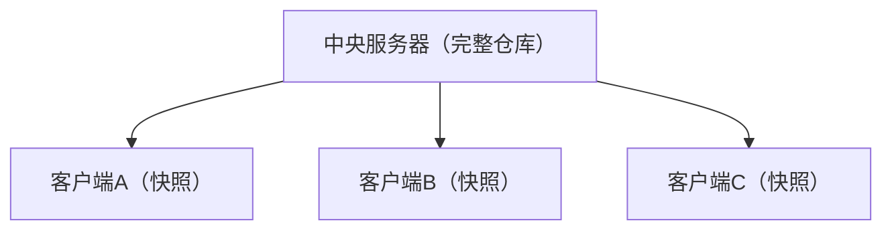
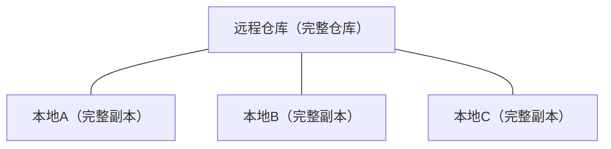

## 1. 分布式架构

### 1.1 集中式 vs 分布式

**集中式版本控制（CVCS）**：



- 所有操作必须联网
- 中央服务器是单点故障
- 分支和标签是服务器端概念

**分布式版本控制（DVCS）**：



- 每个克隆都是完整仓库
- 离线可执行所有操作
- 无单点故障

### 1.2 分布式的优势

| 特性           | 集中式       | 分布式     |
| :------------- | :----------- | :--------- |
| **离线工作**   | 不支持       | 完全支持   |
| **分支速度**   | 慢           | 极快       |
| **数据安全**   | 依赖服务器   | 多副本冗余 |
| **协作灵活性** | 中心化       | 多中心     |
| **大规模项目** | 服务器压力大 | 负载分散   |

## 2. 快照与差异

### 2.1 存储模型

Git 不存储文件的**差异**，而是存储文件的**快照**：

- **版本1**：文件 A、B、C 均有完整快照
- **版本2**：B 发生变更，存储 B 的新快照；A 和 C 未变更，通过链接指向版本1的快照
- **版本3**：C 发生变更，存储 C 的新快照；A 和 B' 未变更，通过链接指向之前对应快照

核心机制：未变更的文件不会重复存储，而是通过链接引用之前的快照，从而实现高效去重。

### 2.2 内容寻址存储

Git 使用 **SHA-1 哈希**作为内容的地址：

$$
\text{SHA-1}(\text{content}) = \text{40位十六进制哈希值}
$$

```bash
# 计算文件的 Git 哈希
echo "hello" | git hash-object --stdin
# ce013625030ba8dba906f756967f9e9ca394464a
```

相同内容 → 相同哈希 → 只存储一次（去重）

## 3. 数据完整性

### 3.1 哈希校验

Git 中的每个对象都通过 SHA-1 哈希校验：

blob、tree、commit 三类对象均通过 SHA-1 哈希唯一标识。

任何数据损坏都会被检测到，因为：

- 修改文件内容 → 哈希变化 → blob 对象变化
- 修改目录结构 → tree 哈希变化 → 上层 tree 变化
- 修改提交 → commit 哈希变化 → 后续所有 commit 变化

### 3.2 不可篡改性

Git 的数据模型保证了**历史不可篡改**：

修改任何一个对象会导致其哈希变化，进而使整条哈希链断裂，后续所有提交的哈希都会失效，从而保证历史记录不可篡改。

## 4. 协作模型

### 4.1 同步模型


| 操作      | 方向            | 命令        |
| :-------- | :-------------- | :---------- |
| **fetch** | 远程 → 本地     | `git fetch` |
| **pull**  | 远程 → 工作区   | `git pull`  |
| **push**  | 本地 → 远程     | `git push`  |
| **clone** | 远程 → 完整本地 | `git clone` |

### 4.2 多远程协作

```bash
# 添加多个远程仓库
git remote add origin git@github.com:user/repo.git
git remote add mirror git@gitlab.com:user/repo.git
git remote add upstream git@github.com:original/repo.git

# 从上游同步
git fetch upstream
git merge upstream/main

# 推送到多个远程
git push origin main
git push mirror main
```

### 4.3 去中心化协作

Git 理论上支持**点对点协作**，无需中央服务器：

```bash
# 两个人直接交换补丁
git format-patch -1 HEAD       # 生成补丁文件
git apply < 0001-feature.patch # 应用补丁

# 或通过 bundle 交换
git bundle create repo.bundle --all
git clone repo.bundle cloned-repo
```

## 5. Git 的性能

### 5.1 本地操作的速度

几乎所有 Git 操作都是**本地操作**，不依赖网络：

| 操作         | 数据来源 | 速度           |
| :----------- | :------- | :------------- |
| `git log`    | 本地     | 毫秒级         |
| `git diff`   | 本地     | 毫秒级         |
| `git branch` | 本地     | 微秒级         |
| `git commit` | 本地     | 毫秒级         |
| `git push`   | 网络     | 秒级           |
| `git clone`  | 网络     | 取决于仓库大小 |

### 5.2 压缩存储

Git 使用 zlib 压缩存储对象：

```bash
# 查看仓库大小
du -sh .git

# 查看对象数量
git count-objects -v

# 手动压缩
git gc --aggressive
```

## 6. 与其他 DVCS 对比

| 特性           | Git             | Mercurial  | Bazaar    |
| :------------- | :-------------- | :--------- | :-------- |
| **分支模型**   | 轻量指针        | 命名分支   | 目录分支  |
| **存储效率**   | 高（去重+压缩） | 中等       | 中等      |
| **学习曲线**   | 较陡            | 较平       | 平缓      |
| **大文件支持** | Git LFS         | 大文件扩展 | 原生      |
| **社区规模**   | 最大            | 中等       | 小        |
| **平台支持**   | GitHub/GitLab   | Bitbucket  | Launchpad |
