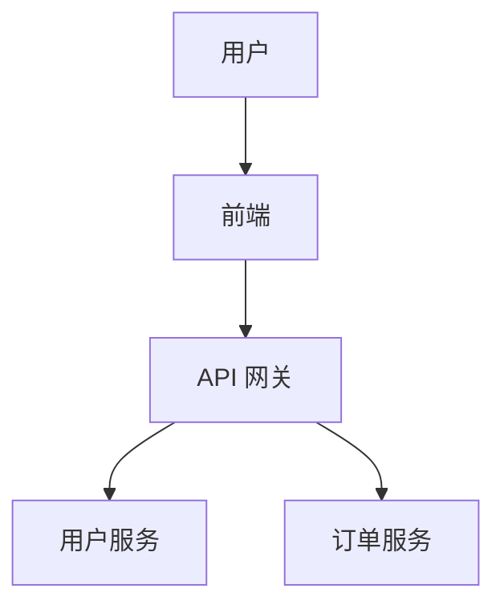

## 1. README 概述

### 1.1 为什么 README 很重要

README 是项目的**门面**，是访客看到的第一份文档。一个好的 README 可以：

- 让访客在 30 秒内理解项目
- 降低新贡献者的上手门槛
- 提高项目的可发现性和可信度

### 1.2 README 的核心要素

| 要素               | 优先级 | 说明                   |
| :----------------- | :----- | :--------------------- |
| **项目名称与描述** | 必须   | 一句话说清楚项目是什么 |
| **安装说明**       | 必须   | 如何安装和运行         |
| **使用示例**       | 必须   | 快速上手代码           |
| **许可证**         | 必须   | 开源协议               |
| **徽章**           | 推荐   | 状态一览               |
| **贡献指南**       | 推荐   | 如何参与               |
| **常见问题**       | 可选   | FAQ                    |

## 2. README 结构模板

```markdown
# 项目名称


简短的项目描述，一句话说明项目做什么。

## 功能特性

- 功能一：简短描述
- 功能二：简短描述
- 功能三：简短描述

## 快速开始

### 安装

\`\`\`bash
npm install my-project
\`\`\`

### 使用

\`\`\`javascript
import { createApp } from 'my-project';

const app = createApp({
target: '#app',
props: { title: 'Hello' }
});
\`\`\`

## 文档

完整文档请访问 [docs.example.com](https://docs.example.com)

## 开发

\`\`\`bash
git clone https://github.com/user/repo.git
cd repo
npm install
npm run dev
\`\`\`

## 贡献

欢迎贡献！请阅读 [贡献指南](CONTRIBUTING.md)

## 许可证

[MIT](LICENSE)
```

## 3. 徽章（Badges）

### 3.1 常用徽章

```markdown


```

### 3.2 自定义徽章

```markdown


```

## 4. 视觉元素

### 4.1 截图和 GIF

```markdown
## 预览


<details>
<summary>更多截图</summary>


</details>
```

### 4.2 架构图

使用 Mermaid 绘制架构图：

````markdown

````

## 5. 最佳实践

- README 控制在 200 行以内，详细内容放 Wiki
- 代码示例要**可运行**
- 安装步骤要**完整**，包括前置依赖
- 使用目录导航长文档
- 定期更新 README 与代码保持同步
