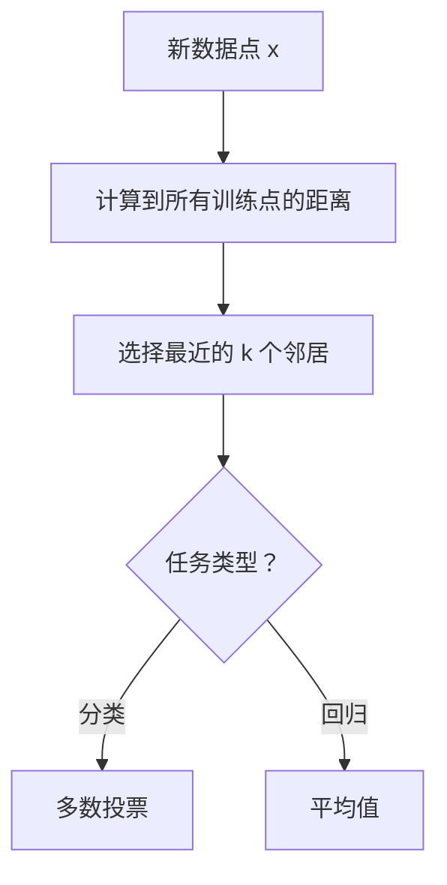

# KNN与距离度量

> K近邻算法通过找最近的邻居来分类。距离度量的选择决定了什么是"近"。

**类型:** 构建
**语言:** Python
**前置条件:** Phase 2 第1课
**时间:** ~60 分钟

## 学习目标

- 从零实现K近邻分类和回归，包括多种距离度量
- 解释为什么特征缩放对KNN至关重要，以及不同距离度量如何影响结果
- 分析k值如何控制偏差-方差权衡
- 使用交叉验证选择最优k值

## 问题

你想根据一个人的特征预测他是否会喜欢一部电影。你有一个用户数据库，知道每个人的特征和喜好。最简单的方法：找到特征最相似的k个用户，看他们是否喜欢这部电影。多数决定。

这就是K近邻算法。它不做任何训练。它只是存储所有数据，在预测时搜索最近的邻居。这种"懒惰学习"方法简单但出奇地有效。

## 概念

### KNN算法



**分类**：k个邻居中多数类别
**回归**：k个邻居目标值的平均值

### 距离度量

距离度量定义了"近"的含义。不同度量给出不同结果。

**欧氏距离**（L2）：

```
d(x, z) = sqrt(sum((x_i - z_i)^2))
```

直线距离。最常用。对异常值敏感（平方放大差异）。

**曼哈顿距离**（L1）：

```
d(x, z) = sum(|x_i - z_i|)
```

城市街区距离。沿轴移动。对异常值更鲁棒。

**闵可夫斯基距离**（泛化）：

```
d(x, z) = (sum(|x_i - z_i|^p))^(1/p)
```

p=1是曼哈顿，p=2是欧氏。p越大越关注最大差异维度。

**余弦距离**：

```
d(x, z) = 1 - (x·z) / (||x|| * ||z||)
```

衡量方向差异而非大小。常用于文本和推荐系统。

### 为什么特征缩放至关重要

KNN基于距离做决策。如果一个特征范围是0-1，另一个是0-1,000,000，大范围特征完全主导距离计算。解决方案：训练前标准化所有特征。

### k值选择

k控制偏差-方差权衡：

| k值  | 偏差 | 方差 | 行为                 |
| ---- | ---- | ---- | -------------------- |
| k=1  | 低   | 高   | 记忆训练数据，过拟合 |
| k=小 | 低   | 高   | 复杂决策边界         |
| k=大 | 高   | 低   | 平滑决策边界，欠拟合 |
| k=N  | 最高 | 最低 | 总是预测多数类       |

最优k通常通过交叉验证找到。典型范围：3到20，奇数避免平票。

### 加权KNN

标准KNN对所有k个邻居同等对待。加权KNN给更近的邻居更大权重：

```
weight_i = 1 / d(x, x_i)^2
```

这减少了k值选择的影响，因为最近的邻居总是最有影响力。

## 动手构建

```python
import random
import math
from collections import Counter

class KNN:
    def __init__(self, k=5, distance='euclidean', weighted=False):
        self.k = k
        self.distance = distance
        self.weighted = weighted
        self.X_train = None
        self.y_train = None

    def _distance(self, x1, x2):
        if self.distance == 'euclidean':
            return math.sqrt(sum((a - b) ** 2 for a, b in zip(x1, x2)))
        elif self.distance == 'manhattan':
            return sum(abs(a - b) for a, b in zip(x1, x2))
        elif self.distance == 'cosine':
            dot = sum(a * b for a, b in zip(x1, x2))
            norm1 = math.sqrt(sum(a ** 2 for a in x1))
            norm2 = math.sqrt(sum(b ** 2 for b in x2))
            if norm1 == 0 or norm2 == 0:
                return 1.0
            return 1 - dot / (norm1 * norm2)

    def fit(self, X, y):
        self.X_train = X
        self.y_train = y
        return self

    def predict(self, X):
        return [self._predict_one(x) for x in X]

    def _predict_one(self, x):
        distances = [(self._distance(x, xt), yt) for xt, yt in zip(self.X_train, self.y_train)]
        distances.sort(key=lambda d: d[0])
        neighbors = distances[:self.k]

        if self.weighted:
            weights = {}
            for dist, label in neighbors:
                w = 1 / (dist ** 2 + 1e-10)
                weights[label] = weights.get(label, 0) + w
            return max(weights, key=weights.get)
        else:
            labels = [label for _, label in neighbors]
            return Counter(labels).most_common(1)[0][0]

    def accuracy(self, X, y):
        preds = self.predict(X)
        return sum(p == t for p, t in zip(preds, y)) / len(y)


def standardize(X):
    n_features = len(X[0])
    means = [sum(X[i][j] for i in range(len(X))) / len(X) for j in range(n_features)]
    stds = []
    for j in range(n_features):
        var = sum((X[i][j] - means[j]) ** 2 for i in range(len(X))) / len(X)
        stds.append(var ** 0.5 if var > 0 else 1)
    return [[(X[i][j] - means[j]) / stds[j] for j in range(n_features)] for i in range(len(X))]


random.seed(42)
N = 300
X = []
y = []
for _ in range(N // 3):
    X.append([random.gauss(0, 1), random.gauss(0, 1)])
    y.append(0)
for _ in range(N // 3):
    X.append([random.gauss(3, 1), random.gauss(0, 1)])
    y.append(1)
for _ in range(N // 3):
    X.append([random.gauss(1.5, 1), random.gauss(3, 1)])
    y.append(2)

X = standardize(X)
split = int(0.8 * N)
X_train, X_test = X[:split], X[split:]
y_train, y_test = y[:split], y[split:]

print("=== KNN with different k values ===")
for k in [1, 3, 5, 11, 21]:
    knn = KNN(k=k, distance='euclidean')
    knn.fit(X_train, y_train)
    print(f"  k={k:2d}: Train={knn.accuracy(X_train, y_train):.4f}, Test={knn.accuracy(X_test, y_test):.4f}")

print("\n=== KNN with different distance metrics ===")
for dist in ['euclidean', 'manhattan', 'cosine']:
    knn = KNN(k=5, distance=dist)
    knn.fit(X_train, y_train)
    print(f"  {dist:12s}: Test={knn.accuracy(X_test, y_test):.4f}")

print("\n=== Weighted KNN ===")
knn_w = KNN(k=5, distance='euclidean', weighted=True)
knn_w.fit(X_train, y_train)
print(f"  Weighted k=5: Test={knn_w.accuracy(X_test, y_test):.4f}")
```

## 实际使用

```python
from sklearn.neighbors import KNeighborsClassifier
from sklearn.model_selection import cross_val_score
from sklearn.preprocessing import StandardScaler
from sklearn.datasets import load_iris
from sklearn.model_selection import train_test_split
import numpy as np

iris = load_iris()
X_tr, X_te, y_tr, y_te = train_test_split(iris.data, iris.target, test_size=0.3, random_state=42)

scaler = StandardScaler()
X_tr_sc = scaler.fit_transform(X_tr)
X_te_sc = scaler.transform(X_te)

knn = KNeighborsClassifier(n_neighbors=5, metric='euclidean')
knn.fit(X_tr_sc, y_tr)
print(f"KNN accuracy: {knn.score(X_te_sc, y_te):.4f}")

print("\nCross-validation for k selection:")
for k in range(1, 21):
    knn_cv = KNeighborsClassifier(n_neighbors=k)
    scores = cross_val_score(knn_cv, X_tr_sc, y_tr, cv=5)
    print(f"  k={k:2d}: CV accuracy = {scores.mean():.4f} (+/- {scores.std():.4f})")
```

## 练习

1. 在未标准化的数据上运行KNN，然后比较标准化后的结果。展示准确率差异。
2. 实现KNN回归（预测邻居目标值的平均值）。在回归数据集上测试。
3. 实现留一交叉验证(LOOCV)来选择最优k。与5折交叉验证比较计算时间。

## 关键术语

| 术语       | 人们怎么说        | 实际含义                                      |
| ---------- | ----------------- | --------------------------------------------- |
| K近邻      | "问最近的k个朋友" | 基于k个最近训练样本的多数投票或平均值进行预测 |
| 欧氏距离   | "直线距离"        | L2范数，两点间最短路径                        |
| 曼哈顿距离 | "城市街区距离"    | L1范数，沿坐标轴的距离之和                    |
| 余弦距离   | "方向差异"        | 衡量向量方向而非大小的差异                    |
| 懒惰学习   | "不训练"          | 不在训练时构建模型，所有计算推迟到预测时      |
| 特征缩放   | "统一尺度"        | 将特征变换到相似范围，防止大范围特征主导距离  |
