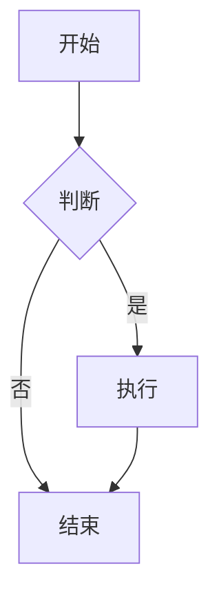
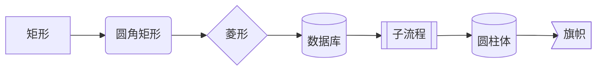
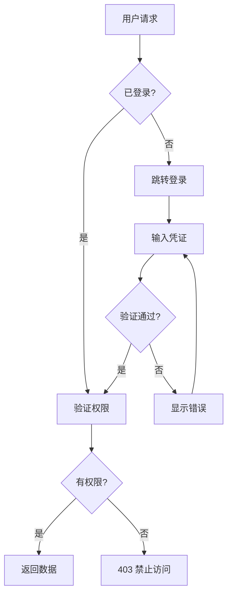
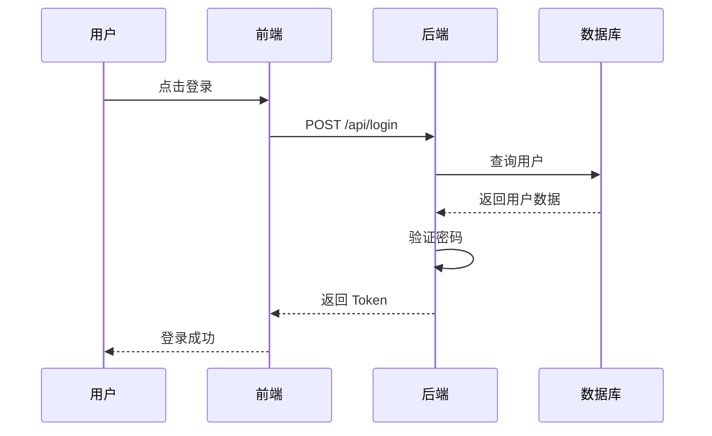
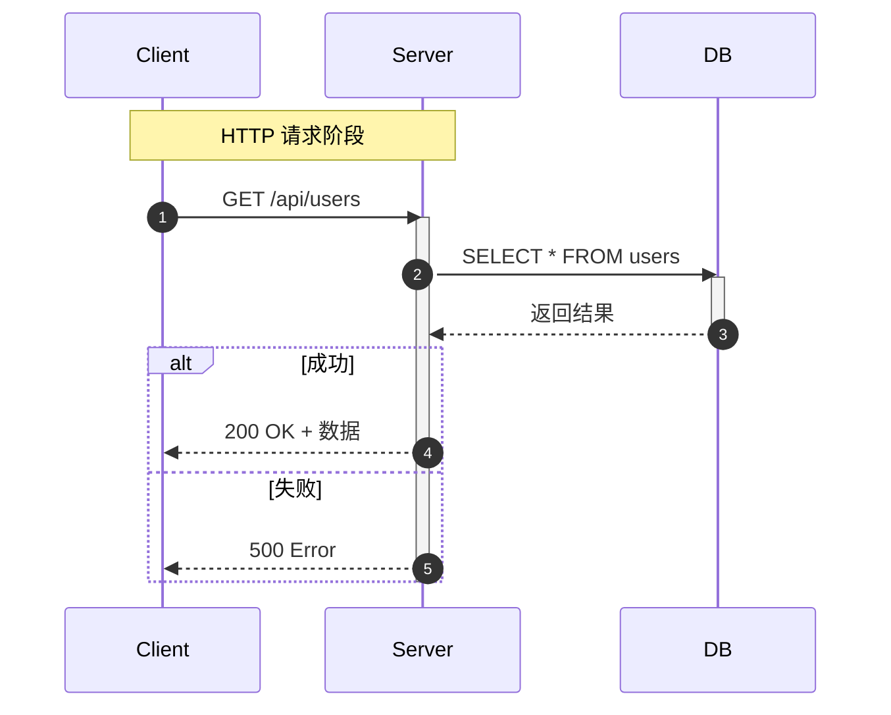
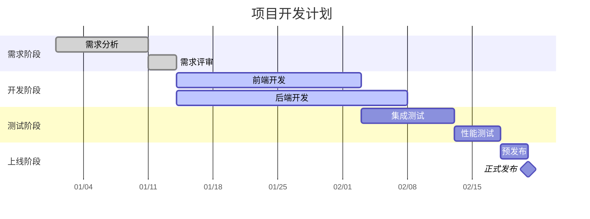
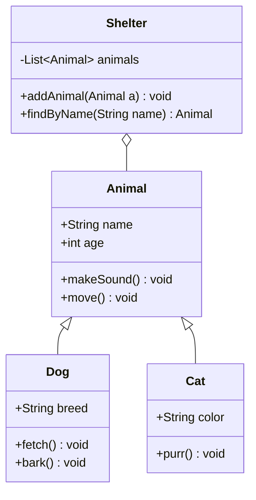
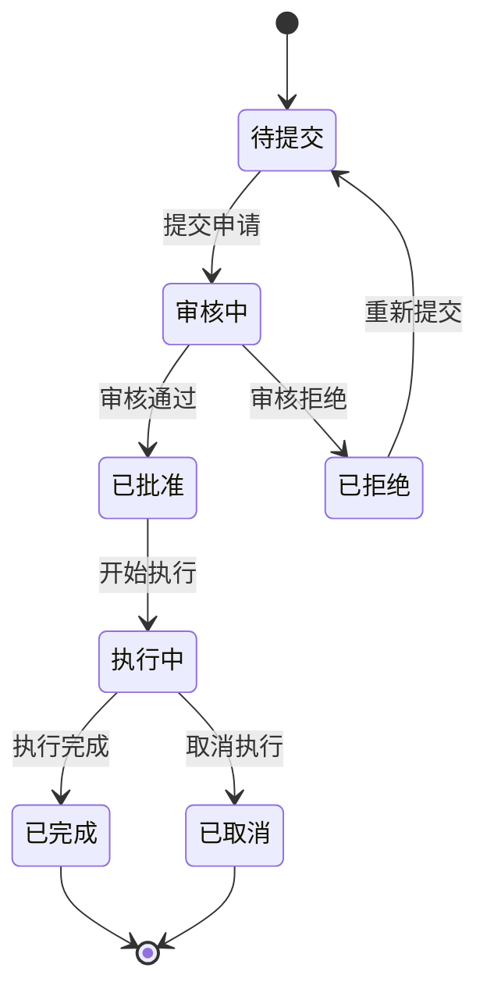
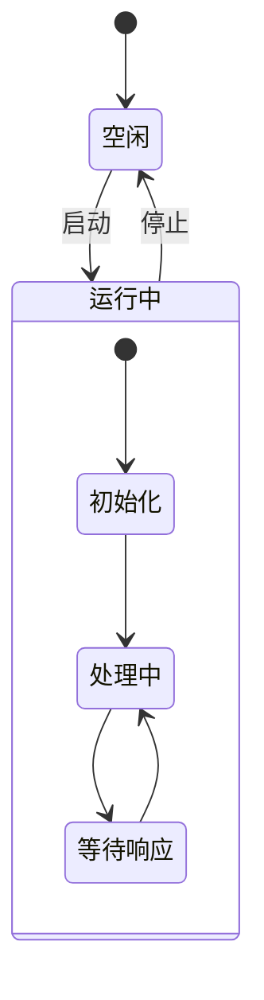

## 1. Mermaid 概述

### 1.1 什么是 Mermaid

Mermaid 是一种基于文本的图表描述语言，允许在 Markdown 中使用代码块创建图表。它将图表定义从图形编辑器转移到文本，使图表可以纳入版本控制。

### 1.2 基本语法

````markdown

````

### 1.3 支持的图表类型

| 图表类型     | 关键字            | 用途               |
| :----------- | :---------------- | :----------------- |
| **流程图**   | `graph`           | 算法流程、业务流程 |
| **时序图**   | `sequenceDiagram` | 交互流程、API 调用 |
| **甘特图**   | `gantt`           | 项目进度、任务排期 |
| **类图**     | `classDiagram`    | 面向对象设计       |
| **状态图**   | `stateDiagram-v2` | 状态机、生命周期   |
| **ER 图**    | `erDiagram`       | 数据库设计         |
| **饼图**     | `pie`             | 数据占比           |
| **思维导图** | `mindmap`         | 知识结构           |
| **Git 图**   | `gitGraph`        | 分支策略           |

## 2. 流程图

### 2.1 方向

| 关键字      | 方向     |
| :---------- | :------- |
| `TB` / `TD` | 从上到下 |
| `BT`        | 从下到上 |
| `LR`        | 从左到右 |
| `RL`        | 从右到左 |

### 2.2 节点形状



| 语法       | 形状     | 用途      |
| :--------- | :------- | :-------- |
| `[文本]`   | 矩形     | 普通步骤  |
| `(文本)`   | 圆角矩形 | 开始/结束 |
| `{文本}`   | 菱形     | 判断/条件 |
| `[(文本)]` | 圆柱体   | 数据库    |
| `[[文本]]` | 子流程   | 子过程    |
| `((文本))` | 圆形     | 连接点    |

### 2.3 连接线

| 语法 | 样式 | 说明 |
| :----- | :--------- | :-------- | ------ | -------- |
| `-->` | 实线箭头 | 默认连接 |
| `---` | 实线无箭头 | 无方向 |
| `-.->` | 虚线箭头 | 可选/条件 |
| `==>` | 粗线箭头 | 强调 |
| `-->   | 文本       | ` | 带标签 | 条件说明 |

### 2.4 完整示例



## 3. 时序图

### 3.1 基本语法



### 3.2 消息类型

| 语法   | 样式         | 说明      |
| :----- | :----------- | :-------- |
| `->>`  | 实线箭头     | 同步请求  |
| `-->>` | 虚线箭头     | 返回/响应 |
| `--)`  | 实线开放箭头 | 异步消息  |
| `--)`  | 虚线开放箭头 | 异步响应  |

### 3.3 高级特性



- `autonumber`：自动编号
- `Note over A,B`：跨参与者注释
- `activate`/`deactivate`：显示激活状态
- `alt`/`else`：条件分支
- `loop`：循环
- `opt`：可选

## 4. 甘特图

### 4.1 基本语法



### 4.2 任务状态

| 关键字      | 样式             | 说明           |
| :---------- | :--------------- | :------------- |
| `done`      | 已完成（灰色）   | 已完成的任务   |
| `active`    | 进行中（蓝色）   | 当前执行的任务 |
| （默认）    | 未开始（浅色）   | 待执行的任务   |
| `milestone` | 里程碑（菱形）   | 关键节点       |
| `crit`      | 关键路径（红色） | 必须按时完成   |

## 5. 类图

### 5.1 基本语法



### 5.2 关系类型

| 语法    | 关系         | 说明                 |
| :------ | :----------- | :------------------- |
| `<\|--` | 继承         | 子类继承父类         |
| `*\--`  | 组合         | 强拥有，生命周期一致 |
| `o--`   | 聚合         | 弱拥有，可独立存在   |
| `-->`   | 关联         | 单向引用             |
| `--`    | 关联（双向） | 双向引用             |
| `..>`   | 依赖         | 使用关系             |
| `..\|>` | 实现         | 接口实现             |

## 6. 状态图

### 6.1 基本语法



### 6.2 复合状态



## 7. 平台支持

| 平台           | Mermaid 支持 | 说明                |
| :------------- | :----------- | :------------------ |
| **GitHub**     |              | 原生支持            |
| **GitLab**     |              | 原生支持            |
| **Obsidian**   |              | 原生支持            |
| **Typora**     |              | 原生支持            |
| **Hugo**       |              | 需 shortcode 或插件 |
| **Jekyll**     |              | 需插件              |
| **CommonMark** |              | 不支持              |

## 8. 调试技巧

- 使用 [Mermaid Live Editor](https://mermaid.live/) 在线编辑和预览
- 语法错误时图表不渲染，检查控制台错误信息
- 节点 ID 不能包含空格，使用文本标签代替
- 中文文本在某些渲染器中可能需要引号包裹
