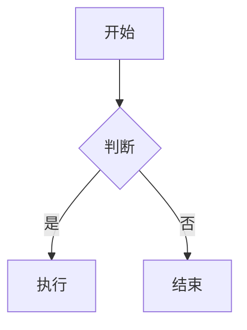
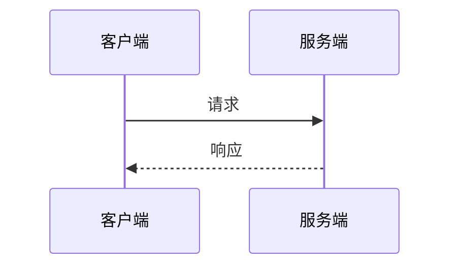
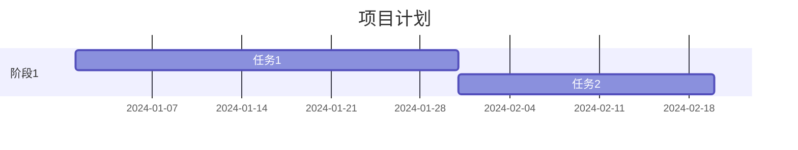
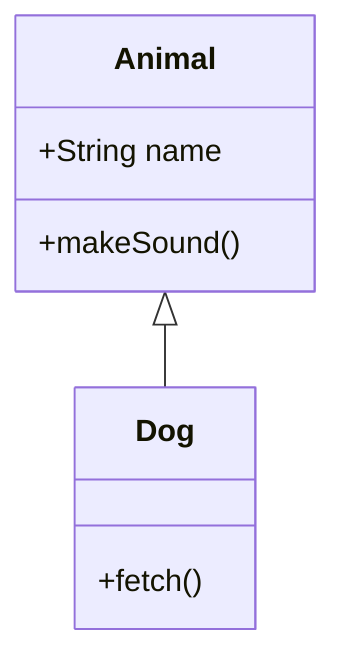

## 1. Markdown 概述

Markdown 是由 John Gruber 和 Aaron Swartz 于 2004 年创建的轻量级标记语言，使用简洁的纯文本语法编写格式化文档，可转换为 HTML、PDF 等格式。

### 1.1 Markdown 的特点

- **易读易写**：纯文本格式，即使不渲染也具有良好的可读性
- **轻量简洁**：语法极简，学习成本低
- **兼容 HTML**：可直接嵌入 HTML 标签，支持 PDF 导出
- **跨平台**：几乎所有文本编辑器都支持
- **广泛使用**：GitHub、Stack Overflow 等平台原生支持

### 1.2 Markdown 的应用场景

- **技术文档**：API 文档、开发手册
- **博客写作**：Markdown 原生支持的博客平台
- **项目说明**：README 文件
- **版本控制**：Git 提交信息、代码审查
- **协作平台**：GitHub、GitLab 的 Issue 和 Wiki

## 2. 标题

### 2.1 ATX 样式标题

使用 `#` 号表示标题级别，`#` 数量对应标题层级：

```markdown
# 一级标题

## 二级标题

### 三级标题

#### 四级标题

##### 五级标题

###### 六级标题
```

### 2.2 Setext 样式标题

- **Setext 风格**：使用 `=` 和 `-` 分别表示一级和二级标题

```markdown
# 一级标题

## 二级标题
```

## 3. 段落与换行

### 3.1 段落

段落之间使用空行分隔：

```markdown
这是第一段。

这是第二段。
```

### 3.2 换行

- 行末加两个空格 + Enter 可强制换行
- HTML 方式使用 `<br>` 标签

```markdown
第一行（行末两个空格）
第二行

或者使用 <br> 换行
```

## 4. 文本格式

### 4.1 加粗

使用 `**` 或 `__` 包裹文本：

```markdown
**加粗文本**
**加粗文本**
```

### 4.2 斜体

使用 `*` 或 `_` 包裹文本：

```markdown
_斜体文本_
_斜体文本_
```

### 4.3 加粗斜体

使用 `***` 或 `___` 包裹文本：

```markdown
**_加粗斜体_**
**_加粗斜体_**
```

### 4.4 删除线

使用 `~~` 包裹文本：

```markdown
~~删除线文本~~
```

### 4.5 行内代码

使用反引号 `` ` `` 包裹：

```markdown
`行内代码`
```

### 4.6 代码块

使用三个反引号包裹，可指定语言实现语法高亮：

````markdown
```java
public class HelloWorld {
  public static void main(String[] args) {
    System.out.println("Hello, World!");
  }
}
```
````

## 5. 列表

### 5.1 无序列表

使用 `-`、`*` 或 `+` 作为标记：

```markdown
- 项目 1
- 项目 2
- 项目 3

* 项目 A
* 项目 B
* 项目 C

- 项目 X
- 项目 Y
- 项目 Z
```

### 5.2 有序列表

使用数字加 `.` 标记：

```markdown
1. 第一项
2. 第二项
3. 第三项
```

### 5.3 嵌套列表

通过缩进实现嵌套：

```markdown
- 一级列表
  - 二级列表
  - 二级列表

1. 有序一级
   1. 有序二级
   1. 有序二级
```

## 6. 链接

### 6.1 行内链接

```markdown
[链接文字](URL '可选标题')
[Google](https://www.google.com 'Google 首页')
```

### 6.2 引用式链接

```markdown
[链接文字][引用ID]
[引用ID]: URL "可选标题"
[Google][1]
[1]: https://www.google.com "Google 首页"
```

### 6.3 自动链接

URL 和邮箱地址可直接转为链接：

```markdown
<https://www.google.com>
<example@example.com>
```

## 7. 图片

### 7.1 行内图片

```markdown


```

### 7.2 引用式图片

```markdown
![替代文字][引用ID]
[引用ID]: 图片URL "可选标题"
![示例][1]
[1]: https://example.com/image.jpg "示例图片"
```

## 8. 引用

### 8.1 基本引用

使用 `>` 标记：

```markdown
> 这是一段引用文本
```

### 8.2 嵌套引用

使用多个 `>` 实现嵌套：

```markdown
> 外层引用
>
> > 嵌套引用
> >
> > > 更深层引用
```

### 8.3 引用中的其他元素

引用中可包含标题、列表等：

```markdown
> #### 引用中的标题
>
> - 引用中的列表项 1
> - 引用中的列表项 2
```

## 9. 表格

### 9.1 基本表格

```markdown
| 列 1   |  列 2  |   列 3 |
| :----- | :----: | -----: |
| 左对齐 |  居中  | 右对齐 |
| 内容 1 | 内容 2 | 内容 3 |
```

### 9.2 对齐方式

- `:---` 左对齐
- `:---:` 居中对齐
- `---:` 右对齐

```markdown
| 左对齐 | 居中对齐 | 右对齐 |
| :----- | :------: | -----: |
| 内容 A |  内容 B  | 内容 C |
| 内容 D |  内容 E  | 内容 F |
```

## 10. 分隔线

使用 `-`、`*` 或 `_` 三个及以上创建分隔线：

```markdown
---
---

---
```

## 11. 转义字符

使用 `\` 转义 Markdown 特殊字符：

```markdown
\# 不是标题 \* 不是斜体
\` 不是代码
```

## 12. 任务列表

使用 `- [ ]` 和 `- [x]` 创建任务列表：

```markdown
- [x] 已完成任务
- [ ] 未完成任务
- [ ] 另一个未完成任务
```

## 13. 数学公式

### 13.1 行内公式

使用 `$` 包裹：

```markdown
行内公式 $E=mc^2$ 示例
```

### 13.2 块级公式

使用 `$$` 包裹：

```markdown
$$
E=mc^2
$$
```

## 14. 代码块（语法高亮）

指定语言可实现语法高亮：

````markdown
```java
public class HelloWorld {
  public static void main(String[] args) {
    System.out.println("Hello, World!");
  }
}
```
````

```python
def hello():
    print("Hello, World!")
```

## 15. 脚注

使用 `[^]` 标记脚注：

```markdown
正文中的脚注标记[^1]

[^1]: 这是脚注的内容
```

## 16. 定义列表

使用 `:` 定义术语：

```markdown
术语 1
: 定义 1

术语 2
: 定义 2
: 定义 3（同一术语多个定义）
```

## 17. 目录

Markdown 可自动生成目录：

```markdown
[TOC]
```

## 18. HTML 嵌入

Markdown 中可直接使用 HTML 标签：

```markdown
<div style="color: red;">红色文本</div>
<p>这是一段 HTML 段落</p>
```

## 19. 扩展语法

### 19.1 GitHub Flavored Markdown (GFM)

#### 任务列表

```markdown
- [x] 已完成
- [ ] 未完成
```

#### 围栏代码块

````markdown
```java
public class HelloWorld {
  public static void main(String[] args) {
    System.out.println("Hello, World!");
  }
}
```
````

#### 表格

```markdown
| 列 1 | 列 2 |
| :--- | :--- |
| 内容 | 内容 |
```

#### 自动链接

```markdown
https://www.github.com
```

#### Emoji

```markdown
:smile:
:+1:
```

### 19.2 其他扩展

- 上标 `^上标^`
- 下标 `~下标~`
- 高亮 `==高亮文本==`

## 20. 编辑器推荐

### 20.1 通用编辑器

- VS Code + Markdown 插件
- Typora（所见即所得）
- Sublime Text + Markdown 插件
- Atom + Markdown 插件
- StackEdit（在线编辑器）
- Dillinger（在线编辑器）

### 20.2 专用编辑器

- Markdown Editor
- Pandoc（格式转换工具）
- Markdownlint（语法检查工具）

### 20.3 在线工具

- StackEdit
- Dillinger
- Markdown Live Preview

## 21. 最佳实践

### 21.1 格式规范

保持一致的缩进和空行使用\

### 21.2 可读性优先

编写时优先考虑源码可读性\

### 21.3 兼容性考虑

注意不同解析器的兼容性差异\

### 21.4 版本控制友好

每行不超过 80 字符，便于 diff 比较\

## 22. 常见问题

### 22.1 常见错误

- 代码块未正确闭合
- 列表缩进不一致
- 链接/图片语法错误
- 表格分隔行格式不正确
- 空行缺失导致渲染异常

### 22.2 调试技巧

- 检查代码块的闭合标记
- 确认列表缩进使用空格而非 Tab
- 验证链接和图片的 URL 有效性
- 使用 Markdown 预览工具实时检查
- 注意不同 Markdown 解析器的差异

## 23. Markdown 扩展生态

### 23.1 GitHub Flavored Markdown (GFM)

#### 23.1.1 代码块行号高亮

````markdown
```javascript {1,3-5}
function hello() {
  console.log('Hello, World!');
  return 'Hello';
}
```
````

#### 23.1.2 Diff 语法

```diff
- 删除的行
+ 新增的行
```

#### 23.1.3 自动引用

```markdown
@username - 引用用户
#issue - 引用 Issue
#pull - 引用 Pull Request
commit SHA - 引用提交
```

#### 23.1.4 Emoji 简码

```markdown
:smile: - 笑脸
:+1: - 点赞
:heart: - 爱心
:rocket: - 火箭
```

### 23.2 Mermaid 图表

#### 23.2.1 流程图



#### 23.2.2 时序图



#### 23.2.3 甘特图



#### 23.2.4 类图



### 23.3 高级表格

#### 23.3.1 多行表格

```markdown
| 头部1 | 头部2        |
| :---- | :----------- |
| 内容1 | 多行<br>内容 |
| 内容2 | 多行<br>内容 |
```

#### 23.3.2 HTML 表格

> 适用于复杂表格布局

```markdown
<table>
<tr>
<th colspan="2">合并表头</th>
</tr>
<tr>
<td>单元格 1</td>
<td>单元格 2</td>
</tr>
</table>
```

### 23.4 提示框（Admonition）

#### 23.4.1 提示框类型

```markdown
::: tip
提示信息
:::
::: warning
警告信息
:::
::: danger
危险警告
:::
::: info
补充信息
:::
```

### 23.5 数学公式增强

#### 23.5.1 常用公式

- 行内公式：$E=mc^2$
- 希腊字母：$\alpha$, $\beta$, $\gamma$
- 上下标：$x^2$, $x_i$

#### 23.5.2 复杂公式

```markdown
$$
\int_{a}^{b} f(x) dx = F(b) - F(a)
$$

$$
\sum_{i=1}^{n} i = \frac{n(n+1)}{2}
$$
```

## 24. Markdown 与版本控制

### 24.1 Git 中的 Markdown

- 提交信息规范（Conventional Commits）
- PR/Issue 模板
- CHANGELOG 维护
- 代码审查中的 Markdown 注释

### 24.2 GitHub 中的 Markdown

- README.md 自动渲染
- Wiki 页面
- Issue 和 PR 描述
- GitHub Pages 博客

### 24.3 协作最佳实践

- 统一 Markdown 风格指南
- 使用 Markdownlint 检查
- 代码审查关注文档质量

## 25. Markdown 工具链

### 25.1 编辑器

#### 25.1.1 VS Code

- Markdown All in One 插件
- 预览功能
- 快捷键支持
- 代码片段

#### 25.1.2 Typora

- 所见即所得编辑
- 实时预览
- 主题自定义
- 导出多格式

### 25.2 转换工具

#### 25.2.1 Git Markdown

- GitBook CLI
- mdBook
- docsify
- Docusaurus

#### 25.2.2 GitHub

- GitHub Pages（Jekyll）
- GitHub Actions 自动部署
- Read the Docs 集成
- Netlify 部署

### 25.3 静态站点生成器

#### 25.3.1 Jekyll

- GitHub Pages 默认支持
- Liquid 模板引擎
- 插件生态丰富

#### 25.3.2 Hugo

- Go 语言编写，构建速度极快
- 主题系统灵活
- 多语言支持

#### 25.3.3 VitePress

- 基于 Vue 和 Vite
- 开发体验优秀
- 构建速度快

#### 25.3.4 Docusaurus

- 基于 React
- Facebook 官方维护
- 文档站点专用

## 26. 性能优化

### 26.1 图片优化

- 使用 WebP 格式
- 懒加载图片
- 响应式图片

### 26.2 文档构建优化

- 减少不必要的插件
- 缓存构建结果
- 增量构建

### 26.3 渲染优化

- 避免过大的 Markdown 文件
- 合理使用代码高亮
- 控制数学公式数量

## 27. Markdown 规范

### 27.1 CommonMark

- 统一的 Markdown 解析规范
- 消除不同实现的歧义
- 提供一致性测试套件

### 27.2 其他规范

- GFM（GitHub Flavored Markdown）
- MDX（Markdown + JSX）
- Markdown Extra

## 28. 实战示例

### 28.1 技术文档

#### 28.1.1 API 文档

````markdown
# API 文档

## 用户接口

| 接口             | 方法     | 描述     |
| :--------------- | :------- | :------- |
| `/api/users`     | `GET`    | 获取列表 |
| `/api/users`     | `POST`   | 创建用户 |
| `/api/users/:id` | `GET`    | 获取详情 |
| `/api/users/:id` | `PUT`    | 更新用户 |
| `/api/users/:id` | `DELETE` | 删除用户 |

## 请求参数

### GET /api/users

---

| 参数    | 类型     | 必填 | 描述     |
| :------ | :------- | :--- | :------- |
| `page`  | `number` | 否   | 页码     |
| `limit` | `number` | 否   | 每页数量 |

---

```json
{
  "code": 200,
  "data": {
    "list": [
      {
        "id": 1,
        "name": "用户名"
      }
    ],
    "total": 1
  }
}
```
````

#### 28.1.2 异步编程示例

````markdown
# JavaScript 异步编程

## 三种异步方式

### 1. 回调函数

```javascript
function fetchData(callback) {
  setTimeout(() => {
    callback('数据');
  }, 1000);
}
fetchData((data) => {
  console.log(data);
});
```
````

### 2. Promise

```javascript
function fetchData() {
  return new Promise((resolve) => {
    setTimeout(() => {
      resolve('数据');
    }, 1000);
  });
}
fetchData().then((data) => {
  console.log(data);
});
```

### 3. async/await

```javascript
async function fetchData() {
  return new Promise((resolve) => {
    setTimeout(() => {
      resolve('数据');
    }, 1000);
  });
}
async function main() {
  const data = await fetchData();
  console.log(data);
}
main();
```

### 28.2 项目模板

#### 28.2.1 README.md 模板

````markdown
# 项目名称

## 简介

- 特性 1
- 特性 2
- 特性 3

## 安装

### 环境要求

- Node.js 14+
- npm 6+

### 安装步骤

```bash
npm install
```
````

### 启动

```bash
npm start
```

## 贡献

[CONTRIBUTING.md](CONTRIBUTING.md)

## 许可证

MIT

````

#### 28.2.2 CHANGELOG.md 模板

```markdown
# Changelog

## [1.0.0] - 2023-12-01

### Added
- 新功能描述
- 功能 1
- 功能 2

## [1.0.1] - 2023-12-05

### Fixed
- 修复 bug 1

### Changed
- 优化项描述
````

## 29. 排版技巧

### 29.1 字体与排版

保持一致的字体和排版风格\

- 使用等宽字体展示代码
- 正文使用合适行高
- 段落间保持适当间距

### 29.2 空白与间距

合理使用空白提升可读性\

- 标题前后各留一个空行
- 列表项之间不留空行
- 代码块前后各留一个空行

### 29.3 代码展示

代码展示应清晰易读\

- 指定代码语言以启用高亮
- 代码行数适中，过长时考虑截断
- 必要时添加行号和注释

### 29.4 图文混排

图文混排应美观协调\

- 图片居中或靠右对齐
- 图片下方添加说明文字
- 控制图片尺寸避免过大

## 30. 安全注意事项

### 30.1 Markdown 注入

- 避免渲染不受信任的 Markdown 内容
- 对用户输入进行过滤和转义
- 使用安全的 Markdown 解析器

### 30.2 XSS 防护

- 禁用或过滤 HTML 标签
- 对链接进行白名单检查
- 设置 Content Security Policy

### 30.3 隐私保护

- 不要在 Markdown 中硬编码密钥
- 避免暴露内部 URL
- 审查图片和链接的来源

## 31. 学习路径

Markdown 学习路径从基础到进阶，循序渐进掌握所有语法。

### 31.1 入门阶段

- 学习基本语法（标题、段落、列表）
- 掌握链接和图片
- 练习代码块和引用
- 了解表格语法
- 熟悉 GFM 扩展

### 31.2 进阶路线

1. **掌握** Markdown 高级语法
2. **学习** GFM 扩展特性
3. **了解** 不同解析器的差异
4. **实践** Markdown 工具链集成
5. **深入** Markdown 规范与生态

```

```
