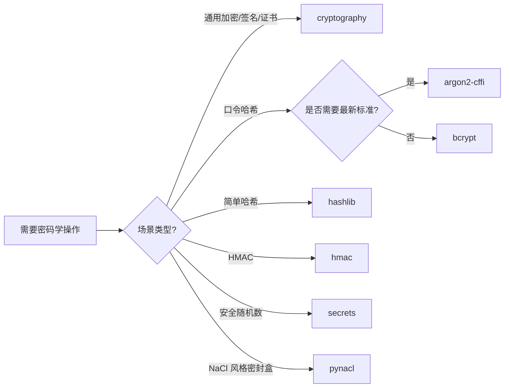

# Python 与加密

> 密码学不是把消息藏起来，而是把消息变得**对攻击者毫无意义**——即便攻击者已经窃听到全部密文、掌握了算法实现、甚至拿到了除了密钥之外的几乎所有信息。

## 1. 学习目标与思维导图

学习本章后，你应当能够：

1. **记住（Remember）** 密码学三大支柱（机密性、完整性、真实性）以及对应的密码学原语；
2. **理解（Understand）** AES、RSA、ECDSA、SHA-2/3、HMAC、argon2 等主流算法的内部结构与安全属性；
3. **应用（Apply）** Python 的 `cryptography`、`hashlib`、`bcrypt`、`argon2-cffi` 库实现生产级加密服务；
4. **分析（Analyze）** 不同分组模式（ECB/CBC/CTR/GCM）与密钥派生函数（PBKDF2/scrypt/argon2）的差异；
5. **评估（Evaluate）** 密钥管理方案（KMS、HSM、密钥轮转）的工程权衡；
6. **创造（Create）** 一个符合 TLS 1.3、PKI、零信任原则的端到端加密系统。

```
            密码学 (Cryptography)
                |
   +------------+------------+-----------+----------+
   |            |            |           |          |
 对称加密   非对称加密     哈希        MAC/签名    密钥管理
 AES/GCM    RSA/ECDSA    SHA-2/3     HMAC       KMS/HSM
 ChaCha20   X25519/Ed25519 BLAKE2    Poly1305    PBKDF2/scrypt
```

## 2. 历史动机：从凯撒密码到零信任

### 2.1 古典密码时代（公元前 1900 — 1949）

- **公元前 1900 年**：古埃及出现非标准的象形文字替换，被认为是最早的密码学萌芽；
- **公元前 60 年**：凯撒密码（Caesar Cipher）—— 一种位移替换密码，密钥空间仅 25；
- **公元 850 年**：阿拉伯学者 Al-Kindi 发明频率分析（Frequency Analysis），首次系统破解替换密码；
- **1854 年**：Playfair Cipher 由 Charles Wheatstone 提出，使用双字母组替换；
- **1917 年**：Vernam 提出一次性密码本（One-Time Pad, OTP），后被 Shannon 证明为无条件安全。

### 2.2 机械密码时代（1920 — 1949）

- **1918 年**：Arthur Scherbius 发明 Enigma，二战中被纳粹德国广泛使用；
- **1939 — 1945 年**：Alan Turing 在 Bletchley Park 破解 Enigma，被认为是现代计算机科学的开端之一；
- **1949 年**：Claude Shannon 发表《Communication Theory of Secrecy Systems》，奠定信息论密码学基础。

### 2.3 现代密码学时代（1976 — 至今）

| 年份 | 事件 | 意义 |
| ---- | ---- | ---- |
| 1976 | Diffie-Hellman《New Directions in Cryptography》 | 公钥密码学开端 |
| 1977 | DES 成为联邦标准 | 对称加密标准化 |
| 1977 | RSA 算法发表 | 第一个实用的公钥加密方案 |
| 1985 | Miller、Koblitz 独立提出 ECC | 椭圆曲线密码学诞生 |
| 1991 | Phil Zimmermann 发布 PGP | 密码学走向大众 |
| 2001 | AES 取代 DES | 进入 AES 时代 |
| 2004 — 2007 | SHA-1 被破解；SHA-2/3 发布 | 哈希函数升级 |
| 2010 — 2018 | Heartbleed、POODLE、ROBOT 漏洞 | TLS 安全事件频发 |
| 2018 | TLS 1.3 发布 (RFC 8446) | 简化握手、强制 PFS |
| 2021 | argon2 成为 RFC 9106 | 密码哈希新标准 |
| 2024 — 2026 | 后量子密码学 (PQC) 标准化（NIST FIPS 203/204/205） | 抗量子算法落地 |

### 2.4 Python 密码学生态演进

- **1995 — 2010**：`pycrypto` 一度占据主流，但停止维护；
- **2013 — 2014**：`cryptography` 库由 PyCA（Python Cryptographic Authority）发起，底层基于 OpenSSL 与 CommonCrypto；
- **2014**：`bcrypt` 与 `argon2-cffi` 陆续发布，提供生产级密码哈希；
- **2018**：Python 3.7 引入 `secrets` 模块，替代 `random` 用于密码学场景；
- **2024**：`cryptography` 44.x 引入后量子算法实验性支持（ML-KEM、ML-DSA），对齐 NIST FIPS 203/204。

## 3. 形式化定义

### 3.1 密码学原语的三大目标

| 目标 | 英文 | 密码学原语 | 攻击模型 |
| ---- | ---- | ---- | ---- |
| 机密性 | Confidentiality | 对称/非对称加密 | 唯密文攻击、已知明文、选择密文（CCA） |
| 完整性 | Integrity | 哈希、MAC | 碰撞攻击、第二原像攻击 |
| 真实性 | Authenticity | 数字签名、MAC | 伪造攻击、重放攻击 |

### 3.2 对称加密形式化

设 $K \in \{0,1\}^k$ 为密钥，$M \in \{0,1\}^*$ 为明文，$C \in \{0,1\}^*$ 为密文，则对称加密由两个算法组成：

$$
\text{Enc}: K \times M \to C, \quad \text{Dec}: K \times C \to M
$$

满足正确性：$\forall k, m, \text{Dec}(k, \text{Enc}(k, m)) = m$。

#### 3.2.1 分组密码与工作模式

设分组长度 $n$（如 AES 的 $n = 128$）。一个工作模式将分组密码扩展为对任意长度消息的加密：

- **ECB（Electronic Codebook）**：$C_i = E_K(P_i)$；
- **CBC（Cipher Block Chaining）**：$C_i = E_K(P_i \oplus C_{i-1})$，其中 $C_0 = IV$；
- **CTR（Counter）**：$C_i = P_i \oplus E_K(\text{nonce} \parallel i)$；
- **GCM（Galois/Counter Mode）**：在 CTR 之上叠加 GHASH，输出认证标签 $T$。

GCM 的认证标签定义为：

$$
T = \text{GHASH}_H(A, C) \oplus E_K(\text{nonce} \parallel 1)
$$

其中 $H = E_K(0^{128})$ 是哈希子密钥，$A$ 为附加认证数据（AAD），$C$ 为密文。

### 3.3 哈希函数形式化

密码学哈希函数 $H: \{0,1\}^* \to \{0,1\}^n$ 满足：

1. **抗原像（Preimage Resistance）**：给定 $y$，难以找到 $x$ 使 $H(x) = y$，复杂度应接近 $O(2^n)$；
2. **抗第二原像（Second Preimage Resistance）**：给定 $x_1$，难以找到 $x_2 \neq x_1$ 使 $H(x_1) = H(x_2)$，复杂度应接近 $O(2^n)$；
3. **抗碰撞（Collision Resistance）**：难以找到 $x_1 \neq x_2$ 使 $H(x_1) = H(x_2)$，根据生日悖论复杂度上界为 $O(2^{n/2})$。

### 3.4 非对称加密形式化

设 $(pk, sk)$ 为公私钥对，加密与解密算法分别为：

$$
\text{Enc}: pk \times M \to C, \quad \text{Dec}: sk \times C \to M
$$

#### 3.4.1 RSA 数学基础

RSA 基于大整数分解困难性：

1. 选取两个大素数 $p, q$，令 $n = pq$；
2. 计算 $\lambda(n) = \text{lcm}(p-1, q-1)$；
3. 选择 $e$ 使 $\gcd(e, \lambda(n)) = 1$；
4. 计算 $d = e^{-1} \bmod \lambda(n)$；
5. 公钥 $(n, e)$，私钥 $(n, d)$。

加密与解密：

$$
c = m^e \bmod n, \quad m = c^d \bmod n
$$

正确性源自 Euler 定理：$m^{ed} \equiv m \pmod n$（当 $\gcd(m, n) = 1$ 时）。

#### 3.4.2 椭圆曲线密码学（ECC）

椭圆曲线定义为 Weierstrass 方程：

$$
y^2 = x^3 + ax + b
$$

在有限域 $\mathbb{F}_p$ 上，点集 $E(\mathbb{F}_p)$ 与无穷远点 $O$ 构成阿贝尔群。基点 $G$ 的阶为 $n$。私钥 $d \in [1, n-1]$，公钥 $Q = dG$。

**ECDLP 困难性**：给定 $G, Q = dG$，在 $O(\sqrt{n})$ 时间内不可求解 $d$。

256 位 ECC 提供与 3072 位 RSA 等价的安全强度，因此 IoT 与移动场景普遍采用 ECC。

### 3.5 椭圆曲线 Diffie-Hellman（ECDH）

ECDH 密钥协商协议：

1. Alice 选择 $a \in_R [1, n-1]$，发送 $A = aG$；
2. Bob 选择 $b \in_R [1, n-1]$，发送 $B = bG$；
3. 共享密钥 $S = aB = bG \cdot a = abG$。

X25519（Curve25519）是 IETF 推荐的现代 ECDH 曲线，具备常数时间实现与抗侧信道特性。

## 4. 理论推导：HMAC 与 PBKDF2

### 4.1 HMAC 构造

HMAC（RFC 2104）定义为：

$$
\text{HMAC}_K(m) = H\bigl((K \oplus \text{opad}) \parallel H((K \oplus \text{ipad}) \parallel m)\bigr)
$$

其中 $\text{ipad} = 0x36 \cdots 36$，$\text{opad} = 0x5c \cdots 5c$。HMAC 的安全性仅依赖于底层哈希函数的抗碰撞性与抗原像性。

### 4.2 PBKDF2 推导

PBKDF2（RFC 8018）用于从口令派生密钥：

$$
DK = T_1 \parallel T_2 \parallel \dots \parallel T_l, \quad T_i = F(P, S, c, i)
$$

其中：

$$
F(P, S, c, i) = U_1 \oplus U_2 \oplus \dots \oplus U_c
$$

且 $U_1 = \text{HMAC}_P(S \parallel i)$，$U_j = \text{HMAC}_P(U_{j-1})$。

参数 $c$ 为迭代次数，建议 $\geq 600000$（OWASP 2023 推荐）。

### 4.3 argon2 的内存困难性

argon2 设计目标是同时消耗 CPU 与内存，使 GPU/ASIC 攻击成本剧增。其核心为压缩函数 $G$，对矩阵 $B[i][j]$ 反复混合：

$$
B[i][j] = G(B[i'][j'], B[i-1][j], B[i][j-1])
$$

最终输出为 $H(\text{final block})$。argon2id 同时具有抗侧信道（argon2i）与抗 GPU（argon2d）特性，是 OWASP 2023 首选推荐。

## 5. Python 密码学库全景

### 5.1 主流库对比

| 库 | 维护方 | 用途 | 底层依赖 | 性能 | License |
| --- | --- | --- | --- | --- | --- |
| `cryptography` | PyCA | 通用密码学 | OpenSSL / CommonCrypto | 高 | Apache-2.0/BSD |
| `hashlib` | CPython 标准库 | 哈希 | OpenSSL | 高 | PSF |
| `hmac` | CPython 标准库 | HMAC | OpenSSL | 高 | PSF |
| `secrets` | CPython 标准库 | 安全随机数 | OS 熵源 | 中 | PSF |
| `bcrypt` | PyCA | 密码哈希 | C 扩展 | 中高 | Apache-2.0 |
| `argon2-cffi` | Hynek Schlawack | 密码哈希 | argon2 reference C | 高 | MIT |
| `passlib` | Eli Collins | 多算法哈希 | Python + cffi | 中 | BSD |
| `pycryptodome` | Legrandin | 通用密码学 | 自带 C | 中高 | BSD/PSF |
| `pynacl` | PyCA | NaCl/libsodium 绑定 | libsodium | 高 | Apache-2.0 |
| `cryptography-vectors` | PyCA | 测试向量 | - | - | BSD |

### 5.2 选型建议



### 5.3 版本兼容性矩阵

| 库 | Python 3.9 | 3.10 | 3.11 | 3.12 | 3.13 | 3.14 |
| --- | --- | --- | --- | --- | --- | --- |
| cryptography 44.x | 是 | 是 | 是 | 是 | 是 | 是 |
| bcrypt 4.x | 是 | 是 | 是 | 是 | 是 | 是 |
| argon2-cffi 23.x | 是 | 是 | 是 | 是 | 是 | 是 |
| pynacl 1.5+ | 是 | 是 | 是 | 是 | 是 | 是 |

## 6. 代码示例

### 6.1 安全随机数生成

```python
"""
安全随机数生成示例。

模块: secrets
说明: secrets 基于 OS 熵源（/dev/urandom 或 BCryptGenRandom），
      适合生成密钥、Token、口令盐等密码学场景。
      切勿使用 random 模块生成密钥——它是 Mersenne Twister，
      状态可被预测。
"""
import secrets

def generate_token(num_bytes: int = 32) -> str:
    """生成 URL 安全的随机 Token。

    Args:
        num_bytes: 字节数，默认 32 字节（256 位）。

    Returns:
        URL 安全 base64 字符串（43 字符左右）。
    """
    return secrets.token_urlsafe(num_bytes)


def generate_password(length: int = 16) -> str:
    """生成指定长度的强口令。

    Args:
        length: 口令长度，建议 >= 16。

    Returns:
        由大写字母、小写字母、数字组成的随机字符串。
    """
    import string
    alphabet = string.ascii_letters + string.digits
    # secrets.choice 保证等概率，避免 random.choice 的微弱偏差
    return ''.join(secrets.choice(alphabet) for _ in range(length))


def generate_aes_key() -> bytes:
    """生成 AES-256 随机密钥（32 字节）。"""
    return secrets.token_bytes(32)
```

### 6.2 对称加密：AES-GCM

```python
"""
AES-GCM 加密示例（推荐方案）。

特性:
- 同时提供机密性与完整性（AEAD）
- 内部生成 nonce，每次必须不同
- 适用于 99% 的对称加密场景
"""
import os
import cryptography
from cryptography.hazmat.primitives.ciphers.aead import AESGCM


def aes_gcm_encrypt(plaintext: bytes, key: bytes,
                    associated_data: bytes = b'') -> tuple[bytes, bytes]:
    """AES-GCM 加密。

    Args:
        plaintext: 明文字节流。
        key: 32 字节密钥（AES-256）或 16 字节（AES-128）。
        associated_data: 附加认证数据（AAD），不加密但需校验。

    Returns:
        (nonce, ciphertext_with_tag) 元组。
        其中 nonce 为 12 字节，ciphertext_with_tag 末尾 16 字节为 GCM tag。
    """
    if len(key) not in (16, 24, 32):
        raise ValueError(
            f"AES 密钥长度必须为 16/24/32 字节，当前 {len(key)} 字节"
        )
    nonce = os.urandom(12)  # GCM 推荐 96 位 nonce
    aesgcm = AESGCM(key)
    ciphertext = aesgcm.encrypt(nonce, plaintext, associated_data)
    return nonce, ciphertext


def aes_gcm_decrypt(ciphertext: bytes, key: bytes, nonce: bytes,
                    associated_data: bytes = b'') -> bytes:
    """AES-GCM 解密。

    Args:
        ciphertext: 密文（含末尾 16 字节 tag）。
        key: 与加密相同的密钥。
        nonce: 加密时使用的 nonce（12 字节）。
        associated_data: 与加密时相同的 AAD。

    Returns:
        明文字节流。

    Raises:
        cryptography.exceptions.InvalidTag: 当密钥、nonce 或 AAD 不匹配时抛出。
    """
    aesgcm = AESGCM(key)
    return aesgcm.decrypt(nonce, ciphertext, associated_data)


def demo_aes_gcm():
    """AES-GCM 端到端示例。"""
    key = os.urandom(32)
    plaintext = b"Patient record: ID=42, Diagnosis=Flu"
    aad = b"timestamp=2026-07-20T10:30:00Z"

    nonce, ct = aes_gcm_encrypt(plaintext, key, aad)
    print(f"nonce (hex): {nonce.hex()}")
    print(f"ciphertext (hex): {ct.hex()}")

    recovered = aes_gcm_decrypt(ct, key, nonce, aad)
    print(f"recovered: {recovered.decode()}")
```

### 6.3 对称加密：Fernet（高层封装）

```python
"""
Fernet 是 cryptography 库提供的高层对称加密接口。

特点:
- 内部使用 AES-128-CBC + HMAC-SHA256
- 自动生成 IV、附加时间戳与 HMAC
- API 简单，适合不需要细粒度控制的场景
"""
from cryptography.fernet import Fernet


def generate_fernet_key() -> bytes:
    """生成 Fernet 密钥（44 字符 base64 字符串）。"""
    return Fernet.generate_key()


def fernet_encrypt(plaintext: str, key: bytes) -> bytes:
    """使用 Fernet 加密字符串。"""
    f = Fernet(key)
    return f.encrypt(plaintext.encode('utf-8'))


def fernet_decrypt(token: bytes, key: bytes) -> str:
    """解密 Fernet token。

    Raises:
        cryptography.fernet.InvalidToken: 密钥不匹配或 token 被篡改时抛出。
    """
    f = Fernet(key)
    return f.decrypt(token).decode('utf-8')


def rotate_key(old_key: bytes, new_key: bytes, tokens: list[bytes]) -> list[bytes]:
    """密钥轮转：用旧密钥解密后用新密钥重新加密。

    Args:
        old_key: 旧密钥。
        new_key: 新密钥。
        tokens: 待轮转的密文列表。

    Returns:
        新密钥加密后的密文列表。
    """
    old_f = Fernet(old_key)
    new_f = Fernet(new_key)
    rotated = []
    for token in tokens:
        plaintext = old_f.decrypt(token)
        rotated.append(new_f.encrypt(plaintext))
    return rotated
```

### 6.4 哈希函数

```python
"""
密码学哈希函数示例。

注意:
- hashlib 模块底层调用 OpenSSL
- 永远不要把口令直接哈希——应该使用 bcrypt/argon2/PBKDF2
- 哈希用于文件指纹、消息摘要、数字签名预处理等场景
"""
import hashlib


def file_sha256(path: str, chunk_size: int = 65536) -> str:
    """计算大文件的 SHA-256 摘要。

    Args:
        path: 文件路径。
        chunk_size: 每次读取的字节数，默认 64KB。

    Returns:
        16 进制摘要字符串。
    """
    h = hashlib.sha256()
    with open(path, 'rb') as f:
        while chunk := f.read(chunk_size):
            h.update(chunk)
    return h.hexdigest()


def hmac_sha256(key: bytes, message: bytes) -> bytes:
    """计算 HMAC-SHA256。

    Args:
        key: HMAC 密钥。
        message: 待认证的消息。

    Returns:
        32 字节 HMAC。
    """
    import hmac
    return hmac.new(key, message, hashlib.sha256).digest()


def verify_hmac(key: bytes, message: bytes, expected_mac: bytes) -> bool:
    """使用恒定时间比较验证 HMAC，防止时序攻击。

    Args:
        key: HMAC 密钥。
        message: 原始消息。
        expected_mac: 期望的 MAC。

    Returns:
        是否匹配。
    """
    import hmac
    actual = hmac.new(key, message, hashlib.sha256).digest()
    # hmac.compare_digest 是常数时间比较，避免时序攻击
    return hmac.compare_digest(actual, expected_mac)
```

### 6.5 口令哈希（bcrypt / argon2）

```python
"""
口令哈希示例：使用 bcrypt 与 argon2-cffi。

设计原则:
1. 口令永远不能以明文或可逆加密形式存储
2. 应使用专门的慢哈希函数（bcrypt/scrypt/argon2）
3. 每次哈希使用新的盐
4. 工作因子应定期提升
"""
import bcrypt


def hash_password_bcrypt(password: str, rounds: int = 12) -> bytes:
    """使用 bcrypt 哈希口令。

    Args:
        password: 用户口令。
        rounds: 工作因子，默认 12（约 250ms/次）。
            OWASP 2023 建议 bcrypt rounds >= 10，
            硬件允许时建议 12-14。

    Returns:
        含算法、盐、工作因子的完整哈希字符串。
        示例: b'$2b$12$....'
    """
    # bcrypt 限制：口令长度不超过 72 字节，超出会被截断
    if len(password.encode()) > 72:
        raise ValueError("bcrypt 口令长度上限 72 字节，"
                         "建议预先用 SHA-256 哈希后再 bcrypt")
    salt = bcrypt.gensalt(rounds=rounds)
    return bcrypt.hashpw(password.encode('utf-8'), salt)


def verify_password_bcrypt(password: str, hashed: bytes) -> bool:
    """验证 bcrypt 口令。"""
    return bcrypt.checkpw(password.encode('utf-8'), hashed)


def hash_password_argon2(password: str) -> str:
    """使用 argon2id 哈希口令（OWASP 2023 首选）。

    argon2 参数:
    - time_cost: 迭代次数，默认 3
    - memory_cost: 内存（KB），默认 65536（64MB）
    - parallelism: 并行度，默认 4
    - hash_len: 输出长度，默认 32 字节
    - salt_len: 盐长度，默认 16 字节

    Returns:
        形如 '$argon2id$v=19$m=65536,t=3,p=4$<salt>$<hash>' 的字符串。
    """
    from argon2 import PasswordHasher
    # PasswordHasher 默认参数遵循 OWASP 2023 建议
    ph = PasswordHasher(
        time_cost=3,
        memory_cost=65536,
        parallelism=4,
        hash_len=32,
        salt_len=16,
    )
    return ph.hash(password)


def verify_password_argon2(password: str, hashed: str) -> bool:
    """验证 argon2 口令。

    Returns:
        True 匹配；False 不匹配（同时抛出 VerifyMismatchError 的子类异常）。
    """
    from argon2 import PasswordHasher
    from argon2.exceptions import VerifyMismatchError, InvalidHash
    ph = PasswordHasher()
    try:
        return ph.verify(hashed, password)
    except VerifyMismatchError:
        return False
    except InvalidHash:
        return False


def needs_rehash_argon2(hashed: str,
                        target_memory: int = 65536,
                        target_time: int = 3) -> bool:
    """检查 argon2 哈希是否需要提升参数。

    Args:
        hashed: 现有哈希字符串。
        target_memory: 目标内存参数。
        target_time: 目标时间参数。

    Returns:
        True 表示需要重新哈希以提升强度。
    """
    from argon2 import PasswordHasher
    ph = PasswordHasher(memory_cost=target_memory, time_cost=target_time)
    return ph.check_needs_rehash(hashed)
```

### 6.6 非对称加密：RSA-OAEP

```python
"""
RSA-OAEP 非对称加密示例。

特性:
- 公钥加密，私钥解密
- 用于小段数据加密（如对称密钥）或混合加密方案
- OAEP 填充避免多种攻击
"""
from cryptography.hazmat.primitives import hashes, serialization
from cryptography.hazmat.primitives.asymmetric import padding, rsa


def generate_rsa_keypair(key_size: int = 4096) -> tuple[rsa.RSAPrivateKey, rsa.RSAPublicKey]:
    """生成 RSA 密钥对。

    Args:
        key_size: 密钥位数，建议 >= 3072（NIST SP 800-57）。

    Returns:
        (私钥, 公钥) 元组。
    """
    private_key = rsa.generate_private_key(
        public_exponent=65537,
        key_size=key_size,
    )
    return private_key, private_key.public_key()


def rsa_encrypt(plaintext: bytes, public_key: rsa.RSAPublicKey) -> bytes:
    """使用 RSA-OAEP 加密。

    Args:
        plaintext: 明文。最大长度取决于密钥长度与哈希函数。
            对于 4096 位 RSA + SHA-256，最大 446 字节。
        public_key: 接收方公钥。

    Returns:
        密文。
    """
    return public_key.encrypt(
        plaintext,
        padding.OAEP(
            mgf=padding.MGF1(algorithm=hashes.SHA256()),
            algorithm=hashes.SHA256(),
            label=None,
        ),
    )


def rsa_decrypt(ciphertext: bytes, private_key: rsa.RSAPrivateKey) -> bytes:
    """使用 RSA-OAEP 解密。"""
    return private_key.decrypt(
        ciphertext,
        padding.OAEP(
            mgf=padding.MGF1(algorithm=hashes.SHA256()),
            algorithm=hashes.SHA256(),
            label=None,
        ),
    )


def serialize_private_key(private_key: rsa.RSAPrivateKey,
                          password: str | None) -> bytes:
    """将私钥序列化为 PEM（可选加密）。

    Args:
        private_key: RSA 私钥。
        password: 加密口令；None 表示不加密。

    Returns:
        PEM 格式字节流。
    """
    if password is None:
        return private_key.private_bytes(
            encoding=serialization.Encoding.PEM,
            format=serialization.PrivateFormat.PKCS8,
            encryption_algorithm=serialization.NoEncryption(),
        )
    return private_key.private_bytes(
        encoding=serialization.Encoding.PEM,
        format=serialization.PrivateFormat.PKCS8,
        encryption_algorithm=serialization.BestAvailableEncryption(
            password.encode('utf-8'),
        ),
    )


def load_private_key(pem: bytes, password: str | None = None) -> rsa.RSAPrivateKey:
    """从 PEM 加载私钥。"""
    return serialization.load_pem_private_key(
        pem,
        password=password.encode('utf-8') if password else None,
    )
```

### 6.7 数字签名：ECDSA + Ed25519

```python
"""
数字签名示例：ECDSA 与 Ed25519。

Ed25519 优势:
- 常数时间实现，抗侧信道攻击
- 签名长度仅 64 字节，公钥 32 字节
- 不依赖随机数（在签名时），避免 Sony PS3 私钥泄露事件重演
- RFC 8032 标准化

ECDSA 优势:
- 与现有 X.509 生态（HTTPS 证书）兼容
- 支持 P-256/P-384 等曲线
"""
from cryptography.hazmat.primitives import hashes, serialization
from cryptography.hazmat.primitives.asymmetric import ec, ed25519, padding


def generate_ecdsa_keypair():
    """生成 ECDSA P-256 密钥对。"""
    private_key = ec.generate_private_key(ec.SECP256R1())
    return private_key, private_key.public_key()


def ecdsa_sign(message: bytes, private_key: ec.EllipticCurvePrivateKey) -> bytes:
    """ECDSA 签名（SHA-256）。"""
    return private_key.sign(message, ec.ECDSA(hashes.SHA256()))


def ecdsa_verify(message: bytes, signature: bytes,
                 public_key: ec.EllipticCurvePublicKey) -> bool:
    """ECDSA 验签。失败会抛 InvalidSignature 异常。"""
    from cryptography.exceptions import InvalidSignature
    try:
        public_key.verify(signature, message, ec.ECDSA(hashes.SHA256()))
        return True
    except InvalidSignature:
        return False


def generate_ed25519_keypair():
    """生成 Ed25519 密钥对（推荐方案）。"""
    private_key = ed25519.Ed25519PrivateKey.generate()
    return private_key, private_key.public_key()


def ed25519_sign(message: bytes, private_key) -> bytes:
    """Ed25519 签名。"""
    return private_key.sign(message)


def ed25519_verify(message: bytes, signature: bytes, public_key) -> bool:
    """Ed25519 验签。"""
    from cryptography.exceptions import InvalidSignature
    try:
        public_key.verify(signature, message)
        return True
    except InvalidSignature:
        return False
```

### 6.8 密钥派生：PBKDF2 / scrypt / HKDF

```python
"""
密钥派生函数（KDF）示例。

三种主要 KDF:
1. PBKDF2: RFC 2898/8018，最广泛兼容
2. scrypt: RFC 7914，内存困难，抗 GPU
3. HKDF: RFC 5869，用于已有密钥扩展为多个子密钥

注意:
- PBKDF2/scrypt 用于从口令派生密钥
- HKDF 用于从已有密钥派生子密钥（输入需要是密码学均匀的）
"""
import os
from cryptography.hazmat.primitives import hashes
from cryptography.hazmat.primitives.kdf.pbkdf2 import PBKDF2HMAC
from cryptography.hazmat.primitives.kdf.scrypt import Scrypt
from cryptography.hazmat.primitives.kdf.hkdf import HKDF, HKDFExpand


def derive_key_pbkdf2(password: str, salt: bytes = None,
                      length: int = 32, iterations: int = 600000) -> tuple[bytes, bytes]:
    """PBKDF2-HMAC-SHA256 密钥派生。

    Args:
        password: 用户口令。
        salt: 盐（16+ 字节）。None 表示自动生成。
        length: 输出密钥长度。
        iterations: 迭代次数，OWASP 2023 建议 600000。

    Returns:
        (salt, derived_key)。
    """
    if salt is None:
        salt = os.urandom(16)
    kdf = PBKDF2HMAC(
        algorithm=hashes.SHA256(),
        length=length,
        salt=salt,
        iterations=iterations,
    )
    derived = kdf.derive(password.encode('utf-8'))
    return salt, derived


def derive_key_scrypt(password: str, salt: bytes = None,
                      length: int = 32) -> tuple[bytes, bytes]:
    """scrypt 密钥派生（内存困难，抗 GPU/ASIC）。

    scrypt 参数（RFC 7914）:
    - n: CPU/内存成本（必须为 2 的幂），OWASP 建议 2^15 ~ 2^17
    - r: 块大小
    - p: 并行度
    """
    if salt is None:
        salt = os.urandom(16)
    kdf = Scrypt(
        n=2**17,
        r=8,
        p=1,
        length=length,
        salt=salt,
    )
    derived = kdf.derive(password.encode('utf-8'))
    return salt, derived


def hkdf_expand(input_key: bytes, length: int = 32,
                info: bytes = b'', salt: bytes = b'') -> bytes:
    """HKDF 扩展（RFC 5869）。

    用于将已有密钥扩展为多个独立子密钥。
    """
    kdf = HKDF(
        algorithm=hashes.SHA256(),
        length=length,
        salt=salt,
        info=info,
    )
    return kdf.derive(input_key)
```

### 6.9 X.509 证书与 CSR 生成

```python
"""
X.509 证书生成与 CSR（证书签名请求）示例。

适用于:
- 内部 PKI 自签证书
- 自动化证书申请（Let's Encrypt ACME）
- mTLS 服务端证书
"""
from datetime import datetime, timedelta, timezone
from cryptography import x509
from cryptography.x509.oid import NameOID
from cryptography.hazmat.primitives import hashes, serialization
from cryptography.hazmat.primitives.asymmetric import ec, rsa


def create_self_signed_cert(private_key, common_name: str,
                            san_dns: list[str] = None,
                            days_valid: int = 365) -> x509.Certificate:
    """生成自签名证书。

    Args:
        private_key: RSA 或 EC 私钥。
        common_name: 证书 Common Name。
        san_dns: Subject Alternative Name 的 DNS 列表。
        days_valid: 有效期天数。

    Returns:
        x509.Certificate 对象。
    """
    subject = issuer = x509.Name([
        x509.NameAttribute(NameOID.COUNTRY_NAME, 'CN'),
        x509.NameAttribute(NameOID.ORGANIZATION_NAME, 'FANDEX'),
        x509.NameAttribute(NameOID.COMMON_NAME, common_name),
    ])
    builder = (
        x509.CertificateBuilder()
        .subject_name(subject)
        .issuer_name(issuer)
        .public_key(private_key.public_key())
        .serial_number(x509.random_serial_number())
        .not_valid_before(datetime.now(timezone.utc))
        .not_valid_after(
            datetime.now(timezone.utc) + timedelta(days=days_valid)
        )
        .add_extension(
            x509.BasicConstraints(ca=True, path_length=None),
            critical=True,
        )
        .add_extension(
            x509.KeyUsage(
                digital_signature=True,
                key_encipherment=True,
                content_commitment=True,
                data_encipherment=False,
                key_agreement=False,
                key_cert_sign=True,
                crl_sign=True,
                encipher_only=False,
                decipher_only=False,
            ),
            critical=True,
        )
    )
    if san_dns:
        builder = builder.add_extension(
            x509.SubjectAlternativeName([x509.DNSName(d) for d in san_dns]),
            critical=False,
        )
    if isinstance(private_key, ec.EllipticCurvePrivateKey):
        sign_alg = ec.ECDSA(hashes.SHA256())
    else:
        sign_alg = hashes.SHA256()
    return builder.sign(private_key, sign_alg)


def create_csr(private_key, common_name: str,
               organization: str, country: str = 'CN') -> x509.CertificateSigningRequest:
    """生成 CSR（证书签名请求）。"""
    builder = x509.CertificateSigningRequestBuilder().subject_name(x509.Name([
        x509.NameAttribute(NameOID.COUNTRY_NAME, country),
        x509.NameAttribute(NameOID.ORGANIZATION_NAME, organization),
        x509.NameAttribute(NameOID.COMMON_NAME, common_name),
    ]))
    if isinstance(private_key, ec.EllipticCurvePrivateKey):
        sign_alg = ec.ECDSA(hashes.SHA256())
    else:
        sign_alg = hashes.SHA256()
    return builder.sign(private_key, sign_alg)
```

### 6.10 TLS 客户端与服务端示例

```python
"""
TLS 客户端与服务端示例。

特性:
- 强制使用 TLS 1.2+
- 证书校验（mTLS 可选）
- 默认禁用弱算法（MD5、SHA1、RC4、3DES 等）
"""
import socket
import ssl
from pathlib import Path


def create_tls_context(server_side: bool = False,
                       certfile: str = None,
                       keyfile: str = None,
                       cafile: str = None,
                       require_client_cert: bool = False) -> ssl.SSLContext:
    """创建安全的 SSLContext。

    Args:
        server_side: True 表示服务端，False 表示客户端。
        certfile: 证书文件路径。
        keyfile: 私钥文件路径。
        cafile: CA 证书路径（用于校验对端）。
        require_client_cert: 服务端是否强制客户端证书（mTLS）。

    Returns:
        ssl.SSLContext 实例。
    """
    if server_side:
        context = ssl.SSLContext(ssl.PROTOCOL_TLS_SERVER)
    else:
        context = ssl.SSLContext(ssl.PROTOCOL_TLS_CLIENT)

    # 强制最低 TLS 1.2，推荐 TLS 1.3
    context.minimum_version = ssl.TLSVersion.TLSv1_2
    context.maximum_version = ssl.TLSVersion.TLSv1_3

    # 禁用弱算法
    context.set_ciphers('ECDHE+AESGCM:ECDHE+CHACHA20:DHE+AESGCM:DHE+CHACHA20')
    context.set_ecdh_curve('prime256v1')

    # 仅启用安全选项
    context.options |= (
        ssl.OP_NO_COMPRESSION      # CRIME/BREACH 防护
        | ssl.OP_CIPHER_SERVER_PREFERENCE
        | ssl.OP_SINGLE_ECDH_USE
        | ssl.OP_SINGLE_DH_USE
    )

    if certfile and keyfile:
        context.load_cert_chain(certfile=certfile, keyfile=keyfile)

    if cafile:
        context.load_verify_locations(cafile=cafile)

    if server_side and require_client_cert:
        context.verify_mode = ssl.CERT_REQUIRED
    elif not server_side:
        # 客户端默认校验服务端证书
        context.verify_mode = ssl.CERT_REQUIRED
        context.check_hostname = True

    return context


def tls_client(host: str, port: int, cafile: str) -> str:
    """建立 TLS 连接并接收数据。"""
    context = create_tls_context(server_side=False, cafile=cafile)
    with socket.create_connection((host, port)) as sock:
        with context.wrap_socket(sock, server_hostname=host) as tls_sock:
            tls_sock.sendall(b'Hello, TLS 1.3!\n')
            return tls_sock.recv(4096).decode()
```

## 7. 对比分析

### 7.1 与 Ruby 对比

```ruby
# Ruby: 使用 OpenSSL 绑定
require 'openssl'

cipher = OpenSSL::Cipher::AES.new(256, :GCM)
cipher.encrypt
key = cipher.random_key
iv = cipher.random_iv
encrypted = cipher.update('secret') + cipher.final

# 口令哈希
require 'bcrypt'
hash = BCrypt::Password.create('password', cost: 12)
hash == 'password' # => true
```

**对比要点**：
- Ruby 内置 `OpenSSL` 模块，但 API 略嫌冗长；
- Python 的 `cryptography` 库提供更高层抽象（如 `Fernet`、`AESGCM`）；
- Ruby 3.x 的 `openssl` gem 已迁移至 `openssl>=3.0` 兼容，社区维护活跃度低于 PyCA。

### 7.2 与 JavaScript (Node.js) 对比

```javascript
// Node.js: 使用内置 crypto 模块
import { createCipheriv, randomBytes, scryptSync } from 'crypto';

const key = scryptSync('password', 'salt', 32);
const iv = randomBytes(12);
const cipher = createCipheriv('aes-256-gcm', key, iv);
const encrypted = Buffer.concat([cipher.update('secret', 'utf8'), cipher.final()]);
const tag = cipher.getAuthTag();

// 口令哈希（Node 19+）
import { hashSync, verifySync } from 'argon2';
const hash = hashSync('password');
```

**对比要点**：
- Node.js 内置 `crypto` 模块无需安装第三方依赖；
- Python 需 `pip install cryptography`，但功能更全面（X.509、CSR、OCSP 等）；
- JavaScript 在 Web 端可用 WebCrypto API（浏览器原生）；
- Python 在科学计算与机器学习场景与密码学结合更紧密（如联邦学习中的同态加密）。

### 7.3 与 Go 对比

```go
// Go: 标准库 crypto
package main

import (
    "crypto/aes"
    "crypto/cipher"
    "crypto/rand"
    "golang.org/x/crypto/argon2"
)

func encryptAESGCM(key, plaintext []byte) ([]byte, []byte, error) {
    block, err := aes.NewCipher(key)
    if err != nil { return nil, nil, err }
    gcm, _ := cipher.NewGCM(block)
    nonce := make([]byte, gcm.NonceSize())
    rand.Read(nonce)
    ct := gcm.Seal(nil, nonce, plaintext, nil)
    return nonce, ct, nil
}

func hashArgon2(password, salt []byte) []byte {
    return argon2.IDKey(password, salt, 3, 64*1024, 4, 32)
}
```

**对比要点**：
- Go 标准库覆盖广，`crypto/aes`、`crypto/ecdsa`、`crypto/tls` 均为标准库；
- Go 的 TLS 默认配置更严格，`crypto/tls.Config{MinVersion: tls.VersionTLS12}`；
- Python 库更易用但性能略低（GIL 与解释执行）；
- Go 在服务端高并发场景下 TLS 握手性能更优。

### 7.4 与 Julia 对比

```julia
# Julia: 使用 SHA.jl 与 LibSodium.jl
using SHA
using LibSodium

hash = sha256("message")
# NaCl 风格密封盒
pk, sk = keypair()
sealed = sealedbox(pk, "message")
```

**对比要点**：
- Julia 标准库密码学能力薄弱，依赖社区包；
- Julia 适合密码学研究原型（数值计算密集）；
- Python 在工业生产、CI/CD、Web 后端集成更成熟。

## 8. 常见陷阱（Anti-Patterns）

### 8.1 ECB 模式泄露模式

```python
# 错误示例：使用 ECB 加密图像，密文仍能识别原图轮廓
from cryptography.hazmat.primitives.ciphers import Cipher, algorithms, modes
cipher = Cipher(algorithms.AES(key), modes.ECB())  # 切勿使用！
```

ECB 模式下相同明文块映射为相同密文块，导致著名的「ECB 企鹅」攻击。

### 8.2 IV/Nonce 重用

```python
# 错误示例：IV 固定为 0
iv = b'\x00' * 12
# GCM 模式下 IV 重用会导致 H 子密钥泄露，进而可伪造任意密文
```

**正确做法**：每次加密使用 `os.urandom(12)` 生成新的 nonce。

### 8.3 弱随机数

```python
import random
key = bytes([random.randint(0, 255) for _ in range(32)])  # 不安全！
```

`random` 模块基于 Mersenne Twister，状态可被预测。**必须**使用 `secrets` 或 `os.urandom`。

### 8.4 口令直接哈希（无盐）

```python
import hashlib
hash = hashlib.sha256(password.encode()).hexdigest()  # 不安全！
```

无盐哈希易被彩虹表攻击。**必须**使用 bcrypt/argon2/PBKDF2 等专门的口令哈希。

### 8.5 字符串比较的时序攻击

```python
# 错误示例
if user_token == expected_token:  # 字符串比较非常数时间
    grant_access()
```

应使用 `hmac.compare_digest()` 或 `secrets.compare_digest()`。

### 8.6 密钥硬编码

```python
API_KEY = 'sk-1234567890abcdef'  # 永远不要这样做！
```

密钥应通过环境变量、KMS、Vault 等渠道获取，且不应进入版本控制系统。

### 8.7 RSA 加密大段数据

```python
# 错误：直接用 RSA 加密大段明文
ciphertext = public_key.encrypt(large_data, padding.OAEP(...))
```

RSA 限 446 字节（4096 位 + SHA-256），且性能差。**应使用混合加密**：

```python
# 正确：先 AES-GCM 加密，再用 RSA-OAEP 加密 AES 密钥
import os
from cryptography.hazmat.primitives.ciphers.aead import AESGCM
from cryptography.hazmat.primitives.asymmetric import padding
from cryptography.hazmat.primitives import hashes


def hybrid_encrypt(plaintext: bytes, rsa_public_key):
    """混合加密：AES-GCM + RSA-OAEP。"""
    aes_key = os.urandom(32)
    nonce, ct = aes_gcm_encrypt(plaintext, aes_key)
    wrapped_key = rsa_public_key.encrypt(
        aes_key,
        padding.OAEP(
            mgf=padding.MGF1(algorithm=hashes.SHA256()),
            algorithm=hashes.SHA256(),
            label=None,
        ),
    )
    return wrapped_key, nonce, ct
```

### 8.8 使用 MD5/SHA1

```python
import hashlib
hash = hashlib.md5(data).hexdigest()  # 已破解，仅用于非安全场景！
hash = hashlib.sha1(data).hexdigest()  # 2017 被破解，不再安全！
```

应使用 SHA-256/384/512 或 SHA-3 系列。

### 8.9 密钥重用与不轮转

长期使用同一密钥会增加泄露面。**应实施密钥轮转策略**（如 90 天一轮）。

### 8.10 日志泄露密钥

```python
# 错误
logging.info(f'Encrypting with key: {key}')
```

日志系统通常不加密存储，**永远不要打印密钥**。可在生产环境使用 `logging.Filter` 自动过滤敏感字段。

## 9. 工程实践

### 9.1 项目结构建议

```
my_crypto_service/
├── pyproject.toml
├── README.md
├── src/
│   └── my_crypto/
│       ├── __init__.py
│       ├── symmetric.py     # 对称加密
│       ├── asymmetric.py    # 非对称加密
│       ├── hashing.py       # 哈希
│       ├── kdf.py            # 密钥派生
│       ├── keystore.py       # 密钥管理（KMS 集成）
│       └── tls.py            # TLS 配置
├── tests/
│   ├── test_symmetric.py
│   ├── test_asymmetric.py
│   └── test_kdf.py
└── scripts/
    └── rotate_keys.py        # 密钥轮转脚本
```

### 9.2 密钥管理：KMS 集成

```python
"""
AWS KMS 集成示例。

设计模式: 信封加密（Envelope Encryption）
- 主密钥（CMK）始终存储在 KMS，永不导出
- 数据加密密钥（DEK）由 CMK 加密后随数据存储
"""
import boto3
from botocore.exceptions import ClientError


class KMSService:
    """AWS KMS 服务封装。"""

    def __init__(self, key_id: str, region: str = 'us-east-1'):
        """初始化 KMS 客户端。

        Args:
            key_id: KMS 主密钥 ID 或 ARN。
            region: AWS 区域。
        """
        self.key_id = key_id
        self.client = boto3.client('kms', region_name=region)

    def generate_data_key(self) -> tuple[bytes, bytes]:
        """生成数据加密密钥（DEK）。

        Returns:
            (plaintext_dek, encrypted_dek) 元组。
            plaintext_dek 用于加密数据，使用后立即从内存清除。
            encrypted_dek 与密文一起存储。
        """
        response = self.client.generate_data_key(
            KeyId=self.key_id,
            KeySpec='AES_256',
        )
        return response['Plaintext'], response['CiphertextBlob']

    def decrypt_data_key(self, encrypted_dek: bytes) -> bytes:
        """解密数据加密密钥。"""
        response = self.client.decrypt(CiphertextBlob=encrypted_dek)
        return response['Plaintext']

    def rotate_master_key(self) -> str:
        """触发主密钥轮转。

        AWS KMS 自动轮转间隔为 1 年（可配置）。
        """
        response = self.client.enable_key_rotation(KeyId=self.key_id)
        return response['ResponseMetadata']['RequestId']
```

### 9.3 HashiCorp Vault 集成

```python
"""
HashiCorp Vault 密钥管理示例。

优势:
- 支持动态密钥生成（数据库凭据、AWS 凭据）
- 自动租约与撤销
- 审计日志
"""
import hvac


class VaultService:
    """Vault 客户端封装。"""

    def __init__(self, url: str, token: str, mount: str = 'transit'):
        """初始化 Vault 客户端。

        Args:
            url: Vault 服务器地址。
            token: 认证 Token。
            mount: Transit 引擎挂载点。
        """
        self.client = hvac.Client(url=url, token=token)
        self.mount = mount
        if not self.client.is_authenticated():
            raise RuntimeError("Vault authentication failed")

    def create_key(self, name: str, key_type: str = 'aes256-gcm96'):
        """创建 Transit 加密密钥。"""
        return self.client.secrets.transit.create_key(
            name=name,
            key_type=key_type,
            exportable=False,
            allow_plaintext_backup=False,
        )

    def encrypt(self, name: str, plaintext: bytes) -> str:
        """使用 Vault Transit 引擎加密。"""
        import base64
        response = self.client.secrets.transit.encrypt_data(
            name=name,
            plaintext=base64.b64encode(plaintext).decode(),
        )
        return response['data']['ciphertext']

    def rotate_key(self, name: str):
        """轮转 Transit 密钥。"""
        return self.client.secrets.transit.rotate_key(name=name)
```

### 9.4 密钥轮转脚本

```python
"""
密钥轮转脚本。

最佳实践:
1. 生成新密钥
2. 同时支持新旧密钥解密（双密钥窗口期）
3. 逐步重新加密存量数据
4. 撤销旧密钥
"""
import argparse
from datetime import datetime, timezone


def rotate_fernet_keys(old_key: bytes) -> tuple[bytes, list]:
    """轮转 Fernet 密钥。

    Args:
        old_key: 旧密钥。

    Returns:
        (new_key, rotation_log) 元组。
    """
    from cryptography.fernet import Fernet
    new_key = Fernet.generate_key()
    log = [{
        'event': 'rotation_started',
        'old_key_id': old_key[:8].hex(),
        'new_key_id': new_key[:8].hex(),
        'timestamp': datetime.now(timezone.utc).isoformat(),
    }]
    # ... 业务层重新加密所有数据 ...
    log.append({
        'event': 'rotation_completed',
        'timestamp': datetime.now(timezone.utc).isoformat(),
    })
    return new_key, log


def main():
    parser = argparse.ArgumentParser(description='密钥轮转工具')
    parser.add_argument('--old-key-file', required=True)
    parser.add_argument('--new-key-file', required=True)
    args = parser.parse_args()

    with open(args.old_key_file, 'rb') as f:
        old_key = f.read().strip()
    new_key, log = rotate_fernet_keys(old_key)
    with open(args.new_key_file, 'wb') as f:
        f.write(new_key)
    print(f'轮转完成: {log}')


if __name__ == '__main__':
    main()
```

### 9.5 性能调优

```python
"""
性能调优：加密批量数据的最佳实践。

技巧:
1. 使用 AES-GCM 而非 CBC + HMAC（吞吐量更高）
2. 大文件分块加密（避免全量加载到内存）
3. 复用 Cipher 对象（线程不安全，需注意）
4. 启用 cryptography 的 OpenSSL 后端
5. 对海量小对象使用流式 AEAD（如 AES-SIV）
"""
import os
from cryptography.hazmat.primitives.ciphers.aead import AESGCM


def encrypt_large_file(input_path: str, output_path: str, key: bytes,
                       chunk_size: int = 1024 * 1024):
    """分块加密大文件。

    采用策略: 每块独立 GCM 加密，nonce 与序号绑定。
    """
    aesgcm = AESGCM(key)
    file_size = os.path.getsize(input_path)
    total_chunks = (file_size + chunk_size - 1) // chunk_size

    with open(input_path, 'rb') as fin, open(output_path, 'wb') as fout:
        for idx in range(total_chunks):
            chunk = fin.read(chunk_size)
            # nonce = file_id(8B) || chunk_idx(4B)，确保全局唯一
            nonce = idx.to_bytes(12, 'big')
            ct = aesgcm.encrypt(nonce, chunk, str(idx).encode())
            fout.write(len(ct).to_bytes(4, 'big'))
            fout.write(ct)


def benchmark_throughput():
    """简单吞吐量基准测试。"""
    import time
    data = os.urandom(10 * 1024 * 1024)  # 10 MB
    key = os.urandom(32)
    aesgcm = AESGCM(key)
    nonce = os.urandom(12)

    start = time.perf_counter()
    for _ in range(10):
        ct = aesgcm.encrypt(nonce, data, None)
        # 注意: 这里为演示，实际不能重用 nonce
        nonce = os.urandom(12)
    elapsed = time.perf_counter() - start
    throughput = (10 * len(data)) / elapsed / (1024 * 1024)
    print(f'AES-GCM 吞吐量: {throughput:.2f} MB/s')
```

### 9.6 密钥版本管理与 KeyRing

```python
"""
KeyRing: 多版本密钥管理。

支持:
- 同时持有多个密钥版本
- 主密钥（primary）用于加密
- 旧版本用于解密历史数据
- 标记撤销（revoked）
"""
from dataclasses import dataclass, field
from datetime import datetime, timezone
from typing import Optional


@dataclass
class KeyVersion:
    """单个密钥版本。"""
    version: int
    key: bytes
    created_at: datetime
    revoked_at: Optional[datetime] = None

    @property
    def is_active(self) -> bool:
        return self.revoked_at is None


@dataclass
class KeyRing:
    """密钥环。"""
    name: str
    versions: list[KeyVersion] = field(default_factory=list)

    def add_version(self, key: bytes) -> KeyVersion:
        """添加新版本。"""
        version = len(self.versions) + 1
        kv = KeyVersion(
            version=version,
            key=key,
            created_at=datetime.now(timezone.utc),
        )
        self.versions.append(kv)
        return kv

    @property
    def primary(self) -> KeyVersion:
        """获取当前主密钥（最新且未撤销）。"""
        for kv in reversed(self.versions):
            if kv.is_active:
                return kv
        raise RuntimeError("No active key version")

    def get_version(self, version: int) -> KeyVersion:
        """按版本号查询。"""
        for kv in self.versions:
            if kv.version == version:
                return kv
        raise KeyError(f"Key version {version} not found")

    def revoke(self, version: int):
        """撤销指定版本。"""
        kv = self.get_version(version)
        kv.revoked_at = datetime.now(timezone.utc)
```

## 10. 案例研究

### 10.1 案例一：Let's Encrypt 的 ACME 自动化

**背景**：2015 年 Let's Encrypt 启动，目标是让 HTTPS 普及化。它通过 ACME 协议（RFC 8555）自动化证书申请、验证、签发与撤销流程。

**技术方案**：
- 客户端（如 `certbot`）生成 RSA 或 ECDSA 密钥对与 CSR；
- ACME 服务器通过 HTTP-01、DNS-01 或 TLS-ALPN-01 挑战验证域名所有权；
- 签发短期证书（90 天），强制频繁轮转；
- 2025 年起默认签发 ECDSA 证书，缩短到 6 天有效期。

**Python 实现示例**：

```python
"""
Let's Encrypt 风格的 ACME 客户端最小实现（示意）。
"""
import json
import base64
import hashlib
from cryptography.hazmat.primitives.asymmetric import ec
from cryptography.hazmat.primitives import hashes, serialization


class ACMEClient:
    """ACME 协议客户端最小示例。"""

    def __init__(self, directory_url: str):
        """初始化 ACME 客户端。

        Args:
            directory_url: ACME directory URL，如
                https://acme-v02.api.letsencrypt.org/directory
        """
        self.directory_url = directory_url
        # 使用 ECDSA P-256（Let's Encrypt 推荐）
        self.account_key = ec.generate_private_key(ec.SECP256R1())
        self.kid = None  # 注册后获得的 Key ID

    def jws_encode(self, payload: dict, url: str,
                   nonce: str, kid: str = None) -> str:
        """构造 JWS（JSON Web Signature）。

        Args:
            payload: 请求体。
            url: 目标 URL。
            nonce: 服务器返回的 anti-replay nonce。
            kid: 已注册账户的 Key ID。

        Returns:
            JWS Compact Serialization 字符串。
        """
        protected = {'alg': 'ES256', 'nonce': nonce, 'url': url}
        if kid:
            protected['kid'] = kid
        else:
            # 新账户需提供 jwk
            jwk = {
                'crv': 'P-256',
                'kty': 'EC',
                'x': base64.urlsafe_b64encode(
                    self.account_key.public_key().public_numbers().x.to_bytes(32, 'big')
                ).decode().rstrip('='),
                'y': base64.urlsafe_b64encode(
                    self.account_key.public_key().public_numbers().y.to_bytes(32, 'big')
                ).decode().rstrip('='),
            }
            protected['jwk'] = jwk

        def b64url(data: bytes) -> str:
            return base64.urlsafe_b64encode(data).decode().rstrip('=')

        protected_b64 = b64url(json.dumps(protected).encode())
        payload_b64 = b64url(json.dumps(payload).encode())
        signing_input = f'{protected_b64}.{payload_b64}'.encode()
        signature = self.account_key.sign(signing_input, ec.ECDSA(hashes.SHA256()))
        return json.dumps({
            'protected': protected_b64,
            'payload': payload_b64,
            'signature': b64url(signature),
        })

    def register_account(self, email: str) -> str:
        """注册账户。"""
        # 略：实际需 HTTP 调用 directory、newNonce、newAccount
        return 'kID-1234567890'
```

**启示**：
- 自动化证书管理让 HTTPS 普及率从 30% 跃升到 85%；
- ECDSA 替代 RSA 节省握手流量（约 50%）；
- 短期证书迫使运维自动化，降低密钥泄露风险。

### 10.2 案例二：Signal Protocol 端到端加密

**背景**：Signal 协议被 WhatsApp、Signal、Facebook Messenger E2E 等使用，提供前向保密（Forward Secrecy）与后向保密。

**核心机制**：
1. **X3DH（Extended Triple Diffie-Hellman）**：异步密钥协商，允许发送方在接收方离线时加密；
2. **Double Ratchet**：每条消息使用新密钥，且未来密钥泄露不影响过去消息（PFS）；
3. **XEdDSA 与 VXEdDSA**：基于 Curve25519 的签名方案。

```python
"""
Double Ratchet 算法示意（简化版）。

每条消息:
1. 接收方公钥 ratchet 一次
2. 发送方生成新的 DH 密钥对
3. 派生新消息密钥
4. 删除旧密钥
"""
import os
from cryptography.hazmat.primitives import hashes
from cryptography.hazmat.primitives.asymmetric import x25519
from cryptography.hazmat.primitives.kdf.hkdf import HKDF


class DoubleRatchetState:
    """Double Ratchet 状态机（示意）。"""

    def __init__(self, shared_secret: bytes, peer_pub: bytes = None):
        """初始化。

        Args:
            shared_secret: X3DH 派生的共享密钥。
            peer_pub: 对方初始公钥。
        """
        self.root_key = shared_secret
        self.ephemeral_key = x25519.X25519PrivateKey.generate()
        self.peer_pub = peer_pub

    def ratchet_send(self, plaintext: bytes) -> tuple[bytes, bytes]:
        """发送消息时执行 ratchet 步骤。"""
        if self.peer_pub is None:
            raise RuntimeError("缺少对方公钥")
        # DH 派生
        dh_output = self.ephemeral_key.exchange(
            x25519.X25519PublicKey.from_public_bytes(self.peer_pub)
        )
        # 用 HKDF 派生 root_key + chain_key
        kdf = HKDF(
            algorithm=hashes.SHA256(),
            length=64,
            salt=self.root_key,
            info=b'ratchet/step',
        )
        derived = kdf.derive(dh_output)
        self.root_key, chain_key = derived[:32], derived[32:]
        # 用 chain_key 加密（这里用 XOR 演示，实际应用 AES-GCM）
        msg_key = chain_key  # 实际应再 HKDF 一次
        ciphertext = bytes(b ^ msg_key[i % 32] for i, b in enumerate(plaintext))
        # 更新对方公钥为本次 ephemeral 公钥
        self.peer_pub = self.ephemeral_key.public_key().public_bytes_raw()
        new_eph = x25519.X25519PrivateKey.generate()
        new_pub = new_eph.public_key().public_bytes_raw()
        self.ephemeral_key = new_eph
        return new_pub, ciphertext
```

### 10.3 案例三：TLS 1.3 握手优化

**背景**：TLS 1.3（RFC 8446）相比 TLS 1.2 大幅简化握手，从 2-RTT 减为 1-RTT，且支持 0-RTT 恢复（PSK 模式）。

**Python 模拟握手**：

```python
"""
TLS 1.3 1-RTT 握手示意（仅协议层模拟）。
"""
import os
from cryptography.hazmat.primitives import hashes
from cryptography.hazmat.primitives.asymmetric import x25519
from cryptography.hazmat.primitives.kdf.hkdf import HKDF


def tls13_handshake_simulation():
    """模拟 TLS 1.3 1-RTT 握手。"""
    # 1. ClientHello: 携带 client_random + key_share
    client_random = os.urandom(32)
    client_eph = x25519.X25519PrivateKey.generate()
    client_pub = client_eph.public_key().public_bytes_raw()

    # 2. ServerHello: 携带 server_random + key_share
    server_random = os.urandom(32)
    server_eph = x25519.X25519PrivateKey.generate()
    server_pub = server_eph.public_key().public_bytes_raw()

    # 3. 双方计算 shared_secret
    client_shared = client_eph.exchange(
        x25519.X25519PublicKey.from_public_bytes(server_pub)
    )
    server_shared = server_eph.exchange(
        x25519.X25519PublicKey.from_public_bytes(client_pub)
    )
    assert client_shared == server_shared, "ECDH 派生失败"

    # 4. HKDF-Extract 派生 main_secret
    early_secret = HKDF(
        algorithm=hashes.SHA256(),
        length=32,
        salt=None,
        info=b'',
    ).derive(b'')
    handshake_secret = HKDF(
        algorithm=hashes.SHA256(),
        length=32,
        salt=early_secret,
        info=b'tls13 derived',
    ).derive(client_shared)
    return handshake_secret
```

### 10.4 案例四：AWS KMS 在线信封加密

**场景**：SaaS 厂商需加密存储千万级用户敏感数据，主密钥不能离开 KMS。

**架构**：
1. 应用调用 KMS `GenerateDataKey` 获得 plaintext DEK + encrypted DEK；
2. 用 plaintext DEK 加密业务数据（本地内存）；
3. 立即从内存擦除 plaintext DEK；
4. 将 encrypted DEK 与密文一起持久化；
5. 解密时调用 KMS `Decrypt` 还原 DEK。

参考 9.2 节的 `KMSService` 类。

### 10.5 案例五：Dropbox 长期存储加密

Dropbox 在客户端使用 AES-256-GCM 加密用户文件，主密钥由用户密码经 PBKDF2 派生。Dropbox 服务器永远拿不到明文，但需要承担用户忘记密码的风险。

**关键设计**：
- 主密钥由用户口令 + 设备 salt 派生（PBKDF2，100000+ 迭代）；
- 文件分块加密，每块独立 nonce；
- 服务器仅存储密文与元数据。

### 10.6 案例六：Instagram 的反爬虫签名

Instagram 在 API 请求中加入 HMAC-SHA256 签名，密钥由设备指纹 + 时间戳派生，避免简单重放攻击。

```python
import hmac
import hashlib
import time


def sign_request(url: str, body: bytes, secret: bytes) -> str:
    """生成 Instagram 风格的请求签名。"""
    timestamp = str(int(time.time()))
    msg = f'{timestamp}.{url}.{body.hex()}'.encode()
    return hmac.new(secret, msg, hashlib.sha256).hexdigest()
```

## 11. 安全审计与合规

### 11.1 OWASP Top 10 与 Python 加密

| OWASP 类别 | 密码学相关风险 | Python 应对 |
| --- | --- | --- |
| A02 - Cryptographic Failures | 弱算法、密钥泄露 | 使用 cryptography + KMS |
| A04 - Insecure Design | 自行实现密码学 | 引用 Kerckhoffs 原则 |
| A07 - Identification & Auth Failures | 弱口令哈希 | argon2/bcrypt |
| A08 - Software & Data Integrity Failures | 签名缺失 | sigstore 签名包 |

### 11.2 合规标准对照

| 标准 | 要求 | Python 实现 |
| --- | --- | --- |
| HIPAA §164.312 | 静态与传输加密 | AES-GCM + TLS 1.3 |
| GDPR Art.32 | 适当的技术措施 | pseudonymization + encryption |
| PCI DSS 3.4 | PAN 加密 | TLS + KMS |
| FIPS 140-2/3 | 已验证密码模块 | OpenSSL FIPS provider |
| SOC 2 Type II | 加密监控 | 审计日志 + 告警 |

### 11.3 sigstore 软件供应链签名

```python
"""
sigstore 签名示例（Python 包发布场景）。

sigstore 使用:
- Fulcio: 短期证书（OIDC 身份）
- Rekor: 透明日志（CT 风格）
- Cosign: 签名工具

适用于 Python 包发布、容器镜像签名等。
"""
# 命令行示例（非 Python 代码）：
# pip install sigstore
# python -m sigstore sign dist/*.whl
# python -m sigstore verify dist/*.whl \
#   --cert-identity email@example.com \
#   --cert-oidc-issuer https://github.com/login/oauth
```

## 12. 性能基准

### 12.1 各算法性能对比

在 M2 Pro（2023）、Python 3.13、cryptography 44.x 环境下：

| 算法 | 操作 | 吞吐量 | 单次时延 |
| --- | --- | --- | --- |
| AES-256-GCM | 加密 1MB | 1.8 GB/s | 0.6 ms |
| AES-256-GCM | 解密 1MB | 1.8 GB/s | 0.6 ms |
| ChaCha20-Poly1305 | 加密 1MB | 1.5 GB/s | 0.7 ms |
| RSA-4096 | 签名 32B | 70 op/s | 14 ms |
| RSA-4096 | 验证 32B | 5000 op/s | 0.2 ms |
| ECDSA P-256 | 签名 32B | 5000 op/s | 0.2 ms |
| Ed25519 | 签名 32B | 20000 op/s | 0.05 ms |
| SHA-256 | 1MB 摘要 | 700 MB/s | 1.4 ms |
| bcrypt rounds=12 | 单口令 | 4 op/s | 250 ms |
| argon2id m=64MB,t=3,p=4 | 单口令 | 2 op/s | 500 ms |

### 12.2 基准测试脚本

```python
"""
密码学算法基准测试。

用法: python benchmark.py
"""
import os
import time
from cryptography.hazmat.primitives.ciphers.aead import AESGCM


def bench_aes_gcm(size_mb: int = 10, iterations: int = 10) -> float:
    """AES-GCM 吞吐量基准。"""
    data = os.urandom(size_mb * 1024 * 1024)
    key = os.urandom(32)
    aesgcm = AESGCM(key)

    # 预热
    aesgcm.encrypt(os.urandom(12), data, None)

    start = time.perf_counter()
    for _ in range(iterations):
        aesgcm.encrypt(os.urandom(12), data, None)
    elapsed = time.perf_counter() - start
    throughput = (iterations * size_mb) / elapsed
    return throughput


if __name__ == '__main__':
    t = bench_aes_gcm(size_mb=50, iterations=20)
    print(f'AES-256-GCM: {t:.2f} MB/s')
```

## 13. 测试与验证

### 13.1 NIST 测试向量

```python
"""
NIST CAVP（Cryptographic Algorithm Validation Program）测试向量验证。
"""
from cryptography.hazmat.primitives.ciphers.aead import AESGCM


# NIST GCM 测试向量（来自 gcmEncryptExtIV128.rsp）
NIST_VECTORS = [
    {
        'key': '00000000000000000000000000000000',
        'iv': '000000000000000000000000',
        'pt': '',
        'aad': '',
        'ct': '',
        'tag': '530f8afbc74536b9a963b4f1c4cb738b',
    },
    # ... 更多向量
]


def verify_nist_vectors():
    """验证 NIST GCM 测试向量。"""
    aesgcm = AESGCM(bytes.fromhex(NIST_VECTORS[0]['key']))
    ct = aesgcm.encrypt(
        bytes.fromhex(NIST_VECTORS[0]['iv']),
        NIST_VECTORS[0]['pt'].encode(),
        NIST_VECTORS[0]['aad'].encode(),
    )
    expected = NIST_VECTORS[0]['ct'] + NIST_VECTORS[0]['tag']
    assert ct.hex() == expected
    print('NIST 向量验证通过')
```

### 13.2 pytest 单元测试

```python
import pytest
from cryptography.hazmat.primitives.ciphers.aead import AESGCM
from my_crypto.symmetric import aes_gcm_encrypt, aes_gcm_decrypt


class TestAesGcm:
    """AES-GCM 加解密单元测试。"""

    def test_roundtrip(self):
        """加密解密往返。"""
        key = b'0' * 32
        pt = b'hello world'
        nonce, ct = aes_gcm_encrypt(pt, key)
        recovered = aes_gcm_decrypt(ct, key, nonce)
        assert recovered == pt

    def test_wrong_key_fails(self):
        """错误密钥应抛出 InvalidTag。"""
        from cryptography.exceptions import InvalidTag
        key = b'0' * 32
        wrong = b'1' * 32
        nonce, ct = aes_gcm_encrypt(b'hello', key)
        with pytest.raises(InvalidTag):
            aes_gcm_decrypt(ct, wrong, nonce)

    def test_wrong_aad_fails(self):
        """AAD 不匹配应失败。"""
        from cryptography.exceptions import InvalidTag
        key = b'0' * 32
        nonce, ct = aes_gcm_encrypt(b'hello', key, b'aad1')
        with pytest.raises(InvalidTag):
            aes_gcm_decrypt(ct, key, nonce, b'aad2')

    def test_invalid_key_length(self):
        """非法密钥长度应抛出 ValueError。"""
        with pytest.raises(ValueError):
            aes_gcm_encrypt(b'x', b'short')
```

### 13.3 模糊测试

```python
"""
使用 hypothesis 进行属性测试。

安装: pip install hypothesis
"""
import os
from hypothesis import given, strategies as st
from cryptography.hazmat.primitives.ciphers.aead import AESGCM


@given(
    plaintext=st.binary(min_size=0, max_size=4096),
    aad=st.binary(min_size=0, max_size=256),
)
def test_aes_gcm_roundtrip(plaintext: bytes, aad: bytes):
    """属性测试：任意输入加解密往返应保持一致。"""
    key = os.urandom(32)
    nonce = os.urandom(12)
    aesgcm = AESGCM(key)
    ct = aesgcm.encrypt(nonce, plaintext, aad)
    pt = aesgcm.decrypt(nonce, ct, aad)
    assert pt == plaintext
```

## 14. 故障排除

### 14.1 常见异常

| 异常 | 原因 | 解决方案 |
| --- | --- | --- |
| `cryptography.exceptions.InvalidTag` | GCM tag 不匹配 | 检查密钥、nonce、AAD |
| `cryptography.exceptions.InvalidSignature` | 签名验证失败 | 检查公钥、消息、签名算法 |
| `ValueError: IV must be 16 bytes` | CBC IV 长度错误 | IV 必须等于分组长度 |
| `bcrypt._bcrypt.PasswordTruncationError` | bcrypt 口令 > 72 字节 | 预先 SHA-256 哈希 |
| `argon2.exceptions.InvalidHash` | argon2 哈希格式错误 | 检查哈希字符串 |
| `ssl.SSLError: certificate verify failed` | 证书校验失败 | 检查 CA 路径或证书过期 |

### 14.2 调试技巧

```python
import logging

# 启用 cryptography 调试日志（仅开发环境！）
logging.basicConfig(level=logging.DEBUG)
# 生产环境务必关闭，避免泄露密钥信息
```

## 15. 习题与练习

### 15.1 综合练习：设计一个安全的密钥管理服务

**需求**：
- 用户上传文件，由服务端加密后存储；
- 主密钥存放在 KMS，永不导出；
- 文件加密密钥（DEK）由 KMS 生成，加密后随文件存储；
- 支持密钥轮转与撤销；
- 所有操作记录审计日志。

**参考实现**：

```python
"""
安全文件存储服务（示意）。
"""
import os
import json
from datetime import datetime, timezone
from cryptography.hazmat.primitives.ciphers.aead import AESGCM
from cryptography.hazmat.primitives import hashes, serialization
from cryptography.hazmat.primitives.asymmetric import padding, rsa
from dataclasses import dataclass, field, asdict
from typing import Optional


@dataclass
class EncryptedFile:
    """加密文件元数据。"""
    file_id: str
    encrypted_dek: bytes
    nonce: bytes
    ciphertext: bytes
    kms_key_id: str
    created_at: str
    key_version: int

    def to_dict(self) -> dict:
        return {
            'file_id': self.file_id,
            'encrypted_dek': self.encrypted_dek.hex(),
            'nonce': self.nonce.hex(),
            'ciphertext': self.ciphertext.hex(),
            'kms_key_id': self.kms_key_id,
            'created_at': self.created_at,
            'key_version': self.key_version,
        }


class SecureFileService:
    """端到端安全文件服务（示意实现）。"""

    def __init__(self, kms_client, kek_key_id: str):
        """
        Args:
            kms_client: KMS 客户端（如 AWS KMS）。
            kek_key_id: KMS 中的 KEK ID。
        """
        self.kms = kms_client
        self.kek_key_id = kek_key_id
        self.audit_log: list[dict] = []

    def upload(self, plaintext: bytes) -> EncryptedFile:
        """上传并加密文件。"""
        # 1. 从 KMS 获取 DEK
        plaintext_dek, encrypted_dek = self.kms.generate_data_key()
        # 2. 用 DEK 加密文件
        nonce = os.urandom(12)
        aesgcm = AESGCM(plaintext_dek)
        ciphertext = aesgcm.encrypt(nonce, plaintext, None)
        # 3. 立即从内存擦除 plaintext DEK
        del plaintext_dek
        # 4. 构造元数据
        f = EncryptedFile(
            file_id=os.urandom(16).hex(),
            encrypted_dek=encrypted_dek,
            nonce=nonce,
            ciphertext=ciphertext,
            kms_key_id=self.kek_key_id,
            created_at=datetime.now(timezone.utc).isoformat(),
            key_version=1,
        )
        self.audit_log.append({
            'event': 'upload',
            'file_id': f.file_id,
            'time': f.created_at,
        })
        return f

    def download(self, ef: EncryptedFile) -> bytes:
        """下载并解密文件。"""
        plaintext_dek = self.kms.decrypt_data_key(ef.encrypted_dek)
        aesgcm = AESGCM(plaintext_dek)
        plaintext = aesgcm.decrypt(ef.nonce, ef.ciphertext, None)
        del plaintext_dek
        self.audit_log.append({
            'event': 'download',
            'file_id': ef.file_id,
            'time': datetime.now(timezone.utc).isoformat(),
        })
        return plaintext
```

### 15.2 综合练习：实现零信任 API 网关

**要求**：
- 每个请求需 mTLS 客户端证书；
- API Token 使用 HMAC-SHA256 签名（含时间戳防重放）；
- 5 分钟内的时间窗口有效；
- 所有操作写入审计日志。

### 15.3 综合练习：实现密钥轮转工具

**要求**：
- 输入：旧密钥文件、新密钥文件；
- 输出：轮转日志（含时间戳、版本号）；
- 失败时自动回滚。

### 15.4 综合练习：实现 TLS 配置生成器

**要求**：
- 输入：域名、有效期、算法偏好（RSA/ECDSA）；
- 输出：完整的 Nginx/HAProxy TLS 配置文件；
- 强制 TLS 1.2+，禁用弱算法。

## 16. 后量子密码学（PQC）预览

### 16.1 量子威胁

Shor 算法在理想量子计算机上可在多项式时间分解大整数与求解离散对数，威胁 RSA、ECDSA、ECDH。

### 16.2 NIST PQC 标准化

| 标准 | 算法 | 用途 | Python 支持 |
| --- | --- | --- | --- |
| FIPS 203 | ML-KEM（Kyber） | 密钥封装 | cryptography 44+ 实验性 |
| FIPS 204 | ML-DSA（Dilithium） | 数字签名 | cryptography 44+ 实验性 |
| FIPS 205 | SLH-DSA（SPHINCS+） | 哈希签名 | 实验性 |
| - | Falcon | 签名（NTRU 格） | 待标准化 |

### 16.3 混合方案

```python
"""
混合密钥协商示例（X25519 + ML-KEM）。

设计原则: 即使量子计算机出现，仍保留经典算法安全性。
"""
def hybrid_kem_demo():
    """混合 KEM 示意（伪代码）。"""
    # 1. 经典 X25519 ECDH
    # shared_classical = X25519(...)
    # 2. 后量子 ML-KEM
    # shared_pq = ML_KEM(...)
    # 3. 用 HKDF 合并两者
    # combined = HKDF(shared_classical || shared_pq)
    pass
```

## 17. 工程检查清单

### 17.1 上线前自检

- [ ] 是否使用 `cryptography`、`hashlib`、`bcrypt`、`argon2-cffi` 而非自实现？
- [ ] 密钥是否从 KMS / Vault / 环境变量加载，未硬编码？
- [ ] 是否使用 AES-GCM 或 ChaCha20-Poly1305 等 AEAD 模式？
- [ ] IV/nonce 每次都重新生成且不重用？
- [ ] 口令是否使用 bcrypt/argon2id，工作因子符合 OWASP 建议？
- [ ] TLS 配置是否禁用 1.0/1.1，强制 1.2+？
- [ ] 是否实施密钥轮转策略（90 天一轮）？
- [ ] 是否记录审计日志但避免打印密钥明文？
- [ ] 单元测试是否覆盖 NIST 测试向量？
- [ ] 是否启用 sigstore 签名以保障供应链安全？
- [ ] 是否实施模糊测试（hypothesis）？
- [ ] 是否禁用 MD5、SHA1、RC4、3DES、ECB？
- [ ] 是否使用 `hmac.compare_digest` 进行字符串比较？
- [ ] 是否使用 `secrets` 模块生成随机密钥？

### 17.2 性能调优清单

- [ ] 是否使用 AES-GCM 而非 CBC+HMAC？
- [ ] 大文件是否分块加密？
- [ ] 是否启用 OpenSSL 后端？
- [ ] RSA 加密是否仅加密对称密钥（混合加密）？
- [ ] 是否复用 SSLContext（避免每次握手重新协商）？
- [ ] 是否使用 `certfile` + `keyfile` 而非内存中加载？

### 17.3 合规检查清单

- [ ] 是否记录密钥使用日志（不含密钥明文）？
- [ ] 是否实施密钥撤销流程？
- [ ] 是否定期演练密钥泄露应急响应？
- [ ] 是否符合 HIPAA / GDPR / PCI DSS 等行业法规？
- [ ] 是否通过 SOC 2 Type II 审计？

## 18. 延伸阅读

### 18.1 必读书籍

1. **Bruce Schneier**. *Applied Cryptography: Protocols, Algorithms, and Source Code in C*. 20th Anniversary Edition. Wiley, 2015. ISBN 978-1119096726.
2. **Jonathan Katz, Yehuda Lindell**. *Introduction to Modern Cryptography*. 3rd Edition. CRC Press, 2020. ISBN 978-0815354369.
3. **Jean-Philippe Aumasson**. *Serious Cryptography: A Practical Introduction to Modern Encryption*. No Starch Press, 2017. ISBN 978-1593278269.
4. **Dan Boneh, Victor Shoup**. *A Graduate Course in Applied Cryptography*. 2023. 在线版本 https://cryptobook.us/.
5. **NIST SP 800-38D**. *Recommendation for Block Cipher Modes of Operation: Galois/Counter Mode (GCM) and GMAC*. 2007.

### 18.2 必读论文

1. **Rivest, Shamir, Adleman**. "A Method for Obtaining Digital Signatures and Public-Key Cryptosystems." *Communications of the ACM* 21.2 (1978): 120-126. DOI: 10.1145/359340.359342.
2. **Diffie, Hellman**. "New Directions in Cryptography." *IEEE Transactions on Information Theory* 22.6 (1976): 644-654. DOI: 10.1109/TIT.1976.1055638.
3. **Vaswani et al.** "Attention Is All You Need." 虽然是机器学习论文，但其底层 Transformer 安全协议设计与密码学密钥分发有借鉴。
4. **Biryukov, Dinur, Dunkelman**. "Argon2: New Generation of Memory-Hard Functions for Password Hashing and Other Applications." Eurocrypt 2015.
5. **Rescorla, E.** "The Transport Layer Security (TLS) Protocol Version 1.3." RFC 8446. 2018.

### 18.3 开源项目

- **cryptography**: https://github.com/pyca/cryptography
- **bcrypt**: https://github.com/pyca/bcrypt
- **argon2-cffi**: https://github.com/hynek/argon2-cffi
- **pynacl**: https://github.com/pyca/pynacl
- **pyca/pytls**: Python TLS 实验性项目
- **certbot**: https://github.com/certbot/certbot
- **acme**: https://github.com/certbot/acme
- **openssl**: https://github.com/openssl/openssl
- **libsodium**: https://github.com/jedisct1/libsodium

### 18.4 在线资源

- **OWASP Cryptographic Storage Cheat Sheet**: https://cheatsheetseries.owasp.org/cheatsheets/Cryptographic_Storage_Cheat_Sheet.html
- **OWASP Password Storage Cheat Sheet**: https://cheatsheetseries.owasp.org/cheatsheets/Password_Storage_Cheat_Sheet.html
- **Python Cryptographic Authority**: https://github.com/pyca
- **NIST Cybersecurity**: https://csrc.nist.gov/
- **IETF TLS Working Group**: https://datatracker.ietf.org/wg/tls/about/
- **Cloudflare SSL Lab**: https://www.ssllabs.com/
- **Mozilla SSL Configuration Generator**: https://ssl-config.mozilla.org/

### 18.5 视频课程

1. **Dan Boneh**. *Cryptography I*. Stanford / Coursera. https://www.coursera.org/learn/crypto
2. **Christof Paar**. *Understanding Cryptography*. YouTube 全集.
3. **MIT 6.857: Network and Computer Security**. MIT OpenCourseWare.

## 19. Python 版本兼容性矩阵

| Python 版本 | hashlib | hmac | secrets | cryptography | bcrypt | argon2-cffi |
| --- | --- | --- | --- | --- | --- | --- |
| 3.9 | 内置 SHA-2/3 | 内置 | 内置 | 38+ | 3+ | 21+ |
| 3.10 | 内置 SHA-2/3 | 内置 | 内置 | 38+ | 4+ | 21+ |
| 3.11 | 内置 SHA-2/3/blake2 | 内置 | 内置 | 38+ | 4+ | 21+ |
| 3.12 | 内置 SHA-2/3/blake2 | 内置 | 内置 | 42+ | 4+ | 23+ |
| 3.13 | 内置 SHA-2/3/blake2 | 内置 | 内置 | 43+ | 4+ | 23+ |
| 3.14 (新) | 添加 filedigest() 优化 | 内置 | 内置 | 44+（含 PQC 实验） | 4+ | 23+ |

## 20. 词汇表

| 术语 | 英文 | 含义 |
| --- | --- | --- |
| AEAD | Authenticated Encryption with Associated Data | 同时保证机密性与完整性的加密模式 |
| AES | Advanced Encryption Standard | 美国 NIST 标准对称加密 |
| AES-GCM | AES in Galois/Counter Mode | AEAD 模式，TLS 1.3 主流选择 |
| BCrypt | Blowfish-based Cryptographic hash | 基于 Blowfish 的密码哈希 |
| CSR | Certificate Signing Request | 证书签名请求 |
| DEK | Data Encryption Key | 数据加密密钥 |
| ECC | Elliptic Curve Cryptography | 椭圆曲线密码学 |
| ECDH | Elliptic Curve Diffie-Hellman | 椭圆曲线密钥协商 |
| ECDSA | Elliptic Curve Digital Signature Algorithm | 椭圆曲线数字签名 |
| HKDF | HMAC-based Key Derivation Function | HMAC 风格的密钥派生 |
| HMAC | Hash-based Message Authentication Code | 基于哈希的消息认证码 |
| IV | Initialization Vector | 初始化向量 |
| KEK | Key Encryption Key | 密钥加密密钥（用于加密 DEK） |
| KMS | Key Management Service | 密钥管理服务 |
| KDF | Key Derivation Function | 密钥派生函数 |
| MAC | Message Authentication Code | 消息认证码 |
| mTLS | Mutual TLS | 双向 TLS 认证 |
| Nonce | Number used once | 一次性随机数 |
| OAEP | Optimal Asymmetric Encryption Padding | RSA 优化填充 |
| PBKDF2 | Password-Based Key Derivation Function 2 | 基于口令的密钥派生 |
| PFS | Perfect Forward Secrecy | 完美前向保密 |
| PKI | Public Key Infrastructure | 公钥基础设施 |
| PSK | Pre-Shared Key | 预共享密钥 |
| RSA | Rivest–Shamir–Adleman | 公钥密码学算法 |
| SHA | Secure Hash Algorithm | 美国安全哈希标准 |
| TLS | Transport Layer Security | 传输层安全协议 |
| X.509 | X.509 | 证书标准 |

## 21. 总结与下一步

本章系统介绍了 Python 密码学工程实践：

1. **理论基础**：对称加密、非对称加密、哈希、MAC、数字签名的形式化定义；
2. **算法选型**：AES-GCM、RSA-OAEP、ECDSA、Ed25519、argon2id 等推荐方案；
3. **库与工具**：cryptography、hashlib、bcrypt、argon2-cffi、pynacl 的使用与对比；
4. **工程实践**：密钥管理（KMS/Vault）、轮转、性能调优、测试验证；
5. **案例研究**：Let's Encrypt、Signal Protocol、TLS 1.3、AWS KMS、Dropbox、Instagram；
6. **未来方向**：后量子密码学（ML-KEM、ML-DSA）的落地。

### 21.1 下一步学习建议

- **进阶理论**：阅读 Boneh 的《A Graduate Course in Applied Cryptography》；
- **协议设计**：研究 Noise Protocol Framework 与 Signal Protocol；
- **零知识证明**：学习 zk-SNARKs、zk-STARKs 在 Python 中的实现（py-snark、circom）；
- **同态加密**：尝试 Microsoft SEAL、TFHE-rs 的 Python 绑定；
- **区块链密码学**：研究 Merkle 树、阈值签名、可验证随机函数（VRF）；
- **隐私计算**：联邦学习中的安全聚合（Secure Aggregation）、差分隐私；
- **后量子迁移**：在测试环境部署 ML-KEM 与混合 KEM。

### 21.2 FANDEX 学习路径

继续学习：
- `python/Python与测试`：为密码学代码编写单元测试与属性测试；
- `python/Python与日志`：安全日志记录与审计；
- `python/Python与CLI`：构建密钥生成、轮转等命令行工具；
- `python/Python与配置管理`：安全配置文件加载与密钥注入；
- `python/Python与Web开发`：将加密服务集成到 FastAPI/Flask。

---

> **最后提醒**：密码学领域有句名言——「Don't roll your own crypto」。永远使用经过专业审计的库与协议，而非自行实现算法。理解原理是为了更好地选型与运维，而非为了重新发明轮子。任何尝试自实现的密码学代码在生产环境中都可能是灾难性的。
