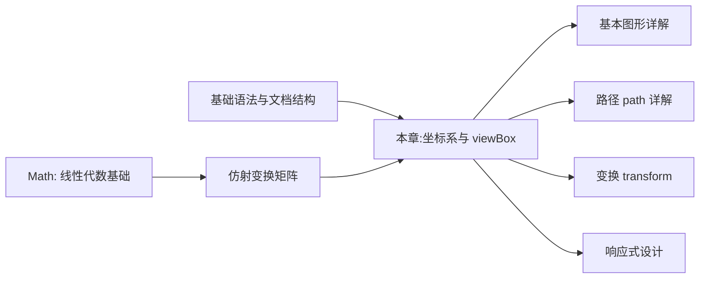

## 1. 学习目标

本章延续 MIT 6.831《用户界面设计与实现》与 Stanford CS248《图形学导论》的教学严谨度,在文档结构基础上深入 SVG 坐标系的形式化定义。学完本章后,学习者应当能够在 Bloom 教育目标分类法的六个层级上达成下列能力。

### 1.1 Bloom 能力矩阵

| 层级 | 行为动词 | 本章目标能力 | 评估方式 |
| ---- | -------- | ------------ | -------- |
| **Remember** 记忆 | 列举、复述 | 能列举视口、视图框、preserveAspectRatio 三大坐标系核心概念 | 选择题、填空题 |
| **Understand** 理解 | 解释、归纳 | 能解释 viewBox 映射矩阵、坐标系方向、meet/slice 适配策略 | 概念辨析题 |
| **Apply** 应用 | 使用、实现 | 能编写响应式 SVG 图标,正确配置 viewBox 与 preserveAspectRatio | 实操题 |
| **Analyze** 分析 | 比较、分解 | 能分析嵌套 svg 坐标系复合的代数性质、负坐标偏移的几何含义 | 对比分析题 |
| **Evaluate** 评价 | 评判、推荐 | 能评估坐标系设计的合理性,给出响应式适配的工程化建议 | 代码评审题 |
| **Create** 创造 | 设计、构建 | 能设计一个支持多分辨率自适应的 SVG 图标体系 | 架构设计题 |

### 1.2 知识图谱前置依赖



### 1.3 学习成果清单

完成本章学习后,学习者应当能够产出:

1. 一份支持响应式自适应的 SVG 图标(单 viewBox 适配多分辨率)
2. 一份带局部放大效果的 SVG 图(通过 viewBox 范围切换)
3. 一份坐标系映射矩阵的形式化推导说明
4. 一份 preserveAspectRatio 适配策略速查表

## 2. 历史动机与发展脉络

### 2.1 坐标系设计的几何渊源

计算机图形学的坐标系选择并非偶然。1963 年 Ivan Sutherland 在 Sketchpad 系统中首次采用屏幕左上角为原点的坐标系,这一选择源自 CRT 显示器的电子束扫描方向:从左至右、从上至下。这一历史惯性延续至今,SVG、Canvas、HTML 布局均采用 Y 轴向下的坐标系。

| 坐标系 | 原点位置 | Y 轴方向 | 起源 |
| ------ | -------- | -------- | ---- |
| 数学笛卡尔 | 任意可选 | 向上 | 历史传统 |
| SVG | 左上角 | 向下 | CRT 扫描惯性 |
| Canvas 2D | 左上角 | 向下 | 同 SVG |
| WebGL | 左下角 | 向上 | OpenGL 传统 |
| PDF | 左下角 | 向上 | PostScript 传统 |

注意 SVG 与 WebGL 的 Y 轴方向相反,这一差异在 SVG-WebGL 协作场景(如 three.js 纹理映射)中常引发坐标翻转 bug。

### 2.2 viewBox 的诞生背景

SVG 1.0(2001 年)首次引入 viewBox 概念,旨在解决两个核心问题:

1. **图像与分辨率解耦**:同一份 SVG 数据既可显示为 16px 图标,也可显示为 1920px 横幅,无需修改内部坐标
2. **坐标归一化**:设计师可用任意坐标范围(0-24、0-100、0-1)描述图形,由 viewBox 完成到视口的映射

在 viewBox 之前,Web 图像只能通过 PNG/JPEG 的 width/height 被动缩放,内部坐标无法重映射。viewBox 的引入使 SVG 真正具备了"矢量"语义:图形数据保持不变,通过坐标系变换适配任意显示尺寸。

### 2.3 与 HTML/CSS 视口模型的对比

SVG 的视口模型与 CSS 视口模型在概念上有共通之处,但语义不同:

| 概念 | HTML/CSS | SVG |
| ---- | -------- | --- |
| 视口 | 浏览器可视区域 | `<svg>` 的 width/height |
| 坐标系 | 由 layout 引擎动态计算 | 由 viewBox 显式声明 |
| 缩放 | transform: scale() | viewBox + preserveAspectRatio |
| 单位 | px/em/rem/vw/vh | user units(默认 px) |
| 响应式 | media queries | viewBox + CSS width/height |

理解这一差异有助于在设计响应式 SVG 时选择正确的策略:HTML 处理外层布局,SVG 内部用 viewBox 处理图形缩放,两者协同工作。

### 2.4 设计哲学:数据与显示解耦

SVG 坐标系的设计哲学可概括为"数据与显示解耦":

- **数据层**:viewBox 描述图形内部坐标系,与显示设备无关
- **显示层**:width/height 描述视口物理尺寸,与设备绑定
- **映射层**:preserveAspectRatio 描述映射策略,连接数据与显示

这一三层模型使 SVG 具备了分辨率无关性(resolution independence),是其与位图格式的本质区别。

## 3. 形式化定义

### 3.1 视口与视图框的数学模型

设视口(viewport)为矩形 $V = [0, W] \times [0, H]$,视图框(viewBox)为矩形 $B = [x_{\min}, x_{\min} + w] \times [y_{\min}, y_{\min} + h]$。SVG 的坐标系映射可形式化为一个仿射变换:

$$
\phi: B \to V, \quad \phi(x, y) = (s_x \cdot (x - x_{\min}), s_y \cdot (y - y_{\min}))
$$

其中缩放因子 $s_x = W / w$, $s_y = H / h$。当 preserveAspectRatio 不为 none 时,$s_x = s_y = s$ 以保持宽高比。

### 3.2 preserveAspectRatio 的几何约束

preserveAspectRatio 的对齐参数 $\alpha \in \{\text{xMin}, \text{xMid}, \text{xMax}\} \times \{\text{YMin}, \text{YMid}, \text{YMax}\}$ 决定映射时的偏移。设视口宽高比 $r_v = W/H$,视图框宽高比 $r_b = w/h$:

- 当 $r_b < r_v$(视图框更窄),采用 meet 策略时,水平方向留白:

$$
\Delta x = \begin{cases}
0 & \alpha_x = \text{xMin} \\
\frac{W - w \cdot s}{2} & \alpha_x = \text{xMid} \\
W - w \cdot s & \alpha_x = \text{xMax}
\end{cases}
$$

- 当 $r_b > r_v$(视图框更宽),垂直方向留白:

$$
\Delta y = \begin{cases}
0 & \alpha_y = \text{YMin} \\
\frac{H - h \cdot s}{2} & \alpha_y = \text{YMid} \\
H - h \cdot s & \alpha_y = \text{YMax}
\end{cases}
$$

其中 $s = \min(W/w, H/h)$ 为 meet 模式的等比缩放因子。

### 3.3 slice 模式的裁剪几何

slice 模式采用 $s = \max(W/w, H/h)$,将视图框放大填满视口,超出部分被裁剪。其几何含义是:视图框的子矩形 $B' \subseteq B$ 被映射到整个视口 $V$,$B'$ 的尺寸由:

$$
B' = \begin{cases}
[w, h \cdot r_v] & \text{if } r_b < r_v \text{ (水平填满,垂直裁剪)} \\
[w/r_v, h] & \text{if } r_b > r_v \text{ (垂直填满,水平裁剪)}
\end{cases}
$$

对齐参数 $\alpha$ 决定 $B'$ 在 $B$ 内的位置,从而控制可见区域。

### 3.4 坐标系方向的向量空间表示

SVG 坐标系可表示为二维实数向量空间 $\mathbb{R}^2$ 上的有序基:

$$
\vec{e}_x = (1, 0), \quad \vec{e}_y = (0, 1)
$$

任意点 $P = (x, y) = x \cdot \vec{e}_x + y \cdot \vec{e}_y$。由于 Y 轴向下,向量 $(0, 1)$ 在屏幕上指向"下方",这与数学中的"向上"相反。在涉及旋转角度时需特别注意:SVG 中的正旋转角度是顺时针方向,与数学中的逆时针相反。

### 3.5 user units 与物理像素的关系

SVG 中的"user units"默认等于 CSS 像素(1px = 1/96 inch),但通过 `svg.width` 与 `viewBox` 的比例可实现任意缩放。设 $u$ 为 user unit,$p$ 为物理像素,则:

$$
p = u \cdot \frac{W_{\text{viewport}}}{w_{\text{viewBox}}} \cdot dpr
$$

其中 $dpr$ 为设备像素比(device pixel ratio)。这一关系是 SVG 响应式设计的数学基础。

## 4. 理论推导与原理解析

### 4.1 viewBox 映射矩阵的推导

viewBox 到视口的映射可表示为齐次坐标下的 $3 \times 3$ 仿射变换矩阵。设视图框为 $[x_{\min}, y_{\min}, w, h]$,视口为 $[W, H]$,meet 模式下:

$$
M_{\text{meet}} = T(\Delta x, \Delta y) \cdot S(s, s) \cdot T(-x_{\min}, -y_{\min})
$$

其中 $T$ 为平移矩阵,$S$ 为缩放矩阵:

$$
T(a, b) = \begin{bmatrix} 1 & 0 & a \\ 0 & 1 & b \\ 0 & 0 & 1 \end{bmatrix}, \quad S(s_x, s_y) = \begin{bmatrix} s_x & 0 & 0 \\ 0 & s_y & 0 \\ 0 & 0 & 1 \end{bmatrix}
$$

展开后:

$$
M_{\text{meet}} = \begin{bmatrix} s & 0 & \Delta x - s \cdot x_{\min} \\ 0 & s & \Delta y - s \cdot y_{\min} \\ 0 & 0 & 1 \end{bmatrix}
$$

任意内部点 $(x, y)$ 在视口中的位置为 $M \cdot (x, y, 1)^T$。这一矩阵表示是 SVG 坐标系代数性质的基础。

### 4.2 复合坐标系的代数性质

嵌套 `<svg>` 建立的坐标系复合满足结合律。设外层映射为 $M_1$,内层映射为 $M_2$,则复合映射 $M = M_1 \cdot M_2$。由于仿射变换集合在矩阵乘法下:

1. **封闭性**:$M_1 \cdot M_2$ 仍是仿射变换
2. **结合律**:$(M_1 \cdot M_2) \cdot M_3 = M_1 \cdot (M_2 \cdot M_3)$
3. **单位元**:存在恒等映射 $I$
4. **不满足交换律**:$M_1 \cdot M_2 \neq M_2 \cdot M_1$(一般情况)

因此仿射变换集合构成一个**幺半群**(monoid),这是 SVG 坐标系复合可被任意嵌套的代数保证。

### 4.3 preserveAspectRatio 的边界条件

当视图框宽高比与视口宽高比相等时,meet 与 slice 的行为一致,均无留白也无裁剪。形式化:

$$
\frac{w}{h} = \frac{W}{H} \iff s_{\text{meet}} = s_{\text{slice}} = \frac{W}{w} = \frac{H}{H}
$$

此时对齐参数 $\alpha$ 不影响结果。这一等价条件是测试 SVG 坐标系实现的边界用例。

### 4.4 嵌套 svg 与 transform 的等价性

嵌套 `<svg>` 与 `<g transform>` 在某些场景下功能等价。设有嵌套:

```xml
<svg viewBox="0 0 100 100">
  <svg x="20" y="20" width="50" height="50" viewBox="0 0 200 200">
    <circle cx="100" cy="100" r="50" />
  </svg>
</svg>
```

内层 circle 在外层坐标系中的位置等价于:

```xml
<g transform="translate(20, 20) scale(0.25)">
  <circle cx="100" cy="100" r="50" />
</g>
```

其中 $0.25 = 50/200$ 是内层 viewBox 到内层视口的缩放因子。这一等价性是 SVG 坐标系代数性质的应用。

### 4.5 坐标系变换的行列式与定向

仿射变换矩阵的左上 $2 \times 2$ 子矩阵的行列式决定坐标系的定向(preservation of orientation):

$$
\det \begin{bmatrix} a & c \\ b & d \end{bmatrix} = ad - bc
$$

- $\det > 0$:定向保持(无翻转)
- $\det < 0$:定向反转(如 scale(-1, 1) 水平翻转)
- $\det = 0$:退化变换(投影到直线)

SVG 的 meet/slice 模式保证 $\det > 0$,即不改变定向。但通过 transform 可实现定向反转,这是镜像效果的基础。

### 4.6 抗锯齿与小数坐标的频率分析

像素是离散的,而 SVG 坐标是连续的。当坐标落在像素边界(如 $x = 10.5$)时,浏览器需通过抗锯齿算法在多个像素间分配颜色。可形式化为低通滤波:

$$
I_{\text{display}}(p) = \int_{\text{pixel}(p)} I_{\text{ideal}}(x) \, dx
$$

其中 $I_{\text{ideal}}$ 为理想连续图像,$I_{\text{display}}$ 为离散像素值。当描边恰好落在像素边界时,积分覆盖两个像素,导致 1px 描边显示为 2px 灰色描边。这就是著名的"0.5 偏移技巧"的数学原理。

## 5. 代码示例

### 5.1 视口(viewport)与视图框(viewBox)

`<svg>` 的 `width` 和 `height` 定义视口尺寸,`viewBox` 定义内部坐标系。

```html
<!-- 视口 400×300,内部坐标 200×150,等比放大 2 倍 -->
<svg width="400" height="300" viewBox="0 0 200 150" xmlns="http://www.w3.org/2000/svg">
  <rect x="0" y="0" width="100" height="75" fill="#4f5bd5" />
</svg>
```

#### 5.1.1 viewBox 语法

```
viewBox = "<min-x> <min-y> <width> <height>"
```

| 参数 | 含义 | 取值 |
| ---- | ---- | ---- |
| `min-x` | 视图框左上角 X 坐标 | 任意实数(含负数) |
| `min-y` | 视图框左上角 Y 坐标 | 任意实数(含负数) |
| `width` | 视图框宽度 | 正实数 |
| `height` | 视图框高度 | 正实数 |

#### 5.1.2 viewBox 的核心价值

| 价值 | 说明 |
| ---- | ---- |
| **响应式适配** | 视口变化时图形按比例缩放,无需重写坐标 |
| **坐标归一化** | 可用 0-100 或 0-1 等任意范围描述图形 |
| **局部裁剪** | 通过调整 min-x/min-y 可显示图形局部 |
| **独立于尺寸** | 同一 SVG 可用作 16px 图标或 1920px 横幅 |

### 5.2 坐标系方向

SVG 坐标系原点在**左上角**,X 轴向右、Y 轴**向下**(与数学坐标系 Y 轴相反)。

```
(0,0) ──────→ X+
  │
  │
  ↓
  Y+
```

```html
<svg viewBox="0 0 100 100" xmlns="http://www.w3.org/2000/svg">
  <!-- 圆心 (50,50):在画布正中央 -->
  <circle cx="50" cy="50" r="40" fill="#4f5bd5" />
  <!-- (0,0) 在左上角 -->
  <rect x="0" y="0" width="20" height="20" fill="#d63031" />
</svg>
```

注意 Y 轴向下意味着:在描述物理场景时(如重力下落),自然映射是"y 增大";在描述数学函数(如正弦曲线)时,需翻转 Y 轴或调整坐标系。

### 5.3 preserveAspectRatio 详解

当 viewBox 与视口宽高比不一致时,`preserveAspectRatio` 控制如何适配。

#### 5.3.1 语法

```
preserveAspectRatio = "<align> <meetOrSlice>"
```

#### 5.3.2 对齐方式 align

| 值 | 含义 | 应用场景 |
| ---- | ---- | ---- |
| `xMinYMin` | 左上对齐 | 图标贴左上角 |
| `xMidYMin` | 上中对齐 | 顶部居中 banner |
| `xMaxYMin` | 右上对齐 | 右上角徽章 |
| `xMinYMid` | 左中对齐 | 侧边栏图标 |
| `xMidYMid` | 居中对齐(默认) | 通用图标 |
| `xMaxYMid` | 右中对齐 | 右侧操作按钮 |
| `xMinYMax` | 左下对齐 | 左下角水印 |
| `xMidYMax` | 下中对齐 | 底部居中提示 |
| `xMaxYMax` | 右下对齐 | 右下角关闭按钮 |

#### 5.3.3 适配模式 meetOrSlice

| 值 | 行为 | 数学含义 |
| ---- | ---- | ---- |
| `meet` | 完整显示 viewBox,留白(默认) | $s = \min(W/w, H/h)$ |
| `slice` | 填满视口,可能裁剪 | $s = \max(W/w, H/h)$ |
| `none` | 拉伸变形,不保持比例 | $s_x = W/w, s_y = H/h$ |

#### 5.3.4 示例对比

```html
<!-- viewBox 4:3,视口 1:1,meet 模式留白 -->
<svg width="100" height="100" viewBox="0 0 400 300" preserveAspectRatio="xMidYMid meet">
  <rect width="400" height="300" fill="#4f5bd5" />
</svg>

<!-- slice 模式填满视口,裁剪左右 -->
<svg width="100" height="100" viewBox="0 0 400 300" preserveAspectRatio="xMidYMid slice">
  <rect width="400" height="300" fill="#00b894" />
</svg>

<!-- none 模式拉伸变形 -->
<svg width="100" height="100" viewBox="0 0 400 300" preserveAspectRatio="none">
  <rect width="400" height="300" fill="#d63031" />
</svg>
```

### 5.4 响应式图标实战

#### 5.4.1 单 viewBox 适配多尺寸

图标 SVG 通常只声明 viewBox,不指定 width/height,由外层 CSS 控制。

```html
<!-- icon.svg:只声明 viewBox,声明可继承的 currentColor -->
<svg viewBox="0 0 24 24" xmlns="http://www.w3.org/2000/svg">
  <path d="M12 2 L22 22 L2 22 Z" fill="currentColor" />
</svg>
```

```css
/* 通过 CSS 控制不同尺寸 */
.icon-sm { width: 16px; height: 16px; }
.icon-md { width: 24px; height: 24px; }
.icon-lg { width: 48px; height: 48px; }
.icon-xl { width: 96px; height: 96px; }
```

```html
<svg class="icon-sm" viewBox="0 0 24 24">...</svg>
<svg class="icon-lg" viewBox="0 0 24 24">...</svg>
```

#### 5.4.2 通过 CSS 自适应父容器

```css
.responsive-svg {
  width: 100%;
  height: auto;
  display: block;
}
```

```html
<div style="max-width: 600px;">
  <svg class="responsive-svg" viewBox="0 0 16 9" xmlns="http://www.w3.org/2000/svg">
    <rect width="16" height="9" fill="#4f5bd5" />
  </svg>
</div>
```

SVG 自动按 16:9 比例缩放至父容器宽度,无需 JavaScript。

### 5.5 负坐标与偏移

viewBox 的 min-x/min-y 可为负数,便于以原点为中心描述图形。

```html
<svg viewBox="-50 -50 100 100" width="100" height="100" xmlns="http://www.w3.org/2000/svg">
  <!-- 坐标系 -50 到 50,原点 (0,0) 居中 -->
  <circle cx="0" cy="0" r="40" fill="#4f5bd5" />
  <line x1="-50" y1="0" x2="50" y2="0" stroke="#333" />
  <line x1="0" y1="-50" x2="0" y2="50" stroke="#333" />
</svg>
```

负坐标系的优势:以原点为中心描述几何图形,简化数学计算(如极坐标转换、旋转变换)。

### 5.6 局部放大

通过缩小 viewBox 范围实现局部放大。

```html
<!-- 完整图:显示 400×300 -->
<svg viewBox="0 0 400 300" width="400" height="300">
  <rect width="400" height="300" fill="#4f5bd5" />
  <circle cx="200" cy="150" r="50" fill="#fff" />
</svg>

<!-- 放大显示原图中央 100×75 区域 -->
<svg viewBox="100 75 100 75" width="400" height="300">
  <rect width="400" height="300" fill="#4f5bd5" />
  <circle cx="200" cy="150" r="50" fill="#fff" />
</svg>
```

应用场景:地图缩放、图表聚焦、图片裁切预览。同一份 SVG 数据,通过 viewBox 切换即可显示不同视图。

### 5.7 嵌套 svg 建立子坐标系

```html
<svg viewBox="0 0 400 200" width="400" height="200" xmlns="http://www.w3.org/2000/svg">
  <svg x="0" y="0" width="200" height="200" viewBox="0 0 100 100">
    <!-- 左侧子坐标系 100×100 映射到 200×200 -->
    <circle cx="50" cy="50" r="40" fill="#4f5bd5" />
  </svg>
  <svg x="200" y="0" width="200" height="200" viewBox="0 0 50 50">
    <!-- 右侧子坐标系 50×50 映射到 200×200,放大 4 倍 -->
    <circle cx="25" cy="25" r="20" fill="#00b894" />
  </svg>
</svg>
```

嵌套 `<svg>` 的语义:在外层视口中开辟一块矩形区域,内部建立独立坐标系。常用于仪表盘、地图瓦片等"图中图"场景。

### 5.8 坐标系与变换

`transform` 属性在坐标系层面应用变换,影响后续所有子元素。

```html
<svg viewBox="0 0 200 200" xmlns="http://www.w3.org/2000/svg">
  <g transform="translate(100, 100) rotate(45)">
    <!-- 此组以 (100,100) 为原点,旋转 45° -->
    <rect x="-25" y="-25" width="50" height="50" fill="#d63031" />
  </g>
</svg>
```

变换的顺序**不可交换**:`translate(100,0) rotate(45)` 与 `rotate(45) translate(100,0)` 结果不同。变换的复合遵循矩阵乘法的非交换性。

### 5.9 viewBox 动态切换

通过 JavaScript 动态修改 viewBox 实现平移与缩放:

```javascript
class SVGViewportController {
  constructor(svgElement) {
    this.svg = svgElement;
    this.viewBox = { x: 0, y: 0, width: 400, height: 300 };
    this.update();
  }

  // 平移 viewBox
  pan(dx, dy) {
    this.viewBox.x += dx;
    this.viewBox.y += dy;
    this.update();
  }

  // 以指定点为中心缩放
  zoomAt(centerX, centerY, factor) {
    const { x, y, width, height } = this.viewBox;
    // 保持中心点不动,缩放 width/height
    const newWidth = width / factor;
    const newHeight = height / factor;
    this.viewBox.x = centerX - (centerX - x) / factor;
    this.viewBox.y = centerY - (centerY - y) / factor;
    this.viewBox.width = newWidth;
    this.viewBox.height = newHeight;
    this.update();
  }

  // 更新 SVG viewBox 属性
  update() {
    const { x, y, width, height } = this.viewBox;
    this.svg.setAttribute(
      'viewBox',
      `${x.toFixed(2)} ${y.toFixed(2)} ${width.toFixed(2)} ${height.toFixed(2)}`
    );
  }

  // 重置到初始视图
  reset() {
    this.viewBox = { x: 0, y: 0, width: 400, height: 300 };
    this.update();
  }
}

// 使用示例
const svg = document.querySelector('svg');
const controller = new SVGViewportController(svg);

// 鼠标滚轮缩放
svg.addEventListener('wheel', (e) => {
  e.preventDefault();
  const factor = e.deltaY > 0 ? 0.9 : 1.1;
  const rect = svg.getBoundingClientRect();
  const cx = e.offsetX;
  const cy = e.offsetY;
  controller.zoomAt(cx, cy, factor);
});

// 拖拽平移
let isDragging = false;
let startX, startY;
svg.addEventListener('mousedown', (e) => {
  isDragging = true;
  startX = e.offsetX;
  startY = e.offsetY;
});
svg.addEventListener('mousemove', (e) => {
  if (!isDragging) return;
  const dx = (e.offsetX - startX) * -1;
  const dy = (e.offsetY - startY) * -1;
  controller.pan(dx, dy);
  startX = e.offsetX;
  startY = e.offsetY;
});
svg.addEventListener('mouseup', () => {
  isDragging = false;
});
```

这是地图应用、图片查看器、可缩放图表的核心实现模式。

## 6. 对比分析

### 6.1 SVG vs Canvas 坐标系

| 特性 | SVG | Canvas |
| ---- | --- | ----- |
| 坐标系类型 | 保留模式(retained mode) | 立即模式(immediate mode) |
| 原点位置 | 可通过 viewBox 任意指定 | 固定左上角 |
| Y 轴方向 | 向下 | 向下 |
| 单位 | user units(可任意缩放) | 像素(固定) |
| 响应式 | viewBox 自动适配 | 需手动重绘 |
| 抗锯齿 | 浏览器自动处理 | 需手动控制 |
| 变换累积 | transform 属性链式 | ctx.translate/rotate 累积 |
| 坐标系嵌套 | 嵌套 `<svg>` | ctx.save/restore |

### 6.2 SVG vs WebGL 坐标系

| 特性 | SVG | WebGL |
| ---- | --- | ----- |
| Y 轴方向 | 向下 | 向上 |
| 原点 | 左上角 | 左下角(NDC) |
| 坐标范围 | 任意(由 viewBox 决定) | [-1, 1] NDC |
| 投影 | 仿射变换 | 透视/正交投影矩阵 |
| 单位 | user units | 像素(屏幕空间) |
| 旋转方向 | 顺时针(正角度) | 逆时针(正角度,数学约定) |

### 6.3 viewBox vs CSS transform: scale()

| 特性 | viewBox 缩放 | CSS scale() |
| ---- | ----------- | ----------- |
| 缩放中心 | viewBox 中心 | transform-origin |
| 影响描边宽度 | 是(描边随缩放) | 否(描边保持) |
| 影响字体大小 | 是(字号随缩放) | 否(字号保持) |
| 响应式适配 | 自动(meet/slice) | 需手动 |
| 性能 | 高(硬件加速) | 高 |
| 应用场景 | 图形整体缩放 | UI 元素微调 |

注意 viewBox 缩放会同步缩放描边与字号,这是与 CSS transform: scale() 的核心差异。需要保持描边宽度不变时,使用 `vector-effect="non-scaling-stroke"`。

### 6.4 meet vs slice vs none 的工程选型

| 模式 | 适用场景 | 优势 | 劣势 |
| ---- | ---- | ---- | ---- |
| `meet` | 图标、logo、需要完整可见 | 不丢失内容 | 留白区域 |
| `slice` | 全屏背景、cover 模式 | 无留白 | 可能裁剪 |
| `none` | 已知精确尺寸场景 | 完全填满 | 形变 |

## 7. 常见陷阱与最佳实践

### 7.1 viewBox 与视口比例不一致导致留白

```html
<!-- 错误:viewBox 4:3,视口 16:9,默认 meet 会留白 -->
<svg width="640" height="360" viewBox="0 0 400 300">
  <rect width="400" height="300" fill="#4f5bd5" />
</svg>
```

**解决方案**:

1. 调整 viewBox 比例匹配视口(如 `viewBox="0 0 640 360"`)
2. 使用 `slice` 填满视口(可能裁剪)
3. 接受留白(某些场景需要完整显示)

### 7.2 小数坐标导致抗锯齿模糊

```html
<!-- 模糊:1px 描边落在 .5 坐标,被分配到两个像素 -->
<line x1="0" y1="10.5" x2="100" y2="10.5" stroke="#000" />

<!-- 清晰:整数坐标 + 0.5 偏移技巧 -->
<line x1="0.5" y1="10" x2="100.5" y2="10" stroke="#000" stroke-width="1" />
```

**原理**:1px 描边的中心在 $y = 10.5$ 时,覆盖像素 10 和像素 11 各 50%,显示为 2px 灰色描边。将描边中心对齐到 $y = 10.5$ 的像素边界(即 $x = 0.5$)可使 1px 描边恰好覆盖像素 10。

### 7.3 忘记设置 viewBox 导致图标无法缩放

```html
<!-- 错误:仅有 width/height,CSS 缩放后比例可能变形 -->
<svg width="24" height="24">
  <circle cx="12" cy="12" r="10" />
</svg>

<!-- 正确:声明 viewBox,由 CSS 控制尺寸 -->
<svg viewBox="0 0 24 24">
  <circle cx="12" cy="12" r="10" />
</svg>
```

**最佳实践**:图标 SVG 始终声明 viewBox,省略 width/height,通过 CSS 控制最终显示尺寸。

### 7.4 描边宽度随缩放变化

```html
<!-- 问题:viewBox 缩放后描边被放大 -->
<svg viewBox="0 0 24 24" style="width: 240px;">
  <circle cx="12" cy="12" r="10" stroke="#000" stroke-width="1" />
  <!-- 显示为 10px 粗描边 -->
</svg>

<!-- 解决:vector-effect 保持描边宽度 -->
<svg viewBox="0 0 24 24" style="width: 240px;">
  <circle
    cx="12" cy="12" r="10"
    stroke="#000" stroke-width="1"
    vector-effect="non-scaling-stroke"
  />
  <!-- 描边保持 1px -->
</svg>
```

### 7.5 Y 轴方向与数学约定相反

```html
<!-- 错误:误用数学坐标系绘制正弦曲线 -->
<svg viewBox="0 0 200 100">
  <!-- 期望:y = sin(x),但 SVG 中 y 向下,实际显示为 -sin(x) -->
  <path d="M 0 50 Q 50 0 100 50 T 200 50" stroke="#000" fill="none" />
</svg>

<!-- 正确:翻转 Y 轴 -->
<svg viewBox="0 0 200 100" transform="scale(1, -1) translate(0, -100)">
  <path d="M 0 50 Q 50 0 100 50 T 200 50" stroke="#000" fill="none" />
</svg>
```

### 7.6 嵌套 svg 与 g 混淆

```html
<!-- 混淆:用嵌套 svg 实现简单变换 -->
<svg viewBox="0 0 100 100">
  <svg x="50" y="50" width="20" height="20" viewBox="0 0 10 10">
    <rect x="0" y="0" width="10" height="10" />
  </svg>
</svg>

<!-- 推荐:简单变换用 g + transform -->
<svg viewBox="0 0 100 100">
  <g transform="translate(50, 50) scale(2)">
    <rect x="0" y="0" width="10" height="10" />
  </g>
</svg>
```

**选择建议**:简单平移/缩放用 `<g transform>`,需要独立 viewBox 或独立 preserveAspectRatio 时才用嵌套 `<svg>`。

### 7.7 preserveAspectRatio 默认值误解

```html
<!-- 误解:以为默认是 none(拉伸填满) -->
<svg width="100" height="50" viewBox="0 0 24 24">
  <circle cx="12" cy="12" r="10" />
</svg>
<!-- 实际默认 xMidYMid meet:留白居中 -->

<!-- 强制拉伸 -->
<svg width="100" height="50" viewBox="0 0 24 24" preserveAspectRatio="none">
  <circle cx="12" cy="12" r="10" />
</svg>
<!-- 圆形被拉伸为椭圆 -->
```

## 8. 工程实践

### 8.1 响应式 SVG 设计模式

#### 8.1.1 固定宽高比容器

```css
.aspect-ratio-box {
  position: relative;
  width: 100%;
  padding-bottom: 56.25%; /* 16:9 */
}
.aspect-ratio-box > svg {
  position: absolute;
  top: 0;
  left: 0;
  width: 100%;
  height: 100%;
}
```

```html
<div class="aspect-ratio-box">
  <svg viewBox="0 0 16 9" preserveAspectRatio="xMidYMid meet">...</svg>
</div>
```

#### 8.1.2 自适应图标系统

```html
<!-- Vue 3 组件:可缩放图标 -->
<template>
  <svg
    :viewBox="viewBox"
    :width="size"
    :height="size"
    :fill="color"
    xmlns="http://www.w3.org/2000/svg"
  >
    <path :d="path" />
  </svg>
</template>

<script setup>
defineProps({
  path: { type: String, required: true },
  size: { type: [Number, String], default: 24 },
  color: { type: String, default: 'currentColor' },
  viewBox: { type: String, default: '0 0 24 24' },
});
</script>
```

#### 8.1.3 React 组件封装

```jsx
import { memo } from 'react';

const Icon = memo(function Icon({ path, size = 24, color = 'currentColor', viewBox = '0 0 24 24', title }) {
  return (
    <svg
      viewBox={viewBox}
      width={size}
      height={size}
      fill={color}
      role={title ? 'img' : 'presentation'}
      aria-hidden={title ? undefined : true}
      aria-label={title}
      xmlns="http://www.w3.org/2000/svg"
    >
      {title && <title>{title}</title>}
      <path d={path} />
    </svg>
  );
});

export default Icon;
```

### 8.2 SVG 查看器:平移与缩放

```javascript
class SVGViewer {
  constructor(container, svg) {
    this.container = container;
    this.svg = svg;
    this.originalViewBox = svg.getAttribute('viewBox').split(' ').map(Number);
    this.viewBox = [...this.originalViewBox];
    this.scale = 1;
    this.bindEvents();
  }

  bindEvents() {
    this.container.addEventListener('wheel', this.onWheel.bind(this), { passive: false });
    this.container.addEventListener('mousedown', this.onMouseDown.bind(this));
    window.addEventListener('mousemove', this.onMouseMove.bind(this));
    window.addEventListener('mouseup', this.onMouseUp.bind(this));
    this.container.addEventListener('dblclick', this.reset.bind(this));
  }

  onWheel(e) {
    e.preventDefault();
    const rect = this.svg.getBoundingClientRect();
    const mx = e.clientX - rect.left;
    const my = e.clientY - rect.top;

    // 屏幕坐标转 SVG 坐标
    const [vx, vy, vw, vh] = this.viewBox;
    const sx = mx / rect.width;
    const sy = my / rect.height;
    const svgX = vx + sx * vw;
    const svgY = vy + sy * vh;

    // 缩放
    const factor = e.deltaY > 0 ? 1.1 : 0.9;
    const newVw = vw * factor;
    const newVh = vh * factor;

    // 保持鼠标位置不动
    this.viewBox = [
      svgX - sx * newVw,
      svgY - sy * newVh,
      newVw,
      newVh,
    ];
    this.updateViewBox();
  }

  onMouseDown(e) {
    this.isDragging = true;
    this.startX = e.clientX;
    this.startY = e.clientY;
    this.startViewBox = [...this.viewBox];
  }

  onMouseMove(e) {
    if (!this.isDragging) return;
    const rect = this.svg.getBoundingClientRect();
    const dx = ((e.clientX - this.startX) / rect.width) * this.startViewBox[2];
    const dy = ((e.clientY - this.startY) / rect.height) * this.startViewBox[3];
    this.viewBox = [
      this.startViewBox[0] - dx,
      this.startViewBox[1] - dy,
      this.startViewBox[2],
      this.startViewBox[3],
    ];
    this.updateViewBox();
  }

  onMouseUp() {
    this.isDragging = false;
  }

  updateViewBox() {
    this.svg.setAttribute(
      'viewBox',
      this.viewBox.map((v) => v.toFixed(2)).join(' ')
    );
  }

  reset() {
    this.viewBox = [...this.originalViewBox];
    this.updateViewBox();
  }
}
```

### 8.3 Vite 集成:SVG as Vue Component

```javascript
// vite.config.js
import { defineConfig } from 'vite';
import vue from '@vitejs/plugin-vue';
import { createSvgPlugin } from 'vite-plugin-svg';

export default defineConfig({
  plugins: [
    vue(),
    createSvgPlugin({
      defaultImport: 'component',
      svgoConfig: {
        plugins: [
          { name: 'removeViewBox', active: false },
          { name: 'removeDimensions', active: true },
        ],
      },
    }),
  ],
});
```

```vue
<!-- 使用 -->
<template>
  <IconHeart size="48" color="#d63031" />
</template>

<script setup>
import IconHeart from './assets/icons/heart.svg?component';
</script>
```

### 8.4 SVG 自动校验脚本

```javascript
// scripts/validate-svg-coords.mjs
import { readFileSync, readdirSync } from 'node:fs';
import { join } from 'node:path';

const SVG_DIR = 'src/assets/icons';
const issues = [];

const files = readdirSync(SVG_DIR).filter((f) => f.endsWith('.svg'));
for (const file of files) {
  const content = readFileSync(join(SVG_DIR, file), 'utf8');
  const issues_in_file = [];

  // 检查 1:必须声明 viewBox
  if (!/viewBox=/.test(content)) {
    issues_in_file.push('missing viewBox');
  }

  // 检查 2:不应同时声明 width 和 height(由 CSS 控制)
  if (/<svg[^>]*\swidth=/.test(content) && /<svg[^>]*\sheight=/.test(content)) {
    issues_in_file.push('explicit width/height (use CSS instead)');
  }

  // 检查 3:viewBox 应使用整数坐标(避免抗锯齿)
  const viewBoxMatch = content.match(/viewBox="([^"]+)"/);
  if (viewBoxMatch) {
    const [, , w, h] = viewBoxMatch[1].split(/\s+/).map(Number);
    if (!Number.isInteger(w) || !Number.isInteger(h)) {
      issues_in_file.push('non-integer viewBox dimensions');
    }
  }

  // 检查 4:不应用 xlink:href(已废弃)
  if (/xlink:href=/.test(content)) {
    issues_in_file.push('deprecated xlink:href (use href)');
  }

  // 检查 5:推荐使用 currentColor 便于主题化
  if (!/currentColor/.test(content) && /fill="#/.test(content)) {
    issues_in_file.push('hardcoded fill color (consider currentColor)');
  }

  if (issues_in_file.length > 0) {
    issues.push({ file, issues: issues_in_file });
  }
}

if (issues.length > 0) {
  console.error('SVG validation failed:');
  for (const { file, issues: i } of issues) {
    console.error(`  ${file}:`);
    for (const issue of i) {
      console.error(`    - ${issue}`);
    }
  }
  process.exit(1);
} else {
  console.log(`All ${files.length} SVG files passed validation.`);
}
```

## 9. 案例研究

### 9.1 案例一:Material Design 图标体系

Google Material Icons 采用统一的 24×24 viewBox 设计,所有图标在 `0 0 24 24` 坐标系内绘制:

```xml
<svg viewBox="0 0 24 24" xmlns="http://www.w3.org/2000/svg">
  <path d="M12 2C6.48 2 2 6.48 2 12s4.48 10 10 10 10-4.48 10-10S17.52 2 12 2zm-2 15l-5-5 1.41-1.41L10 14.17l7.59-7.59L19 8l-9 9z"/>
</svg>
```

**设计要点**:

1. 统一 viewBox,简化图标库管理
2. 不声明 width/height,由使用方决定尺寸
3. 使用 currentColor,通过 CSS color 控制颜色
4. 路径使用整数坐标,确保清晰渲染

### 9.2 案例二:GitHub Octicon 体系

GitHub 的 Octicon 在 16×16 viewBox 内设计,适配密集 UI:

```xml
<svg viewBox="0 0 16 16" xmlns="http://www.w3.org/2000/svg">
  <path fill-rule="evenodd" d="M8 0C3.58 0 0 3.58 0 8c0 3.54 2.29 6.53 5.47 7.59.4.07.55-.17.55-.38 0-.19-.01-.82-.01-1.49-2.01.37-2.53-.49-2.69-.94-.09-.23-.48-.94-.82-1.13-.28-.15-.68-.52-.01-.53.63-.01 1.08.58 1.23.82.72 1.21 1.87.87 2.33.66.07-.52.28-.87.51-1.07-1.78-.2-3.64-.89-3.64-3.95 0-.87.31-1.59.82-2.15-.08-.2-.36-1.02.08-2.12 0 0 .67-.21 2.2.82.64-.18 1.32-.27 2-.27.68 0 1.36.09 2 .27 1.53-1.04 2.2-.82 2.2-.82.44 1.1.16 1.92.08 2.12.51.56.82 1.27.82 2.15 0 3.07-1.87 3.75-3.65 3.95.29.25.54.73.54 1.48 0 1.07-.01 1.93-.01 2.2 0 .21.15.46.55.38A8.013 8.013 0 0016 8c0-4.42-3.58-8-8-8z"/>
</svg>
```

**设计要点**:

1. 16×16 viewBox 适配高密度像素网格
2. 坐标尽量使用整数,减少抗锯齿模糊
3. `fill-rule="evenodd"` 处理复杂路径

### 9.3 案例三:Bootstrap Icons 体系

Bootstrap Icons 提供 16×16 与 24×24 双 viewBox 版本,适配不同 UI 场景:

```xml
<!-- 16×16 版本 -->
<svg viewBox="0 0 16 16" xmlns="http://www.w3.org/2000/svg">
  <path d="M8 0a8 8 0 1 0 0 16A8 8 0 0 0 8 0zM1.5 8a6.5 6.5 0 1 1 13 0 6.5 6.5 0 0 1-13 0z"/>
</svg>

<!-- 24×24 版本 -->
<svg viewBox="0 0 24 24" xmlns="http://www.w3.org/2000/svg">
  <path d="M12 0a12 12 0 1 0 0 24 12 12 0 0 0 0-24zm0 22.5a10.5 10.5 0 1 1 0-21 10.5 10.5 0 0 1 0 21z"/>
</svg>
```

### 9.4 案例四:FANDEX 项目图标体系

FANDEX 项目采用混合策略:

```html
<!-- 路由图标:16×16 紧凑布局 -->
<svg viewBox="0 0 16 16">
  <path d="..." fill="currentColor" />
</svg>

<!-- 卡片图标:24×24 标准尺寸 -->
<svg viewBox="0 0 24 24">
  <path d="..." fill="currentColor" />
</svg>

<!-- Hero 横幅:大尺寸场景 -->
<svg viewBox="0 0 1200 400" preserveAspectRatio="xMidYMid slice">
  <!-- 详细背景图 -->
</svg>
```

### 9.5 案例五:D3.js 数据可视化

D3.js 利用 viewBox 实现响应式图表:

```javascript
import * as d3 from 'd3';

const margin = { top: 20, right: 30, bottom: 30, left: 40 };
const width = 800 - margin.left - margin.right;
const height = 400 - margin.top - margin.bottom;

const svg = d3.select('#chart')
  .append('svg')
  .attr('viewBox', `0 0 ${width + margin.left + margin.right} ${height + margin.top + margin.bottom}`)
  .classed('responsive-svg', true);

const g = svg.append('g')
  .attr('transform', `translate(${margin.left}, ${margin.top})`);

// 通过 CSS 实现响应式
```

```css
.responsive-svg {
  width: 100%;
  height: auto;
}
```

## 10. 习题

### 10.1 选择题

**题目 1**:SVG 坐标系的 Y 轴方向是?

- A. 向上(与数学坐标系一致)
- B. 向下(与屏幕扫描方向一致)
- C. 向左
- D. 向右

<details>
<summary>查看答案</summary>

**答案**:B

**解析**:SVG 坐标系原点在左上角,Y 轴向下,这与 CRT 显示器电子束扫描方向的历史惯性一致。这一方向选择影响了所有旋转操作:SVG 中的正旋转角度是顺时针方向。
</details>

**题目 2**:`preserveAspectRatio="xMidYMid meet"` 的含义是?

- A. 视图框拉伸填满视口,中心对齐
- B. 视图框等比缩小居中显示,留白
- C. 视图框等比放大填满视口,可能裁剪
- D. 视图框不缩放,左上角对齐

<details>
<summary>查看答案</summary>

**答案**:B

**解析**:`meet` 模式采用 $s = \min(W/w, H/h)$ 等比缩放,完整显示 viewBox 内容,空余区域留白;`xMidYMid` 表示水平垂直均居中对齐。
</details>

**题目 3**:下列哪个 viewBox 会让图形看起来更大(放大效果)?

- A. `viewBox="0 0 200 200"`
- B. `viewBox="0 0 100 100"`
- C. `viewBox="0 0 400 400"`
- D. `viewBox="-100 -100 400 400"`

<details>
<summary>查看答案</summary>

**答案**:B

**解析**:视口尺寸固定时,viewBox 范围越小,图形被放大越多。`viewBox="0 0 100 100"` 比 `viewBox="0 0 200 200"` 小,因此图形显示更大。这就是局部放大的原理。
</details>

**题目 4**:关于嵌套 `<svg>`,下列说法正确的是?

- A. 嵌套 `<svg>` 必须声明新的 xmlns
- B. 嵌套 `<svg>` 的 viewBox 是相对于外层 SVG 坐标系的
- C. 嵌套 `<svg>` 可以建立独立坐标系,通过 x/y/width/height 定位
- D. 嵌套 `<svg>` 不能再嵌套

<details>
<summary>查看答案</summary>

**答案**:C

**解析**:嵌套 `<svg>` 通过 x/y/width/height 在外层视口中定位,内部 viewBox 建立独立坐标系,可任意嵌套。xmlns 在子 `<svg>` 中可省略(继承自根元素)。
</details>

**题目 5**:`vector-effect="non-scaling-stroke"` 的作用是?

- A. 禁止描边
- B. 使描边宽度不随 viewBox 缩放变化
- C. 使描边颜色固定
- D. 使描边变虚线

<details>
<summary>查看答案</summary>

**答案**:B

**解析**:默认情况下,viewBox 缩放会同步缩放描边宽度。设置 `vector-effect="non-scaling-stroke"` 后,描边宽度保持原始像素值,不随缩放变化。这在响应式图标中保持一致的描边粗细很有用。
</details>

### 10.2 填空题

**题目 6**:SVG 中 1px 描边落在整数坐标(如 $y = 10$)时显示模糊,解决方法是将坐标偏移 ________。

<details>
<summary>查看答案</summary>

**答案**:`0.5`(或 `0.5px`)

**解析**:1px 描边的中心在像素边界时,会被分配到两个像素各 50%,显示为 2px 灰色描边。将坐标偏移 0.5(如 $y = 10.5$)使描边中心对齐像素中心,显示为清晰的 1px。
</details>

**题目 7**:`preserveAspectRatio` 的两个参数分别是 ________ 和 ________。

<details>
<summary>查看答案</summary>

**答案**:`align`(对齐方式);`meetOrSlice`(适配模式)

**解析**:`preserveAspectRatio="<align> <meetOrSlice>"`,如 `xMidYMid meet`、`xMinYMin slice`、`none`(单独使用,忽略对齐参数)。
</details>

**题目 8**:设视口为 400×300,viewBox 为 `0 0 200 150`,meet 模式下的缩放因子 $s$ = ________。

<details>
<summary>查看答案</summary>

**答案**:`2`

**解析**:$s_x = W/w = 400/200 = 2$,$s_y = H/h = 300/150 = 2$。由于 $s_x = s_y = 2$,meet 与 slice 行为一致,均为缩放 2 倍。
</details>

**题目 9**:viewBox 的四个参数依次是 ________、________、________、________。

<details>
<summary>查看答案</summary>

**答案**:`min-x`(X 起点);`min-y`(Y 起点);`width`(宽度);`height`(高度)

**解析**:`viewBox="<min-x> <min-y> <width> <height>"`,前两个参数定义视图框左上角坐标,后两个定义宽高。min-x/min-y 可为负数。
</details>

**题目 10**:嵌套 `<svg>` 的坐标系复合满足 ________ 律(矩阵乘法的代数性质),但不满足 ________ 律。

<details>
<summary>查看答案</summary>

**答案**:`结合`;`交换`

**解析**:仿射变换集合在矩阵乘法下构成幺半群,满足结合律 $(M_1 M_2) M_3 = M_1 (M_2 M_3)$,但一般不满足交换律 $M_1 M_2 \neq M_2 M_1$。
</details>

### 10.3 编程题

**题目 11**:实现一个 SVG 时钟,viewBox 为 `0 0 100 100`,要求:

1. 表盘圆形居中(cx=50, cy=50, r=45)
2. 12 个时刻刻度(每 30°一个)
3. 时针、分针、秒针用不同颜色与长度
4. 中心点带小圆

```html
<svg viewBox="0 0 100 100" xmlns="http://www.w3.org/2000/svg">
  <!-- 表盘 -->
  <circle cx="50" cy="50" r="45" fill="#fff" stroke="#333" stroke-width="2" />

  <!-- 12 个时刻刻度 -->
  <g stroke="#333" stroke-width="2">
    <!-- 利用 transform rotate 围绕中心旋转 -->
    <line x1="50" y1="8" x2="50" y2="14" />
    <line x1="50" y1="8" x2="50" y2="14" transform="rotate(30 50 50)" />
    <line x1="50" y1="8" x2="50" y2="14" transform="rotate(60 50 50)" />
    <line x1="50" y1="8" x2="50" y2="14" transform="rotate(90 50 50)" />
    <line x1="50" y1="8" x2="50" y2="14" transform="rotate(120 50 50)" />
    <line x1="50" y1="8" x2="50" y2="14" transform="rotate(150 50 50)" />
    <line x1="50" y1="8" x2="50" y2="14" transform="rotate(180 50 50)" />
    <line x1="50" y1="8" x2="50" y2="14" transform="rotate(210 50 50)" />
    <line x1="50" y1="8" x2="50" y2="14" transform="rotate(240 50 50)" />
    <line x1="50" y1="8" x2="50" y2="14" transform="rotate(270 50 50)" />
    <line x1="50" y1="8" x2="50" y2="14" transform="rotate(300 50 50)" />
    <line x1="50" y1="8" x2="50" y2="14" transform="rotate(330 50 50)" />
  </g>

  <!-- 时针(指向 12 点,长度 25) -->
  <line
    x1="50" y1="50" x2="50" y2="25"
    stroke="#333" stroke-width="3"
    stroke-linecap="round"
    transform="rotate(0 50 50)"
  />

  <!-- 分针(指向 3 点,长度 35) -->
  <line
    x1="50" y1="50" x2="80" y2="50"
    stroke="#666" stroke-width="2"
    stroke-linecap="round"
    transform="rotate(0 50 50)"
  />

  <!-- 秒针(指向 6 点,长度 40) -->
  <line
    x1="50" y1="50" x2="50" y2="85"
    stroke="#d63031" stroke-width="1"
    stroke-linecap="round"
    transform="rotate(0 50 50)"
  />

  <!-- 中心点 -->
  <circle cx="50" cy="50" r="3" fill="#333" />
</svg>
```

**评分标准**:

- 表盘正确(2 分)
- 12 刻度正确分布(4 分)
- 三针颜色与长度区分(2 分)
- 中心点装饰(2 分)

**题目 12**:实现一个响应式 SVG banner,要求:

1. viewBox 为 `0 0 1200 300`(宽高比 4:1)
2. 背景为线性渐变
3. 居中显示文字 "FANDEX"
4. 在不同视口尺寸下保持宽高比
5. 视口小于 viewBox 时,采用 slice 模式裁剪两侧

```html
<svg
  viewBox="0 0 1200 300"
  preserveAspectRatio="xMidYMid slice"
  xmlns="http://www.w3.org/2000/svg"
  role="img"
  aria-labelledby="banner-title"
>
  <title id="banner-title">FANDEX Banner</title>

  <defs>
    <linearGradient id="banner-grad" x1="0%" y1="0%" x2="100%" y2="100%">
      <stop offset="0%" stop-color="#4f5bd5" />
      <stop offset="50%" stop-color="#00b894" />
      <stop offset="100%" stop-color="#f9a825" />
    </linearGradient>
  </defs>

  <!-- 背景 -->
  <rect width="1200" height="300" fill="url(#banner-grad)" />

  <!-- 装饰圆形 -->
  <circle cx="200" cy="150" r="80" fill="#fff" fill-opacity="0.1" />
  <circle cx="1000" cy="150" r="80" fill="#fff" fill-opacity="0.1" />

  <!-- 主文字 -->
  <text
    x="600"
    y="180"
    text-anchor="middle"
    font-family="system-ui, sans-serif"
    font-size="96"
    font-weight="bold"
    fill="#fff"
    letter-spacing="8"
  >
    FANDEX
  </text>
</svg>
```

```css
.banner {
  width: 100%;
  height: 200px;
  display: block;
}

@media (max-width: 768px) {
  .banner {
    height: 120px;
  }
}
```

**评分标准**:

- viewBox 与 preserveAspectRatio 配置正确(3 分)
- 渐变背景正确(2 分)
- 文字居中对齐(text-anchor)(2 分)
- 响应式 CSS 适配(3 分)

### 10.4 思考题

**题目 13**:为什么 SVG 选择 Y 轴向下而不是数学约定的向上?这一设计在现代显示器上还有意义吗?

<details>
<summary>参考答案</summary>

**历史原因**:

1. CRT 显示器电子束从左上角开始,从左至右、从上至下扫描
2. 早期图形库(如 QuickDraw、GDI)延续这一约定
3. HTML 布局也是从上至下,SVG 与其保持一致

**现代意义**:

1. **与 HTML/CSS 一致**:DOM 布局、CSS 定位都基于左上角原点,SVG 与之协同更自然
2. **物理直觉符合**:页面滚动时 y 增大,与"向下"方向一致
3. **简化文本排版**:文字基线、行高从上至下计算更直观
4. **劣势**:数学函数(正弦、抛物线)需翻转 Y 轴,旋转变为顺时针,与数学约定相反

**未来趋势**:WebGL、Three.js 等基于 OpenGL 的库采用 Y 轴向上,SVG 与之协作时需坐标翻转,这是 SVG/WebGL 集成的常见 bug 来源。
</details>

**题目 14**:viewBox 的负坐标(min-x/min-y 为负数)在什么场景下有用?请举例说明。

<details>
<summary>参考答案</summary>

**场景一:中心化坐标系**

数学函数图像、极坐标图等以原点为中心的图形,使用负 viewBox 更自然:

```html
<svg viewBox="-50 -50 100 100">
  <!-- 原点 (0,0) 在画布中心 -->
  <line x1="-50" y1="0" x2="50" y2="0" stroke="#333" />
  <line x1="0" y1="-50" x2="0" y2="50" stroke="#333" />
  <circle cx="0" cy="0" r="40" fill="none" stroke="#4f5bd5" />
</svg>
```

**场景二:游戏地图**

游戏世界以中心为原点,负坐标描述西南方向:

```html
<svg viewBox="-1000 -1000 2000 2000">
  <!-- 角色在 (0,0),怪物在 (-300, 200) -->
  <circle cx="0" cy="0" r="20" fill="#4f5bd5" />
  <circle cx="-300" cy="200" r="15" fill="#d63031" />
</svg>
```

**场景三:CAD 工程图**

工程图纸以原点为基准,负坐标描述工件的左侧或下方区域。

**优势**:

1. 数学计算简化(无需偏移转换)
2. 直觉符合"以原点为中心"的几何思维
3. 便于扩展(任意方向都可在原坐标系内描述)
</details>

**题目 15**:如果一个 SVG 图标需要同时支持 16px、24px、48px、96px 多种显示尺寸,你会如何设计?请给出完整代码示例并说明设计权衡。

<details>
<summary>参考答案</summary>

**设计方案**:

1. SVG 文件只声明 viewBox,不声明 width/height
2. 使用 currentColor 作为填充色,由 CSS 控制
3. 通过 CSS class 控制不同尺寸
4. 优先使用整数坐标,减少抗锯齿

```xml
<!-- icon-heart.svg -->
<svg viewBox="0 0 24 24" xmlns="http://www.w3.org/2000/svg">
  <path
    d="M12 21.35l-1.45-1.32C5.4 15.36 2 12.28 2 8.5 2 5.42 4.42 3 7.5 3c1.74 0 3.41.81 4.5 2.09C13.09 3.81 14.76 3 16.5 3 19.58 3 22 5.42 22 8.5c0 3.78-3.4 6.86-8.55 11.54L12 21.35z"
    fill="currentColor"
  />
</svg>
```

```css
.icon {
  display: inline-block;
  vertical-align: middle;
  fill: currentColor;
}

.icon-16 { width: 16px; height: 16px; }
.icon-24 { width: 24px; height: 24px; }
.icon-48 { width: 48px; height: 48px; }
.icon-96 { width: 96px; height: 96px; }
```

```html
<svg class="icon icon-16" viewBox="0 0 24 24">...</svg>
<svg class="icon icon-24" viewBox="0 0 24 24">...</svg>
<svg class="icon icon-48" viewBox="0 0 24 24">...</svg>
<svg class="icon icon-96" viewBox="0 0 24 24">...</svg>
```

**设计权衡**:

1. **viewBox 统一为 24×24**:Material Design 标准,兼顾 16/24/48/96 多尺寸缩放
2. **不声明 width/height**:由 CSS 决定显示尺寸,避免 HTML 属性与 CSS 冲突
3. **currentColor**:便于主题化,通过 `color` CSS 属性控制颜色
4. **整数坐标**:减少小数坐标导致的抗锯齿模糊,尤其在小尺寸(16px)下重要
5. **fill 而非 stroke**:fill 缩放效果好,stroke 在小尺寸下可能过粗
6. **如果描边需要保持固定宽度**:加 `vector-effect="non-scaling-stroke"`

**性能考虑**:

- 大量小图标(16px)渲染时,SVG 描边可能模糊,可考虑 PNG fallback
- 96px 大尺寸下,SVG 矢量优势明显,无失真
</details>

## 11. 参考文献

### 11.1 W3C 规范

1. W3C. 2018. **SVG 2 Specification**. W3C Recommendation. https://doi.org/10.17487/RFC8141. Available at: https://www.w3.org/TR/SVG2/

2. W3C. 2003. **Scalable Vector Graphics (SVG) 1.1 Specification**. W3C Recommendation. https://www.w3.org/TR/SVG11/

3. W3C. 2001. **Scalable Vector Graphics (SVG) 1.0 Specification**. W3C Recommendation. https://www.w3.org/TR/SVG/

4. W3C. 2023. **CSS Transforms Module Level 1**. W3C Working Draft. https://www.w3.org/TR/css-transforms-1/

5. WHATWG. 2023. **HTML Living Standard**. https://html.spec.whatwg.org/

### 11.2 学术论文

6. Sutherland, I. E. 1963. **Sketchpad: A Man-Machine Graphical Communication System**. In *Proceedings of the Spring Joint Computer Conference* (AFIPS '63). Association for Computing Machinery, New York, NY, USA, 329–346. https://doi.org/10.1145/1461551.1461591

7. Foley, J. D., van Dam, A., Feiner, S. K., and Hughes, J. F. 2013. **Computer Graphics: Principles and Practice** (3rd ed.). Addison-Wesley Professional, Boston, MA, USA.

8. Shreiner, D., Sellers, G., Kessenich, J. M., and Licea-Kane, B. 2013. **OpenGL Programming Guide: The Official Guide to Learning OpenGL, Version 4.3** (8th ed.). Addison-Wesley Professional.

9. Munzner, T. 2014. **Visualization Analysis and Design**. CRC Press, Boca Raton, FL, USA. https://doi.org/10.1201/b17511

### 11.3 工程实践参考

10. Pilgroom, S. 2023. **Practical SVG**. A Book Apart, New York, NY, USA.

11. Eisenberg, J. D. 2014. **SVG Essentials** (2nd ed.). O'Reilly Media, Sebastopol, CA, USA.

12. Bellamy-Royds, A., Eisenberg, J. D., and Ginger, D. 2017. **Using SVG with CSS3 and HTML5: Vector Graphics for Web Design**. O'Reilly Media, Sebastopol, CA, USA.

13. Bostock, M., Ogievetsky, V., and Heer, J. 2011. **D3: Data-Driven Documents**. *IEEE Transactions on Visualization and Computer Graphics* 17, 12, 2301–2309. https://doi.org/10.1109/TVCG.2011.185

### 11.4 在线资源

14. MDN Web Docs. 2023. **SVG viewBox attribute**. https://developer.mozilla.org/en-US/docs/Web/SVG/Attribute/viewBox

15. MDN Web Docs. 2023. **SVG preserveAspectRatio attribute**. https://developer.mozilla.org/en-US/docs/Web/SVG/Attribute/preserveAspectRatio

16. Google Material Design. 2023. **Material Icons**. https://material.io/icons

17. GitHub. 2023. **Octicons**. https://primer.style/octicons/

18. Bootstrap. 2023. **Bootstrap Icons**. https://icons.getbootstrap.com/

## 12. 延伸阅读

### 12.1 计算机图形学基础

- **MIT 6.837 Computer Graphics**:深入理解图形管线、变换矩阵、光栅化算法
- **Stanford CS248 Introduction to Computer Graphics**:坐标系、投影、变换的数学基础
- **CMU 15-462/662 Computer Graphics**:从理论到实现的完整覆盖

### 12.2 用户界面设计

- **MIT 6.831 User Interface Design and Implementation**:响应式设计、可访问性、交互模式
- **Don Norman《设计心理学》**:坐标系选择对用户认知的影响
- **Apple Human Interface Guidelines**:图标设计的视觉一致性原则

### 12.3 Web 标准演进

- **W3C SVG Working Group**:跟踪 SVG 2.1、SVG Native 等新规范
- **CSS Working Group**:CSS 与 SVG 的融合趋势(transform-box、clip-path)
- **WHATWG HTML Living Standard**:内联 SVG 的解析规则

### 12.4 相关工具

- **SVGO**:SVG 优化工具,理解坐标精度对文件大小的影响
- **Figma**:设计工具如何导出 viewBox 与坐标
- **Inkscape**:开源 SVG 编辑器,深入理解坐标系操作

### 12.5 进阶主题

- **SVG Native**:Adobe 提出的 SVG 子集,用于字体与印刷
- **WebGPU + SVG**:GPU 加速的 SVG 渲染管线
- **Variable SVG**:类似 Variable Font 的可变 SVG 概念
- **SVG Filters**:feGaussianBlur、feColorMatrix 等基于坐标系的滤镜

下一篇介绍 rect、circle、ellipse、line、polyline、polygon 六大基本图形,在已建立的坐标系基础上深入图形元素的属性与绘制原理。
