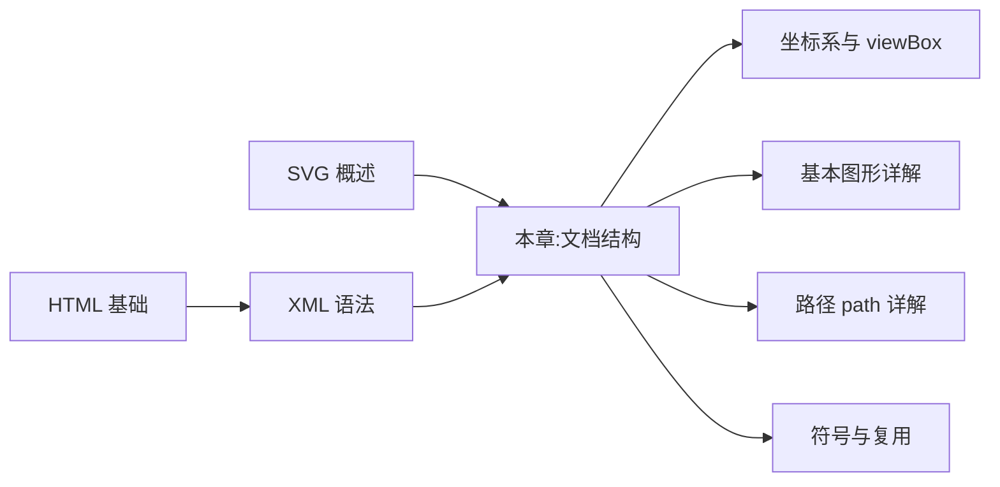
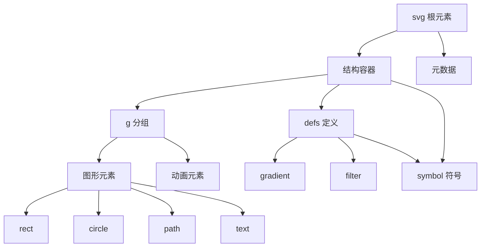

## 1. 学习目标

本章延续 MIT 6.831《用户界面设计与实现》与 CMU 15-213《计算机系统导论》的教学严谨度,在 SVG 概述基础上深入文档结构的形式化定义。学完本章后,学习者应当能够在 Bloom 教育目标分类法的六个层级上达成下列能力。

### 1.1 Bloom 能力矩阵

| 层级 | 行为动词 | 本章目标能力 | 评估方式 |
| ---- | -------- | ------------ | -------- |
| **Remember** 记忆 | 列举、复述 | 能列举 SVG 根元素、容器元素、图形元素、元数据元素的分类 | 选择题、填空题 |
| **Understand** 理解 | 解释、归纳 | 能解释命名空间、属性继承、文档树形结构的语义 | 概念辨析题 |
| **Apply** 应用 | 使用、实现 | 能编写符合 SVG 2 规范的完整文档,正确使用 defs/symbol/use | 实操题 |
| **Analyze** 分析 | 比较、分解 | 能分析嵌套 `<svg>` 与 `<g>` 的差异、可继承与不可继承属性 | 对比分析题 |
| **Evaluate** 评价 | 评判、推荐 | 能评估文档结构的合理性,给出工程化重构建议 | 代码评审题 |
| **Create** 创造 | 设计、构建 | 能设计一个具备可访问性、可维护性的 SVG 文档骨架 | 架构设计题 |

### 1.2 知识图谱前置依赖



### 1.3 学习成果清单

完成本章学习后,学习者应当能够产出:

1. 一份符合 SVG 2 规范的独立 .svg 文件(含 XML 声明、命名空间、`<defs>`、`<symbol>`、`<title>`、`<desc>`)
2. 一份内联 SVG 的 HTML5 文档(具备可访问性)
3. 一份 SVG 文档结构形式化定义说明
4. 一份属性继承规则的速查表

## 2. 历史动机与发展脉络

### 2.1 XML 与 SVG 的语法渊源

SVG 选择 XML 作为语法基础并非偶然。1996 年 W3C 启动 XML(Extensible Markup Language)设计,1998 年发布 XML 1.0 推荐标准。XML 的设计目标包括:

1. **易于在互联网上使用**:文本格式,无二进制依赖
2. **支持广泛的国际化**:基于 Unicode,多语言友好
3. **可读性强**:人类与机器皆可阅读
4. **设计简洁**:语法规则少而清晰
5. **文档结构严格**:DTD/Schema 可校验

XML 的这些特征恰好契合矢量图形描述的需求,因此 SVG 1.0 顺理成章地选择 XML 作为载体。

### 2.2 SVG 文档模型演进

| 版本 | 文档模型变化 | 关键差异 |
| ---- | ------------ | -------- |
| SVG 1.0 | 严格 XML 文档,必须闭合标签 | 与 HTML 不兼容 |
| SVG 1.1 | 模块化,引入 SVG Tiny/Basic | 移动端简化 |
| HTML5 | 内联 SVG 作为外来内容 | HTML 解析器宽松处理 |
| SVG 2 | DOM 接口与 HTML 对齐 | 与 CSS 协同更紧密 |
| SVG 2.1 | 简化命名空间要求 | 内联 SVG 可省略 xmlns |

### 2.3 与 HTML 解析器的协同

HTML5 引入了对内联 SVG 的支持,但 HTML 解析器遵循与 XML 不同的规则:

| 规则 | XML 解析器 | HTML 解析器 |
| ---- | ---------- | ----------- |
| 标签闭合 | 必须严格闭合 | 自动补全 |
| 属性引号 | 必须双引号 | 可省略 |
| 大小写敏感 | 敏感 | 不敏感 |
| 命名空间 | 必须显式声明 | 自动推断 |
| 自闭合 | `<tag/>` | `<tag />` 或 `<tag></tag>` |
| 注释 | `<!-- -->` | `<!-- -->` |

理解这一差异对调试 SVG 至关重要:独立 .svg 文件必须严格 XML,内联 SVG 可宽松。

### 2.4 设计哲学:文档即接口

SVG 的设计哲学可概括为"文档即接口"(Document as Interface):

- 文档是数据:SVG 文档是图形数据的文本表示
- 文档是结构:树形 DOM 反映图形的层次组合关系
- 文档是接口:每个元素是 DOM 节点,可通过 JavaScript/CSS 操作
- 文档是语义:`<title>`、`<desc>` 提供机器可读语义

这一哲学使 SVG 既可作为图像格式,也可作为编程接口,这是其与 Canvas 的本质区别。

## 3. 形式化定义

### 3.1 SVG 文档的形式化模型

SVG 文档可形式化为一个有根的有向树 $T = (V, E)$,其中:

- $V$ 是节点(vertex)有限集合,每个节点 $v \in V$ 是一个元素(element)
- $E \subseteq V \times V$ 是父子关系边,满足:
  - 存在唯一根节点 $r \in V$,无入边
  - 除 $r$ 外,每个节点恰有一个父节点
  - 不存在环

每个节点 $v$ 可表示为元组 $v = (\text{tag}, \text{attrs}, \text{children})$,其中:

- $\text{tag} \in \Sigma$ 是标签名,取自 SVG 标签字母表
- $\text{attrs}: \text{AttrName} \to \text{AttrValue}$ 是属性映射函数
- $\text{children} \subseteq V$ 是子节点有序集合

### 3.2 SVG 标签字母表

SVG 标签字母表 $\Sigma$ 可分类为:

$$
\Sigma = \Sigma_{\text{struct}} \cup \Sigma_{\text{shape}} \cup \Sigma_{\text{text}} \cup \Sigma_{\text{paint}} \cup \Sigma_{\text{anim}} \cup \Sigma_{\text{meta}}
$$

| 类别 | 标签 |
| ---- | ---- |
| 结构 $\Sigma_{\text{struct}}$ | `<svg>` `<g>` `<defs>` `<symbol>` `<use>` `<image>` `<switch>` |
| 图形 $\Sigma_{\text{shape}}$ | `<rect>` `<circle>` `<ellipse>` `<line>` `<polyline>` `<polygon>` `<path>` |
| 文本 $\Sigma_{\text{text}}$ | `<text>` `<tspan>` `<textPath>` `<tref>` |
| 绘制 $\Sigma_{\text{paint}}$ | `<linearGradient>` `<radialGradient>` `<pattern>` `<marker>` `<clipPath>` `<mask>` `<filter>` |
| 动画 $\Sigma_{\text{anim}}$ | `<animate>` `<animateTransform>` `<animateMotion>` `<set>` |
| 元数据 $\Sigma_{\text{meta}}$ | `<title>` `<desc>` `<metadata>` |

### 3.3 属性继承的偏序关系

SVG 属性继承构成一个偏序关系 $\preceq$。设属性 $a$ 可继承至子节点,则:

$$
\text{inherits}(a, v) = \begin{cases}
\text{attrs}(v)[a] & \text{if } a \in \text{attrs}(v) \\
\text{inherits}(a, \text{parent}(v)) & \text{otherwise}
\end{cases}
$$

属性继承遵循"就近原则":从当前节点向上查找,遇到第一个显式声明即停止。

### 3.4 命名空间的形式化

XML 命名空间是一个 URI 引用,用于限定元素与属性名的归属。形式化定义:

$$
\text{QName} = (\text{prefix}, \text{localname})
$$

其中 prefix 通过 xmlns 声明映射到 URI。SVG 默认命名空间:

$$
\text{NS}_{\text{SVG}} = \text{URI}(\text{"http://www.w3.org/2000/svg"})
$$

XLink 命名空间(SVG 1.x 用于 href):

$$
\text{NS}_{\text{XLink}} = \text{URI}(\text{"http://www.w3.org/1999/xlink"})
$$

SVG 2 推荐使用普通 `href` 而非 `xlink:href`,以简化命名空间声明。

### 3.5 文档类型定义(DTD)的简化

SVG 1.1 的 DTD 定义了元素允许的子元素与属性。例如 `<svg>` 元素的 DTD 片段:

```dtd
<!ELEMENT svg (desc?,title?,metadata?,defs?,
              (animate|set|animateMotion|animateTransform|
               circle|ellipse|line|path|polygon|polyline|
               rect|use|image|text|g|switch|svg|
               ...)*)
>
<!ATTLIST svg
  xmlns CDATA #FIXED "http://www.w3.org/2000/svg"
  width %Length; #IMPLIED
  height %Length; #IMPLIED
  viewBox %ViewBoxSpec; #IMPLIED
  ...
>
```

SVG 2 移除了 DTD 依赖,改为通过 RelaxNG 或纯文本规范定义文档模型。

## 4. 理论推导与原理解析

### 4.1 DOM 树的构建算法

浏览器解析 SVG 时构建 DOM 树,其算法复杂度可分析。设文档长度为 $L$,元素数为 $n$:

| 阶段 | 时间复杂度 | 空间复杂度 |
| ---- | ---------- | ---------- |
| 词法分析(tokenization) | $O(L)$ | $O(1)$ |
| 语法分析(parsing) | $O(n)$ | $O(n)$ |
| DOM 树构建 | $O(n)$ | $O(n)$ |
| 属性计算 | $O(n \cdot m)$, $m$ 为属性数 | $O(n \cdot m)$ |

总复杂度 $O(L + n \cdot m)$,在 $L \gg n$ 时瓶颈在 IO,在 $n \cdot m \gg L$ 时瓶颈在属性计算。

### 4.2 属性继承的传递闭包

属性继承可建模为传递闭包计算。设继承关系图 $G = (V, E)$,其中 $(u, v) \in E$ 当且仅当 $v$ 是 $u$ 的子节点。属性 $a$ 的继承值:

$$
\text{val}(a, v) = \begin{cases}
\text{explicit}(a, v) & \text{if explicitly set} \\
\text{val}(a, \text{parent}(v)) & \text{otherwise} \\
\text{default}(a) & \text{if no ancestor sets it}
\end{cases}
$$

这是树形 DP 问题,可在 $O(n)$ 时间内计算所有节点的属性值。

### 4.3 坐标系复合的代数性质

嵌套 `<svg>` 建立的坐标系复合具有代数性质。设外层变换为 $T_1$,内层变换为 $T_2$,则复合变换 $T = T_1 \circ T_2$:

$$
T = T_1 \cdot T_2 = \begin{bmatrix} a_1 & c_1 & e_1 \\ b_1 & d_1 & f_1 \\ 0 & 0 & 1 \end{bmatrix} \cdot \begin{bmatrix} a_2 & c_2 & e_2 \\ b_2 & d_2 & f_2 \\ 0 & 0 & 1 \end{bmatrix}
$$

由于仿射变换集合在矩阵乘法下封闭,且构成一个幺半群(monoid),嵌套 `<svg>` 的复合结果仍是仿射变换,这是 SVG 坐标系代数性质的基础。

### 4.4 `<use>` 引用的语义模型

`<use>` 元素引用 `<symbol>` 或其他元素时,其语义可形式化为"影子 DOM 克隆":

$$
\text{render}(\text{use}) = \text{transform}(\text{clone}(\text{referenced}), \text{use.attrs})
$$

克隆是深拷贝,但保留对原始 `<defs>` 中资源的引用。这一模型的关键性质:

1. **克隆是只读的**:修改原始 `<symbol>` 会影响所有 `<use>` 实例
2. **属性覆盖有限**:`<use>` 上的属性仅部分可继承到克隆(如 fill、stroke)
3. **事件独立**:`<use>` 实例的事件不传播到原始元素

### 4.5 SVG 2 与 CSS 属性的对齐

SVG 2 将许多原 SVG 专有属性提升为 CSS 属性,统一了样式模型。下表列出关键迁移:

| SVG 1.x 属性 | SVG 2 CSS 属性 | 兼容性 |
| ------------- | -------------- | ------ |
| `fill` | `fill` | 完全 |
| `stroke` | `stroke` | 完全 |
| `stroke-width` | `stroke-width` | 完全 |
| `opacity` | `opacity` | 完全 |
| `transform` | `transform` (CSS) | 部分 |
| `display` | `display` | 完全 |
| `visibility` | `visibility` | 完全 |
| `clip-path` | `clip-path` | 完全 |

这一对齐让 SVG 元素可像 HTML 元素一样用 CSS 完整控制,提升了与 Web 生态的融合。

## 5. 代码示例

### 5.1 `<svg>` 根元素

`<svg>` 是 SVG 文档的根元素,承载坐标系、视口与全局属性。

```html
<svg
  width="400"
  height="300"
  viewBox="0 0 400 300"
  xmlns="http://www.w3.org/2000/svg"
  xmlns:xlink="http://www.w3.org/1999/xlink"
>
  <!-- 内容 -->
</svg>
```

#### 5.1.1 关键属性

| 属性 | 作用 | 说明 |
| ---- | ---- | ---- |
| `width` / `height` | 视口尺寸 | 可用像素或百分比;内联 SVG 省略时默认 100% × 100% |
| `viewBox` | 内部坐标系 | `min-x min-y width height`,决定图形映射到视口的方式 |
| `xmlns` | 命名空间 | 独立 .svg 文件必需;内联在 HTML 中可省略 |
| `preserveAspectRatio` | 宽高比策略 | 控制 viewBox 如何适配视口 |
| `role` / `aria-label` | 可访问性 | 为屏幕阅读器提供语义 |

#### 5.1.2 内联 vs 独立文件

```html
<!-- 内联:HTML 解析器宽容,可省略 xmlns -->
<svg viewBox="0 0 100 100">
  <circle cx="50" cy="50" r="40" />
</svg>

<!-- 独立 .svg 文件:必须有 xmlns 与 XML 声明 -->
<?xml version="1.0" encoding="UTF-8"?>
<svg xmlns="http://www.w3.org/2000/svg" viewBox="0 0 100 100">
  <circle cx="50" cy="50" r="40" />
</svg>
```

### 5.2 完整独立 SVG 文档骨架

生产级独立 .svg 文件应包含以下要素:

```xml
<?xml version="1.0" encoding="UTF-8"?>
<svg
  xmlns="http://www.w3.org/2000/svg"
  xmlns:xlink="http://www.w3.org/1999/xlink"
  viewBox="0 0 300 150"
  role="img"
  aria-labelledby="title desc"
>
  <title id="title">品牌 Logo</title>
  <desc id="desc">由矩形与圆形组合而成的简化 Logo,代表 FANDEX 项目</desc>

  <defs>
    <linearGradient id="brand-grad" x1="0%" x2="100%">
      <stop offset="0%" stop-color="#4f5bd5" />
      <stop offset="100%" stop-color="#00b894" />
    </linearGradient>
    <symbol id="dot" viewBox="0 0 20 20">
      <circle cx="10" cy="10" r="8" fill="#fff" />
    </symbol>
  </defs>

  <g fill="url(#brand-grad)">
    <rect x="10" y="30" width="200" height="90" rx="12" />
  </g>

  <use href="#dot" x="180" y="55" width="30" height="30" />
  <text x="110" y="80" text-anchor="middle" fill="#fff" font-size="28" font-family="sans-serif">
    FANDEX
  </text>
</svg>
```

### 5.3 `<g>` 分组元素

`<g>`(group)将多个元素逻辑分组,可统一应用样式与变换。

```html
<svg viewBox="0 0 200 100">
  <g fill="#4f5bd5" stroke="#fff" stroke-width="2">
    <circle cx="50" cy="50" r="30" />
    <rect x="90" y="20" width="60" height="60" rx="8" />
  </g>
</svg>
```

子元素继承 `<g>` 上的 `fill`、`stroke`、`transform` 等可继承属性。`<g>` 是组织复杂图形的核心工具。

#### 5.3.1 配合 transform 的复合变换

```html
<svg viewBox="0 0 400 200">
  <g transform="translate(100, 100)">
    <g transform="rotate(45)">
      <g transform="scale(1.5)">
        <rect x="-20" y="-20" width="40" height="40" fill="#4f5bd5" />
      </g>
    </g>
  </g>
</svg>
```

三层 `<g>` 嵌套实现了平移、旋转、缩放的复合变换。

### 5.4 `<defs>` 定义

`<defs>` 存放可复用资源(渐变、滤镜、符号、路径),**不直接渲染**,通过 `url(#id)` 引用。

```html
<svg viewBox="0 0 200 100">
  <defs>
    <linearGradient id="brand" x1="0%" x2="100%">
      <stop offset="0%" stop-color="#4f5bd5" />
      <stop offset="100%" stop-color="#00b894" />
    </linearGradient>
    <radialGradient id="glow" cx="50%" cy="50%" r="50%">
      <stop offset="0%" stop-color="#fff" stop-opacity="0.8" />
      <stop offset="100%" stop-color="#fff" stop-opacity="0" />
    </radialGradient>
    <filter id="blur">
      <feGaussianBlur stdDeviation="2" />
    </filter>
  </defs>
  <rect width="200" height="100" fill="url(#brand)" />
  <circle cx="100" cy="50" r="30" fill="url(#glow)" filter="url(#blur)" />
</svg>
```

`<defs>` 内的元素**不参与渲染**,只有被引用时才实例化,这是性能优化的关键。

### 5.5 `<symbol>` 符号

`<symbol>` 类似 `<g>`,但**自带 viewBox**,适合定义可复用图标,配合 `<use>` 实例化。

```html
<svg>
  <symbol id="icon-close" viewBox="0 0 24 24">
    <path d="M6 6 L18 18 M18 6 L6 18" stroke="currentColor" stroke-width="2" />
  </symbol>
  <use href="#icon-close" x="0" y="0" width="24" height="24" />
</svg>
```

`<symbol>` 与 `<g>` 的核心区别:

| 特性 | `<g>` | `<symbol>` |
| ---- | ----- | ---------- |
| 自带 viewBox | 否 | 是 |
| 直接渲染 | 是 | 否(需 `<use>` 引用) |
| 适用场景 | 逻辑分组 | 图标定义 |
| 配合 `<use>` | 可 | 推荐 |

### 5.6 `<use>` 引用

`<use>` 复制并实例化 `<g>`、`<symbol>` 或其他元素。

```html
<use href="#icon-close" x="100" y="50" width="32" height="32" fill="#d63031" />
```

`href` 替代了旧版的 `xlink:href`(SVG 2 推荐)。跨文件引用:

```html
<use href="icons.svg#icon-close" width="24" height="24" />
```

跨文件引用的注意事项:

1. 受同源策略限制,跨域 SVG 需配置 CORS
2. 部分浏览器对外部 `<use>` 支持不完整
3. 内联 `<symbol>` + `<use>` 是最稳健的方案

### 5.7 `<title>` 与 `<desc>`

为可访问性提供标题与描述,类似 ``。

```html
<svg viewBox="0 0 200 100" role="img" aria-labelledby="t d">
  <title id="t">2024 年度销售额</title>
  <desc id="d">柱状图展示四个季度的销售额对比</desc>
  <!-- 图形 -->
</svg>
```

可访问性要点:

1. `<title>` 必须是 SVG 的第一个子元素
2. `<desc>` 紧跟 `<title>` 之后
3. `aria-labelledby` 引用两者的 id
4. 屏幕阅读器优先读 `<title>`,详细时读 `<desc>`

### 5.8 `<metadata>` 元数据

存放 RDF / DC 等元信息,不参与渲染。

```html
<metadata>
  <rdf:RDF xmlns:rdf="http://www.w3.org/1999/02/22-rdf-syntax-ns#">
    <rdf:Description rdf:about="" xmlns:dc="http://purl.org/dc/elements/1.1/">
      <dc:creator>fanquanpp</dc:creator>
      <dc:date>2026-07-18</dc:date>
      <dc:rights>Copyright 2026 FANDEX</dc:rights>
      <dc:description>SVG 教程示例文档</dc:description>
    </rdf:Description>
  </rdf:RDF>
</metadata>
```

Dublin Core(DC)常用字段:

| 字段 | 含义 |
| ---- | ---- |
| `dc:title` | 标题 |
| `dc:creator` | 创作者 |
| `dc:date` | 创建日期 |
| `dc:rights` | 版权声明 |
| `dc:description` | 描述 |
| `dc:format` | 格式 |

### 5.9 `<switch>` 与特性检测

`<switch>` 按顺序渲染第一个 `requiredFeatures` 匹配的子元素,用于兼容降级。

```html
<switch>
  <text requiredFeatures="http://www.w3.org/TR/SVG11/feature#Extensibility">
    高级特性可用
  </text>
  <text>降级文本</text>
</switch>
```

`<switch>` 在 SVG 2 中已不推荐使用,改为基于 CSS 的特性检测:

```css
@supports (display: grid) {
  .modern-svg {
    display: grid;
  }
}
```

## 6. 元素嵌套规则

### 6.1 容器元素

可包含其他图形元素的容器:`<svg>`、`<g>`、`<defs>`、`<symbol>`、`<a>`、`<mask>`、`<pattern>`、`<marker>`。

### 6.2 图形元素

只能作为叶子节点或包含动画元素:`<rect>`、`<circle>`、`<ellipse>`、`<line>`、`<polyline>`、`<polygon>`、`<path>`、`<text>`、`<image>`、`<use>`。

### 6.3 嵌套规则表



### 6.4 嵌套 `<svg>` 建立子坐标系

`<svg>` 可嵌套,建立独立坐标系,常用于组件化场景。

```html
<svg viewBox="0 0 400 200">
  <svg x="0" y="0" width="200" height="200" viewBox="0 0 100 100">
    <circle cx="50" cy="50" r="40" fill="#4f5bd5" />
  </svg>
  <svg x="200" y="0" width="200" height="200" viewBox="0 0 100 100">
    <rect x="10" y="10" width="80" height="80" fill="#00b894" />
  </svg>
</svg>
```

嵌套 `<svg>` 与 `<g>` 的区别:

| 特性 | 嵌套 `<svg>` | `<g>` |
| ---- | ------------ | ----- |
| 独立 viewBox | 是 | 否 |
| 独立 width/height | 是 | 否 |
| 裁剪超出内容 | 默认是 | 否 |
| 性能开销 | 较高 | 较低 |
| 适用场景 | 组件化 | 逻辑分组 |

## 7. 属性继承规则

### 7.1 可继承属性

| 类别 | 属性 |
| ---- | ---- |
| 颜色 | `color`、`fill`、`stroke`、`stop-color` |
| 描边 | `stroke-width`、`stroke-linecap`、`stroke-linejoin`、`stroke-dasharray` |
| 文本 | `font-family`、`font-size`、`font-weight`、`text-anchor`、`direction` |
| 其他 | `opacity`、`visibility`、`cursor`、`letter-spacing` |

### 7.2 不可继承属性

`x`、`y`、`cx`、`cy`、`r`、`width`、`height`、`transform`、`filter`、`clip-path`、`mask` 等几何与变换属性不可继承。

### 7.3 `currentColor` 关键字

`currentColor` 引用当前元素的 `color` 属性,实现与 CSS 联动的主题色。

```html
<g color="#d63031">
  <rect width="100" height="100" fill="currentColor" />
  <circle cx="150" cy="50" r="40" stroke="currentColor" fill="none" />
</g>
```

修改 `color` 即可统一调整 fill 与 stroke 颜色,是图标系统主题化的核心技巧。

### 7.4 继承链查找算法

属性继承的查找算法可形式化描述:

```text
function getComputedAttr(element, attrName):
  current = element
  while current is not null:
    if current has explicit attrName:
      return current.attrName
    current = current.parent
  return default(attrName)
```

这是树形向上查找,时间复杂度 $O(d)$,其中 $d$ 为树深度。

## 8. 对比分析

### 8.1 SVG vs HTML 文档结构

| 维度 | SVG 文档 | HTML 文档 |
| ---- | -------- | --------- |
| 解析器 | XML 解析器(独立文件) | HTML 解析器 |
| 命名空间 | 必需 | 内置 |
| 标签大小写 | 敏感 | 不敏感 |
| 属性引号 | 必需 | 可选 |
| 自闭合 | 必需 | 可选 |
| 严格性 | 严格 | 宽松 |
| 默认渲染 | 矢量图形 | 流式布局 |

### 8.2 `<g>` vs `<symbol>` vs `<defs>`

| 元素 | 渲染 | viewBox | 适用场景 |
| ---- | ---- | ------- | -------- |
| `<g>` | 直接渲染 | 否 | 逻辑分组,统一变换/样式 |
| `<symbol>` | 不直接渲染 | 是 | 图标定义,配合 `<use>` |
| `<defs>` | 不直接渲染 | 否 | 资源仓库,存放渐变/滤镜/符号 |

### 8.3 `<use>` vs JavaScript 克隆

| 方式 | 优势 | 劣势 |
| ---- | ---- | ---- |
| `<use>` | 声明式,性能优 | 属性覆盖有限 |
| JS 克隆 | 完全控制 | 性能开销大,需手动维护 |

### 8.4 与其他文档模型对比

| 模型 | 描述 | 与 SVG 关系 |
| ---- | ---- | ------------ |
| HTML DOM | 流式文档 | 内联 SVG 嵌入其中 |
| XML DOM | 通用树形文档 | SVG 是 XML 子集 |
| DOM 4 | 现代 DOM 标准 | SVG 2 与之对齐 |
| Shadow DOM | Web Components 隔离 | `<use>` 类似但非真 Shadow DOM |

## 9. 常见陷阱与最佳实践

### 9.1 陷阱 1:独立 SVG 文件缺少 XML 声明

```xml
<!-- 错误:缺少 XML 声明,部分浏览器拒绝解析 -->
<svg viewBox="0 0 100 100">
  <circle cx="50" cy="50" r="40" />
</svg>

<!-- 正确:独立文件必须有 XML 声明 -->
<?xml version="1.0" encoding="UTF-8"?>
<svg viewBox="0 0 100 100">
  <circle cx="50" cy="50" r="40" />
</svg>
```

### 9.2 陷阱 2:xmlns 命名空间缺失

```xml
<!-- 错误:独立 SVG 文件无命名空间,被识别为普通 XML -->
<?xml version="1.0"?>
<svg viewBox="0 0 100 100">
  <circle cx="50" cy="50" r="40" />
</svg>

<!-- 正确:声明 SVG 命名空间 -->
<?xml version="1.0" encoding="UTF-8"?>
<svg xmlns="http://www.w3.org/2000/svg" viewBox="0 0 100 100">
  <circle cx="50" cy="50" r="40" />
</svg>
```

### 9.3 陷阱 3:`<defs>` 内的元素被渲染

```html
<!-- 错误:期望 defs 内的 circle 不显示,但写在 defs 外 -->
<svg viewBox="0 0 100 100">
  <circle cx="50" cy="50" r="40" fill="#4f5bd5" />
  <defs>
    <linearGradient id="g">...</linearGradient>
  </defs>
</svg>

<!-- 正确:defs 内的资源不会被渲染 -->
<svg viewBox="0 0 100 100">
  <defs>
    <linearGradient id="g">...</linearGradient>
    <circle id="c" cx="50" cy="50" r="40" fill="#4f5bd5" />
  </defs>
  <use href="#c" />
</svg>
```

### 9.4 陷阱 4:`<symbol>` 直接渲染

```html
<!-- 错误:symbol 不会直接渲染 -->
<svg viewBox="0 0 100 100">
  <symbol id="icon">
    <circle cx="50" cy="50" r="40" />
  </symbol>
</svg>

<!-- 正确:必须用 use 引用 -->
<svg viewBox="0 0 100 100">
  <symbol id="icon" viewBox="0 0 100 100">
    <circle cx="50" cy="50" r="40" />
  </symbol>
  <use href="#icon" width="100" height="100" />
</svg>
```

### 9.5 陷阱 5:`xlink:href` 与 `href` 混用

```html
<!-- 旧版(SVG 1.x):使用 xlink:href -->
<use xlink:href="#icon" />

<!-- 新版(SVG 2 推荐):使用 href -->
<use href="#icon" />

<!-- 兼容写法:同时声明 -->
<use href="#icon" xlink:href="#icon" />
```

**最佳实践**:优先使用 `href`,如需兼容老浏览器(IE 11)才同时声明。

### 9.6 陷阱 6:`<title>` 位置错误

```html
<!-- 错误:title 不是第一个子元素,屏幕阅读器不读取 -->
<svg viewBox="0 0 100 100">
  <circle cx="50" cy="50" r="40" />
  <title>圆形</title>
</svg>

<!-- 正确:title 必须是第一个子元素 -->
<svg viewBox="0 0 100 100">
  <title>圆形</title>
  <circle cx="50" cy="50" r="40" />
</svg>
```

### 9.7 陷阱 7:属性继承误用

```html
<!-- 错误:期望 width/height 可继承到子元素 -->
<svg width="100" height="100">
  <g>
    <!-- rect 不会继承 width/height,需显式声明 -->
    <rect x="10" y="10" />
  </g>
</svg>

<!-- 正确:几何属性不可继承 -->
<svg viewBox="0 0 100 100">
  <rect x="10" y="10" width="80" height="80" />
</svg>
```

### 9.8 浏览器兼容性最佳实践

| 特性 | Chrome | Firefox | Safari | Edge | 兼容策略 |
| ---- | ------ | ------- | ------ | ---- | -------- |
| `<symbol>` + `<use>` | 全部 | 全部 | 全部 | 全部 | 直接使用 |
| `href` 替代 `xlink:href` | 88+ | 85+ | 13+ | 88+ | 优先 href |
| 跨文件 `<use>` | 部分 | 部分 | 部分 | 部分 | 内联为佳 |
| 嵌套 `<svg>` | 全部 | 全部 | 全部 | 全部 | 直接使用 |
| `<switch>` | 全部 | 全部 | 全部 | 全部 | 已弃用,改用 CSS |

### 9.9 可访问性最佳实践

```html
<svg
  viewBox="0 0 100 100"
  role="img"
  aria-labelledby="title-id desc-id"
  aria-describedby="extra-info"
>
  <title id="title-id">2024 年度销售额</title>
  <desc id="desc-id">柱状图展示四个季度的销售额对比,Q3 达到峰值 210 万</desc>
  <!-- 图形 -->
</svg>
```

可访问性检查清单:

- [ ] `<title>` 是 SVG 的第一个子元素
- [ ] `<desc>` 紧跟 `<title>`
- [ ] `role="img"` 标识为图像
- [ ] `aria-labelledby` 关联 title 与 desc
- [ ] 装饰性 SVG 用 `aria-hidden="true"`
- [ ] 交互元素添加 `tabindex="0"`

### 9.10 性能优化清单

- [ ] 复杂资源放 `<defs>`,延迟渲染
- [ ] 复用图形用 `<symbol>` + `<use>`
- [ ] 减少 `<g>` 嵌套层级(深度 < 10)
- [ ] 避免深层 transform 复合(每层增加计算)
- [ ] 大型 SVG 拆分为多个小 SVG
- [ ] DOM 节点数控制在 5000 以内
- [ ] `<defs>` 内的资源按需声明,避免无用资源

## 10. 工程实践

### 10.1 生产级 SVG 文档骨架

```xml
<?xml version="1.0" encoding="UTF-8"?>
<svg
  xmlns="http://www.w3.org/2000/svg"
  xmlns:xlink="http://www.w3.org/1999/xlink"
  viewBox="0 0 24 24"
  role="img"
  aria-labelledby="icon-title icon-desc"
  class="fandex-icon"
>
  <title id="icon-title">关闭</title>
  <desc id="icon-desc">关闭按钮的 X 图标,用于对话框或抽屉</desc>

  <defs>
    <symbol id="icon-close" viewBox="0 0 24 24">
      <path
        d="M6 6 L18 18 M18 6 L6 18"
        fill="none"
        stroke="currentColor"
        stroke-width="2"
        stroke-linecap="round"
      />
    </symbol>
  </defs>

  <use href="#icon-close" width="24" height="24" />
</svg>
```

### 10.2 SVG 雪碧图(Sprite)

将多个图标合并为一个 SVG 文件,通过 `<use>` 引用,减少 HTTP 请求:

```html
<!DOCTYPE html>
<html lang="zh-CN">
  <head>
    <meta charset="UTF-8" />
    <title>SVG 雪碧图示例</title>
  </head>
  <body>
    <!-- 雪碧图:display:none 防止渲染 -->
    <svg style="display:none" aria-hidden="true">
      <symbol id="icon-home" viewBox="0 0 24 24">
        <path d="M3 9l9-7 9 7v11a2 2 0 0 1-2 2H5a2 2 0 0 1-2-2z" />
      </symbol>
      <symbol id="icon-search" viewBox="0 0 24 24">
        <circle cx="11" cy="11" r="8" />
        <line x1="21" y1="21" x2="16.65" y2="16.65" />
      </symbol>
      <symbol id="icon-user" viewBox="0 0 24 24">
        <path d="M20 21v-2a4 4 0 0 0-4-4H8a4 4 0 0 0-4 4v2" />
        <circle cx="12" cy="7" r="4" />
      </symbol>
    </svg>

    <!-- 使用图标 -->
    <svg width="24" height="24" fill="currentColor">
      <use href="#icon-home" />
    </svg>
    <svg width="24" height="24" fill="currentColor">
      <use href="#icon-search" />
    </svg>
    <svg width="24" height="24" fill="currentColor">
      <use href="#icon-user" />
    </svg>
  </body>
</html>
```

### 10.3 React 组件封装

```tsx
// components/Icon.tsx
import React from 'react';
import { IconName } from './icon-types';

interface IconProps extends React.SVGProps<SVGSVGElement> {
  name: IconName;
  size?: number;
  title?: string;
  desc?: string;
}

export const Icon: React.FC<IconProps> = ({
  name,
  size = 24,
  title,
  desc,
  ...props
}) => {
  const titleId = title ? `icon-${name}-title` : undefined;
  const descId = desc ? `icon-${name}-desc` : undefined;
  const labelledBy = titleId || descId
    ? [titleId, descId].filter(Boolean).join(' ')
    : undefined;

  return (
    <svg
      viewBox="0 0 24 24"
      width={size}
      height={size}
      fill="none"
      stroke="currentColor"
      strokeWidth={2}
      strokeLinecap="round"
      strokeLinejoin="round"
      role="img"
      aria-labelledby={labelledBy}
      aria-hidden={title ? undefined : true}
      {...props}
    >
      {title && <title id={titleId}>{title}</title>}
      {desc && <desc id={descId}>{desc}</desc>}
      <use href={`#icon-${name}`} />
    </svg>
  );
};
```

### 10.4 Vue 组件封装

```vue
<!-- components/Icon.vue -->
<script setup lang="ts">
import { computed } from 'vue';

interface Props {
  name: string;
  size?: number;
  title?: string;
  desc?: string;
}

const props = withDefaults(defineProps<Props>(), {
  size: 24,
  title: '',
  desc: ''
});

const titleId = computed(() => `icon-${props.name}-title`);
const descId = computed(() => `icon-${props.name}-desc`);
const labelledBy = computed(() =>
  [props.title ? titleId.value : '', props.desc ? descId.value : '']
    .filter(Boolean)
    .join(' ')
);
</script>

<template>
  <svg
    :viewBox="`0 0 24 24`"
    :width="size"
    :height="size"
    fill="none"
    stroke="currentColor"
    :stroke-width="2"
    stroke-linecap="round"
    stroke-linejoin="round"
    role="img"
    :aria-labelledby="labelledBy || undefined"
    :aria-hidden="title ? undefined : true"
  >
    <title v-if="title" :id="titleId">{{ title }}</title>
    <desc v-if="desc" :id="descId">{{ desc }}</desc>
    <use :href="`#icon-${name}`" />
  </svg>
</template>
```

### 10.5 调试工具

#### 10.5.1 浏览器开发者工具

Chrome DevTools 是调试 SVG 文档结构的利器:

| 面板 | 用途 |
| ---- | ---- |
| Elements | 查看 DOM 树、编辑属性 |
| Console | `document.querySelector('svg')` |
| Accessibility | 检查 ARIA 标签 |
| Performance | 分析渲染性能 |

#### 10.5.2 在线工具

- **W3C Validator**:https://validator.w3.org/
- **SVG Validator**:https://svgvalidator.appspot.com/
- **SVGOMG**:https://jakearchibald.github.io/svgomg/

### 10.6 设计工具集成

#### 10.6.1 Figma SVG 导出配置

1. 选中图层
2. 右键 → "Copy as SVG"
3. 在设置中启用:
   - "Outline text"(文字转路径)
   - "Include id attribute"(保留 id)
   - 关闭 "Simplify stroke"(保留原始路径)

#### 10.6.2 Adobe Illustrator SVG 导出

| 选项 | 推荐值 | 原因 |
| ---- | ------ | ---- |
| SVG Profiles | SVG 1.1 | 兼容性最佳 |
| Fonts | Convert to outline | 避免字体缺失 |
| Decimal places | 2 | 精度与体积平衡 |
| Minification | 启用 | 减小体积 |
| Object IDs | Layer Names | 便于调试 |

### 10.7 自动化校验脚本

```javascript
// scripts/validate-svg-structure.mjs
import { readFile } from 'node:fs/promises';
import { glob } from 'node:fs/promises';

const CHECKS = [
  {
    name: 'XML 声明',
    test: content => content.startsWith('<?xml'),
    message: '独立 SVG 文件必须以 XML 声明开头'
  },
  {
    name: 'SVG 命名空间',
    test: content => content.includes('xmlns="http://www.w3.org/2000/svg"'),
    message: '必须声明 SVG 命名空间'
  },
  {
    name: 'viewBox 属性',
    test: content => /viewBox="[^"]+"/.test(content),
    message: '必须声明 viewBox 以支持响应式'
  },
  {
    name: 'title 元素',
    test: content => /<title[^>]*>/.test(content),
    message: '建议提供 <title> 用于可访问性'
  },
  {
    name: 'desc 元素',
    test: content => /<desc[^>]*>/.test(content),
    message: '建议提供 <desc> 用于可访问性'
  },
  {
    name: '无 width/height 属性',
    test: content => !/<svg[^>]*\s(width|height)=/.test(content),
    message: '图标 SVG 应通过 viewBox + CSS 控制尺寸'
  }
];

async function validateSvg(filePath) {
  const content = await readFile(filePath, 'utf8');
  const errors = [];

  for (const check of CHECKS) {
    if (!check.test(content)) {
      errors.push(`${check.name}: ${check.message}`);
    }
  }

  return { filePath, errors };
}

const files = process.argv.slice(2);
const results = await Promise.all(files.map(validateSvg));
const failed = results.filter(r => r.errors.length > 0);

if (failed.length > 0) {
  console.error('校验失败:');
  failed.forEach(f => {
    console.error(`  ${f.filePath}:`);
    f.errors.forEach(e => console.error(`    - ${e}`));
  });
  process.exit(1);
} else {
  console.log(`✓ 所有 ${files.length} 个 SVG 校验通过`);
}
```

## 11. 案例研究

### 11.1 案例一:Bootstrap Icons 的文档结构

Bootstrap Icons 采用简洁的文档结构:

```html
<svg xmlns="http://www.w3.org/2000/svg" width="16" height="16" fill="currentColor" class="bi bi-arrow-right" viewBox="0 0 16 16">
  <path fill-rule="evenodd" d="M1 8a.5.5 0 0 1 .5-.5h11.793l-3.147-3.146a.5.5 0 0 1 .708-.708l4 4a.5.5 0 0 1 0 .708l-4 4a.5.5 0 0 1-.708-.708L13.293 8.5H1.5A.5.5 0 0 1 1 8z"/>
</svg>
```

特点:

1. 直接 inline 在 HTML 中,无 XML 声明
2. 使用 `fill="currentColor"` 支持主题化
3. viewBox 为 16x16,适合小图标
4. 通过 class 提供样式钩子

### 11.2 案例二:Heroicons 的 React 组件结构

Heroicons 提供独立的 React 组件:

```tsx
import React from 'react';

export const HomeIcon = (props: React.SVGProps<SVGSVGElement>) => {
  return (
    <svg
      xmlns="http://www.w3.org/2000/svg"
      fill="none"
      viewBox="0 0 24 24"
      strokeWidth={1.5}
      stroke="currentColor"
      {...props}
    >
      <path
        strokeLinecap="round"
        strokeLinejoin="round"
        d="M2.25 12l8.954-8.955c.44-.439 1.152-.439 1.591 0L21.75 12M4.5 9.75v10.5a.75.75 0 01.75.75h4.5a.75.75 0 01.75-.75V15a.75.75 0 01.75-.75h3a.75.75 0 01.75.75v5.25c0 .414.336.75.75.75h4.5a.75.75 0 00.75-.75V9.75M8.25 21h8.25"
      />
    </svg>
  );
};
```

工程亮点:

1. 每个 SVG 独立组件,支持 tree-shaking
2. 通过 `props` 透传,完全可定制
3. 使用 `stroke="currentColor"` 支持主题
4. strokeLinecap 与 strokeLinejoin 统一风格

### 11.3 案例三:FANDEX 项目的 SVG 架构

```text
src/
├── components/ui/svg/
│   ├── icons/
│   │   ├── Icon.tsx                通用 Icon 组件
│   │   ├── icon-sprite.svg         雪碧图
│   │   └── icon-types.ts           图标类型
│   ├── illustrations/
│   │   └── illustration-*.tsx      插画组件
│   └── patterns/
│       └── pattern-*.svg           装饰图案
├── assets/svg/                     原始 SVG 资源
└── styles/svg-theme.ts             SVG 主题配置
```

### 11.4 案例四:Google Material Symbols 的结构

Google Material Symbols 提供 SVG 与字体双格式:

```html
<!-- SVG 格式 -->
<svg xmlns="http://www.w3.org/2000/svg" viewBox="0 0 24 24" fill="currentColor">
  <path d="M10 20v-6h4v6h5v-8h3L12 3 2 12h3v8z"/>
</svg>

<!-- 字体格式 -->
<span class="material-symbols-outlined">home</span>
```

SVG 优势:

1. 支持 fill/stroke 双模式
2. 可变字重(weight、grade、optical size)
3. 支持 fill-rule 复杂填充规则

### 11.5 案例五:Lucide Icons 的源文档结构

Lucide Icons(原 Feather Icons)采用严格的文档规范:

```xml
<?xml version="1.0" encoding="UTF-8"?>
<svg
  xmlns="http://www.w3.org/2000/svg"
  width="24"
  height="24"
  viewBox="0 0 24 24"
  fill="none"
  stroke="currentColor"
  stroke-width="2"
  stroke-linecap="round"
  stroke-linejoin="round"
>
  <circle cx="11" cy="11" r="8"/>
  <line x1="21" y1="21" x2="16.65" y2="16.65"/>
</svg>
```

设计原则:

1. 24x24 viewBox 网格
2. 描边宽度统一 2px
3. 端点与拐角圆润(round)
4. fill="none",stroke="currentColor"
5. 坐标尽量整数

## 12. 习题

### 12.1 选择题

**题目 2.1** 下列哪个元素**不会**直接渲染到屏幕?

A. `<g>`
B. `<symbol>`
C. `<rect>`
D. `<circle>`

<details>
<summary>答案与解析</summary>

答案:B

`<symbol>` 用于定义可复用符号,需通过 `<use>` 引用才会渲染。`<g>` 是分组元素会直接渲染其子元素,`<rect>` 与 `<circle>` 是图形元素会直接渲染。
</details>

**题目 2.2** 在 SVG 文档中,`<title>` 元素必须位于哪个位置?

A. 任意位置
B. SVG 根元素的第一个子元素
C. SVG 根元素的最后一个子元素
D. 紧跟 `<defs>` 之后

<details>
<summary>答案与解析</summary>

答案:B

根据 SVG 规范,`<title>` 必须是其父元素的第一个子元素。屏幕阅读器按文档顺序读取,因此 `<title>` 必须在最前。`<desc>` 通常紧跟 `<title>` 之后。
</details>

**题目 2.3** 下列哪个属性**不可继承**?

A. `fill`
B. `stroke`
C. `transform`
D. `font-size`

<details>
<summary>答案与解析</summary>

答案:C

`transform` 是不可继承属性,每个元素需独立声明变换。`fill`、`stroke`、`font-size` 都是可继承属性,子元素会自动获得父元素的值。
</details>

**题目 2.4** SVG 2 推荐使用哪个属性替代 `xlink:href`?

A. `src`
B. `href`
C. `url`
D. `ref`

<details>
<summary>答案与解析</summary>

答案:B

SVG 2 将 `xlink:href` 简化为 `href`,无需声明 XLink 命名空间。现代浏览器全部支持 `href`,旧版浏览器(IE 11)才需 `xlink:href`。
</details>

**题目 2.5** 关于 `<symbol>` 与 `<g>` 的区别,下列哪项**正确**?

A. `<symbol>` 直接渲染,`<g>` 不直接渲染
B. `<symbol>` 自带 viewBox,`<g>` 不自带
C. `<symbol>` 用于分组,`<g>` 用于图标定义
D. 两者完全等价

<details>
<summary>答案与解析</summary>

答案:B

`<symbol>` 自带 viewBox 属性,适合定义可复用图标。`<g>` 不自带 viewBox,但会直接渲染。`<symbol>` 不直接渲染,需 `<use>` 引用;`<g>` 直接渲染其子元素。
</details>

### 12.2 填空题

**题目 2.6** SVG 文档形式化为有根有向树 $T = (V, E)$,其中 $V$ 是 ______ 集合,$E$ 是 ______ 关系。

<details>
<summary>答案与解析</summary>

答案:节点(vertex);父子

SVG 文档是一棵有根有向树,每个节点是一个元素,边表示父子包含关系。根节点是 `<svg>`,无入边;除根外每个节点恰有一个父节点。
</details>

**题目 2.7** SVG 默认命名空间的 URI 是 ______。

<details>
<summary>答案与解析</summary>

答案:http://www.w3.org/2000/svg

SVG 命名空间 URI 为 `http://www.w3.org/2000/svg`,通过 `xmlns="..."` 声明。独立 .svg 文件必须声明,内联在 HTML 中的 SVG 可省略(由 HTML 解析器自动处理)。
</details>

**题目 2.8** 在 SVG 中,`<use>` 引用 `<symbol>` 时,通过 ______ 属性指定引用目标,通过 ______ 和 ______ 属性指定实例位置。

<details>
<summary>答案与解析</summary>

答案:href(或 xlink:href);x;y

`<use href="#id" x="100" y="50" />` 通过 href 引用目标,通过 x、y 指定实例在父坐标系中的位置,通过 width、height 指定实例尺寸。
</details>

**题目 2.9** SVG 属性继承遵循 ______ 原则,即从当前节点向上查找,遇到第一个显式声明即停止。

<details>
<summary>答案与解析</summary>

答案:就近

SVG 属性继承是就近原则:从当前节点开始,沿父链向上查找,遇到第一个显式声明的属性值即采用,若到达根节点仍未找到则使用默认值。这是树形 DP 的典型应用。
</details>

**题目 2.10** `currentColor` 关键字引用当前元素的 ______ 属性,实现与 CSS 联动的主题色。

<details>
<summary>答案与解析</summary>

答案:color

`currentColor` 是一个特殊关键字,它引用当前元素的 `color` CSS 属性值。通过修改 `color` 即可统一调整 fill 与 stroke 颜色,是图标系统主题化的核心技巧。
</details>

### 12.3 编程题

**题目 2.11** 编写一个完整的独立 SVG 文件,要求:

1. 包含 XML 声明与 SVG 命名空间
2. viewBox 为 "0 0 100 100"
3. 在 `<defs>` 中定义 `<symbol>` 表示一个圆形图标
4. 使用 `<use>` 实例化该图标三次,位置分别为 (10,10)、(40,40)、(70,70)
5. 包含 `<title>` 与 `<desc>` 用于可访问性

<details>
<summary>参考答案</summary>

```xml
<?xml version="1.0" encoding="UTF-8"?>
<svg
  xmlns="http://www.w3.org/2000/svg"
  viewBox="0 0 100 100"
  role="img"
  aria-labelledby="title-id desc-id"
>
  <title id="title-id">三个圆形图标</title>
  <desc id="desc-id">演示 symbol 与 use 的复用机制</desc>

  <defs>
    <symbol id="circle-icon" viewBox="0 0 20 20">
      <circle cx="10" cy="10" r="8" fill="#4f5bd5" />
    </symbol>
  </defs>

  <use href="#circle-icon" x="10" y="10" width="20" height="20" />
  <use href="#circle-icon" x="40" y="40" width="20" height="20" />
  <use href="#circle-icon" x="70" y="70" width="20" height="20" />
</svg>
```

要点:
1. XML 声明在文档第一行
2. xmlns 命名空间必须声明
3. `<symbol>` 在 `<defs>` 内,不直接渲染
4. `<use>` 通过 href 引用 symbol
5. 每次实例化可指定不同 x/y 位置
6. `<title>` 必须是 `<svg>` 的第一个子元素
</details>

**题目 2.12** 设计一个 SVG 雪碧图文件,包含至少 3 个图标(home、search、user),并提供在 HTML 中使用的方式。

<details>
<summary>参考答案</summary>

sprites/icons.svg:

```xml
<?xml version="1.0" encoding="UTF-8"?>
<svg xmlns="http://www.w3.org/2000/svg" style="display:none" aria-hidden="true">
  <symbol id="icon-home" viewBox="0 0 24 24" fill="none" stroke="currentColor" stroke-width="2" stroke-linecap="round" stroke-linejoin="round">
    <path d="M3 9l9-7 9 7v11a2 2 0 0 1-2 2H5a2 2 0 0 1-2-2z"/>
    <polyline points="9 22 9 12 15 12 15 22"/>
  </symbol>
  <symbol id="icon-search" viewBox="0 0 24 24" fill="none" stroke="currentColor" stroke-width="2" stroke-linecap="round" stroke-linejoin="round">
    <circle cx="11" cy="11" r="8"/>
    <line x1="21" y1="21" x2="16.65" y2="16.65"/>
  </symbol>
  <symbol id="icon-user" viewBox="0 0 24 24" fill="none" stroke="currentColor" stroke-width="2" stroke-linecap="round" stroke-linejoin="round">
    <path d="M20 21v-2a4 4 0 0 0-4-4H8a4 4 0 0 0-4 4v2"/>
    <circle cx="12" cy="7" r="4"/>
  </symbol>
</svg>
```

使用方式一:直接内联在 HTML 中

```html
<!DOCTYPE html>
<html lang="zh-CN">
  <head>
    <meta charset="UTF-8" />
    <title>SVG Sprite</title>
  </head>
  <body>
    <!-- 内联雪碧图 -->
    <svg style="display:none" aria-hidden="true">
      <symbol id="icon-home" viewBox="0 0 24 24">
        <path d="M3 9l9-7 9 7v11a2 2 0 0 1-2 2H5a2 2 0 0 1-2-2z"/>
      </symbol>
      <!-- 其他 symbol -->
    </svg>

    <!-- 使用图标 -->
    <button>
      <svg width="24" height="24" fill="currentColor">
        <use href="#icon-home" />
      </svg>
      首页
    </button>
  </body>
</html>
```

使用方式二:外部引用(同源)

```html
<svg width="24" height="24">
  <use href="sprites/icons.svg#icon-home" />
</svg>
```
</details>

### 12.4 思考题

**题目 2.13** 为什么 SVG 选择 XML 而非自定义二进制格式作为语法基础?结合文档结构的需求分析。

<details>
<summary>参考思路</summary>

从文档结构需求角度分析:

1. **树形结构天然适配**:XML 是树形文档,SVG 图形也需要层次组合(`<g>` 嵌套、`<defs>` 包含资源),树形结构完美契合
2. **属性键值对**:SVG 元素需要大量属性(x、y、width、fill 等),XML 的 attribute 模型直接支持
3. **DOM 互操作**:XML 解析后即得 DOM,SVG 元素成为 DOM 节点,可与 JavaScript/CSS 互操作
4. **可校验性**:DTD/Schema 可校验文档合法性,二进制格式需自定义校验
5. **可读性**:文本格式便于开发者阅读调试,二进制需十六进制查看
6. **国际化**:XML 基于 Unicode,天然支持多语言文本
7. **可扩展性**:通过命名空间可嵌入其他 XML 词汇(RDF 元数据、XSLT 变换)

权衡:文件体积较大,但通过 SVGO 等工具可压缩 30-70%,可接受。
</details>

**题目 2.14** 在什么场景下应该使用 `<symbol>`,什么场景下应该使用 `<g>`?给出工程化决策依据。

<details>
<summary>参考思路</summary>

`<symbol>` 适用场景:

1. **图标系统**:每个图标定义为一个 `<symbol>`,通过 `<use>` 实例化
2. **可复用组件**:需要在多处使用的图形,且尺寸需要独立调整
3. **响应式图标**:不同尺寸下显示同一图标(通过 width/height 控制)
4. **大型 SVG 库**:大量可复用图形,集中管理

`<g>` 适用场景:

1. **逻辑分组**:同一 SVG 内的元素分组,统一应用 transform/style
2. **直接渲染**:需要立即显示的图形组合
3. **样式继承**:为子元素统一设置 fill/stroke
4. **动画分组**:统一应用动画

决策依据:
- 需要复用 + 自带 viewBox → `<symbol>`
- 直接渲染 + 逻辑分组 → `<g>`
- 资源仓库 → `<defs>`

工程化最佳实践:图标全部用 `<symbol>` 定义在 `<defs>` 内,通过 `<use>` 引用。
</details>

**题目 2.15** 设计一个企业级 SVG 文档结构的规范,要求支持:多主题、多语言、可访问性、版本管理。请给出完整的规范文档。

<details>
<summary>参考思路</summary>

规范文档大纲:

1. **目录结构**
   ```text
   svgs/
   ├── icons/                图标 SVG
   ├── illustrations/        插画 SVG
   ├── logos/                品牌 Logo
   └── patterns/              装饰图案
   ```

2. **文件命名规范**
   - kebab-case:`icon-arrow-left.svg`
   - 包含语义:`illustration-onboarding.svg`
   - 版本后缀:`logo-v2.svg`

3. **文档结构规范**
   ```xml
   <?xml version="1.0" encoding="UTF-8"?>
   <svg xmlns="..." viewBox="..." role="img" aria-labelledby="t d">
     <title id="t">...</title>
     <desc id="d">...</desc>
     <metadata>
       <rdf:RDF>
         <dc:title>...</dc:title>
         <dc:creator>...</dc:creator>
         <dc:date>...</dc:date>
         <dc:language>zh-CN</dc:language>
         <dc:rights>...</dc:rights>
       </rdf:RDF>
     </metadata>
     <defs>...</defs>
     <!-- 内容 -->
   </svg>
   ```

4. **主题化**
   - 颜色用 `currentColor` + CSS 变量
   - 通过 `data-theme` 属性切换
   - 支持暗色模式

5. **多语言**
   - 文字内容用 `<text>` 而非路径
   - 提供 `xml:lang` 属性
   - 通过 JavaScript 动态切换

6. **可访问性**
   - 必须有 `<title>` 与 `<desc>`
   - 装饰性 SVG 加 `aria-hidden="true"`
   - 交互元素加 `tabindex="0"`

7. **版本管理**
   - Git 提交遵循 Conventional Commits
   - 语义化版本(SemVer)
   - 变更日志(Changesets)

8. **校验流程**
   - CI 自动运行 SVGO
   - 自动校验文档结构
   - 视觉回归测试
</details>

## 13. 参考文献

### 13.1 规范与标准

- World Wide Web Consortium (W3C). 2003. *Scalable Vector Graphics (SVG) 1.1 Specification - Document Structure*. W3C Recommendation. https://www.w3.org/TR/SVG11/struct.html

- World Wide Web Consortium (W3C). 2018. *Scalable Vector Graphics (SVG) 2 - Document Structure*. W3C Candidate Recommendation. https://www.w3.org/TR/SVG2/struct.html

- World Wide Web Consortium (W3C). 2004. *XML Information Set (Second Edition)*. W3C Recommendation. https://www.w3.org/TR/xml-infoset/

- Bray, T., Paoli, J., Sperberg-McQueen, C. M., Maler, E., and Yergeau, F. 2008. *Extensible Markup Language (XML) 1.0 (Fifth Edition)*. W3C Recommendation. https://www.w3.org/TR/xml/

- Hollander, D., Tobin, R., and Bray, T. 2009. *Namespaces in XML 1.0 (Third Edition)*. W3C Recommendation. https://www.w3.org/TR/xml-names/

### 13.2 学术论文

- Appelt, W. 1999. *WWW based collaboration with the BSCW system*. In Proceedings of the 26th Conference on Current Trends in Theory and Practice of Informatics on Theory and Practice of Informatics (SOFSEM '99), 66–78. https://doi.org/10.1007/3-540-49127-X_5

- World Wide Web Consortium (W3C). 2004. *Document Object Model (DOM) Level 3 Core Specification*. W3C Recommendation. https://www.w3.org/TR/DOM-Level-3-Core/

- Hors, A. L., Hegaret, P. L., Wood, L., Nicol, G., Robie, J., Champion, M., and Byrne, S. 2004. *Document Object Model (DOM) Level 3 Core Specification*. W3C Recommendation. https://www.w3.org/TR/2004/REC-DOM-Level-3-Core-20040407/

### 13.3 书籍

- Eisenberg, J. D. 2002. *SVG Essentials*. O'Reilly Media, Sebastopol, CA. ISBN: 978-0-596-00223-7.

- Bellamy-Royds, A., Myers, D., and Stokes, C. 2018. *Using SVG with CSS3 and HTML5: Vector Graphics for Web Design*. O'Reilly Media, Sebastopol, CA. ISBN: 978-1-4919-2197-5.

- Harold, E. R. 2004. *XML 1.1 Bible*. Wiley Publishing, Indianapolis, IN. ISBN: 978-0-7645-4919-7.

- Ray, E. T. 2003. *Learning XML*. O'Reilly Media, Sebastopol, CA. ISBN: 978-0-596-00420-6.

## 14. 延伸阅读

### 14.1 在线教程与文档

- **MDN SVG 教程**:https://developer.mozilla.org/zh-CN/docs/Web/SVG/Tutorial
  Mozilla 官方 SVG 教程,涵盖从入门到进阶

- **SVG 1.1 规范 - Document Structure**:https://www.w3.org/TR/SVG11/struct.html
  W3C 官方规范,最权威的文档结构定义

- **CSS-Tricks SVG 指南**:https://css-tricks.com/svg-properties-and-css/
  实战导向的 SVG 与 CSS 集成教程

- **A List Apart: SVG 文档结构**:https://alistapart.com/article/svg-document-structure/
  深入讲解 SVG 文档结构设计

### 14.2 开源项目与代码库

- **SVGO**:https://github.com/svg/svgo
  SVG 优化工具,源码学习文档结构

- **svg-sprite-loader**:https://github.com/JetBrains/svg-sprite-loader
  Webpack 雪碧图生成器

- **vite-plugin-svg-icons**:https://github.com/anncwb/vite-plugin-svg-icons
  Vite 的 SVG 图标插件

- **Heroicons**:https://github.com/tailwindlabs/heroicons
  Tailwind CSS 团队的 SVG 图标库

- **Lucide**:https://github.com/lucide-icons/lucide
  Feather Icons 的继任者,2000+ 图标

### 14.3 视频课程

- **Frontend Masters: Advanced SVG Animation**
  Sarah Drasner 主讲的 SVG 进阶课程

- **Egghead: SVG Fundamentals**
  SVG 基础系统性视频教程

- **Pluralsight: SVG Document Structure**
  专注 SVG 文档结构的深度课程

### 14.4 进阶主题建议

完成本章学习后,建议继续探索:

1. **坐标系与 viewBox**:深入理解视口与视图框的映射
2. **路径 path 详解**:SVG 中最强大的图形描述元素
3. **符号与复用**:`<symbol>` 与 `<use>` 的高级用法
4. **CSS 与 SVG 集成**:SVG 2 的 CSS 属性化趋势
5. **SVG 与 Web Components**:封装可复用 SVG 组件
6. **SVG 与可访问性**:深入 ARIA、屏幕阅读器协同
7. **SVG 性能优化**:浏览器渲染管线深度分析
8. **SVG 与设计系统**:Figma → SVG → 组件库的工作流

下一篇将深入 `viewBox` 与坐标系,这是 SVG 缩放适配的核心机制。
