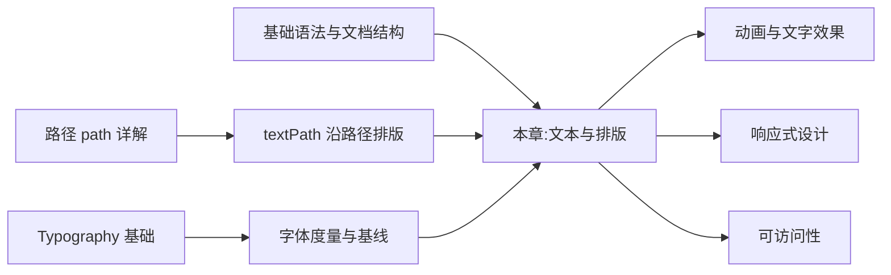

## 1. 学习目标

本章延续 MIT 6.831《用户界面设计与实现》与 Stanford CS248《图形学导论》的教学严谨度,在路径基础上深入 SVG 文本与排版的形式化定义。学完本章后,学习者应当能够在 Bloom 教育目标分类法的六个层级上达成下列能力。

### 1.1 Bloom 能力矩阵

| 层级 | 行为动词 | 本章目标能力 | 评估方式 |
| ---- | -------- | ------------ | -------- |
| **Remember** 记忆 | 列举、复述 | 能列举 `<text>`、`<tspan>`、`<textPath>` 的核心属性与默认值 | 选择题、填空题 |
| **Understand** 理解 | 解释、归纳 | 能解释 text-anchor、dominant-baseline、writing-mode 的语义 | 概念辨析题 |
| **Apply** 应用 | 使用、实现 | 能编写多语言、多风格、沿路径排版的 SVG 文本 | 实操题 |
| **Analyze** 分析 | 比较、分解 | 能分析字体度量(ascent/descent/cap-height)、基线系统的几何含义 | 推导题 |
| **Evaluate** 评价 | 评判、推荐 | 能评估 SVG 文本可访问性,给出 ARIA 与 `<title>`/`<desc>` 配置建议 | 代码评审题 |
| **Create** 创造 | 设计、构建 | 能设计一个支持响应式、可访问性的 SVG 文本组件库 | 架构设计题 |

### 1.2 知识图谱前置依赖



### 1.3 学习成果清单

完成本章学习后,学习者应当能够产出:

1. 一份支持多语言(中文/英文/日文/阿拉伯文)的 SVG 文本示例
2. 一份沿任意路径排版的文字(textPath)实现
3. 一份 SVG 文本字体度量与基线系统的形式化说明
4. 一份可访问的 SVG 数据可视化图表(含 `<title>`/`<desc>` 与 ARIA)

## 2. 历史动机与发展脉络

### 2.1 文本渲染的演进

计算机文本渲染经历了多个阶段,SVG 文本是这一演进的集大成者:

| 时期 | 技术 | 渲染方式 | 关键贡献 |
| ---- | ---- | -------- | -------- |
| 1960s | 矢量字体 | 笔画命令序列 | 早期 CAD 文本 |
| 1982 | PostScript Type 1 | 三次贝塞尔轮廓 | 高质量印刷 |
| 1991 | TrueType | 二次贝塞尔轮廓 | Apple/Microsoft 标准 |
| 1996 | OpenType | 三次贝塞尔 + 高级特性 | 多语言支持 |
| 2001 | SVG 1.0 `<text>` | 路径 + 字体引用 | Web 矢量文本 |
| 2018 | SVG 2 + WOFF 2 | CSS 字体 + 字体子集 | Web 字体优化 |

### 2.2 SVG 文本的特殊性

SVG `<text>` 与 HTML `<p>` 的核心差异:

| 特性 | HTML 文本 | SVG 文本 |
| ---- | --------- | -------- |
| 布局 | 流式布局,自动换行 | 绝对坐标,无自动换行 |
| 字体 | CSS font-* 属性 | 同 CSS + SVG 专有 |
| 度量 | box model | 字体度量 + 基线 |
| 路径排版 | 不支持 | textPath |
| 选择 | 默认可选 | 需 `user-select: text` |
| 可访问性 | 语义化 | 需 `<title>`/ARIA |
| 国际化 | writing-mode | 同 CSS |
| 渲染 | DOM + 文本引擎 | 路径 + 字体引擎 |

SVG 文本"绝对坐标 + 无自动换行"的特征,使其更适合数据可视化标签、图标、装饰性文字,而非长篇内容。

### 2.3 字体度量系统的起源

字体度量(typographic metrics)源自金属活字时代(15 世纪古登堡),核心概念包括:

- **em square**:字体设计的基本方框,所有度量相对此归一化
- **baseline(基线)**:字母 sit 的水平线,如字母 "x" 的底部
- **ascender(上伸)**:小写字母上伸部分(如 "b"、"h")的顶部
- **descender(下伸)**:小写字母下伸部分(如 "g"、"y")的底部
- **cap height(大写高)**:大写字母顶部
- **x-height(x 高)**:小写字母 "x" 的高度
- **line height(行高)**:行间距,通常 = ascent + descent + leading

SVG 的 `dominant-baseline` 属性直接引用这些字体度量,如 `alphabetic`、`central`、`hanging`、`text-before-edge` 等。

### 2.4 设计哲学:文本即图形

SVG 文本的设计哲学可概括为"文本即图形":

- **统一渲染**:文本与图形使用相同的渲染管线(路径 + 填充)
- **坐标控制**:文本位置由精确坐标决定,而非布局引擎
- **路径集成**:文本可沿任意路径排版(textPath)
- **样式继承**:文本属性与其他 SVG 元素一致,支持 CSS

这一设计让 SVG 文本既能作为内容载体(可访问、可选),也能作为视觉元素(任意变换、填充、描边)。

## 3. 形式化定义

### 3.1 文本元素的形式化模型

SVG 文本元素可形式化为一个嵌套结构:

$$
\text{Text} = \langle L, S, G \rangle
$$

其中:

- $L = \{x, y, dx, dy, rotate, textLength, lengthAdjust\}$ 是布局属性
- $S = \{font-family, font-size, font-weight, font-style, fill, stroke, ...\}$ 是样式属性
- $G$ 是字形(glyph)序列,$G = (g_1, g_2, \ldots, g_n)$,每个字形 $g_i$ 由字体中的路径数据定义

### 3.2 字体度量的数学模型

字体的度量可表示为一个度量元组 $M$:

$$
M = \langle u_{em}, a_{sc}, d_{esc}, c_{ap}, x_h, l_{ine} \rangle
$$

- $u_{em}$:em 单位(通常 1000 或 2048)
- $a_{sc}$:ascender(基线上方高度)
- $d_{esc}$:descender(基线下方深度,通常为负数)
- $c_{ap}$:cap height(大写字母高度)
- $x_h$:x-height(小写字母高度)
- $l_{ine}$:line height(行高)

实际像素值由 font-size 缩放:$a_{sc,px} = a_{sc} \cdot \frac{font-size}{u_{em}}$。

### 3.3 text-anchor 的几何定义

`text-anchor` 定义文本水平锚点。设文本宽度为 $W$(由字形度量累加得到),锚点 $x_a$ 为 `x` 属性值:

- `start`:$x_{\text{start}} = x_a$,文本从 $x_a$ 向右延伸
- `middle`:$x_{\text{start}} = x_a - W/2$,文本居中
- `end`:$x_{\text{start}} = x_a - W$,文本从 $x_a$ 向左延伸

形式化:

$$
x_{\text{start}} = \begin{cases}
x_a & \text{if text-anchor=start} \\
x_a - W/2 & \text{if text-anchor=middle} \\
x_a - W & \text{if text-anchor=end}
\end{cases}
$$

### 3.4 dominant-baseline 的度量基线

`dominant-baseline` 定义文本垂直基线。设基线 $y_b$ 相对于 `y` 属性的偏移为 $\Delta y$:

| 值 | 基线类型 | $\Delta y$ |
| -- | -------- | ---------- |
| `alphabetic` | 字母基线(默认) | 0 |
| `middle` | 字体中线 | $-(a_{sc} + d_{esc})/2$ |
| `central` | 几何中心 | $-x_h/2$ |
| `hanging` | 悬挂线(天城文等) | $-a_{sc}$ |
| `text-top` | 文本顶部 | $-a_{sc}$ |
| `text-bottom` | 文本底部 | $-d_{esc}$ |

这些基线对应不同书写系统的传统参考线。

### 3.5 textPath 的弧长参数化

`<textPath>` 沿路径排列文字,核心是将字符位置映射到路径弧长。设路径 $C(s)$ 由弧长 $s \in [0, L]$ 参数化($L$ 为路径总长),字符 $i$ 的位置 $s_i$ 由 `startOffset` 与字符宽度累加得到:

$$
s_i = s_{\text{start}} + \sum_{j=0}^{i-1} w_j
$$

其中 $s_{\text{start}}$ 是 `startOffset` 转换为弧长,$w_j$ 是字符 $j$ 的 advance width。

### 3.6 writing-mode 与方向性

`writing-mode` 控制文本方向,支持的水平与垂直模式:

| 值 | 方向 | 应用场景 |
| -- | ---- | -------- |
| `horizontal-tb`(默认) | 水平,从上到下 | 拉丁文、中文 |
| `vertical-rl` | 垂直,从右到左 | 传统日文、中文古籍 |
| `vertical-lr` | 垂直,从左到右 | 蒙古文 |

文本方向还包括 `direction`(ltr/rtl)与 `unicode-bidi`,用于处理阿拉伯文、希伯来文等 RTL 语言。

## 4. 理论推导与原理解析

### 4.1 字形选择与 Unicode 映射

文本渲染的第一步是将 Unicode 码点映射到字形。设码点 $c$ 与字体 $F$,字形索引 $g$ 通过 cmap 表查找:

$$
g = \text{cmap}_F(c)
$$

若 $F$ 不包含 $c$ 的字形($\text{cmap}_F(c) = \text{undefined}$),浏览器回退到下一个字体,直到找到或显示 `.notdef`(豆腐块 □)。

字体回退算法:

```
function getGlyph(codepoint, fontStack):
    for font in fontStack:
        if font.has(codepoint):
            return font.get(codepoint)
    return NOTDEF_GLYPH
```

这就是为何 SVG `<text>` 中 `font-family: 'CustomFont', sans-serif` 列表很重要:确保 fallback 字体能覆盖 CustomFont 缺失的字符。

### 4.2 字符宽度与 advance width

每个字形在字体中有 `advance width` 属性,表示渲染后字符的 advance 距离(下一字符起始位置)。设字形 $g$ 的 advance width 为 $w(g)$,文本宽度为:

$$
W_{\text{text}} = \sum_{i=1}^{n} w(g_i) + \text{kerning adjustments}
$$

字距调整(kerning)是特定字符对的间距修正,如 "AV"、"To" 等组合通常减少间距以视觉平衡。OpenType 还支持 `liga`(连字)、`calt`(上下文替代)等特性。

### 4.3 文本边界框的计算

文本的边界框(bounding box)由字形路径决定:

$$
\text{bbox}(\text{Text}) = \bigcup_{i=1}^{n} \text{bbox}(g_i) + \text{position}(g_i)
$$

注意边界框包含 descender(如 "g"、"y" 的下伸部分),实际高度可能超过 font-size。

JavaScript 获取精确边界框:

```javascript
const text = document.querySelector('text');
const bbox = text.getBBox();
console.log(bbox);
// { x, y, width, height }
```

### 4.4 textPath 的几何变换

textPath 将字符放置在路径上,需要为每个字符应用:

1. **平移**:字符锚点到路径上对应弧长位置
2. **旋转**:字符基线对齐路径切线方向
3. **缩放**:可选,根据路径曲率调整字符大小

设路径在弧长 $s$ 处的点为 $P(s)$,切线方向为 $\theta(s)$,字符 $i$ 的变换矩阵:

$$
M_i = T(P(s_i)) \cdot R(\theta(s_i))
$$

字符 $i$ 的本地坐标系原点在 $P(s_i)$,x 轴沿路径切线方向。

### 4.5 字体子集化与文件大小

SVG 引用的字体文件通常很大(中文字体可达 10MB+)。字体子集化只保留实际使用的字形:

$$
\text{size}_{\text{subset}} \approx \text{size}_{\text{glyph}} \cdot |\text{used glyphs}|
$$

常用工具:

- **fonttools**(Python):`pyftsubset` 命令行
- **glyphhanger**(Node.js):基于浏览器使用情况
- **subfont**:自动分析 HTML/SVG,生成子集字体

子集化可将 5MB 中文字体降至 100KB 以内,大幅提升加载性能。

### 4.6 SVG 文本的可访问性

SVG 文本的可访问性涉及多个层面:

1. **语义化**:`<title>`、`<desc>` 提供图表标题与描述
2. **ARIA**:`role="img"`、`aria-label`、`aria-labelledby`
3. **可选择性**:`user-select: text` 让用户可选中文本
4. **对比度**:`fill` 颜色需满足 WCAG AA/AAA 对比度
5. **动态字体**:`font-size` 用 `rem`/`em` 跟随用户设置

形式化可访问性检查:

$$
\text{accessible}(\text{Text}) = \text{hasTitle} \land \text{hasLabel} \land \text{sufficientContrast} \land \text{selectable}
$$

### 4.7 RTL 与双向文本

阿拉伯文、希伯来文等 RTL 语言的文本方向由 Unicode Bidirectional Algorithm(bidi)处理。设文本序列为 $T = (c_1, c_2, \ldots, c_n)$,bidi 算法:

1. **分段**:将文本按方向分为 LTR 与 RTL 段
2. **排序**:RTL 段反向,但数字保持 LTR
3. **镜像**:某些字符(如括号)在 RTL 中镜像

SVG 中通过 `direction="rtl"` 与 `unicode-bidi="embed"` 控制:

```html
<text direction="rtl" unicode-bidi="embed">مرحبا بالعالم</text>
```

### 4.8 多行文本的实现策略

SVG `<text>` 不支持自动换行,实现多行文本有几种策略:

1. **多个 `<text>`**:每行独立 `<text>`,通过 `y` 控制行距
2. **`<tspan>` + `dy`**:同一 `<text>` 内用 `<tspan>` 换行
3. **`<text>` + `white-space: pre`**(SVG 2):支持自动换行
4. **`<foreignObject>`**:嵌入 HTML `<div>` 实现复杂布局

形式化策略选择:

$$
\text{strategy} = \begin{cases}
\text{multiple text} & \text{if few lines, static} \\
\text{tspan + dy} & \text{if related lines, dynamic} \\
\text{foreignObject} & \text{if complex layout, HTML needed}
\end{cases}
$$

## 5. 代码示例

### 5.1 text 基础

`<text>` 在指定坐标绘制文本。

```html
<svg viewBox="0 0 300 100" xmlns="http://www.w3.org/2000/svg">
  <text x="20" y="50" font-size="24" fill="#4f5bd5">Hello SVG</text>
</svg>
```

#### 5.1.1 关键属性

| 属性 | 说明 | 默认值 |
| ---- | ---- | ------ |
| `x` / `y` | 基线起点坐标 | 0 |
| `font-family` | 字体族 | sans-serif |
| `font-size` | 字号 | medium |
| `font-weight` | 字重 | normal |
| `font-style` | 字体样式 | normal |
| `fill` | 文字颜色 | black |
| `text-anchor` | 水平对齐 | start |
| `dominant-baseline` | 垂直对齐 | alphabetic |
| `letter-spacing` | 字距 | normal |
| `text-decoration` | 下划线等 | none |

#### 5.1.2 y 是基线而非顶部

```html
<svg viewBox="0 0 300 100" xmlns="http://www.w3.org/2000/svg">
  <line x1="0" y1="50" x2="300" y2="50" stroke="#ccc" />
  <text x="20" y="50" font-size="24" fill="#4f5bd5">基线在 y=50</text>
</svg>
```

文字的基线对齐 y=50,字符主体在基线之上,下伸部分(如 g、y)在基线之下。

### 5.2 text-anchor 水平对齐

```html
<svg viewBox="0 0 300 150" xmlns="http://www.w3.org/2000/svg">
  <line x1="150" y1="0" x2="150" y2="150" stroke="#ccc" />
  <text x="150" y="40" text-anchor="start" font-size="20">start</text>
  <text x="150" y="80" text-anchor="middle" font-size="20">middle</text>
  <text x="150" y="120" text-anchor="end" font-size="20">end</text>
</svg>
```

| 值 | 对齐方式 |
| -- | -------- |
| `start` | 左对齐(默认) |
| `middle` | 居中 |
| `end` | 右对齐 |

### 5.3 dominant-baseline 垂直对齐

```html
<svg viewBox="0 0 300 150" xmlns="http://www.w3.org/2000/svg">
  <line x1="0" y1="75" x2="300" y2="75" stroke="#ccc" />
  <text x="50" y="75" dominant-baseline="alphabetic" font-size="16">alphabetic</text>
  <text x="150" y="75" dominant-baseline="middle" font-size="16">middle</text>
  <text x="250" y="75" dominant-baseline="hanging" font-size="16">hanging</text>
</svg>
```

| 值 | 含义 |
| -- | ---- |
| `alphabetic` | 字母基线(默认) |
| `middle` | 字符垂直中线 |
| `hanging` | 顶部悬挂线(适合天城文等) |
| `text-top` | 文本顶部 |
| `text-bottom` | 文本底部 |
| `central` | 几何中心 |

### 5.4 tspan 子文本

`<tspan>` 类似 HTML 的 `<span>`,可在同一 `<text>` 内切换样式或换行。

#### 5.4.1 局部样式

```html
<svg viewBox="0 0 300 60" xmlns="http://www.w3.org/2000/svg">
  <text x="20" y="40" font-size="24">
    <tspan fill="#4f5bd5">蓝色</tspan>
    <tspan fill="#d63031">红色</tspan>
    <tspan font-weight="bold" fill="#00b894">绿色粗体</tspan>
  </text>
</svg>
```

#### 5.4.2 相对位置

```html
<text x="20" y="40" font-size="20">
  <tspan>FANDEX</tspan>
  <tspan dx="10" dy="0" fill="#4f5bd5">-Web</tspan>
  <tspan x="20" dy="30">换行到第二行</tspan>
</text>
```

- `dx` / `dy`:相对前一字符的偏移
- `x` / `y`:绝对坐标(用于强制换行)

#### 5.4.3 字距控制

```html
<text x="20" y="40" font-size="20" letter-spacing="4">字距加宽</text>
<text x="20" y="80" font-size="20" letter-spacing="-1">字距收紧</text>
```

### 5.5 textPath 沿路径排版

`<textPath>` 让文字沿任意路径排列,常用于环形文字、波浪标语。

```html
<svg viewBox="0 0 300 200" xmlns="http://www.w3.org/2000/svg">
  <defs>
    <path id="curve" d="M 20 100 Q 150 20 280 100" />
  </defs>
  <use href="#curve" fill="none" stroke="#ccc" />
  <text font-size="18" fill="#4f5bd5">
    <textPath href="#curve" startOffset="0">沿曲线排列的 SVG 文字示例</textPath>
  </text>
</svg>
```

#### 5.5.1 startOffset 起始位置

```html
<textPath href="#curve" startOffset="50%" text-anchor="middle"> 居中显示 </textPath>
```

| 值 | 含义 |
| -- | ---- |
| `0` | 从路径起点 |
| `50%` | 路径中点 |
| `100%` | 路径终点 |

#### 5.5.2 环形文字

```html
<svg viewBox="0 0 200 200" xmlns="http://www.w3.org/2000/svg">
  <defs>
    <path id="circle" d="M 100 100 m -75 0 a 75 75 0 1 1 150 0 a 75 75 0 1 1 -150 0" />
  </defs>
  <text font-size="14" fill="#4f5bd5">
    <textPath href="#circle" startOffset="0">围绕圆形排列的文字 · 围绕圆形排列的文字 ·</textPath>
  </text>
</svg>
```

#### 5.5.3 沿路径的方向计算

```javascript
function placeTextOnPath(pathElement, text, startOffset = 0) {
  const totalLength = pathElement.getTotalLength();
  const chars = text.split('');
  let currentOffset = startOffset;

  return chars.map((char) => {
    const point = pathElement.getPointAtLength(currentOffset);
    // 计算切线方向(下一与上一点的差)
    const next = pathElement.getPointAtLength(Math.min(currentOffset + 1, totalLength));
    const angle = Math.atan2(next.y - point.y, next.x - point.x) * (180 / Math.PI);

    const tsp = document.createElementNS('http://www.w3.org/2000/svg', 'tspan');
    tsp.textContent = char;
    tsp.setAttribute('x', point.x);
    tsp.setAttribute('y', point.y);
    tsp.setAttribute('transform', `rotate(${angle} ${point.x} ${point.y})`);

    // 估算字符宽度(简化版)
    currentOffset += 8;
    return tsp;
  });
}
```

### 5.6 writing-mode 竖排文字

```html
<svg viewBox="0 0 200 200" xmlns="http://www.w3.org/2000/svg">
  <text x="50" y="20" font-size="20" writing-mode="tb">竖排文字</text>
</svg>
```

`writing-mode="tb"`(top-to-bottom)让文字垂直排列,适合中日韩排版。

更现代的写法使用 CSS:

```html
<text x="50" y="20" font-size="20" style="writing-mode: vertical-rl;">竖排文字</text>
```

### 5.7 字体加载与回退

SVG 中的字体遵循 CSS 字体规则,可用 `@font-face` 加载自定义字体。

```html
<svg viewBox="0 0 400 100" xmlns="http://www.w3.org/2000/svg">
  <style>
    @font-face {
      font-family: 'CustomFont';
      src: url('font.woff2') format('woff2');
    }
    text {
      font-family: 'CustomFont', 'PingFang SC', 'Microsoft YaHei', sans-serif;
    }
  </style>
  <text x="20" y="60" font-size="32">自定义字体</text>
</svg>
```

> 独立 .svg 文件中 `<style>` 内的 `@font-face` 仅在 `<object>` / `<iframe>` 嵌入时生效;内联 SVG 中可直接使用主页面的字体规则。

#### 5.7.1 字体加载策略

```css
/* WOFF 2 优先(压缩率高),回退到 WOFF/TTF */
@font-face {
  font-family: 'CustomFont';
  src: url('font.woff2') format('woff2'),
       url('font.woff') format('woff'),
       url('font.ttf') format('truetype');
  font-display: swap; /* 加载前用 fallback,加载后切换 */
}
```

### 5.8 文本描边与填充

```html
<svg viewBox="0 0 300 150" xmlns="http://www.w3.org/2000/svg">
  <!-- 描边文字 -->
  <text x="20" y="40" font-size="32" fill="none" stroke="#4f5bd5" stroke-width="1.5">描边文字</text>
  <!-- 双层:先描边后填充 -->
  <text
    x="20"
    y="90"
    font-size="32"
    stroke="#fff"
    stroke-width="6"
    fill="#4f5bd5"
    paint-order="stroke fill"
  >
    描边填充
  </text>
  <!-- 渐变文字 -->
  <defs>
    <linearGradient id="text-grad" x1="0%" x2="100%">
      <stop offset="0%" stop-color="#4f5bd5" />
      <stop offset="100%" stop-color="#00b894" />
    </linearGradient>
  </defs>
  <text x="20" y="140" font-size="32" fill="url(#text-grad)">渐变文字</text>
</svg>
```

#### 5.8.1 paint-order 顺序

| 值 | 含义 |
| -- | ---- |
| `fill stroke` | 先填充后描边(默认) |
| `stroke fill` | 先描边后填充(描边在下) |
| `fill stroke markers` | 完整顺序 |

> `stroke fill` 让描边在填充下方,避免粗描边遮挡文字主体,是描边文字的常用技巧。

### 5.9 可访问文本

为屏幕阅读器提供语义化文本结构。

```html
<svg viewBox="0 0 300 100" role="img" aria-labelledby="chart-title" xmlns="http://www.w3.org/2000/svg">
  <title id="chart-title">2024 Q1 销售额柱状图</title>
  <desc id="chart-desc">柱状图显示 2024 年第一季度销售额:Q1 120 万、Q2 165 万、Q3 210 万</desc>
  <text x="150" y="50" text-anchor="middle" font-size="20" aria-hidden="true">销售额柱状图</text>
</svg>
```

- `<title>`:屏幕阅读器读取的主标题
- `<desc>`:详细描述(可选)
- `aria-hidden="true"`:装饰性文字避免重复朗读

### 5.10 实战:带数据标签的图表

```html
<svg viewBox="0 0 400 200" xmlns="http://www.w3.org/2000/svg">
  <!-- 坐标轴 -->
  <line x1="40" y1="160" x2="380" y2="160" stroke="#333" />
  <line x1="40" y1="20" x2="40" y2="160" stroke="#333" />
  <!-- 柱子与数据标签 -->
  <g font-family="sans-serif">
    <rect x="80" y="80" width="40" height="80" fill="#4f5bd5" />
    <text x="100" y="70" text-anchor="middle" font-size="14" fill="#333">120</text>
    <text x="100" y="180" text-anchor="middle" font-size="12" fill="#666">Q1</text>

    <rect x="160" y="50" width="40" height="110" fill="#00b894" />
    <text x="180" y="40" text-anchor="middle" font-size="14" fill="#333">165</text>
    <text x="180" y="180" text-anchor="middle" font-size="12" fill="#666">Q2</text>

    <rect x="240" y="20" width="40" height="140" fill="#d63031" />
    <text x="260" y="10" text-anchor="middle" font-size="14" fill="#333">210</text>
    <text x="260" y="180" text-anchor="middle" font-size="12" fill="#666">Q3</text>
  </g>
</svg>
```

### 5.11 多语言支持

```html
<svg viewBox="0 0 400 200" xmlns="http://www.w3.org/2000/svg">
  <!-- 中文 -->
  <text x="20" y="40" font-size="20" font-family="'PingFang SC', 'Microsoft YaHei', sans-serif">
    你好世界
  </text>

  <!-- 英文 -->
  <text x="20" y="80" font-size="20" font-family="'Helvetica', 'Arial', sans-serif">
    Hello World
  </text>

  <!-- 日文 -->
  <text x="20" y="120" font-size="20" font-family="'Hiragino Sans', 'Yu Gothic', sans-serif">
    こんにちは世界
  </text>

  <!-- 阿拉伯文(RTL) -->
  <text
    x="380"
    y="160"
    font-size="20"
    direction="rtl"
    unicode-bidi="embed"
    text-anchor="end"
    font-family="'Noto Naskh Arabic', sans-serif"
  >
    مرحبا بالعالم
  </text>
</svg>
```

### 5.12 动态文本测量

```javascript
function measureSvgText(text, fontOptions = {}) {
  const {
    fontFamily = 'sans-serif',
    fontSize = 16,
    fontWeight = 'normal',
    fontStyle = 'normal',
  } = fontOptions;

  // 创建临时 SVG 与 text 元素
  const svg = document.createElementNS('http://www.w3.org/2000/svg', 'svg');
  svg.setAttribute('width', '0');
  svg.setAttribute('height', '0');
  svg.style.position = 'absolute';
  svg.style.visibility = 'hidden';

  const textEl = document.createElementNS('http://www.w3.org/2000/svg', 'text');
  textEl.setAttribute('font-family', fontFamily);
  textEl.setAttribute('font-size', fontSize);
  textEl.setAttribute('font-weight', fontWeight);
  textEl.setAttribute('font-style', fontStyle);
  textEl.textContent = text;

  svg.appendChild(textEl);
  document.body.appendChild(svg);

  const bbox = textEl.getBBox();
  document.body.removeChild(svg);

  return { width: bbox.width, height: bbox.height };
}

// 使用示例
const m = measureSvgText('Hello SVG', { fontSize: 24, fontFamily: 'serif' });
console.log(m); // { width: 90.3, height: 28.5 }
```

## 6. 对比分析

### 6.1 SVG text vs HTML text

| 特性 | SVG `<text>` | HTML `<p>` |
| ---- | ------------ | ---------- |
| 布局 | 绝对坐标 | 流式 |
| 自动换行 | 不支持(SVG 2 部分) | 默认 |
| 选择 | `user-select: text` | 默认可选 |
| 字体 | CSS font-* | 同 SVG |
| textPath | 支持 | 不支持 |
| 国际化 | writing-mode | 同 CSS |
| 性能 | 复杂文本较慢 | 优化 |
| 适用场景 | 标签、装饰 | 长内容 |

### 6.2 SVG text vs Canvas text

| 特性 | SVG `<text>` | Canvas `fillText` |
| ---- | ------------ | ------------------ |
| 渲染方式 | DOM + 字体引擎 | 位图绘制 |
| 可访问性 | 良好(可选、朗读) | 差(像素,无语义) |
| 缩放 | 矢量,无失真 | 像素,需重绘 |
| 文本测量 | `getBBox()` | `measureText()` |
| 选择 | 可选 | 不可选 |
| 性能 | 复杂文本较慢 | 快 |
| 国际化 | 完整支持 | 部分支持 |
| 适用场景 | 简单文本、可访问性优先 | 复杂动画、性能优先 |

### 6.3 text-anchor vs CSS text-align

| 特性 | SVG text-anchor | CSS text-align |
| ---- | --------------- | -------------- |
| 应用对象 | SVG `<text>` | HTML 块级元素 |
| 参考点 | `x` 属性 | 容器边界 |
| RTL 适配 | `start`/`end` 自动适配 | `start`/`end` 自动适配 |
| 动态计算 | 浏览器自动 | 浏览器自动 |

### 6.4 dominant-baseline vs CSS vertical-align

| 特性 | SVG dominant-baseline | CSS vertical-align |
| ---- | --------------------- | ------------------- |
| 参考点 | 字体度量基线 | 行高基线 |
| 精度 | 高(精确度量) | 中(行高近似) |
| 选项 | alphabetic、middle、central、hanging 等 | top、middle、bottom、baseline、sub、super |
| 应用场景 | SVG 文本对齐 | HTML 行内元素对齐 |

## 7. 常见陷阱与最佳实践

### 7.1 y 是基线而非顶部

```html
<!-- 错误:以为 y=50 是文字顶部,实际是基线 -->
<text x="20" y="50" font-size="24">Hello</text>
<!-- 文字主体在 y=50 之上,descender 部分在 y=50 之下 -->

<!-- 正确:计算文字顶部需考虑 ascent -->
<text x="20" y="50" font-size="24" dominant-baseline="hanging">Hello</text>
<!-- 现在 y=50 是文字顶部 -->
```

### 7.2 忘记设置 font-family

```html
<!-- 错误:依赖浏览器默认字体,跨平台不一致 -->
<text x="20" y="50">Hello</text>

<!-- 正确:声明完整字体回退栈 -->
<text x="20" y="50" font-family="'Inter', 'Helvetica Neue', sans-serif">Hello</text>
```

### 7.3 字体未加载就渲染

```html
<!-- 错误:字体加载前显示 fallback,加载后跳动 -->
<style>
  @font-face {
    font-family: 'CustomFont';
    src: url('font.woff2') format('woff2');
  }
  text { font-family: 'CustomFont', sans-serif; }
</style>
<text>自定义字体</text>

<!-- 改进:font-display: swap 显式控制 -->
<style>
  @font-face {
    font-family: 'CustomFont';
    src: url('font.woff2') format('woff2');
    font-display: swap;
  }
</style>
```

### 7.4 中文字体文件过大

```html
<!-- 错误:加载完整中文字体(5MB+) -->
<style>
  @font-face {
    font-family: 'SourceHanSans';
    src: url('source-han-sans.woff2') format('woff2');
  }
</style>

<!-- 改进:字体子集化,仅保留使用字符 -->
<style>
  @font-face {
    font-family: 'SourceHanSans-Subset';
    src: url('source-han-sans.subset.woff2') format('woff2');
    /* 文件大小从 5MB 降至 100KB */
  }
</style>
```

### 7.5 textPath 字符溢出路径

```html
<!-- 错误:文字过长,超出路径长度后字符消失 -->
<textPath href="#short-path">这是一段很长的文字,超出了路径长度</textPath>

<!-- 改进:缩短文字或延长路径 -->
<textPath href="#long-path">这是一段很长的文字,现在路径足够长</textPath>
```

### 7.6 dominant-baseline 跨浏览器不一致

```html
<!-- 问题:不同浏览器对 dominant-baseline 实现略有差异 -->
<text dominant-baseline="middle">Hello</text>
<!-- Chrome 与 Firefox 渲染位置可能差几像素 -->

<!-- 改进:用 dy 显式偏移 -->
<text dy="0.35em">Hello</text>
<!-- dy="0.35em" 等价于 middle,跨浏览器更一致 -->
```

### 7.7 装饰性文字未加 aria-hidden

```html
<!-- 错误:装饰性文字被屏幕阅读器朗读,干扰内容 -->
<text>✨ 装饰 ✨</text>

<!-- 改进:加 aria-hidden 避免朗读 -->
<text aria-hidden="true">✨ 装饰 ✨</text>
```

### 7.8 SVG 文本无法选中

```html
<!-- 默认:SVG 文本不可选 -->
<text>Hello</text>

<!-- 启用选择 -->
<text style="user-select: text;">Hello</text>
```

## 8. 工程实践

### 8.1 Vue 3 SVG 文本组件

```vue
<template>
  <svg :viewBox="`0 0 ${width} ${height}`" xmlns="http://www.w3.org/2000/svg">
    <text
      :x="x"
      :y="y"
      :text-anchor="anchor"
      :dominant-baseline="baseline"
      :font-family="fontFamily"
      :font-size="fontSize"
      :font-weight="fontWeight"
      :fill="color"
      :aria-hidden="decorative ? 'true' : undefined"
    >
      {{ content }}
    </text>
  </svg>
</template>

<script setup>
defineProps({
  content: { type: String, required: true },
  x: { type: [Number, String], default: 0 },
  y: { type: [Number, String], default: 0 },
  width: { type: [Number, String], default: 200 },
  height: { type: [Number, String], default: 50 },
  anchor: { type: String, default: 'start' },
  baseline: { type: String, default: 'alphabetic' },
  fontFamily: { type: String, default: "'Inter', sans-serif" },
  fontSize: { type: [Number, String], default: 16 },
  fontWeight: { type: [Number, String], default: 'normal' },
  color: { type: String, default: '#333' },
  decorative: { type: Boolean, default: false },
});
</script>
```

### 8.2 React SVG 文本组件

```jsx
import { memo } from 'react';

const SVGText = memo(function SVGText({
  content,
  x = 0,
  y = 0,
  width = 200,
  height = 50,
  anchor = 'start',
  baseline = 'alphabetic',
  fontFamily = "'Inter', sans-serif",
  fontSize = 16,
  fontWeight = 'normal',
  color = '#333',
  decorative = false,
  title,
  desc,
}) {
  return (
    <svg viewBox={`0 0 ${width} ${height}`} xmlns="http://www.w3.org/2000/svg"
      role={title ? 'img' : undefined}
      aria-labelledby={title ? 'text-title' : undefined}>
      {title && <title id="text-title">{title}</title>}
      {desc && <desc>{desc}</desc>}
      <text
        x={x}
        y={y}
        text-anchor={anchor}
        dominant-baseline={baseline}
        font-family={fontFamily}
        font-size={fontSize}
        font-weight={fontWeight}
        fill={color}
        aria-hidden={decorative ? 'true' : undefined}
      >
        {content}
      </text>
    </svg>
  );
});

export default SVGText;
```

### 8.3 字体子集化工具

```javascript
// scripts/subset-font.mjs
import { subsetFont } from 'fonttools';
import { readFileSync, writeFileSync } from 'node:fs';

const inputFont = 'fonts/SourceHanSansSC-Regular.otf';
const outputFont = 'public/fonts/subset.woff2';

// 收集所有 SVG 中使用的字符
import { readdirSync } from 'node:fs';
import { join } from 'node:path';

const SVG_DIR = 'src/assets';
const chars = new Set();

const files = readdirSync(SVG_DIR).filter((f) => f.endsWith('.svg'));
for (const file of files) {
  const content = readFileSync(join(SVG_DIR, file), 'utf8');
  // 提取 <text> 标签内容
  const matches = content.match(/<text[^>]*>([^<]+)<\/text>/g);
  if (matches) {
    for (const match of matches) {
      const text = match.replace(/<\/?text[^>]*>/g, '');
      for (const char of text) {
        chars.add(char);
      }
    }
  }
}

// 子集化
const charsArray = Array.from(chars).join('');
const buffer = readFileSync(inputFont);
const subsetBuffer = subsetFont(buffer, {
  text: charsArray,
  formats: ['woff2'],
});

writeFileSync(outputFont, subsetBuffer);
console.log(`Subset created with ${charsArray.length} chars: ${charsArray}`);
```

### 8.4 多行文本组件

```javascript
class MultiLineText {
  constructor(svg, options = {}) {
    this.svg = svg;
    this.options = {
      lineHeight: 1.2,
      fontFamily: 'sans-serif',
      fontSize: 16,
      fill: '#333',
      ...options,
    };
  }

  render(x, y, lines) {
    const { fontSize, lineHeight } = this.options;
    const lineHeightPx = fontSize * lineHeight;

    const text = document.createElementNS('http://www.w3.org/2000/svg', 'text');
    text.setAttribute('x', x);
    text.setAttribute('y', y);
    text.setAttribute('font-family', this.options.fontFamily);
    text.setAttribute('font-size', fontSize);
    text.setAttribute('fill', this.options.fill);

    lines.forEach((line, i) => {
      const tspan = document.createElementNS('http://www.w3.org/2000/svg', 'tspan');
      tspan.setAttribute('x', x);
      tspan.setAttribute('dy', i === 0 ? 0 : lineHeightPx);
      tspan.textContent = line;
      text.appendChild(tspan);
    });

    this.svg.appendChild(text);
    return text;
  }
}

// 使用
const mlt = new MultiLineText(document.querySelector('svg'), { fontSize: 14 });
mlt.render(10, 20, ['第一行', '第二行', '第三行']);
```

### 8.5 SVG 自动换行(SVG 2)

SVG 2 引入 `white-space` 属性,支持自动换行:

```html
<svg viewBox="0 0 200 100" xmlns="http://www.w3.org/2000/svg">
  <text x="10" y="20" font-size="14" style="white-space: pre-wrap; width: 180px;">
    这是一段长文本,会自动换行到下一行,无需手动拆分。
  </text>
</svg>
```

> 注意:浏览器支持有限,生产环境推荐用 `<foreignObject>` 或手动换行。

### 8.6 SVG 文本可访问性检查器

```javascript
function checkSVGTextAccessibility(svgRoot) {
  const issues = [];
  const texts = svgRoot.querySelectorAll('text');

  texts.forEach((text, i) => {
    const issues_text = [];

    // 检查 1:装饰性文本是否有 aria-hidden
    const content = text.textContent.trim();
    if (content && !text.getAttribute('aria-hidden')) {
      // 检查是否有 title/desc 父元素
      const parent = text.parentElement;
      const hasTitle = parent && parent.querySelector('title');
      if (!hasTitle) {
        // 文本可能既不是装饰也缺少可访问性标注
        // 这里只警告,不一定是问题
      }
    }

    // 检查 2:对比度
    const fill = window.getComputedStyle(text).fill;
    if (fill && isLowContrast(fill, '#fff')) {
      issues_text.push(`low contrast fill: ${fill}`);
    }

    // 检查 3:font-size 是否过小
    const fontSize = parseFloat(window.getComputedStyle(text).fontSize);
    if (fontSize < 12) {
      issues_text.push(`font-size too small: ${fontSize}px (< 12px)`);
    }

    // 检查 4:text-anchor 与位置是否匹配
    const x = parseFloat(text.getAttribute('x'));
    const anchor = text.getAttribute('text-anchor') || 'start';
    if (anchor === 'end' && x < 50) {
      issues_text.push(`end-anchored text near left edge (x=${x})`);
    }

    if (issues_text.length > 0) {
      issues.push({ index: i, content, issues: issues_text });
    }
  });

  return issues;
}

function isLowContrast(color1, color2) {
  const c1 = hexToRgb(color1);
  const c2 = hexToRgb(color2);
  if (!c1 || !c2) return false;
  const ratio = contrastRatio(c1, c2);
  return ratio < 4.5; // WCAG AA 标准
}

function hexToRgb(hex) {
  const m = /^#?([a-f\d]{2})([a-f\d]{2})([a-f\d]{2})$/i.exec(hex);
  return m ? { r: parseInt(m[1], 16), g: parseInt(m[2], 16), b: parseInt(m[3], 16) } : null;
}

function contrastRatio(c1, c2) {
  const l1 = luminance(c1);
  const l2 = luminance(c2);
  return (Math.max(l1, l2) + 0.05) / (Math.min(l1, l2) + 0.05);
}

function luminance(c) {
  const { r, g, b } = c;
  const rs = r / 255;
  const gs = g / 255;
  const bs = b / 255;
  return 0.2126 * gamma(rs) + 0.7152 * gamma(gs) + 0.0722 * gamma(bs);
}

function gamma(c) {
  return c <= 0.03928 ? c / 12.92 : Math.pow((c + 0.055) / 1.055, 2.4);
}
```

## 9. 案例研究

### 9.1 案例一:D3.js 数据可视化

D3.js 大量使用 SVG `<text>` 绘制坐标轴、数据标签、图例:

```javascript
import * as d3 from 'd3';

const svg = d3.select('#chart').append('svg')
  .attr('viewBox', '0 0 800 400');

// 坐标轴
const xAxis = d3.axisBottom(xScale);
svg.append('g')
  .attr('transform', 'translate(0, 350)')
  .call(xAxis);

// 数据标签
svg.selectAll('.data-label')
  .data(dataset)
  .enter()
  .append('text')
  .attr('class', 'data-label')
  .attr('x', (d) => xScale(d.x))
  .attr('y', (d) => yScale(d.y) - 10)
  .attr('text-anchor', 'middle')
  .attr('font-size', 12)
  .attr('fill', '#333')
  .text((d) => d.value);

// 图例
const legend = svg.append('g')
  .attr('transform', 'translate(650, 30)');

['Series A', 'Series B', 'Series C'].forEach((label, i) => {
  legend.append('text')
    .attr('x', 20)
    .attr('y', i * 20)
    .attr('font-size', 12)
    .text(label);
});
```

### 9.2 案例二:Material Design 数据标签

Material Design 中 SVG 文本用于卡片、列表项的数据展示:

```xml
<svg viewBox="0 0 200 100" xmlns="http://www.w3.org/2000/svg">
  <text x="20" y="30" font-family="Roboto, sans-serif" font-size="12" fill="rgba(0,0,0,0.6)">
    Revenue
  </text>
  <text x="20" y="60" font-family="Roboto, sans-serif" font-size="24" font-weight="500" fill="rgba(0,0,0,0.87)">
    $12,345
  </text>
  <text x="20" y="80" font-family="Roboto, sans-serif" font-size="11" fill="#00b894">
    +12.5% ↑
  </text>
</svg>
```

### 9.3 案例三:Logo 文字

品牌 Logo 中的文字常使用 SVG 实现矢量缩放:

```xml
<svg viewBox="0 0 200 60" xmlns="http://www.w3.org/2000/svg">
  <defs>
    <linearGradient id="logo-grad" x1="0%" y1="0%" x2="100%" y2="0%">
      <stop offset="0%" stop-color="#4f5bd5" />
      <stop offset="100%" stop-color="#00b894" />
    </linearGradient>
  </defs>
  <text
    x="100"
    y="40"
    text-anchor="middle"
    font-family="'Inter', sans-serif"
    font-size="32"
    font-weight="700"
    fill="url(#logo-grad)"
    letter-spacing="2"
  >
    FANDEX
  </text>
</svg>
```

### 9.4 案例四:环形徽章

```xml
<svg viewBox="0 0 200 200" xmlns="http://www.w3.org/2000/svg">
  <defs>
    <path id="badge-circle" d="M 100 100 m -70 0 a 70 70 0 1 1 140 0 a 70 70 0 1 1 -140 0" />
  </defs>
  <circle cx="100" cy="100" r="90" fill="#4f5bd5" />
  <circle cx="100" cy="100" r="70" fill="#fff" />
  <text font-size="14" fill="#4f5bd5" font-weight="bold">
    <textPath href="#badge-circle" startOffset="0">
      FANDEX · PREMIUM · 2026 · FANDEX · PREMIUM · 2026 ·
    </textPath>
  </text>
  <text x="100" y="105" text-anchor="middle" font-size="32" font-weight="bold" fill="#4f5bd5">
    PRO
  </text>
</svg>
```

### 9.5 案例五:可访问图表

```xml
<svg viewBox="0 0 400 250" xmlns="http://www.w3.org/2000/svg" role="img" aria-labelledby="title desc">
  <title id="title">2024 年季度销售额对比</title>
  <desc id="desc">
    柱状图展示 2024 年三个季度销售额:Q1 120 万美元、Q2 165 万美元、Q3 210 万美元,呈增长趋势。
  </desc>

  <!-- 坐标轴 -->
  <line x1="40" y1="200" x2="380" y2="200" stroke="#333" />
  <line x1="40" y1="20" x2="40" y2="200" stroke="#333" />

  <!-- Y 轴标签 -->
  <g font-family="sans-serif" font-size="10" fill="#666" text-anchor="end">
    <text x="35" y="203">0</text>
    <text x="35" y="153">100</text>
    <text x="35" y="103">200</text>
    <text x="35" y="53">300</text>
  </g>

  <!-- 柱子 -->
  <g>
    <rect x="80" y="140" width="40" height="60" fill="#4f5bd5" />
    <rect x="160" y="117.5" width="40" height="82.5" fill="#00b894" />
    <rect x="240" y="95" width="40" height="105" fill="#d63031" />
  </g>

  <!-- 数据标签 -->
  <g font-family="sans-serif" font-size="12" fill="#333" text-anchor="middle">
    <text x="100" y="135">120</text>
    <text x="180" y="112">165</text>
    <text x="260" y="90">210</text>
  </g>

  <!-- X 轴标签 -->
  <g font-family="sans-serif" font-size="11" fill="#666" text-anchor="middle">
    <text x="100" y="220">Q1</text>
    <text x="180" y="220">Q2</text>
    <text x="260" y="220">Q3</text>
  </g>

  <!-- 单位 -->
  <text x="20" y="20" font-family="sans-serif" font-size="10" fill="#999">万美元</text>
</svg>
```

### 9.6 案例六:FANDEX 项目知识图谱节点

```html
<svg viewBox="0 0 800 600" xmlns="http://www.w3.org/2000/svg">
  <g class="node" transform="translate(100, 100)">
    <circle r="40" fill="#4f5bd5" />
    <text text-anchor="middle" dominant-baseline="central" fill="#fff" font-size="14" font-weight="bold">
      HTML
    </text>
  </g>

  <g class="node" transform="translate(300, 200)">
    <rect x="-50" y="-20" width="100" height="40" rx="8" fill="#00b894" />
    <text text-anchor="middle" dominant-baseline="central" fill="#fff" font-size="14">
      JavaScript
    </text>
  </g>

  <g class="node" transform="translate(500, 300)">
    <rect x="-60" y="-25" width="120" height="50" rx="8" fill="#d63031" />
    <text text-anchor="middle" dominant-baseline="central" fill="#fff" font-size="16" font-weight="bold">
      TypeScript
    </text>
  </g>
</svg>
```

## 10. 习题

### 10.1 选择题

**题目 1**:SVG `<text>` 的 `y` 属性表示?

- A. 文字顶部
- B. 文字底部
- C. 文字基线(默认)
- D. 文字中心

<details>
<summary>查看答案</summary>

**答案**:C

**解析**:默认情况下,`y` 表示文字的字母基线(alphabetic baseline)。可通过 `dominant-baseline` 属性改为其他参考线,如 `middle`(中心)、`hanging`(顶部)等。
</details>

**题目 2**:`text-anchor="middle"` 的含义是?

- A. 文字左对齐
- B. 文字居中对齐,锚点在文字中点
- C. 文字右对齐
- D. 文字两端对齐

<details>
<summary>查看答案</summary>

**答案**:B

**解析**:`text-anchor="middle"` 让 `x` 属性指向文字水平中心。设文字宽度为 W,则文字从 $x - W/2$ 开始,延伸到 $x + W/2$。
</details>

**题目 3**:`<textPath>` 的 `startOffset="50%"` 表示?

- A. 文字从路径起点开始
- B. 文字从路径中点开始
- C. 文字居中显示在路径中点
- D. 文字结束于路径中点

<details>
<summary>查看答案</summary>

**答案**:B(若配合 `text-anchor="middle"` 则为 C)

**解析**:`startOffset` 表示文字起始位置(锚点)在路径上的弧长位置。50% 表示锚点在路径中点。若同时设置 `text-anchor="middle"`,则文字居中显示在路径中点;否则文字从路径中点向右延伸。
</details>

**题目 4**:dominant-baseline="hanging" 适合?

- A. 拉丁文
- B. 天城文(Devanagari)
- C. 中文
- D. 阿拉伯文

<details>
<summary>查看答案</summary>

**答案**:B

**解析**:`hanging` 基线是顶部悬挂线,适合天城文(印度语系)等"悬挂式"书写系统。拉丁文用 `alphabetic`,中文用 `alphabetic` 或 `central`。
</details>

**题目 5**:SVG 文本默认可选吗?

- A. 可选
- B. 不可选
- C. 取决于浏览器
- D. 仅在 Firefox 可选

<details>
<summary>查看答案</summary>

**答案**:B

**解析**:SVG `<text>` 默认不可选(`user-select: none`),需通过 CSS `user-select: text` 显式启用。这是与 HTML 文本的关键差异之一。
</details>

### 10.2 填空题

**题目 6**:SVG 中字体度量的基本单位是 ________,通常为 1000 或 2048。

<details>
<summary>查看答案</summary>

**答案**:`em square`(或 `em`)

**解析**:字体设计的所有度量(ascender、descender、cap-height 等)都相对于 em square 归一化。font-size 决定 1 em 等于多少像素。
</details>

**题目 7**:`paint-order="stroke fill"` 的作用是 ________,常用于 ________。

<details>
<summary>查看答案</summary>

**答案**:`先描边后填充(描边在填充下方)`;`描边文字(避免粗描边遮挡文字主体)`

**解析**:默认 `fill stroke` 是先填充后描边,粗描边会遮挡文字主体。改为 `stroke fill` 后,描边在填充下方,文字主体清晰可见。
</details>

**题目 8**:`<tspan>` 的 `dx`/`dy` 与 `x`/`y` 的区别是:前者是 ________,后者是 ________。

<details>
<summary>查看答案</summary>

**答案**:`相对偏移(相对前一字符)`;`绝对坐标`

**解析**:`dx`/`dy` 是相对前一字符位置的偏移量,常用于字距调整;`x`/`y` 是绝对坐标,常用于强制换行或重置位置。
</details>

**题目 9**:SVG `<text>` 默认不支持自动换行,实现多行文本的常见策略包括:________、________、________。

<details>
<summary>查看答案</summary>

**答案**:`多个 <text> 元素`、`<tspan> + dy 换行`、`<foreignObject> 嵌入 HTML`

**解析**:三种策略各有优劣:多个 `<text>` 适合静态少量行;`<tspan>` 适合同一文本内换行;`<foreignObject>` 适合复杂布局(支持 HTML/CSS)。SVG 2 引入 `white-space: pre-wrap` 但浏览器支持有限。
</details>

**题目 10**:字体子集化的作用是 ________,可将中文字体从 5MB 降至 ________。

<details>
<summary>查看答案</summary>

**答案**:`只保留实际使用的字形,减小文件大小`;`100KB 以内`

**解析**:字体子集化通过分析 HTML/SVG 中实际使用的字符,生成仅包含这些字形的字体文件。对中文字体尤其有效,因为完整字体包含数万字形,而单页可能只用几百字。
</details>

### 10.3 编程题

**题目 11**:实现一个 SVG 文本组件,要求:

1. 支持 text-anchor 与 dominant-baseline 配置
2. 字体回退栈(中文 + 英文)
3. 可访问性(可选 aria-hidden 或 title/desc)
4. 多行文本(通过 tspan + dy)

```vue
<template>
  <text
    :x="x"
    :y="y"
    :text-anchor="anchor"
    :dominant-baseline="baseline"
    :font-family="fontStack"
    :font-size="size"
    :font-weight="weight"
    :fill="color"
    :letter-spacing="letterSpacing"
    :aria-hidden="decorative ? 'true' : undefined"
    :role="title ? 'img' : undefined"
    :aria-label="title || undefined"
  >
    <title v-if="title">{{ title }}</title>
    <desc v-if="desc">{{ desc }}</desc>
    <template v-if="Array.isArray(content)">
      <tspan
        v-for="(line, i) in content"
        :key="i"
        :x="x"
        :dy="i === 0 ? 0 : size * lineHeight"
      >{{ line }}</tspan>
    </template>
    <template v-else>{{ content }}</template>
  </text>
</template>

<script setup>
import { computed } from 'vue';

const props = defineProps({
  content: { type: [String, Array], required: true },
  x: { type: [Number, String], default: 0 },
  y: { type: [Number, String], default: 0 },
  anchor: { type: String, default: 'start' },
  baseline: { type: String, default: 'alphabetic' },
  fontStack: {
    type: String,
    default: "'Inter', 'PingFang SC', 'Microsoft YaHei', sans-serif",
  },
  size: { type: [Number, String], default: 16 },
  weight: { type: [Number, String], default: 'normal' },
  color: { type: String, default: '#333' },
  letterSpacing: { type: [Number, String], default: 'normal' },
  lineHeight: { type: Number, default: 1.2 },
  decorative: { type: Boolean, default: false },
  title: { type: String, default: '' },
  desc: { type: String, default: '' },
});

// 计算 fontStack(可被覆盖)
const fontStack = computed(() => props.fontStack);
</script>
```

**评分标准**:

- text-anchor 与 dominant-baseline 支持(2 分)
- 字体回退栈(2 分)
- 可访问性配置(3 分)
- 多行文本支持(3 分)

**题目 12**:实现一个 textPath 文字组件,沿给定路径排列文字,要求:

1. 路径在 `<defs>` 中定义
2. 支持 startOffset(数值或百分比)
3. 支持 text-anchor
4. 文字溢出路径时给出警告

```javascript
class TextPathComponent {
  constructor(svg, pathD, options = {}) {
    this.svg = svg;
    this.options = {
      startOffset: 0,
      textAnchor: 'start',
      fontSize: 16,
      fill: '#333',
      fontFamily: 'sans-serif',
      ...options,
    };

    this.pathId = `textpath-${Math.random().toString(36).slice(2, 9)}`;
    this.setupDefs(pathD);
  }

  setupDefs(pathD) {
    const NS = 'http://www.w3.org/2000/svg';
    let defs = this.svg.querySelector('defs');
    if (!defs) {
      defs = document.createElementNS(NS, 'defs');
      this.svg.appendChild(defs);
    }
    const path = document.createElementNS(NS, 'path');
    path.setAttribute('id', this.pathId);
    path.setAttribute('d', pathD);
    path.setAttribute('fill', 'none');
    defs.appendChild(path);
    this.pathElement = path;
  }

  render(text) {
    const NS = 'http://www.w3.org/2000/svg';

    // 测量文本宽度
    const tempText = document.createElementNS(NS, 'text');
    tempText.setAttribute('font-size', this.options.fontSize);
    tempText.setAttribute('font-family', this.options.fontFamily);
    tempText.textContent = text;
    this.svg.appendChild(tempText);
    const textWidth = tempText.getBBox().width;
    this.svg.removeChild(tempText);

    // 检查路径长度
    const pathLength = this.pathElement.getTotalLength();
    if (textWidth > pathLength) {
      console.warn(
        `Text width ${textWidth}px exceeds path length ${pathLength}px; ` +
        `text will be clipped.`
      );
    }

    // 创建 textPath
    const textEl = document.createElementNS(NS, 'text');
    textEl.setAttribute('font-size', this.options.fontSize);
    textEl.setAttribute('font-family', this.options.fontFamily);
    textEl.setAttribute('fill', this.options.fill);
    textEl.setAttribute('text-anchor', this.options.textAnchor);

    const textPath = document.createElementNS(NS, 'textPath');
    textPath.setAttribute('href', `#${this.pathId}`);
    textPath.setAttribute('startOffset', this.options.startOffset);
    textPath.textContent = text;

    textEl.appendChild(textPath);
    this.svg.appendChild(textEl);
    return textEl;
  }
}

// 使用示例
const component = new TextPathComponent(
  document.querySelector('svg'),
  'M 20 100 Q 150 20 280 100',
  { startOffset: '50%', textAnchor: 'middle', fontSize: 18, fill: '#4f5bd5' }
);
component.render('沿曲线排列的文字');
```

**评分标准**:

- 路径在 defs 中定义(2 分)
- 支持 startOffset(2 分)
- 支持 text-anchor(2 分)
- 溢出检测与警告(4 分)

### 10.4 思考题

**题目 13**:为什么 SVG `<text>` 默认不可选?这一设计有哪些考量?如何权衡?

<details>
<summary>参考答案</summary>

**默认不可选的原因**:

1. **历史定位**:SVG 1.0 设计为"矢量图形格式"而非"文档格式",文本被视为图形元素而非内容
2. **避免误选**:SVG 中大量文本是装饰性(图标、Logo),误选会干扰用户体验
3. **可访问性**:屏幕阅读器通过 `<title>`/`<desc>` 提供语义,不依赖文本选择
4. **性能**:可选文本需要额外的 hit-testing 与 selection range 计算

**权衡考量**:

| 场景 | 选择 | 理由 |
| ---- | ---- | ---- |
| 图标、Logo | 不可选 | 装饰性,不应干扰 |
| 数据可视化标签 | 不可选 | 数据通过 `<title>`/`<desc>` 暴露 |
| 文档内容 | 可选 | 用户需复制 |
| 表单输入 | 可选 | 用户需编辑 |
| 教学材料 | 可选 | 用户需引用 |

**实现方式**:

```css
/* 全局启用 */
svg text { user-select: text; }

/* 仅特定文本可选 */
.selectable { user-select: text; }
```

**现代趋势**:SVG 2 倾向于让文本默认可选,以提升内容可用性。但浏览器实现仍存在差异,生产环境建议显式声明 `user-select`。
</details>

**题目 14**:设计一个支持多语言的 SVG 文本系统,要求覆盖中文、英文、日文、阿拉伯文,描述关键设计决策。

<details>
<summary>参考答案</summary>

**关键设计决策**:

1. **字体回退栈**:每种语言使用最佳字体
   ```css
   font-family:
     'Inter',          /* 英文优先 */
     'PingFang SC',    /* 中文 */
     'Hiragino Sans',  /* 日文 */
     'Noto Naskh Arabic', /* 阿拉伯文 */
     sans-serif;       /* 最终回退 */
   ```

2. **方向控制**:
   ```html
   <!-- 阿拉伯文:RTL -->
   <text direction="rtl" unicode-bidi="embed">مرحبا</text>

   <!-- 日文:可选竖排 -->
   <text style="writing-mode: vertical-rl;">こんにちは</text>
   ```

3. **字体子集化**:为每种语言生成独立子集
   ```
   fonts/
     latin.subset.woff2     /* 英文字符 */
     cjk-sc.subset.woff2    /* 简体中文 */
     cjk-jp.subset.woff2    /* 日文假名+汉字 */
     arabic.subset.woff2    /* 阿拉伯字母 */
   ```

4. **基线适配**:
   - 拉丁文:`dominant-baseline="alphabetic"`
   - 中日韩:`dominant-baseline="central"` 或 `alphabetic`
   - 天城文:`dominant-baseline="hanging"`
   - 阿拉伯文:`dominant-baseline="alphabetic"`(基线在字符底部)

5. **字符宽度处理**:
   - 全角字符(中日韩)与半角字符(拉丁)宽度不同
   - 使用 `letter-spacing` 微调
   - CJK 标点压缩(如 `。` `、` 紧贴前字符)

6. **可访问性**:
   ```html
   <text lang="zh-CN">你好</text>
   <text lang="en">Hello</text>
   <text lang="ja">こんにちは</text>
   <text lang="ar" direction="rtl">مرحبا</text>
   ```
   `lang` 属性帮助屏幕阅读器选择正确发音。

7. **响应式字体大小**:
   ```css
   text { font-size: clamp(12px, 2vw, 18px); }
   ```

8. **完整示例**:

```html
<svg viewBox="0 0 400 300" xmlns="http://www.w3.org/2000/svg">
  <style>
    @font-face {
      font-family: 'NotoSansCJK';
      src: url('fonts/cjk.subset.woff2') format('woff2');
    }
    @font-face {
      font-family: 'NotoNaskh';
      src: url('fonts/arabic.subset.woff2') format('woff2');
    }
    text { font-family: 'Inter', 'NotoSansCJK', 'NotoNaskh', sans-serif; }
  </style>

  <text x="20" y="40" font-size="20" lang="zh-CN">你好,世界!</text>
  <text x="20" y="80" font-size="20" lang="en">Hello, World!</text>
  <text x="20" y="120" font-size="20" lang="ja">こんにちは世界!</text>
  <text x="380" y="160" font-size="20" lang="ar" direction="rtl" text-anchor="end">
    مرحبا بالعالم!
  </text>
</svg>
```
</details>

**题目 15**:解释字体子集化的原理,并说明在 SVG 项目中如何实施。

<details>
<summary>参考答案</summary>

**字体子集化原理**:

字体文件包含:

1. **cmap 表**:Unicode 码点到字形索引的映射
2. **glyf 表**:字形路径数据(贝塞尔曲线)
3. **hmtx 表**:水平度量(advance width)
4. **其他表**:kerning、liga、name 等

子集化只保留实际使用的字形:

$$
\text{subset}(F, U) = \{g \in F \mid \text{cmap}^{-1}(g) \in U\}
$$

其中 $U$ 是使用的 Unicode 码点集合。

**实施步骤**:

1. **收集字符**:扫描所有 HTML/SVG/JS,提取文本内容
   ```javascript
   // scripts/collect-chars.mjs
   import { readFileSync, readdirSync } from 'node:fs';
   import { join } from 'node:path';

   const DIRS = ['src', 'public'];
   const chars = new Set();

   function scanDir(dir) {
     for (const entry of readdirSync(dir, { withFileTypes: true })) {
       const path = join(dir, entry.name);
       if (entry.isDirectory()) {
         scanDir(path);
       } else if (/\.(html|svg|js|ts|vue|jsx|tsx)$/.test(entry.name)) {
         const content = readFileSync(path, 'utf8');
         for (const char of content) {
           // 过滤 ASCII(英文字体已含)
           if (char.charCodeAt(0) > 127) {
             chars.add(char);
           }
         }
       }
     }
   }

   DIRS.forEach(scanDir);
   console.log(`Found ${chars.size} unique non-ASCII chars`);
   console.log(Array.from(chars).join(''));
   ```

2. **生成子集**:使用 fonttools 或 glyphhanger
   ```bash
   # Python fonttools
   pyftsubset NotoSansSC-Regular.otf \
     --text-file=chars.txt \
     --output-file=NotoSansSC.subset.woff2 \
     --flavor=woff2 \
     --layout-features='*' \
     --no-hinting
   ```

3. **集成到构建**:Vite/Webpack 插件自动子集化
   ```javascript
   // vite.config.js
   import { subfontPlugin } from 'vite-plugin-subfont';

   export default {
     plugins: [
       subfontPlugin({
         // 自动分析 HTML,生成子集
         inlineFonts: false,
         fontDisplay: 'swap',
       }),
     ],
   };
   ```

4. **动态子集**:基于用户访问内容实时子集
   ```javascript
   // 服务端动态子集
   app.get('/api/font/:chars', async (req, res) => {
     const chars = decodeURIComponent(req.params.chars);
     const subsetBuffer = await subsetFont(fullFont, chars, { formats: ['woff2'] });
     res.setHeader('Content-Type', 'font/woff2');
     res.send(subsetBuffer);
   });
   ```

**性能收益**:

| 字体 | 原始大小 | 子集大小 | 减少 |
| ---- | -------- | -------- | ---- |
| Source Han Sans SC(中文) | 8.5 MB | 80 KB | 99% |
| Noto Sans JP(日文) | 6.2 MB | 60 KB | 99% |
| Roboto(英文) | 168 KB | 30 KB | 82% |

**注意事项**:

1. **字符完整性**:确保扫描覆盖所有页面,避免漏字符
2. **动态内容**:用户生成内容(UGC)需动态子集
3. **字体更新**:字体升级后重新子集
4. **fallback 字体**:子集字体缺失字符时回退到系统字体
</details>

## 11. 参考文献

### 11.1 W3C 规范

1. W3C. 2018. **SVG 2 Specification: Text**. W3C Recommendation. https://www.w3.org/TR/SVG2/text.html

2. W3C. 2003. **SVG 1.1 Specification: Text**. W3C Recommendation. https://www.w3.org/TR/SVG11/text.html

3. W3C. 2023. **CSS Text Module Level 3**. W3C Working Draft. https://www.w3.org/TR/css-text-3/

4. W3C. 2023. **CSS Writing Modes Level 4**. W3C Working Draft. https://www.w3.org/TR/css-writing-modes-4/

5. W3C. 2021. **WOFF File Format 2.0**. W3C Recommendation. https://www.w3.org/TR/WOFF2/

6. W3C. 2023. **WCAG 2.2: Web Content Accessibility Guidelines**. W3C Recommendation. https://www.w3.org/TR/WCAG22/

### 11.2 学术论文

7. Knuth, D. E. 1986. **The METAFONTbook**. Addison-Wesley Professional, Reading, MA, USA.

8. Bringhurst, R. 2013. **The Elements of Typographic Style** (4th ed.). Hartley & Marks Publishers, Vancouver, BC, Canada.

9. Hosken, M. 2003. **OpenType Layout: A Developer's Perspective**. In *Proceedings of the 2003 International Conference on Digital Typography* (EPUB '03). Springer-Verlag, Berlin, Heidelberg, Germany, 75–88.

10. Haralambous, Y. and Mossé, B. 2018. **Computerized Typography and the Web**. In *Digital Typography*, R. P. Stanley (Ed.). Springer-Verlag, 45–67. https://doi.org/10.1007/978-3-319-90197-8_3

### 11.3 工程实践参考

11. Eisenberg, J. D. 2014. **SVG Essentials** (2nd ed.). O'Reilly Media, Sebastopol, CA, USA.

12. Bellamy-Royds, A., Eisenberg, J. D., and Ginger, D. 2017. **Using SVG with CSS3 and HTML5**. O'Reilly Media.

13. Bostock, M., Ogievetsky, V., and Heer, J. 2011. **D3: Data-Driven Documents**. *IEEE Transactions on Visualization and Computer Graphics* 17, 12, 2301–2309. https://doi.org/10.1109/TVCG.2011.185

### 11.4 在线资源

14. MDN Web Docs. 2023. **SVG <text> element**. https://developer.mozilla.org/en-US/docs/Web/SVG/Element/text

15. MDN Web Docs. 2023. **SVG text-anchor attribute**. https://developer.mozilla.org/en-US/docs/Web/SVG/Attribute/text-anchor

16. MDN Web Docs. 2023. **SVG dominant-baseline attribute**. https://developer.mozilla.org/en-US/docs/Web/SVG/Attribute/dominant-baseline

17. MDN Web Docs. 2023. **SVG <textPath> element**. https://developer.mozilla.org/en-US/docs/Web/SVG/Element/textPath

18. Google Fonts. 2023. **Google Fonts API**. https://developers.google.com/fonts

19. Type Network. 2023. **Variable Fonts Introduction**. https://type.network/guide/variable-fonts

## 12. 延伸阅读

### 12.1 字体设计

- **Knuth, D. E. The METAFONTbook**:字体设计算法基础
- **Bringhurst, R. The Elements of Typographic Style**:排版美学经典
- **Frutiger, A. Type Sign Symbol**:字体与符号设计哲学
- **OpenType Specification**:OpenType 高级特性(liga、calt、ss01)

### 12.2 国际化

- **W3C Internationalization (i18n)**:多语言 Web 文档
- **Unicode Standard**:Unicode 编码与双向算法
- **CSS Writing Modes**:vertical-rl、vertical-lr、RTL 支持
- **Google Noto Fonts**:全球语言字体覆盖项目

### 12.3 可访问性

- **W3C WAI-ARIA**:SVG 文本 ARIA 属性
- **WCAG 2.2 Guidelines**:对比度、可读性标准
- **Inclusive Design Patterns**:包容性设计模式
- **Deque axe DevTools**:可访问性自动化检测

### 12.4 性能优化

- **WOFF 2.0 Specification**:Brotli 压缩的字体格式
- **fonttools(pyftsubset)**:Python 字体子集化工具
- **glyphhanger**:Node.js 字体子集化工具
- **subfont**:自动字体子集化构建工具

### 12.5 进阶主题

- **Variable Fonts in SVG**:可变字体在 SVG 中的应用
- **Houdini CSS Paint API**:自定义文本渲染
- **WebGPU Text Rendering**:GPU 加速文本光栅化
- **HarfBuzz**:跨平台文本 shaping 引擎
- **Pango**:GNOME 项目的文本布局引擎

下一篇介绍 SVG 颜色与填充,包括线性渐变、径向渐变、图案、滤镜等高级填充技术,在文本基础上扩展视觉表现力。
