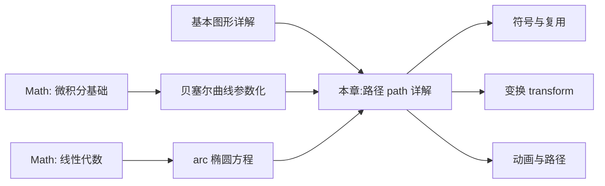

## 1. 学习目标

本章延续 Stanford CS248《图形学导论》与 MIT 6.837《计算机图形学》的教学严谨度,在坐标系基础上深入 SVG 路径的形式化定义。学完本章后,学习者应当能够在 Bloom 教育目标分类法的六个层级上达成下列能力。

### 1.1 Bloom 能力矩阵

| 层级 | 行为动词 | 本章目标能力 | 评估方式 |
| ---- | -------- | ------------ | -------- |
| **Remember** 记忆 | 列举、复述 | 能列举 path 的 10 大命令(M/L/H/V/C/S/Q/T/A/Z)及其参数 | 选择题、填空题 |
| **Understand** 理解 | 解释、归纳 | 能解释贝塞尔曲线的控制点语义、弧线 4 参数组合的几何含义 | 概念辨析题 |
| **Apply** 应用 | 使用、实现 | 能编写复杂路径数据,绘制任意曲线、扇形、心形等图形 | 实操题 |
| **Analyze** 分析 | 比较、分解 | 能分析贝塞尔曲线 de Casteljau 算法、arc 隐式方程求解 | 推导题 |
| **Evaluate** 评价 | 评判、推荐 | 能评估路径数据压缩策略,给出 SVGO 优化建议 | 代码评审题 |
| **Create** 创造 | 设计、构建 | 能设计一个支持路径绘制与编辑的 SVG 工具 | 架构设计题 |

### 1.2 知识图谱前置依赖



### 1.3 学习成果清单

完成本章学习后,学习者应当能够产出:

1. 一份使用所有 10 大 path 命令绘制的复杂图形
2. 一份贝塞尔曲线 de Casteljau 算法的 JavaScript 实现
3. 一份 arc 命令四参数组合的几何对照图
4. 一份路径长度计算与 stroke-dasharray 动画实现

## 2. 历史动机与发展脉络

### 2.1 路径数据的演进

SVG path 命令的设计源自 PostScript 的路径模型(1982 年由 John Warnock 设计),核心思想是用**命令序列**描述图形轮廓。这一模型经历了多个阶段:

| 时期 | 系统 | 命令风格 | 关键贡献 |
| ---- | ---- | -------- | -------- |
| 1982 | PostScript | `moveto`/`lineto`/`curveto`/`closepath` | 首次提出路径命令模型 |
| 1985 | Adobe Illustrator | 贝塞尔曲线编辑 | 引入三次贝塞尔交互 |
| 1990 | PDF | 简化 PostScript 路径 | 二进制路径数据 |
| 2001 | SVG 1.0 | `M`/`L`/`C`/`Q`/`A`/`Z` | XML 化路径数据 |
| 2018 | SVG 2 | 与 CSS path() 函数融合 | 路径作为 CSS 属性 |

### 2.2 贝塞尔曲线的历史

贝塞尔曲线由法国工程师 Pierre Bézier 于 1960 年在 Renault(雷诺)汽车公司推广用于车身设计,但数学基础由 Paul de Casteljau 于 1959 年在 Citroën(雪铁龙)提出。两者的命名差异反映了学术与工程的优先权之争:

- **de Casteljau 算法**(1959):递归细分,数值稳定
- **Bézier 曲线命名**(1960):公开发表,工业推广

SVG path 的 `C`/`Q`/`S`/`T` 命令直接对应贝塞尔曲线的控制点参数。

### 2.3 弧线命令的设计考量

SVG 的 `A` 命令采用"端点 + 半径 + 标志"的参数化方式,而非直接给出椭圆中心。这一选择源于两个约束:

1. **几何唯一性问题**:给定两端点与椭圆半径,存在 4 种可能的弧线(2 个中心位置 × 2 个弧长)
2. **避免冗余计算**:端点已知,中心可由方程推导

因此 SVG 选择用 `large-arc-flag` 与 `sweep-flag` 两个布尔值区分 4 种情况。

### 2.4 设计哲学:命令序列即数据

SVG path 的设计哲学可概括为"命令序列即数据":

- **可读性**:命令字母助记性强(M=Move, L=Line, C=Curve)
- **紧凑性**:相对坐标(小写)减少数字位数
- **可组合**:多个子路径通过 M 命令分隔
- **可解析**:语法简单,易于词法分析

这一设计使 path 既能作为矢量数据存储,也能作为编程接口操作。

## 3. 形式化定义

### 3.1 路径数据的形式化模型

SVG 路径数据可形式化为一个命令序列 $D = (c_1, c_2, \ldots, c_n)$,其中每个命令 $c_i$ 是一个元组:

$$
c_i = (\text{cmd}, \text{absolute}, \text{params})
$$

- $\text{cmd} \in \{M, L, H, V, C, S, Q, T, A, Z\}$ 是命令字母
- $\text{absolute} \in \{\text{true}, \text{false}\}$ 是绝对/相对标志(大写/小写)
- $\text{params}$ 是参数序列,长度由命令类型决定

### 3.2 当前点与子路径状态

路径解析器维护一个状态机,核心状态包括:

- **当前点(current point)** $P_c = (x_c, y_c)$:前一个命令的终点
- **当前子路径起点(subpath start)** $P_s = (x_s, y_s)$:最近的 M 命令终点
- **上一控制点(last control point)** $P_{lc} = (x_{lc}, y_{lc})$:用于 S/T 命令反射

每个命令根据状态计算新的几何点,并更新状态。M 命令会重置子路径起点;Z 命令将当前点设为子路径起点。

### 3.3 命令字母表

$$
\Sigma_{\text{path}} = \{M, L, H, V, C, S, Q, T, A, Z\}
$$

| 命令 | 含义 | 参数 | 参数数量 |
| ---- | ---- | ---- | -------- |
| `M` | 移动到(moveTo) | x, y | 2 |
| `L` | 直线到(lineTo) | x, y | 2 |
| `H` | 水平线 | x | 1 |
| `V` | 垂直线 | y | 1 |
| `C` | 三次贝塞尔 | x1,y1 x2,y2 x,y | 6 |
| `S` | 平滑三次贝塞尔 | x2,y2 x,y | 4 |
| `Q` | 二次贝塞尔 | x1,y1 x,y | 4 |
| `T` | 平滑二次贝塞尔 | x,y | 2 |
| `A` | 弧线 | rx,ry rot large,sweep x,y | 7 |
| `Z` | 闭合路径 | 无 | 0 |

### 3.4 绝对坐标 vs 相对坐标

大写命令使用**绝对坐标**(以 SVG 坐标系原点为参考),小写命令使用**相对坐标**(以前一命令终点为参考):

$$
\text{abs}(x, y) = (x, y), \quad \text{rel}(dx, dy) = (x_c + dx, y_c + dy)
$$

相对坐标的优势:

1. **紧凑性**:小数字,文件更小
2. **可移植性**:路径数据可平移而不修改内部坐标
3. **可复用性**:同一相对路径可在不同位置复用

### 3.5 贝塞尔曲线的参数化定义

n 次贝塞尔曲线 $B(t)$ 由 $n+1$ 个控制点 $P_0, P_1, \ldots, P_n$ 定义:

$$
B(t) = \sum_{i=0}^{n} \binom{n}{i} (1-t)^{n-i} t^i P_i, \quad t \in [0, 1]
$$

- **二次贝塞尔**(Q 命令):$n = 2$,3 个控制点 $P_0, P_1, P_2$
- **三次贝塞尔**(C 命令):$n = 3$,4 个控制点 $P_0, P_1, P_2, P_3$

其中 $P_0$ 是当前点(曲线起点),$P_1, P_2$ 是控制点,$P_3$ 是终点。

### 3.6 弧线的椭圆方程

SVG arc 命令隐含一个椭圆方程。设椭圆中心 $(c_x, c_y)$,半长轴 $r_x$,半短轴 $r_y$,旋转角 $\phi$,则椭圆上的点 $(x, y)$ 满足:

$$
\begin{bmatrix} x \\ y \end{bmatrix} = \begin{bmatrix} \cos\phi & -\sin\phi \\ \sin\phi & \cos\phi \end{bmatrix} \begin{bmatrix} r_x \cos\theta \\ r_y \sin\theta \end{bmatrix} + \begin{bmatrix} c_x \\ c_y \end{bmatrix}
$$

其中 $\theta \in [0, 2\pi)$ 是椭圆参数角。给定端点 $P_1, P_2$ 与半径 $r_x, r_y$,中心 $(c_x, c_y)$ 可通过解方程组获得(共有 2 个可能解)。

## 4. 理论推导与原理解析

### 4.1 de Casteljau 算法

de Casteljau 算法是计算贝塞尔曲线上点的递归方法,数值稳定且几何直观。对 n 次贝塞尔曲线:

$$
P_i^{(k)}(t) = (1-t) \cdot P_i^{(k-1)}(t) + t \cdot P_{i+1}^{(k-1)}(t)
$$

其中 $P_i^{(0)} = P_i$ 是原始控制点,$P_0^{(n)}(t) = B(t)$ 是曲线上的点。

**三次贝塞尔的 de Casteljau 推导**:

给定控制点 $P_0, P_1, P_2, P_3$,计算 $t = 0.5$ 处的点:

1. 一阶插值:$Q_0 = \frac{P_0 + P_1}{2}$, $Q_1 = \frac{P_1 + P_2}{2}$, $Q_2 = \frac{P_2 + P_3}{2}$
2. 二阶插值:$R_0 = \frac{Q_0 + Q_1}{2}$, $R_1 = \frac{Q_1 + Q_2}{2}$
3. 三阶插值:$S = \frac{R_0 + R_1}{2}$ 即为曲线上的点

这一算法可同时计算曲线导数(切线方向),对路径动画与 stroke-dasharray 计算至关重要。

### 4.2 贝塞尔曲线的导数

n 次贝塞尔曲线的导数是 $n-1$ 次贝塞尔曲线:

$$
B'(t) = n \sum_{i=0}^{n-1} (P_{i+1} - P_i) \binom{n-1}{i} (1-t)^{n-1-i} t^i
$$

- **二次贝塞尔导数**:$B'(t) = 2[(1-t)(P_1 - P_0) + t(P_2 - P_1)]$
- **三次贝塞尔导数**:$B'(t) = 3[(1-t)^2(P_1 - P_0) + 2t(1-t)(P_2 - P_1) + t^2(P_3 - P_2)]$

导数模长 $|B'(t)|$ 即切线长度,用于参数 $t$ 到弧长的转换。

### 4.3 路径长度的数值积分

路径长度 $L$ 可通过积分计算:

$$
L = \int_0^1 |B'(t)| \, dt
$$

对贝塞尔曲线,该积分无解析解,需用数值方法:

```javascript
function cubicBezierLength(p0, p1, p2, p3, segments = 100) {
  let length = 0;
  let prev = p0;
  for (let i = 1; i <= segments; i++) {
    const t = i / segments;
    const next = cubicBezierPoint(p0, p1, p2, p3, t);
    length += Math.hypot(next.x - prev.x, next.y - prev.y);
    prev = next;
  }
  return length;
}

function cubicBezierPoint(p0, p1, p2, p3, t) {
  const mt = 1 - t;
  const x = mt*mt*mt*p0.x + 3*mt*mt*t*p1.x + 3*mt*t*t*p2.x + t*t*t*p3.x;
  const y = mt*mt*mt*p0.y + 3*mt*mt*t*p1.y + 3*mt*t*t*p2.y + t*t*t*p3.y;
  return { x, y };
}
```

更精确的方法是 Gaussian quadrature(高斯积分),在少量采样点下获得高精度。

### 4.4 弧线参数的求解

给定 arc 命令 $A\ r_x\ r_y\ \phi\ f_a\ f_s\ x_2\ y_2$(起点 $P_1$,终点 $P_2$),椭圆中心 $(c_x, c_y)$ 的求解步骤:

**Step 1:计算端点中点与差向量**

$$
\vec{m} = \frac{P_1 + P_2}{2}, \quad \vec{d} = \frac{P_1 - P_2}{2}
$$

**Step 2:旋转坐标系**

$$
\begin{bmatrix} x_1' \\ y_1' \end{bmatrix} = \begin{bmatrix} \cos\phi & \sin\phi \\ -\sin\phi & \cos\phi \end{bmatrix} \begin{bmatrix} d_x \\ d_y \end{bmatrix}
$$

**Step 3:修正半径(若端点距离超过椭圆直径)**

$$
r_x' = r_x \cdot k, \quad r_y' = r_y \cdot k, \quad k = \sqrt{\frac{x_1'^2}{r_x^2} + \frac{y_1'^2}{r_y^2}}, \quad k \ge 1
$$

**Step 4:计算中心偏移**

$$
\vec{c}' = \pm \sqrt{\frac{r_x'^2 r_y'^2 - r_x'^2 y_1'^2 - r_y'^2 x_1'^2}{r_x'^2 y_1'^2 + r_y'^2 x_1'^2}} \begin{bmatrix} r_x' y_1' / r_y' \\ -r_y' x_1' / r_x' \end{bmatrix}
$$

符号由 $f_a \neq f_s$ 决定(异或关系)。

**Step 5:逆旋转得到中心**

$$
\begin{bmatrix} c_x \\ c_y \end{bmatrix} = \begin{bmatrix} \cos\phi & -\sin\phi \\ \sin\phi & \cos\phi \end{bmatrix} \begin{bmatrix} c_x' \\ c_y' \end{bmatrix} + \begin{bmatrix} m_x \\ m_y \end{bmatrix}
$$

**Step 6:计算起止角度**

$$
\theta_1 = \text{atan2}\left(\frac{y_1' - c_y'}{r_y'}, \frac{x_1' - c_x'}{r_x'}\right), \quad \theta_2 = \text{atan2}\left(\frac{-y_1' - c_y'}{r_y'}, \frac{-x_1' - c_x'}{r_x'}\right)
$$

$sweep\_flag$ $f_s$ 决定 $\theta_2$ 大于还是小于 $\theta_1$。

### 4.5 fill-rule 算法

复杂路径的填充规则基于射线交叉计数:

**nonzero 规则**(默认):从点 $P$ 出发沿任意方向射线,统计路径穿越次数。每次顺时针穿越计数 +1,逆时针 -1。最终计数非零则填充。

$$
\text{fill}_{\text{nonzero}}(P) = \left( \sum_{i} \text{sign}(\text{cross}_i) \right) \neq 0
$$

**evenodd 规则**:不考虑方向,只统计穿越次数,奇数填充。

$$
\text{fill}_{\text{evenodd}}(P) = \left( \sum_{i} 1 \right) \mod 2 = 1
$$

### 4.6 平滑贝塞尔(S/T)的控制点反射

`S x2,y2 x,y` 命令的第一个控制点自动反射前一命令(必须是 C/S)的第二控制点:

$$
P_1' = 2 P_c - P_{lc}
$$

其中 $P_c$ 是当前点,$P_{lc}$ 是上一控制点。这一反射使曲线在连接点处保持 $C^1$ 连续(切线连续)。

`T x,y` 命令类似,但反射前一 Q/T 命令的控制点。

### 4.7 pathLength 的归一化语义

`pathLength` 属性将路径长度归一化为指定值 $L_n$。后续的 `stroke-dasharray`、`stroke-dashoffset` 等基于 $L_n$ 计算:

$$
\text{actual\_length} = \text{getTotalLength}(), \quad \text{scale} = \frac{L_n}{\text{actual\_length}}
$$

所有引用路径长度的属性都按 scale 缩放,使动画可基于归一化参数(0-100 或 0-1)编写。

### 4.8 多子路径的填充

单个 `<path>` 可包含多个 `M` 命令,形成多个独立子路径。填充规则应用于整个路径:

- **nonzero**:子路径方向决定填充(外顺 + 内逆 = 镂空)
- **evenodd**:子路径方向无关,只数穿越次数

这一性质常用于绘制环形、镂空图形(如五角星中心)。

## 5. 代码示例

### 5.1 path 概述

`<path>` 是 SVG 中最强大的元素,通过 `d` 属性的命令序列描述任意形状。所有基本图形都可用 path 表达。

```html
<svg viewBox="0 0 200 100" xmlns="http://www.w3.org/2000/svg">
  <path d="M 10 10 L 190 10 L 190 90 L 10 90 Z" fill="#4f5bd5" />
</svg>
```

### 5.2 命令总览

| 命令 | 含义 | 参数 | 大小写区别 |
| ---- | ---- | ---- | ---------- |
| `M` | 移动到(moveTo) | x,y | 大写绝对,小写相对 |
| `L` | 直线到(lineTo) | x,y | 同上 |
| `H` | 水平线 | x | 同上 |
| `V` | 垂直线 | y | 同上 |
| `C` | 三次贝塞尔 | x1,y1 x2,y2 x,y | 同上 |
| `S` | 平滑三次贝塞尔 | x2,y2 x,y | 同上 |
| `Q` | 二次贝塞尔 | x1,y1 x,y | 同上 |
| `T` | 平滑二次贝塞尔 | x,y | 同上 |
| `A` | 弧线 | rx,ry rot large,sweep x,y | 同上 |
| `Z` | 闭合路径 | 无 | 大小写等价 |

> **绝对坐标**:以坐标系原点为参考;**相对坐标**:以前一命令终点为参考。

### 5.3 直线命令

#### 5.3.1 M / L

```html
<path d="M 10 10 L 100 10 L 100 50 L 10 50 Z" fill="#4f5bd5" />
```

绘制矩形:从 (10,10) → (100,10) → (100,50) → (10,50) → 闭合回起点。

#### 5.3.2 H / V

```html
<path d="M 10 10 H 100 V 50 H 10 Z" fill="#00b894" />
```

`H 100` 等价于 `L 100 当前y`,`V 50` 等价于 `L 当前x 50`。H/V 比 L 更紧凑,文件更小。

#### 5.3.3 相对坐标

```html
<!-- 绝对 -->
<path d="M 10 10 L 100 10 L 100 50" />
<!-- 相对:等价效果 -->
<path d="M 10 10 l 90 0 l 0 40" />
```

相对命令 `l 90 0` 表示从前一点向右移动 90,y 不变。

### 5.4 贝塞尔曲线

#### 5.4.1 二次贝塞尔 Q

`Q x1,y1 x,y`:一个控制点 + 终点。

```html
<svg viewBox="0 0 200 100" xmlns="http://www.w3.org/2000/svg">
  <!-- 控制点 (100,10),终点 (190,90) -->
  <path d="M 10 90 Q 100 10 190 90" fill="none" stroke="#4f5bd5" stroke-width="3" />
  <!-- 辅助线 -->
  <line x1="10" y1="90" x2="100" y2="10" stroke="#ccc" stroke-dasharray="3" />
  <line x1="100" y1="10" x2="190" y2="90" stroke="#ccc" stroke-dasharray="3" />
</svg>
```

#### 5.4.2 平滑二次贝塞尔 T

`T x,y`:自动反射前一控制点,形成连续平滑曲线。

```html
<path d="M 10 90 Q 100 10 190 90 T 370 90" fill="none" stroke="#d63031" stroke-width="3" />
```

第二个控制点自动为 $(280, 170)$(反射 $(100, 10)$ 关于 $(190, 90)$),形成波浪。

#### 5.4.3 三次贝塞尔 C

`C x1,y1 x2,y2 x,y`:两个控制点 + 终点,可表达更复杂曲线。

```html
<svg viewBox="0 0 200 100" xmlns="http://www.w3.org/2000/svg">
  <path d="M 10 50 C 50 10 150 90 190 50" fill="none" stroke="#00b894" stroke-width="3" />
</svg>
```

#### 5.4.4 平滑三次贝塞尔 S

`S x2,y2 x,y`:第二控制点自动反射,第一控制点需显式提供。

```html
<path d="M 10 50 C 50 10 100 90 150 50 S 250 10 290 50" fill="none" stroke="#d63031" />
```

### 5.5 弧线命令 A

```
A rx,ry x-axis-rotation large-arc-flag sweep-flag x,y
```

| 参数 | 含义 |
| ---- | ---- |
| `rx,ry` | 椭圆半径 |
| `x-axis-rotation` | 椭圆 x 轴旋转角度(度) |
| `large-arc-flag` | 0 短弧 / 1 长弧 |
| `sweep-flag` | 0 逆时针 / 1 顺时针 |
| `x,y` | 终点 |

#### 5.5.1 四种弧组合

```html
<svg viewBox="0 0 400 200" xmlns="http://www.w3.org/2000/svg">
  <!-- 从 (50,100) 到 (150,100),半径 50 -->
  <path d="M 50 100 A 50 50 0 0 0 150 100" fill="none" stroke="#4f5bd5" />
  <path d="M 250 100 A 50 50 0 0 1 350 100" fill="none" stroke="#00b894" />
  <path d="M 50 50 A 50 50 0 1 0 150 50" fill="none" stroke="#d63031" />
  <path d="M 250 50 A 50 50 0 1 1 350 50" fill="none" stroke="#f9a825" />
</svg>
```

#### 5.5.2 圆弧扇形

```html
<svg viewBox="0 0 200 200" xmlns="http://www.w3.org/2000/svg">
  <path d="M 100 100 L 100 20 A 80 80 0 0 1 180 100 Z" fill="#4f5bd5" />
</svg>
```

绘制 1/4 扇形:从圆心 (100,100) → (100,20) → 顺时针弧到 (180,100) → 闭合。

### 5.6 闭合路径 Z

`Z`(或 `z`)从当前点连回 `M` 起点形成闭合。

```html
<!-- 不闭合:不画最后一条边 -->
<path d="M 10 10 L 100 10 L 100 50" fill="none" stroke="#000" />
<!-- 闭合:自动连接终点到起点 -->
<path d="M 10 10 L 100 10 L 100 50 Z" fill="#4f5bd5" />
```

> 闭合后 `fill` 才能正确填充内部。

### 5.7 路径填充规则 fill-rule

复杂路径(自相交或多子路径)的填充行为由 `fill-rule` 控制。

#### 5.7.1 nonzero(默认)

```html
<path
  d="M 10 10 L 190 10 L 190 90 L 10 90 Z M 50 30 L 150 30 L 150 70 L 50 70 Z"
  fill="#4f5bd5"
  fill-rule="nonzero"
/>
```

外矩形 + 内矩形:nonzero 规则下内矩形被"挖空"(外顺时针 + 内逆时针 → 区域计数为 0)。

#### 5.7.2 evenodd

```html
<path
  d="M 10 10 L 190 10 L 190 90 L 10 90 Z M 50 30 L 150 30 L 150 70 L 50 70 Z"
  fill="#00b894"
  fill-rule="evenodd"
/>
```

evenodd 规则下,无论方向,奇数次穿越绘制,偶数次不绘制 → 形成环带效果。

#### 5.7.3 五角星示例

```html
<!-- nonzero:中心填充 -->
<path
  d="M 100 10 L 120 70 L 180 70 L 130 105 L 150 165 L 100 130 L 50 165 L 70 105 L 20 70 L 80 70 Z"
  fill="#d63031"
  fill-rule="nonzero"
/>

<!-- evenodd:中心镂空 -->
<path
  d="M 100 10 L 120 70 L 180 70 L 130 105 L 150 165 L 100 130 L 50 165 L 70 105 L 20 70 L 80 70 Z"
  fill="#f9a825"
  fill-rule="evenodd"
/>
```

### 5.8 多子路径

单个 `<path>` 可包含多个 `M` 命令,形成多个独立子路径。

```html
<!-- 两个独立三角形 -->
<path d="M 10 10 L 90 10 L 50 90 Z M 110 10 L 190 10 L 150 90 Z" fill="#4f5bd5" />
```

### 5.9 路径长度与测量

`pathLength` 属性将路径归一化到指定长度,便于 stroke-dasharray 动画。

```html
<path
  d="M 10 50 Q 100 10 190 50"
  fill="none"
  stroke="#4f5bd5"
  stroke-width="3"
  pathLength="100"
  stroke-dasharray="50 50"
/>
<!-- pathLength=100,dasharray 50 50 表示画一半留一半 -->
```

JavaScript 获取实际长度:

```javascript
const path = document.querySelector('path');
const length = path.getTotalLength();
console.log(length); // 例如 200

const point = path.getPointAtLength(100); // 路径中点坐标
console.log(point.x, point.y);
```

### 5.10 stroke-dasharray 动画

```html
<svg viewBox="0 0 200 100" xmlns="http://www.w3.org/2000/svg">
  <path
    id="animated-path"
    d="M 10 50 Q 100 10 190 50"
    fill="none"
    stroke="#4f5bd5"
    stroke-width="3"
    stroke-dasharray="200"
    stroke-dashoffset="200"
  >
    <animate
      attributeName="stroke-dashoffset"
      from="200"
      to="0"
      dur="2s"
      repeatCount="indefinite"
    />
  </path>
</svg>
```

### 5.11 实战:手写心形

```html
<svg viewBox="0 0 100 100" width="200" height="200" xmlns="http://www.w3.org/2000/svg">
  <path
    d="M 50 30
       C 30 10 0 20 0 50
       C 0 70 30 90 50 100
       C 70 90 100 70 100 50
       C 100 20 70 10 50 30 Z"
    fill="#d63031"
  />
</svg>
```

**解析**:

- 起点 (50,30):心形顶部凹陷
- C 到 (0,50):左半弧
- C 到 (50,100):底部尖角
- C 到 (100,50):右半弧
- C 回 (50,30):闭合

### 5.12 JavaScript 路径生成器

```javascript
class PathBuilder {
  constructor() {
    this.commands = [];
  }

  moveTo(x, y, relative = false) {
    this.commands.push(`${relative ? 'm' : 'M'} ${x} ${y}`);
    return this;
  }

  lineTo(x, y, relative = false) {
    this.commands.push(`${relative ? 'l' : 'L'} ${x} ${y}`);
    return this;
  }

  cubicBezier(x1, y1, x2, y2, x, y, relative = false) {
    this.commands.push(`${relative ? 'c' : 'C'} ${x1} ${y1} ${x2} ${y2} ${x} ${y}`);
    return this;
  }

  quadraticBezier(x1, y1, x, y, relative = false) {
    this.commands.push(`${relative ? 'q' : 'Q'} ${x1} ${y1} ${x} ${y}`);
    return this;
  }

  arc(rx, ry, rotation, largeArc, sweep, x, y, relative = false) {
    this.commands.push(
      `${relative ? 'a' : 'A'} ${rx} ${ry} ${rotation} ${largeArc ? 1 : 0} ${sweep ? 1 : 0} ${x} ${y}`
    );
    return this;
  }

  close() {
    this.commands.push('Z');
    return this;
  }

  build() {
    return this.commands.join(' ');
  }
}

// 使用示例:绘制圆角矩形
function roundedRectPath(x, y, width, height, r) {
  return new PathBuilder()
    .moveTo(x + r, y)
    .arc(r, r, 0, false, true, x + width, y + r)
    .arc(r, r, 0, false, true, x + width - r, y + height)
    .arc(r, r, 0, false, true, x, y + height - r)
    .arc(r, r, 0, false, true, x + r, y)
    .close()
    .build();
}

console.log(roundedRectPath(10, 10, 100, 80, 8));
// "M 18 10 A 8 8 0 0 1 110 18 A 8 8 0 0 1 102 90 A 8 8 0 0 1 10 82 A 8 8 0 0 1 18 10 Z"
```

### 5.13 de Casteljau 算法实现

```javascript
function deCasteljau(points, t) {
  if (points.length === 1) return points[0];
  const next = [];
  for (let i = 0; i < points.length - 1; i++) {
    next.push({
      x: (1 - t) * points[i].x + t * points[i + 1].x,
      y: (1 - t) * points[i].y + t * points[i + 1].y,
    });
  }
  return deCasteljau(next, t);
}

// 三次贝塞尔曲线点
function cubicBezier(p0, p1, p2, p3, t) {
  return deCasteljau([p0, p1, p2, p3], t);
}

// 二次贝塞尔曲线点
function quadraticBezier(p0, p1, p2, t) {
  return deCasteljau([p0, p1, p2], t);
}

// 使用
const p0 = { x: 10, y: 50 };
const p1 = { x: 50, y: 10 };
const p2 = { x: 150, y: 90 };
const p3 = { x: 190, y: 50 };
console.log(cubicBezier(p0, p1, p2, p3, 0.5)); // 中点
```

### 5.14 弧线参数求解

```javascript
function arcCenter(p1, p2, rx, ry, phi, largeArc, sweep) {
  const phiRad = (phi * Math.PI) / 180;
  const cosPhi = Math.cos(phiRad);
  const sinPhi = Math.sin(phiRad);

  // Step 1: 计算中点与差向量
  const mx = (p1.x + p2.x) / 2;
  const my = (p1.y + p2.y) / 2;
  const dx = (p1.x - p2.x) / 2;
  const dy = (p1.y - p2.y) / 2;

  // Step 2: 旋转坐标系
  const x1p = cosPhi * dx + sinPhi * dy;
  const y1p = -sinPhi * dx + cosPhi * dy;

  // Step 3: 修正半径
  const lambda = (x1p * x1p) / (rx * rx) + (y1p * y1p) / (ry * ry);
  const k = Math.sqrt(Math.max(1, lambda));
  rx *= k;
  ry *= k;

  // Step 4: 计算中心偏移
  const rx2 = rx * rx;
  const ry2 = ry * ry;
  const x1p2 = x1p * x1p;
  const y1p2 = y1p * y1p;

  const denom = rx2 * y1p2 + ry2 * x1p2;
  const numer = Math.sqrt(Math.max(0, (rx2 * ry2 - denom) / denom));
  const sign = largeArc !== sweep ? 1 : -1;

  const cxp = (sign * numer * rx * y1p) / ry;
  const cyp = (sign * numer * -ry * x1p) / rx;

  // Step 5: 逆旋转
  const cx = cosPhi * cxp - sinPhi * cyp + mx;
  const cy = sinPhi * cxp + cosPhi * cyp + my;

  // Step 6: 计算起止角度
  const theta1 = Math.atan2((y1p - cyp) / ry, (x1p - cxp) / rx);
  let theta2 = Math.atan2((-y1p - cyp) / ry, (-x1p - cxp) / rx);

  // 调整 theta2 范围
  if (!sweep && theta2 > theta1) theta2 -= 2 * Math.PI;
  if (sweep && theta2 < theta1) theta2 += 2 * Math.PI;

  return { cx, cy, rx, ry, phi: phiRad, theta1, theta2 };
}

// 使用示例
const center = arcCenter(
  { x: 50, y: 100 },
  { x: 150, y: 100 },
  50,
  50,
  0,
  false,
  true
);
console.log(center);
// { cx: 100, cy: 100, rx: 50, ry: 50, phi: 0, theta1: ..., theta2: ... }
```

## 6. 对比分析

### 6.1 SVG path vs Canvas Path2D

| 特性 | SVG path | Canvas Path2D |
| ---- | -------- | -------------- |
| 数据格式 | 字符串(d 属性) | JavaScript 对象 |
| 命令风格 | M/L/C/Q/A | moveTo/lineTo/bezierCurveTo/arc |
| 贝塞尔曲线 | 三次、二次 | 三次、二次 |
| 弧线 | A 命令(端点参数化) | arc(中心 + 角度参数化) |
| 平滑贝塞尔 | S/T 自动反射 | 需手动计算控制点 |
| 填充规则 | fill-rule | fill('evenodd'/'nonzero') |
| 序列化 | 原生支持 | 需手动序列化 |
| 编辑能力 | DOM 操作 | 不可编辑 |

### 6.2 SVG path vs PostScript path

| 特性 | SVG path | PostScript path |
| ---- | -------- | --------------- |
| 语法 | XML 属性 | PostScript 命令 |
| 命令字母 | M/L/C/Q/A/Z | moveto/lineto/curveto/closepath |
| 坐标类型 | 绝对 + 相对 | 仅绝对 |
| 弧线 | A 命令 | 通过 curveto 近似 |
| 平滑贝塞尔 | S/T | 需手动计算 |
| 文本格式 | 是 | 是 |

### 6.3 贝塞尔曲线 vs 样条曲线

| 特性 | 贝塞尔曲线 | B 样条曲线 | NURBS |
| ---- | ---------- | ---------- | ----- |
| 控制点影响 | 全局 | 局部 | 局部 |
| 节点数 | n+1 | 任意 | 任意 |
| 连续性 | $C^{n-1}$ | $C^{k-1}$ | $C^{k-1}$ |
| 权重 | 无 | 无 | 有 |
| 适用场景 | SVG/字体 | CAD | 高级建模 |
| 计算复杂度 | 低 | 中 | 高 |

### 6.4 nonzero vs evenodd

| 特性 | nonzero | evenodd |
| ---- | ------- | -------- |
| 方向敏感性 | 是 | 否 |
| 顺时针 + 逆时针 | 抵消(镂空) | 不抵消(填充) |
| 同向子路径 | 计数累加 | 计数累加 |
| 实现复杂度 | 中 | 低 |
| 适用场景 | 方向明确的设计 | 复杂嵌套图形 |

## 7. 常见陷阱与最佳实践

### 7.1 命令字母大小写混淆

```html
<!-- 错误:相对坐标用大写,导致位置错乱 -->
<path d="M 10 10 L 90 90" />
<!-- 等价于绝对坐标,从 (10,10) 到 (90,90) -->

<!-- 正确:相对坐标用小写 -->
<path d="M 10 10 l 90 90" />
<!-- 等价于从 (10,10) 移动 (90,90),到 (100,100) -->
```

### 7.2 弧线参数无解

```html
<!-- 错误:两点距离超过椭圆直径,导致自动放大半径 -->
<path d="M 0 0 A 50 50 0 0 1 200 0" />
<!-- 端点距离 200,但直径只有 100,半径会被放大到 100 -->
```

**最佳实践**:验证端点距离 $\leq 2 \cdot \max(r_x, r_y)$,否则半径会被自动修正。

### 7.3 Z 命令后未重置当前点

```html
<!-- 错误:Z 后继续画线,会从 Z 之前的终点开始 -->
<path d="M 10 10 L 100 10 Z L 100 100" />
<!-- L 100 100 从 (100,10) 开始,而非 (10,10) -->
```

**最佳实践**:Z 后若需在新位置画图,应使用 M 命令显式重置。

### 7.4 平滑贝塞尔前无 C/Q

```html
<!-- 错误:S 前没有 C,反射控制点未定义 -->
<path d="M 10 50 S 100 10 190 50" />
<!-- 第一控制点默认为当前点,等价于 Q -->
```

**最佳实践**:S 命令前应有 C 或 S 命令;T 命令前应有 Q 或 T 命令。

### 7.5 坐标精度过高

```html
<!-- 冗余:过多小数位 -->
<path d="M 10.123456789 20.987654321 L 100.111111111 50.222222222" />

<!-- 推荐:精度 2 位足够 -->
<path d="M 10.12 20.99 L 100.11 50.22" />
```

**最佳实践**:用 SVGO 自动压缩坐标精度,通常 2-3 位小数已足够视觉精度。

### 7.6 复杂路径未分组

```html
<!-- 难维护:所有形状在一个 path 内 -->
<path d="M 0 0 L 100 0 L 100 100 Z M 200 0 L 300 0 L 300 100 Z M ..." />

<!-- 推荐:逻辑分组用多个 path 或 g -->
<g fill="#4f5bd5">
  <path d="M 0 0 L 100 0 L 100 100 Z" />
  <path d="M 200 0 L 300 0 L 300 100 Z" />
</g>
```

### 7.7 路径方向影响 fill-rule

```html
<!-- nonzero 规则下,内矩形方向决定是否镂空 -->
<!-- 外顺 + 内顺 = 都填充 -->
<path d="M 10 10 L 190 10 L 190 90 L 10 90 Z M 50 30 L 150 30 L 150 70 L 50 70 Z" fill-rule="nonzero" />

<!-- 外顺 + 内逆 = 镂空 -->
<path d="M 10 10 L 190 10 L 190 90 L 10 90 Z M 50 70 L 150 70 L 150 30 L 50 30 Z" fill-rule="nonzero" />
```

**最佳实践**:需要镂空效果时,确保外环与内环方向相反(可通过 reverse 命令调整)。

### 7.8 pathLength 与实际长度混淆

```html
<!-- 误解:认为 pathLength=100 后,实际长度变为 100 -->
<path d="..." pathLength="100" />
<!-- 实际长度可能为 200,pathLength 仅影响 stroke-dasharray 等的归一化 -->
```

## 8. 工程实践

### 8.1 SVG 图标库设计

#### 8.1.1 统一 viewBox 与坐标系

```xml
<!-- 所有图标统一 24×24 viewBox -->
<svg viewBox="0 0 24 24" xmlns="http://www.w3.org/2000/svg">
  <path d="M 12 2 L 22 22 L 2 22 Z" fill="currentColor" />
</svg>
```

#### 8.1.2 路径数据 TypeScript 类型

```typescript
// SVG path 命令类型定义
type PathCommand =
  | { cmd: 'M'; x: number; y: number; absolute: boolean }
  | { cmd: 'L'; x: number; y: number; absolute: boolean }
  | { cmd: 'C'; x1: number; y1: number; x2: number; y2: number; x: number; y: number; absolute: boolean }
  | { cmd: 'Q'; x1: number; y1: number; x: number; y: number; absolute: boolean }
  | { cmd: 'A'; rx: number; ry: number; rotation: number; largeArc: boolean; sweep: boolean; x: number; y: number; absolute: boolean }
  | { cmd: 'Z' };

function commandsToPath(commands: PathCommand[]): string {
  return commands.map((c) => {
    const prefix = c.absolute ? c.cmd : c.cmd.toLowerCase();
    switch (c.cmd) {
      case 'M':
      case 'L':
        return `${prefix} ${c.x} ${c.y}`;
      case 'C':
        return `${prefix} ${c.x1} ${c.y1} ${c.x2} ${c.y2} ${c.x} ${c.y}`;
      case 'Q':
        return `${prefix} ${c.x1} ${c.y1} ${c.x} ${c.y}`;
      case 'A':
        return `${prefix} ${c.rx} ${c.ry} ${c.rotation} ${c.largeArc ? 1 : 0} ${c.sweep ? 1 : 0} ${c.x} ${c.y}`;
      case 'Z':
        return 'Z';
    }
  }).join(' ');
}
```

### 8.2 Vue 3 SVG 路径组件

```vue
<template>
  <svg
    :viewBox="`0 0 ${size} ${size}`"
    :width="size"
    :height="size"
    xmlns="http://www.w3.org/2000/svg"
  >
    <path
      :d="path"
      :fill="color"
      :stroke="stroke"
      :stroke-width="strokeWidth"
      :fill-rule="fillRule"
    />
  </svg>
</template>

<script setup>
import { computed } from 'vue';

const props = defineProps({
  path: { type: String, required: true },
  size: { type: [Number, String], default: 24 },
  color: { type: String, default: 'currentColor' },
  stroke: { type: String, default: 'none' },
  strokeWidth: { type: [Number, String], default: 0 },
  fillRule: { type: String, default: 'nonzero' },
});

const size = computed(() => Number(props.size));
</script>
```

### 8.3 React SVG 路径组件

```jsx
import { memo } from 'react';

const SVGIcon = memo(function SVGIcon({
  path,
  size = 24,
  color = 'currentColor',
  stroke = 'none',
  strokeWidth = 0,
  fillRule = 'nonzero',
  title,
  ...rest
}) {
  return (
    <svg
      viewBox={`0 0 ${size} ${size}`}
      width={size}
      height={size}
      xmlns="http://www.w3.org/2000/svg"
      role={title ? 'img' : 'presentation'}
      aria-hidden={title ? undefined : true}
      aria-label={title}
      {...rest}
    >
      {title && <title>{title}</title>}
      <path
        d={path}
        fill={color}
        stroke={stroke}
        strokeWidth={strokeWidth}
        fillRule={fillRule}
      />
    </svg>
  );
});

export default SVGIcon;
```

### 8.4 SVGO 优化配置

```javascript
// svgo.config.js
module.exports = {
  plugins: [
    'preset-default',
    {
      name: 'convertPathData',
      params: {
        // 使用相对坐标
        utilizeAbsolute: false,
        // 移除不必要的小数
        floatPrecision: 3,
        // 合并连续命令
        mergeRepeated: true,
        // 移除冗余命令
        removeUseless: true,
      },
    },
    {
      name: 'convertTransform',
      params: {
        convertToShorts: true,
      },
    },
    'removeViewBox',
    'removeDimensions',
  ],
};
```

### 8.5 路径长度计算工具

```javascript
class PathLengthCalculator {
  constructor() {
    this.segments = [];
  }

  // 解析路径数据
  parse(d) {
    const tokens = d.match(/[a-zA-Z]|-?\d*\.?\d+/g);
    let cmd = null;
    let i = 0;
    let current = { x: 0, y: 0 };
    let start = { x: 0, y: 0 };

    while (i < tokens.length) {
      if (/[a-zA-Z]/.test(tokens[i])) {
        cmd = tokens[i++];
      }
      const abs = cmd === cmd.toUpperCase();
      const lower = cmd.toLowerCase();

      switch (lower) {
        case 'm':
          current = this.parsePoint(tokens, i, abs, current);
          i += 2;
          start = { ...current };
          break;
        case 'l':
        case 'h':
        case 'v': {
          const next = this.parseLine(lower, tokens, i, abs, current);
          this.segments.push({ type: 'L', start: current, end: next });
          current = next;
          i += lower === 'l' ? 2 : 1;
          break;
        }
        case 'c': {
          const seg = this.parseCubic(tokens, i, abs, current);
          this.segments.push(seg);
          current = seg.end;
          i += 6;
          break;
        }
        case 'z':
          this.segments.push({ type: 'L', start: current, end: start });
          current = { ...start };
          i += 0;
          break;
        // 其他命令略
        default:
          i++;
      }
    }
    return this.segments;
  }

  parsePoint(tokens, i, abs, current) {
    const x = parseFloat(tokens[i]);
    const y = parseFloat(tokens[i + 1]);
    return abs ? { x, y } : { x: current.x + x, y: current.y + y };
  }

  parseLine(cmd, tokens, i, abs, current) {
    if (cmd === 'l') return this.parsePoint(tokens, i, abs, current);
    if (cmd === 'h') {
      const x = parseFloat(tokens[i]);
      return abs ? { x, y: current.y } : { x: current.x + x, y: current.y };
    }
    if (cmd === 'v') {
      const y = parseFloat(tokens[i]);
      return abs ? { x: current.x, y } : { x: current.x, y: current.y + y };
    }
  }

  parseCubic(tokens, i, abs, current) {
    const p = (offset) => this.parsePoint(tokens, i + offset, abs, current);
    const c1 = p(0);
    const c2 = p(2);
    const end = p(4);
    return { type: 'C', start: current, c1, c2, end };
  }

  // 计算总长度
  totalLength() {
    return this.segments.reduce((sum, seg) => sum + this.segmentLength(seg), 0);
  }

  segmentLength(seg) {
    if (seg.type === 'L') {
      return Math.hypot(seg.end.x - seg.start.x, seg.end.y - seg.start.y);
    }
    if (seg.type === 'C') {
      // 数值积分
      let length = 0;
      let prev = seg.start;
      const samples = 100;
      for (let i = 1; i <= samples; i++) {
        const t = i / samples;
        const p = this.cubicPoint(seg, t);
        length += Math.hypot(p.x - prev.x, p.y - prev.y);
        prev = p;
      }
      return length;
    }
    return 0;
  }

  cubicPoint(seg, t) {
    const { start, c1, c2, end } = seg;
    const mt = 1 - t;
    return {
      x: mt*mt*mt*start.x + 3*mt*mt*t*c1.x + 3*mt*t*t*c2.x + t*t*t*end.x,
      y: mt*mt*mt*start.y + 3*mt*mt*t*c1.y + 3*mt*t*t*c2.y + t*t*t*end.y,
    };
  }
}
```

### 8.6 SVG 编辑器核心逻辑

```javascript
class SVGPathEditor {
  constructor(svg) {
    this.svg = svg;
    this.history = [];
    this.currentPath = null;
    this.controlPoints = [];
  }

  // 开始新路径
  startPath(x, y) {
    this.currentPath = `M ${x} ${y}`;
    this.renderPath();
  }

  // 添加直线
  addLine(x, y) {
    this.currentPath += ` L ${x} ${y}`;
    this.renderPath();
    this.saveHistory();
  }

  // 添加三次贝塞尔
  addCubicBezier(x1, y1, x2, y2, x, y) {
    this.currentPath += ` C ${x1} ${y1} ${x2} ${y2} ${x} ${y}`;
    this.renderPath();
    this.saveHistory();
  }

  // 闭合路径
  closePath() {
    this.currentPath += ' Z';
    this.renderPath();
    this.saveHistory();
  }

  renderPath() {
    const path = this.svg.querySelector('path.editing');
    if (!path) {
      const newPath = document.createElementNS('http://www.w3.org/2000/svg', 'path');
      newPath.setAttribute('class', 'editing');
      newPath.setAttribute('fill', 'none');
      newPath.setAttribute('stroke', '#4f5bd5');
      this.svg.appendChild(newPath);
    }
    this.svg.querySelector('path.editing').setAttribute('d', this.currentPath);
  }

  saveHistory() {
    this.history.push(this.currentPath);
  }

  undo() {
    if (this.history.length > 1) {
      this.history.pop();
      this.currentPath = this.history[this.history.length - 1];
      this.renderPath();
    }
  }
}
```

## 9. 案例研究

### 9.1 案例一:Material Design 图标

Google Material Icons 大量使用 path 命令:

```xml
<svg viewBox="0 0 24 24" xmlns="http://www.w3.org/2000/svg">
  <path d="M12 2C6.48 2 2 6.48 2 12s4.48 10 10 10 10-4.48 10-10S17.52 2 12 2zm-2 15l-5-5 1.41-1.41L10 14.17l7.59-7.59L19 8l-9 9z"/>
</svg>
```

**设计要点**:

1. 使用相对坐标(l 小写)减少数字位数
2. 弧线 A 命令精确绘制圆角
3. 单一 path 简化 DOM 结构

### 9.2 案例二:Heroicons 体系

```xml
<svg viewBox="0 0 24 24" xmlns="http://www.w3.org/2000/svg" fill="none" stroke="currentColor">
  <path stroke-linecap="round" stroke-linejoin="round" stroke-width="2" d="M5 13l4 4L19 7" />
</svg>
```

**设计要点**:

1. 使用 stroke 而非 fill,便于主题化
2. `stroke-linecap="round"` 让端点圆润
3. 简洁命令序列

### 9.3 案例三:Lucide Icons

```xml
<svg viewBox="0 0 24 24" xmlns="http://www.w3.org/2000/svg" fill="none" stroke="currentColor" stroke-width="2" stroke-linecap="round" stroke-linejoin="round">
  <path d="M21 12.79A9 9 0 1 1 11.21 3 7 7 0 0 0 21 12.79z"/>
</svg>
```

### 9.4 案例四:Bootstrap Icons

```xml
<svg viewBox="0 0 16 16" xmlns="http://www.w3.org/2000/svg">
  <path fill-rule="evenodd" d="M8 0a8 8 0 1 0 0 16A8 8 0 0 0 8 0zM1.5 8a6.5 6.5 0 1 1 13 0 6.5 6.5 0 0 1-13 0z"/>
</svg>
```

**设计要点**:

1. 使用 `fill-rule="evenodd"` 处理环形
2. 单 path 完成圆形 + 镂空
3. 16×16 viewBox 适配密集 UI

### 9.5 案例五:D3.js 数据可视化

```javascript
import * as d3 from 'd3';

// 生成路径数据
const line = d3.line()
  .x((d) => xScale(d.x))
  .y((d) => yScale(d.y))
  .curve(d3.curveCatmullRom); // 平滑曲线

const path = svg.append('path')
  .datum(data)
  .attr('d', line)
  .attr('fill', 'none')
  .attr('stroke', '#4f5bd5');
```

D3.js 内部将曲线插值转换为 SVG path 命令,支持贝塞尔、B 样条等多种插值。

### 9.6 案例六:FANDEX 项目实战

FANDEX 项目使用 path 命令绘制知识图谱节点连接线:

```html
<svg viewBox="0 0 800 600" xmlns="http://www.w3.org/2000/svg">
  <!-- 节点 -->
  <circle cx="100" cy="100" r="20" fill="#4f5bd5" />
  <circle cx="700" cy="500" r="20" fill="#00b894" />

  <!-- 贝塞尔曲线连接 -->
  <path
    d="M 120 100 C 300 50, 500 550, 680 500"
    fill="none"
    stroke="#999"
    stroke-width="2"
    stroke-dasharray="4 4"
  >
    <animate attributeName="stroke-dashoffset" from="0" to="8" dur="0.5s" repeatCount="indefinite" />
  </path>
</svg>
```

**应用场景**:

1. 知识图谱节点关系连线
2. 流程图箭头
3. 数据可视化曲线
4. 装饰性背景

## 10. 习题

### 10.1 选择题

**题目 1**:`M 10 10 L 100 100` 与 `m 10 10 l 100 100` 的区别是?

- A. 没有区别
- B. 前者从 (10,10) 到 (100,100),后者从 (110,110) 到 (210,210)
- C. 前者绝对,后者相对
- D. 前者使用直线,后者使用曲线

<details>
<summary>查看答案</summary>

**答案**:C

**解析**:大写字母 M/L 使用绝对坐标(以原点为参考),小写字母 m/l 使用相对坐标(以前一终点为参考)。若前一终点为原点(初始状态),两者结果相同;否则不同。
</details>

**题目 2**:绘制一个完整的圆形(从 (50,50) 到 (150,50),半径 50),正确的 arc 命令是?

- A. `A 50 50 0 0 0 150 50`
- B. `A 50 50 0 1 0 150 50`
- C. `A 50 50 0 1 1 150 50`
- D. `A 50 50 0 0 1 150 50`

<details>
<summary>查看答案</summary>

**答案**:B 或 C

**解析**:完整圆形需要 large-arc-flag=1(长弧,因为是半圆以上),sweep-flag 决定方向(0 逆时针下半圆,1 顺时针上半圆)。两种都可绘制半圆,组合为完整圆。
</details>

**题目 3**:三次贝塞尔曲线有几个控制点?

- A. 1 个
- B. 2 个
- C. 3 个
- D. 4 个

<details>
<summary>查看答案</summary>

**答案**:B

**解析**:三次贝塞尔曲线由 4 个点定义:起点(当前点)+ 2 个控制点 + 终点。SVG C 命令格式为 `C x1,y1 x2,y2 x,y`,其中 x1,y1 和 x2,y2 是控制点。
</details>

**题目 4**:`fill-rule="evenodd"` 与 `nonzero` 的核心区别是?

- A. evenodd 不考虑方向,nonzero 考虑
- B. evenodd 用于填充,nonzero 用于描边
- C. evenodd 性能更高
- D. evenodd 仅适用于矩形

<details>
<summary>查看答案</summary>

**答案**:A

**解析**:nonzero 规则统计射线穿越路径的代数和(顺时针 +1,逆时针 -1),非零填充;evenodd 仅统计穿越次数(奇数填充),不考虑方向。因此 evenodd 在复杂嵌套图形中更易预测。
</details>

**题目 5**:`S` 命令的第一控制点如何确定?

- A. 始终为当前点
- B. 始终为前一个 C 命令的终点
- C. 反射前一个 C/S 命令的第二控制点关于当前点
- D. 随机生成

<details>
<summary>查看答案</summary>

**答案**:C

**解析**:`S x2,y2 x,y` 命令的第一控制点 $P_1'$ 自动反射前一个 C/S 命令的第二控制点 $P_{lc}$ 关于当前点 $P_c$:$P_1' = 2P_c - P_{lc}$。这保证曲线在连接点处切线连续。
</details>

### 10.2 填空题

**题目 6**:贝塞尔曲线的数学基础由 ________ 于 1959 年提出,但工业推广由 ________ 于 1960 年完成。

<details>
<summary>查看答案</summary>

**答案**:`Paul de Casteljau`(de Casteljau);`Pierre Bézier`(Bézier)

**解析**:de Casteljau 在 Citroën 提出算法,Bézier 在 Renault 推广工业应用。由于 Bézier 公开发表,曲线以他命名,但 de Casteljau 算法保留原创者名。
</details>

**题目 7**:`pathLength="100"` 的作用是将路径长度归一化为 ________,后续 stroke-dasharray 基于 ________ 计算。

<details>
<summary>查看答案</summary>

**答案**:`100`;`100`(归一化值)

**解析**:pathLength 不改变实际路径长度,只是将引用路径长度的属性(stroke-dasharray、stroke-dashoffset)按归一化值计算。例如 stroke-dasharray="50 50" 在 pathLength=100 时表示画一半留一半。
</details>

**题目 8**:arc 命令的 `large-arc-flag` 与 `sweep-flag` 共可表示 ________ 种弧组合。

<details>
<summary>查看答案</summary>

**答案**:`4`

**解析**:large-arc-flag(0/1) × sweep-flag(0/1) = 4 种组合,分别对应:短弧逆时针、短弧顺时针、长弧逆时针、长弧顺时针。
</details>

**题目 9**:`Z` 命令将当前点连接到 ________,并使路径 ________。

<details>
<summary>查看答案</summary>

**答案**:`M 命令的起点(子路径起点)`;`闭合(可填充内部)`

**解析**:Z 命令画一条直线从当前点回到子路径起点(最近 M 命令终点),形成闭合路径。闭合后 fill 才能正确填充内部。
</details>

**题目 10**:三次贝塞尔曲线 $B(t) = \sum_{i=0}^{3} \binom{3}{i} (1-t)^{3-i} t^i P_i$ 的展开形式是 ________。

<details>
<summary>查看答案</summary>

**答案**:$B(t) = (1-t)^3 P_0 + 3(1-t)^2 t P_1 + 3(1-t) t^2 P_2 + t^3 P_3$

**解析**:三次贝塞尔的 Bernstein 多项式展开,其中 $\binom{3}{0}=\binom{3}{3}=1$, $\binom{3}{1}=\binom{3}{2}=3$。
</details>

### 10.3 编程题

**题目 11**:用 path 命令绘制一个五角星,中心在 (100,100),外接圆半径 80,要求:

1. 五角星 10 个顶点(5 外 + 5 内)
2. 内顶点距中心 32(外接圆的 0.4 倍)
3. 使用 Z 命令闭合
4. 测试 nonzero 与 evenodd 的填充差异

```html
<svg viewBox="0 0 200 200" xmlns="http://www.w3.org/2000/svg">
  <!-- 5 外顶点角度:90°, 162°, 234°, 306°, 18°(数学逆时针) -->
  <!-- SVG Y 轴向下,故用 -angle 翻转 -->

  <!-- nonzero:中心填充 -->
  <path
    d="M 100 20
       L 124.7 84.8
       L 190.2 84.8
       L 137.3 124.7
       L 156.6 188.5
       L 100 150.4
       L 43.4 188.5
       L 62.7 124.7
       L 9.8 84.8
       L 75.3 84.8
       Z"
    fill="#d63031"
    fill-rule="nonzero"
    transform="translate(0 0)"
  />

  <!-- evenodd:中心镂空 -->
  <path
    d="M 100 20
       L 124.7 84.8
       L 190.2 84.8
       L 137.3 124.7
       L 156.6 188.5
       L 100 150.4
       L 43.4 188.5
       L 62.7 124.7
       L 9.8 84.8
       L 75.3 84.8
       Z"
    fill="#f9a825"
    fill-rule="evenodd"
    transform="translate(220 0)"
  />
</svg>
```

**顶点计算公式**:

```javascript
function starPoints(cx, cy, rOuter, rInner, points) {
  const coords = [];
  for (let i = 0; i < points * 2; i++) {
    const r = i % 2 === 0 ? rOuter : rInner;
    const angle = (Math.PI / points) * i - Math.PI / 2; // 起点在顶部
    coords.push({
      x: cx + r * Math.cos(angle),
      y: cy + r * Math.sin(angle),
    });
  }
  return coords;
}

const points = starPoints(100, 100, 80, 32, 5);
const d = `M ${points[0].x.toFixed(1)} ${points[0].y.toFixed(1)} ` +
  points.slice(1).map((p) => `L ${p.x.toFixed(1)} ${p.y.toFixed(1)}`).join(' ') +
  ' Z';
console.log(d);
```

**评分标准**:

- 顶点计算正确(4 分)
- 路径闭合(2 分)
- nonzero vs evenodd 对比展示(4 分)

**题目 12**:实现一个 JavaScript 函数,将 SVG path 数据转换为点序列,要求:

1. 支持 M、L、H、V、C、Q、Z 命令
2. 处理绝对/相对坐标
3. 对贝塞尔曲线采样为线段
4. 返回点数组用于后续处理

```javascript
function parsePathToPoints(d, options = {}) {
  const {
    bezierSegments = 20, // 贝塞尔采样段数
  } = options;

  const tokens = d.match(/[a-zA-Z]|-?\d*\.?\d+(?:e[-+]?\d+)?/g);
  let i = 0;
  let cmd = null;
  let current = { x: 0, y: 0 };
  let subpathStart = { x: 0, y: 0 };
  const points = [];

  while (i < tokens.length) {
    if (/[a-zA-Z]/.test(tokens[i])) {
      cmd = tokens[i++];
    }
    const abs = cmd === cmd.toUpperCase();
    const lower = cmd.toLowerCase();

    switch (lower) {
      case 'm': {
        const x = parseFloat(tokens[i++]);
        const y = parseFloat(tokens[i++]);
        current = abs ? { x, y } : { x: current.x + x, y: current.y + y };
        subpathStart = { ...current };
        points.push({ ...current });
        break;
      }
      case 'l': {
        const x = parseFloat(tokens[i++]);
        const y = parseFloat(tokens[i++]);
        current = abs ? { x, y } : { x: current.x + x, y: current.y + y };
        points.push({ ...current });
        break;
      }
      case 'h': {
        const x = parseFloat(tokens[i++]);
        current = abs ? { x, y: current.y } : { x: current.x + x, y: current.y };
        points.push({ ...current });
        break;
      }
      case 'v': {
        const y = parseFloat(tokens[i++]);
        current = abs ? { x: current.x, y } : { x: current.x, y: current.y + y };
        points.push({ ...current });
        break;
      }
      case 'c': {
        const nums = tokens.slice(i, i + 6).map(parseFloat);
        i += 6;
        const [x1, y1, x2, y2, x, y] = nums;
        const c1 = abs ? { x: x1, y: y1 } : { x: current.x + x1, y: current.y + y1 };
        const c2 = abs ? { x: x2, y: y2 } : { x: current.x + x2, y: current.y + y2 };
        const end = abs ? { x, y } : { x: current.x + x, y: current.y + y };
        // 采样贝塞尔
        for (let t = 1; t <= bezierSegments; t++) {
          const u = t / bezierSegments;
          const mu = 1 - u;
          points.push({
            x: mu*mu*mu*current.x + 3*mu*mu*u*c1.x + 3*mu*u*u*c2.x + u*u*u*end.x,
            y: mu*mu*mu*current.y + 3*mu*mu*u*c1.y + 3*mu*u*u*c2.y + u*u*u*end.y,
          });
        }
        current = end;
        break;
      }
      case 'q': {
        const nums = tokens.slice(i, i + 4).map(parseFloat);
        i += 4;
        const [x1, y1, x, y] = nums;
        const c1 = abs ? { x: x1, y: y1 } : { x: current.x + x1, y: current.y + y1 };
        const end = abs ? { x, y } : { x: current.x + x, y: current.y + y };
        for (let t = 1; t <= bezierSegments; t++) {
          const u = t / bezierSegments;
          const mu = 1 - u;
          points.push({
            x: mu*mu*current.x + 2*mu*u*c1.x + u*u*end.x,
            y: mu*mu*current.y + 2*mu*u*c1.y + u*u*end.y,
          });
        }
        current = end;
        break;
      }
      case 'z': {
        points.push({ ...subpathStart });
        current = { ...subpathStart };
        break;
      }
      default:
        i++;
    }
  }

  return points;
}

// 使用示例
const points = parsePathToPoints('M 10 10 L 100 100 C 150 50 200 150 250 100 Z');
console.log(points);
```

**评分标准**:

- 命令解析正确(4 分)
- 绝对/相对处理(2 分)
- 贝塞尔采样(2 分)
- Z 命令处理(2 分)

### 10.4 思考题

**题目 13**:为什么 SVG 选择贝塞尔曲线而非 B 样条或 NURBS 作为路径曲线?这一选择有哪些优势与劣势?

<details>
<summary>参考答案</summary>

**选择贝塞尔曲线的原因**:

1. **简单性**:贝塞尔曲线数学定义简洁,易于实现与编辑
2. **字体兼容**:PostScript(Type 1)、TrueType、OpenType 字体均使用贝塞尔,SVG 与之协同自然
3. **端点插值**:贝塞尔曲线通过端点,便于连接与闭合
4. **历史延续**:PostScript、PDF 均采用贝塞尔,SVG 顺应工业标准

**优势**:

- 实现简单,计算复杂度低
- 与字体、PDF 等格式无缝转换
- 编辑直观(控制点可视化)
- 端点与切线方向可控

**劣势**:

- **全局控制**:修改任一控制点影响整条曲线,不利于局部编辑
- **难以表达复杂形状**:需要拼接多段贝塞尔
- **无权重**:无法精确表示圆锥曲线(圆、椭圆除外)
- **连续性限制**:拼接时只能保证 $C^1$ 连续,难以达到 $C^2$

**何时考虑 NURBS**:

- CAD/CAM 工程图(精确圆锥曲线)
- 高级建模(权重控制)
- 工业设计(汽车、飞机外形)
</details>

**题目 14**:设计一个 SVG 图标库的路径数据规范,要求支持主题化、多尺寸、可访问性。请描述关键设计决策。

<details>
<summary>参考答案</summary>

**设计决策**:

1. **统一 viewBox**:所有图标采用 24×24 viewBox,与 Material Design 对齐,便于跨库迁移
2. **fill="currentColor"**:图标颜色由 CSS `color` 控制,自动适配深色/浅色主题
3. **不声明 width/height**:由使用方决定显示尺寸,避免 HTML 属性与 CSS 冲突
4. **整数坐标**:减少小数坐标,降低抗锯齿模糊风险
5. **相对坐标优先**:路径数据用小写命令,文件更小
6. **单 path 原则**:能合并的形状尽量在单个 path 内,减少 DOM 节点
7. **可访问性**:
   - 装饰图标:`aria-hidden="true"`
   - 语义图标:`<title>` + `aria-label`
8. **去除冗余**:SVGO 自动移除 metadata、注释、默认属性

**示例**:

```xml
<!-- icon-heart.svg -->
<svg viewBox="0 0 24 24" xmlns="http://www.w3.org/2000/svg" aria-hidden="true">
  <path d="M12 21.35l-1.45-1.32C5.4 15.36 2 12.28 2 8.5 2 5.42 4.42 3 7.5 3c1.74 0 3.41.81 4.5 2.09C13.09 3.81 14.76 3 16.5 3 19.58 3 22 5.42 22 8.5c0 3.78-3.4 6.86-8.55 11.54L12 21.35z" fill="currentColor"/>
</svg>
```

**TypeScript 接口**:

```typescript
interface IconSpec {
  name: string;
  viewBox: string;       // 默认 "0 0 24 24"
  path: string;         // 单个 path 的 d 属性
  fill?: string;        // 默认 "currentColor"
  stroke?: string;      // 默认 "none"
  strokeWidth?: number; // 默认 0
  tags?: string[];      // 关键词,便于搜索
  category?: string;    // 分类(如 "action"、"navigation")
}
```

**主题化**:

```css
.dark-theme { color: #fff; }
.light-theme { color: #333; }
.primary { color: #4f5bd5; }
.success { color: #00b894; }
.danger { color: #d63031; }
```

```html
<button class="primary">
  <svg class="icon">...</svg>
  <span>确认</span>
</button>
```

**多尺寸**:

```css
.icon-sm { width: 16px; height: 16px; }
.icon-md { width: 24px; height: 24px; }
.icon-lg { width: 48px; height: 48px; }
```
</details>

**题目 15**:解释 `stroke-dasharray` 动画的原理,并说明如何用 pathLength 实现基于百分比的路径动画。

<details>
<summary>参考答案</summary>

**stroke-dasharray 动画原理**:

`stroke-dasharray` 定义描边的虚线模式,如 `dasharray="10 5"` 表示"画 10 像素,留 5 像素"。

`stroke-dashoffset` 定义虚线起始偏移。通过动画偏移量,可实现:

1. **路径绘制动画**:将整个路径视为"画"的部分,通过 offset 从"全部隐藏"到"全部显示"
2. **蚂蚁线效果**:固定 dasharray,持续 offset 形成流动虚线

**实现步骤**:

```html
<svg viewBox="0 0 200 100">
  <path
    id="draw-path"
    d="M 10 50 Q 100 10 190 50"
    fill="none"
    stroke="#4f5bd5"
    stroke-width="3"
  />
</svg>

<script>
const path = document.getElementById('draw-path');
const length = path.getTotalLength();

// 设置初始状态:全部隐藏
path.style.strokeDasharray = length;
path.style.strokeDashoffset = length;

// 动画:从隐藏到显示
path.style.transition = 'stroke-dashoffset 2s ease-in-out';
requestAnimationFrame(() => {
  path.style.strokeDashoffset = 0;
});
</script>
```

**pathLength 实现百分比动画**:

`pathLength` 将路径长度归一化,使 stroke-dasharray 基于归一化值:

```html
<svg viewBox="0 0 200 100">
  <path
    d="M 10 50 Q 100 10 190 50"
    fill="none"
    stroke="#4f5bd5"
    stroke-width="3"
    pathLength="100"
    stroke-dasharray="100"
    stroke-dashoffset="100"
  >
    <animate attributeName="stroke-dashoffset" from="100" to="0" dur="2s" fill="freeze"/>
  </path>
</svg>
```

**优势**:

1. **统一参数**:不同长度的路径都用 0-100 范围,动画代码可复用
2. **百分比语义**:dasharray="50" 直观表示"画 50%"
3. **简化交互**:用户输入百分比(如进度条)直接映射

**应用场景**:

- 数据可视化(进度条、加载动画)
- 流程图(箭头流动)
- 装饰效果(描边动画)
- 教学动画(几何图形绘制过程)

**进阶:动态进度**:

```javascript
function setProgress(path, percent) {
  path.style.strokeDashoffset = 100 - percent; // pathLength=100
}

const path = document.querySelector('path');
setProgress(path, 30); // 30% 进度
```
</details>

## 11. 参考文献

### 11.1 W3C 规范

1. W3C. 2018. **SVG 2 Specification: Path Element**. W3C Recommendation. https://www.w3.org/TR/SVG2/paths.html

2. W3C. 2003. **SVG 1.1 Specification: Path**. W3C Recommendation. https://www.w3.org/TR/SVG11/paths.html

3. W3C. 2023. **CSS Masking Module Level 1: fill-rule**. W3C Candidate Recommendation. https://www.w3.org/TR/css-masking-1/

### 11.2 学术论文

4. Bézier, P. 1966. **Définition numérique des courbes et surfaces I**. *Automatisme* 11, 625–632.

5. Bézier, P. 1967. **Définition numérique des courbes et surfaces II**. *Automatisme* 12, 17–21.

6. de Casteljau, P. 1959. **Courbes à pôles**. *National Industrial Property Institute* (INPI), Paris, France.

7. Farin, G. 1993. **Curves and Surfaces for Computer-Aided Geometric Design: A Practical Guide** (3rd ed.). Academic Press, Boston, MA, USA. https://doi.org/10.1016/B978-0-12-249052-7.X5001-5

8. Foley, J. D., van Dam, A., Feiner, S. K., and Hughes, J. F. 2013. **Computer Graphics: Principles and Practice** (3rd ed.). Addison-Wesley Professional.

9. Piegl, L. and Tiller, W. 1997. **The NURBS Book** (2nd ed.). Springer-Verlag, Berlin, Heidelberg, Germany. https://doi.org/10.1007/978-3-642-59223-2

### 11.3 工程实践参考

10. Eisenberg, J. D. 2014. **SVG Essentials** (2nd ed.). O'Reilly Media, Sebastopol, CA, USA.

11. Bellamy-Royds, A., Eisenberg, J. D., and Ginger, D. 2017. **Using SVG with CSS3 and HTML5**. O'Reilly Media.

12. Bostock, M., Ogievetsky, V., and Heer, J. 2011. **D3: Data-Driven Documents**. *IEEE Transactions on Visualization and Computer Graphics* 17, 12, 2301–2309. https://doi.org/10.1109/TVCG.2011.185

### 11.4 在线资源

13. MDN Web Docs. 2023. **SVG <path> element**. https://developer.mozilla.org/en-US/docs/Web/SVG/Element/path

14. MDN Web Docs. 2023. **SVG path data**. https://developer.mozilla.org/en-US/docs/Web/SVG/Attribute/d

15. W3C. 2023. **SVG Path Data Specification**. https://www.w3.org/TR/SVG2/paths.html#PathDataBNF

16. SVGO Project. 2023. **SVG Optimizer**. https://github.com/svg/svgo

17. Bostock, M. 2023. **D3-Path**. https://github.com/d3/d3-path

## 12. 延伸阅读

### 12.1 计算机图形学

- **MIT 6.837 Computer Graphics**:深入理解贝塞尔曲线、B 样条、NURBS
- **Stanford CS248 Introduction to Computer Graphics**:曲线与曲面的数学基础
- **CMU 15-462/662 Computer Graphics**:从理论到实现的完整覆盖
- **Farin, G. Curves and Surfaces for CAGD**:CAD/CAM 领域的曲线曲面圣经

### 12.2 字体设计

- **OpenType Specification**:字体中贝塞尔曲线的应用
- **TrueType Reference Manual**:二次贝塞尔在 TrueType 中的使用
- **Frutiger, A. Type Sign Symbol**:字体设计与几何美学

### 12.3 数据可视化

- **D3.js 文档**:曲线插值器(curveBasis、curveCardinal、curveCatmullRom)
- **Munzner, T. Visualization Analysis and Design**:可视化中的路径应用
- **Wilkinson, L. The Grammar of Graphics**:图形语法的路径表示

### 12.4 相关工具

- **SVGO**:路径数据压缩与优化
- **Inkscape**:开源 SVG 编辑器,可视化路径编辑
- **Figma**:设计工具的路径布尔运算
- **Illustrator**:Adobe 的路径编辑工具

### 12.5 进阶主题

- **CSS path() 函数**:SVG 2 将 path 数据作为 CSS 属性
- **Houdini API**:自定义路径渲染
- **WebGPU 路径渲染**:GPU 加速的曲线细分
- **Variable Fonts**:可变字体与路径插值

下一篇介绍 SVG 文本,包括 `<text>`、`<tspan>`、`<textPath>` 等排版能力,在路径基础上扩展沿路径排版的复合应用。
